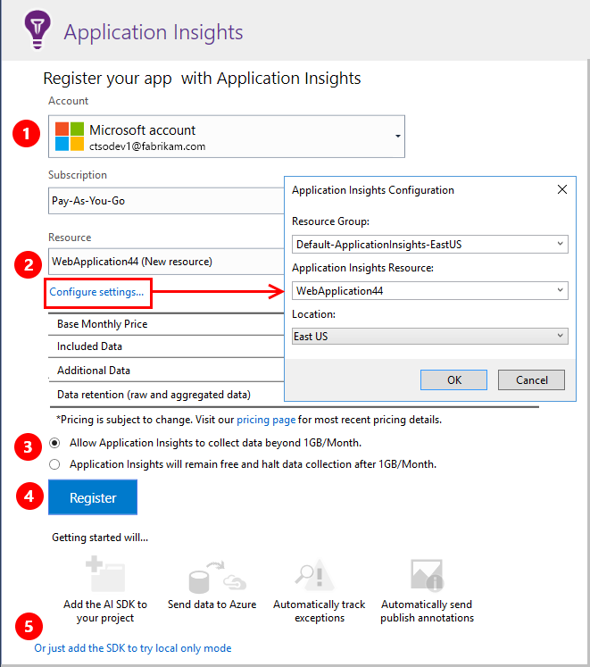

# Set up Application Insights for your ASP.NET website

This procedure configures your ASP.NET web app to send telemetry to the [Azure Application Insights](app-insights-overview.md) service. It works for ASP.NET apps that are hosted either in your own IIS server or in the Cloud. You get charts and a powerful query language that help you understand the performance of your app and how people are using it, plus automatic alerts on failures or performance issues. Many developers find these features great as they are, but you can also extend and customize the telemetry if you need to.

Setup takes just a few clicks in Visual Studio. You have the option to avoid charges by limiting the volume of telemetry. This allows you to experiment and debug, or to monitor a site with not many users. When you decide you want to go ahead and monitor your production site, it's easy to raise the limit later.

## Before you start
You need:

* Visual Studio 2013 update 3 or later. Later is better.
* A subscription to [Microsoft Azure](http://azure.com). If your team or organization has an Azure subscription, the owner can add you to it, by using your [Microsoft account](http://live.com).

There are alternative topics to look at if you are interested in:

* [Instrumenting a web app at runtime](app-insights-monitor-performance-live-website-now.md)
* [Azure Cloud Services](app-insights-cloudservices.md)

##  Step 1: Add the Application Insights SDK

Right-click your web app project in Solution Explorer, and choose **Add** > **Application Insights Telemetry...** or **Configure Application Insights**.

(In Visual Studio 2015, there's also an option to add Application Insights in the New Project dialog.)

Continue to the Application Insights configuration page:

**a.** Select the account and subscription that you use to access Azure.

**b.** Select the resource in Azure where you want to see the data from your app. Usually:

* Use a [single resource for different components](app-insights-monitor-multi-role-apps.md) of a single application. 
* Create separate resources for unrelated applications.
 
If you want to set the resource group or the location where your data is stored, click **Configure settings**. Resource groups are used to control access to data. For example, if you have several apps that form part of the same system, you might put their Application Insights data in the same resource group.

**c.** Set a cap at the free data volume limit, to avoid charges. Application Insights is free up to a certain volume of telemetry. After the resource is created, you can change your selection in the portal by opening  **Features + pricing** > **Data volume management** > **Daily volume cap**.

**d.** Click **Register** to go ahead and configure Application Insights for your web app. Telemetry will be sent to the [Azure portal](https://portal.azure.com), both during debugging and after you have published your app.

**e.** If you don't want to send telemetry to the portal while you're debugging, just add the Application Insights SDK to your app but don't configure a resource in the portal. You will be able to see telemetry in Visual Studio while you are debugging. Later, you can return to this configuration page, or you could wait until after you have deployed your app and [switch on telemetry at run time](app-insights-monitor-performance-live-website-now.md).

##  Step 2: Run your app
Run your app with F5. Open different pages to generate some telemetry.

In Visual Studio, you see a count of the events that have been logged.

## Step 3: See your telemetry
You can see your telemetry either in Visual Studio or in the Application Insights web portal. Search telemetry in Visual Studio to help you debug your app. Monitor performance and usage in the web portal when your system is live. 

### See your telemetry in Visual Studio

In Visual Studio, open the Application Insights window. Either click the **Application Insights** button, or right-click your project in Solution Explorer, select **Application Insights**, and then click **Search Live Telemetry**.

In the Visual Studio Application Insights Search window, see the **Data from Debug session** view for telemetry generated in the server side of your app. Experiment with the filters, and click any event to see more detail.

> [!NOTE]
> If you don't see any data, make sure the time range is correct, and click the Search icon.

[Learn more about Application Insights tools in Visual Studio](app-insights-visual-studio.md).

### See telemetry in web portal

You can also see telemetry in the Application Insights web portal (unless you chose to install only the SDK). The portal has more charts, analytic tools, and cross-component views than Visual Studio. The portal also provides alerts.

Open your Application Insights resource. Either sign in to the [Azure portal](https://portal.azure.com/) and find it there, or right-click the project in Visual Studio, and let it take you there.

> [!NOTE]
> If you get an access error: Do you have more than one set of Microsoft credentials, and are you signed in with the wrong set? In the portal, sign out and sign in again.

The portal opens on a view of the telemetry from your app.

In the portal, click any tile or chart to see more detail.

[Learn more about using Application Insights in the Azure portal](app-insights-dashboards.md).

## Step 4: Publish your app
Publish your app to your IIS server or to Azure. Watch [Live Metrics Stream](app-insights-metrics-explorer.md#live-metrics-stream) to make sure everything is running smoothly.

Your telemetry builds up in the Application Insights portal, where you can monitor metrics, search your telemetry, and set up [dashboards](app-insights-dashboards.md). You can also use the powerful [Analytics query language](app-insights-analytics.md) to analyze usage and performance, or to find specific events.

You can also continue to analyze your telemetry in [Visual Studio](app-insights-visual-studio.md), with tools such as diagnostic search and [trends](app-insights-visual-studio-trends.md).

> [!NOTE]
> If your app sends enough telemetry to approach the [throttling limits](app-insights-pricing.md#limits-summary), automatic [sampling](app-insights-sampling.md) switches on. Sampling reduces the quantity of telemetry sent from your app, while preserving correlated data for diagnostic purposes.
>
>

##  You're all set

Congratulations! You installed the Application Insights package in your app, and configured it to send telemetry to the Application Insights service on Azure.

The Azure resource that receives your app's telemetry is identified by an *instrumentation key*. You'll find this key in the ApplicationInsights.config file.

## Upgrade to future SDK versions
To upgrade to a [new release of the SDK](https://github.com/Microsoft/ApplicationInsights-dotnet-server/releases), open the **NuGet package manager** again, and filter on installed packages. Select **Microsoft.ApplicationInsights.Web**, and choose **Upgrade**.

If you made any customizations to ApplicationInsights.config, save a copy of it before you upgrade. Then, merge your changes into the new version.

## Video

> [!VIDEO https://channel9.msdn.com/events/Connect/2016/100/player]

## Next steps

### More telemetry

* **[Browser and page load data](app-insights-javascript.md)** - Insert a code snippet in your web pages.
* **[Get more detailed dependency and exception monitoring](app-insights-monitor-performance-live-website-now.md)** - Install Status Monitor on your server.
* **[Code custom events](app-insights-api-custom-events-metrics.md)** to count, time, or measure user actions.
* **[Get log data](app-insights-asp-net-trace-logs.md)** - Correlate log data with your telemetry.

### Analysis

* **[Working with Application Insights in Visual Studio](app-insights-visual-studio.md)** Includes information about debugging with telemetry, diagnostic search, and drill through to code.
* **[Working with the Application Insights portal](app-insights-dashboards.md)**  Includes information about dashboards, powerful diagnostic and analytic tools, alerts, a live dependency map of your application, and telemetry export.
* **[Analytics](app-insights-analytics-tour.md)** - The powerful query language.

### Alerts

* [Availability tests](app-insights-monitor-web-app-availability.md): Create tests to make sure your site is visible on the web.
* [Smart diagnostics](app-insights-proactive-diagnostics.md): These tests run automatically, so you don't have to do anything to set them up. They tell you if your app has an unusual rate of failed requests.
* [Metric alerts](app-insights-alerts.md): Set these to warn you if a metric crosses a threshold. You can set them on custom metrics that you code into your app.

### Automation

* [Automate creating an Application Insights resource](app-insights-powershell.md)
