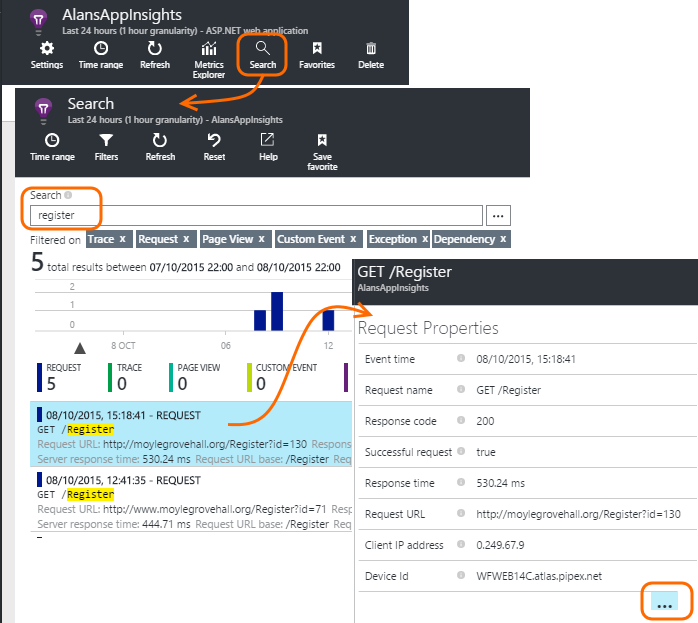

<properties 
	pageTitle="Application Insights for ASP.NET" 
	description="Analyze performance, availability and usage patterns of your on-premises or Microsoft Azure web application by using Application Insights." 
	services="application-insights" 
    documentationCenter=".net"
	authors="alancameronwills" 
	manager="douge"/>

<tags 
	ms.service="application-insights" 
	ms.workload="tbd" 
	ms.tgt_pltfrm="ibiza" 
	ms.devlang="na" 
	ms.topic="article" 
	ms.date="10/13/2015" 
	ms.author="awills"/>

# Set up Application Insights for ASP.NET

*Application Insights is in preview.*

[Visual Studio Application Insights](http://azure.microsoft.com/services/application-insights) monitors your live application to help you [detect and diagnose performance issues and exceptions][detect], and [discover how your app is used][knowUsers]. It works by installing an SDK into your app. The SDK sends telemetry about your app to the Application Insights service, where you analyze and visualize the app's behavior.

[AZURE.INCLUDE [app-insights-selector-get-started-dotnet](../../includes/app-insights-selector-get-started-dotnet.md)]

Add the SDK to your app in Visual Studio, and you'll get charts of server requests, response times, and failures.

You'll also be able to use the API to monitor usage in detail.

#### Before you start

You need:

* A subscription to [Microsoft Azure](http://azure.com). If your team or organization has an Azure subscription, the owner can add you to it, using your [Microsoft account](http://live.com).
* Visual Studio 2013 update 3 or later.

##  Add Application Insights to your project in Visual Studio

#### If it's a new project...

When you create a new project in Visual Studio, make sure Application Insights is selected. 

#### ... or if it's an existing project

Right click the project in Solution Explorer, and choose Add Application Insights.

#### Setup options

If this is your first time, you'll be asked login or sign up to Microsoft Azure. 

If this app is part of a bigger application, you might want to use **Configure settings** to put it in the same resource group as the other components. 

#### What did 'Add Application Insights' do?

The command did these steps (which you could instead [do manually](app-insights-start-monitoring-app-health-usage.md) if you prefer):

* Creates an Application Insights resource in [the Azure portal][portal]. This is where you'll see your data. It retrieves the *instrumentation key,* which identifies the resource.
* Adds the Application Insights Web SDK NuGet package to your project. To see it in Visual Studio, right-click your project and choose Manage NuGet Packages.
* Places the instrumentation key in `ApplicationInsights.config`.

##  Run your project

Run your application with F5 and try it out: open different pages to generate some telemetry.

In Visual Studio, you'll see a count of the events that have been sent.

##  Open Application Insights

Open your Application Insights resource in the [Azure portal][portal].

### Metrics: aggregated data

Look for data in the Overview charts. At first, you'll just see one or two points. For example:

Click through any chart to see more detailed metrics. [Learn more about metrics.][perf]

* *No user or page data?* - [Add user & page data](../article/application-insights/app-insights-asp-net-client.md)

### Search: individual events

Open Search to investigate individual requests and their associated events. 

[Learn more about search](app-insights-diagnostic-search.md)

* *No associated events?* Set up [server exceptions](../article/application-insights/app-insights-asp-net-exception-mvc.md) and [dependencies](../article/application-insights/app-insights-asp-net-dependencies.md).

### No data?

* Make sure you're looking at the right thing. Sign in at the [Azure portal](https://portal.azure.com), click "Browse >", "Application Insights", and then select your app.
* Use the application, opening different pages so that it generates some telemetry.
* Open the [Search][diagnostic] blade, to see individual events. Sometimes events take a little while longer to come through the metrics pipeline.
* Wait a few seconds and click Refresh.
* See [Troubleshooting][qna].

## Publish your app

Now deploy your application and watch the data accumulate.

When you run in debug mode, telemetry is expedited through the pipeline, so that you should see data appearing within seconds. When you deploy your app, data accumulates more slowly.

#### Trouble on your build server?

See [this Troubleshooting item](app-insights-troubleshoot-faq.md#NuGetBuild).

## Next steps

- [User & page data](../article/application-insights/app-insights-asp-net-client.md#selector1)
- [Exceptions](../article/application-insights/app-insights-asp-net-exception-mvc.md#selector1)
- [Dependencies](../article/application-insights/app-insights-asp-net-dependencies.md#selector1)
- [Availability](../article/application-insights/app-insights-monitor-web-app-availability.md#selector1)

## To upgrade to future SDK versions

To upgrade to a [new release of the SDK](app-insights-release-notes-dotnet.md), open NuGet package manager again and filter on installed packages. Select Microsoft.ApplicationInsights.Web and choose Upgrade.

If you made any customizations to ApplicationInsights.config, save a copy of it before you upgrade, and afterwards merge your changes into the new version.

## Video

> [AZURE.VIDEO getting-started-with-application-insights]

<!--Link references-->

[api]: app-insights-api-custom-events-metrics.md
[apikey]: app-insights-api-custom-events-metrics.md#ikey
[availability]: app-insights-monitor-web-app-availability.md
[azure]: ../insights-perf-analytics.md
[client]: app-insights-javascript.md
[detect]: app-insights-detect-triage-diagnose.md
[diagnostic]: app-insights-diagnostic-search.md
[knowUsers]: app-insights-overview-usage.md
[metrics]: app-insights-metrics-explorer.md
[netlogs]: app-insights-asp-net-trace-logs.md
[perf]: app-insights-web-monitor-performance.md
[portal]: http://portal.azure.com/
[qna]: app-insights-troubleshoot-faq.md
[redfield]: app-insights-monitor-performance-live-website-now.md
[roles]: app-insights-resources-roles-access-control.md
[start]: app-insights-overview.md

 