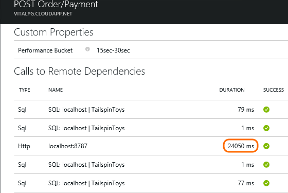
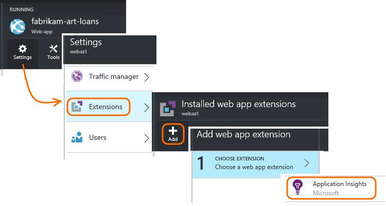
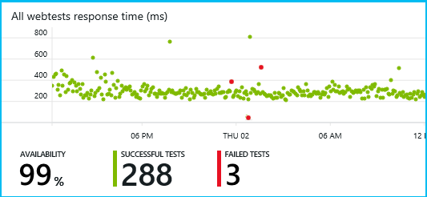

<properties 
	pageTitle="Application Insights for ASP.NET" 
	description="Analyze usage, availability and performance of your on-premises or Microsoft Azure web application with Application Insights." 
	services="application-insights" 
    documentationCenter=".net"
	authors="alancameronwills" 
	manager="douge"/>

<tags 
	ms.service="application-insights" 
	ms.workload="tbd" 
	ms.tgt_pltfrm="ibiza" 
	ms.devlang="na" 
	ms.topic="article" 
	ms.date="09/23/2015" 
	ms.author="awills"/>


# Application Insights for ASP.NET

*Application Insights is in preview.*

[AZURE.INCLUDE [app-insights-selector-get-started](../../includes/app-insights-selector-get-started.md)]


[Visual Studio Application Insights](http://azure.microsoft.com/services/application-insights) monitors your live application to help you [detect and diagnose performance issues and exceptions][detect], and [discover how your app is used][knowUsers]. It can be used with a wide variety of application types. It works for apps that are hosted on your own on-premises IIS servers or on Azure VMs, as well as Azure web apps. ([Device apps and Java servers are also covered][start].)


#### Before you start

You need:

* A subscription to [Microsoft Azure](http://azure.com). If your team or organization has an Azure subscription, the owner can add you to it, using your [Microsoft account](http://live.com).
* Visual Studio 2013 update 3 or later.

## <a name="ide"></a> Add Application Insights to your project in Visual Studio

#### If it's a new project...

When you create a new project in Visual Studio, make sure Application Insights is selected. 


#### ... or if it's an existing project

Right click the project in Solution Explorer, and choose Add Application Insights.


#### Setup options

If this is your first time, you'll be asked login or sign up to Microsoft Azure. 

If this app is part of a bigger application, you might want to use **Configure settings** to put it in the same resource group as the other components. 


####<a name="land"></a> What did 'Add Application Insights' do?

The command did these steps (which you could instead do manually if you prefer):

* Creates an Application Insights resource in [the Azure portal][portal]. This is where you'll see your data. It retrieves the *instrumentation key,* which identifies the resource.
* Adds the Application Insights Web SDK NuGet package to your project. To see it in Visual Studio, right-click your project and choose Manage NuGet Packages.
* Places the instrumentation key in `ApplicationInsights.config`.


## <a name="run"></a> Run your project

Run your application with F5 and try it out: open different pages to generate some telemetry.

In Visual Studio, you'll see a count of the events that have been sent.


## <a name="monitor"></a> Open Application Insights

Open your Application Insights resource in the [Azure portal][portal].


Look for data in the Overview charts. At first, you'll just see one or two points. For example:


Click through any chart to see more detailed metrics. [Learn more about metrics.][perf]

Now deploy your application and watch the data accumulate.


When you run in debug mode, telemetry is expedited through the pipeline, so that you should see data appearing within seconds. When you deploy your app, data accumulates more slowly.

#### No data?

* Open the [Search][diagnostic] tile, to see individual events.
* Use the application, opening different pages so that it generates some telemetry.
* Wait a few seconds and click Refresh.
* See [Troubleshooting][qna].

#### Trouble on your build server?

Please see [this Troubleshooting item](app-insights-troubleshoot-faq.md#NuGetBuild).


## Add browser monitoring

Browser or client-side monitoring gives you data on users, sessions, page views, and any exceptions or crashes that occur in the browser. 

   

You'll also be able to write your own code to track how your users work with your app, right down to the detailed level of clicks and keystrokes.

#### If your clients are web browsers

If your app displays web pages, add a JavaScript snippet to every page. Get the code from your Application Insights resource:


Notice that the code contains the instrumentation key that identifies your application resource.

[Learn more about web page tracking.](app-insights-web-track-usage.md)

#### If your clients are device apps

If your application is serving clients such as phones or other devices, add the [appropriate SDK](app-insights-platforms.md) to your device app.

If you configure the client SDK with the same instrumentation key as the server SDK, the two streams will be integrated so that you can see them together.

## Usage tracking

When you've delivered a new user story, you'd like to know how much your customers are using it, and whether they are achieving their goals or having difficulties. Get a detailed picture of user activity by inserting TrackEvent() and other calls in your code, both at the client and server. 

[Use the API to track usage][api]


## Diagnostic logs

[Capture log traces][netlogs] from your favorite logging framework to help diagnose any problems. Your log entries will appear in [diagnostic search][diagnostic] along with the Application Insights telemetry events.

## Publish your app

If you haven't yet published your app (since you added Application Insights), do that now. Watch the data grow in the charts as people use your app.


#### No data after you publish to your server?

Open these ports for outgoing traffic in your server's firewall:

+ `dc.services.visualstudio.com:443`
+ `f5.services.visualstudio.com:443`


## Dev, test and release

For a major application, it's advisable to send telemetry data from different stamps (debugging, testing and production builds) into [separate resources](app-insights-separate-resources.md). 

## Track Application version

Make sure `buildinfo.config` is generated by your build process. In your .csproj file, add:  

```XML

    <PropertyGroup>
      <GenerateBuildInfoConfigFile>true</GenerateBuildInfoConfigFile>    <IncludeServerNameInBuildInfo>true</IncludeServerNameInBuildInfo>
    </PropertyGroup> 
```

When it has the build info, the Application Insights web module automatically adds **Application version** as a property to every item of telemetry. That allows you to filter by version when performing [diagnostic searches][diagnostic] or when [exploring metrics][metrics].


## Add dependency tracking and system perf counters

[Dependency metrics](app-insights-dependencies.md) can be invaluable to help you diagnose performance issues. They measure calls from your app to databases, REST APIs, and other external components.



This step also enables [reporting of performance counters](app-insights-web-monitor-performance.md#system-performance-counters) such as CPU, memory, network occupancy.

#### If your app runs in your IIS server

Login to your server with admin rights, and install [Application Insights Status Monitor](http://go.microsoft.com/fwlink/?LinkId=506648). 

You have to make sure some [additional ports are open in your server's firewall](app-insights-monitor-performance-live-website-now.md#troubleshooting).

#### If your app is an Azure Web App

In the control panel of your Azure Web App, add the Application Insights extension.



(The extension only assists an app that has been built with the SDK. Unlike Status Monitor, it can't instrument an existing app.)

#### To monitor Azure cloud services roles

There's a [manual procedure for adding the status monitor](app-insights-cloudservices.md).

## Availability web tests

[Set up web tests][availability] to test from the outside that your application is live and responsive.





## To upgrade to future SDK versions

To upgrade to a [new release of the SDK](app-insights-release-notes-dotnet.md), open NuGet package manager again and filter on installed packages. Select Microsoft.ApplicationInsights.Web and choose Upgrade.

If you made any customizations to ApplicationInsights.config, save a copy of it before you upgrade, and afterwards merge your changes into the new version.


## <a name="video"></a>Video

> [AZURE.VIDEO getting-started-with-application-insights]


<!--Link references-->

[api]: app-insights-api-custom-events-metrics.md
[apikey]: app-insights-api-custom-events-metrics.md#ikey
[availability]: app-insights-monitor-web-app-availability.md
[azure]: ../insights-perf-analytics.md
[client]: app-insights-javascript.md
[detect]: app-insights-detect-triage-diagnose.md
[diagnostic]: app-insights-diagnostic-search.md
[knowUsers]: app-insights-overview-usage.md
[metrics]: app-insights-metrics-explorer.md
[netlogs]: app-insights-asp-net-trace-logs.md
[perf]: app-insights-web-monitor-performance.md
[portal]: http://portal.azure.com/
[qna]: app-insights-troubleshoot-faq.md
[redfield]: app-insights-monitor-performance-live-website-now.md
[roles]: app-insights-resources-roles-access-control.md
[start]: app-insights-get-started.md

 