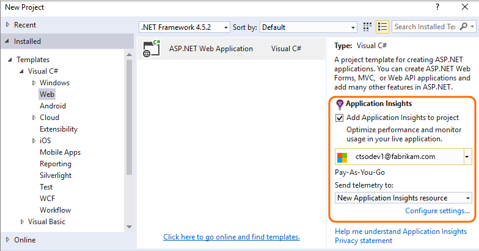
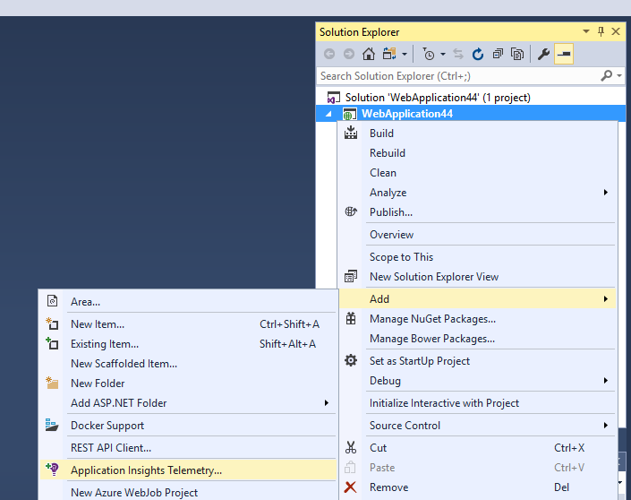
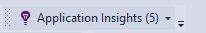
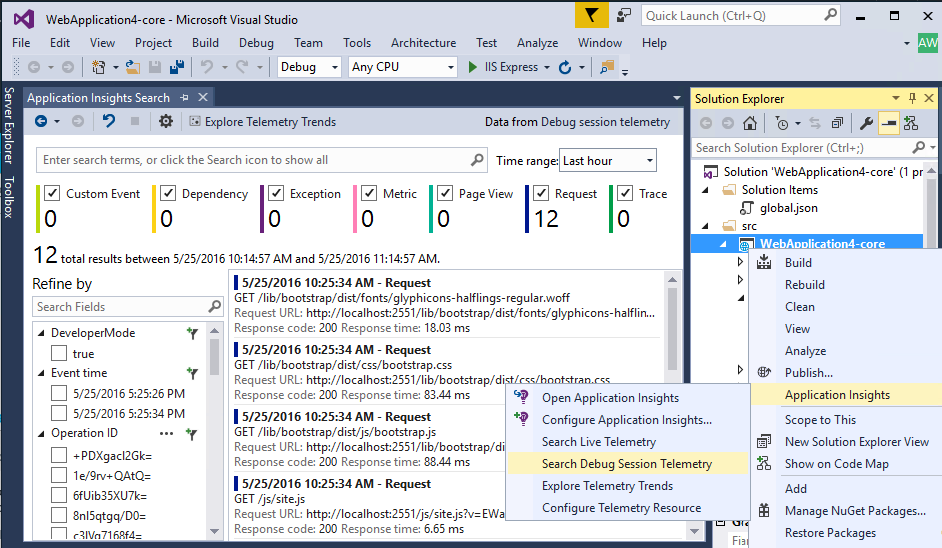
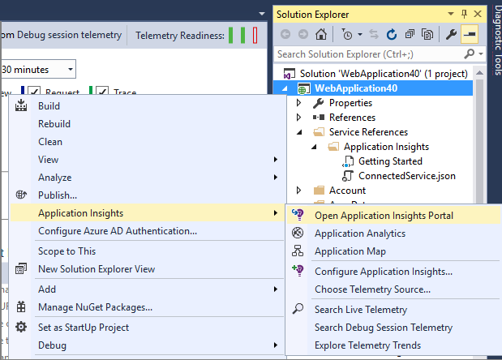
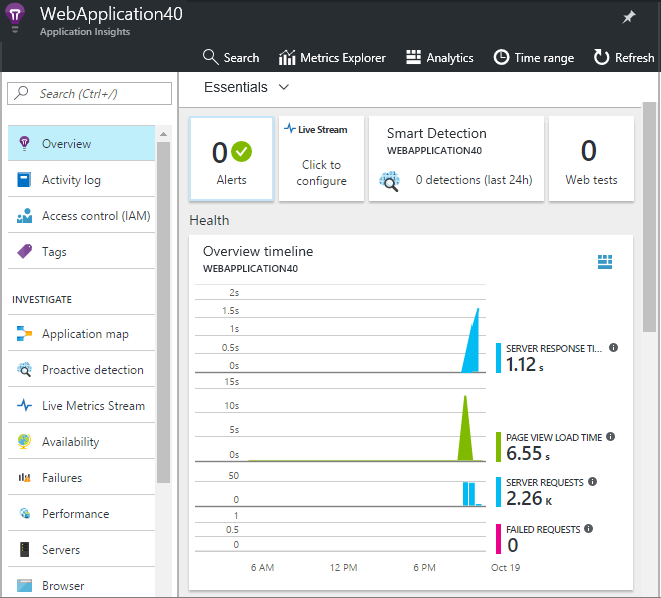
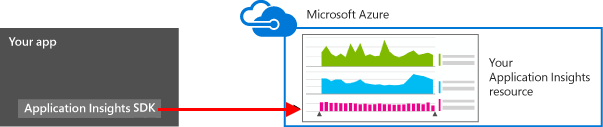

<properties 
	pageTitle="Set up web app analytics for ASP.NET with Application Insights" 
	description="Configure performance, availability and usage analytics for your ASP.NET website, hosted on-premises or in Azure." 
	services="application-insights" 
    documentationCenter=".net"
	authors="NumberByColors" 
	manager="douge"/>

<tags 
	ms.service="application-insights" 
	ms.workload="tbd" 
	ms.tgt_pltfrm="ibiza" 
	ms.devlang="na" 
	ms.topic="get-started-article" 
	ms.date="08/09/2016" 
	ms.author="daviste"/>

# Set up Application Insights for ASP.NET

[Visual Studio Application Insights](app-insights-overview.md) monitors your live application to help you [detect and diagnose performance issues and exceptions](app-insights-detect-triage-diagnose.md), and [discover how your app is used](app-insights-overview-usage.md).  It works for apps that are hosted on your own on-premises IIS servers or on cloud VMs, as well as Azure web apps.

## Before you start

You need:

* Visual Studio 2013 update 3 or later. Later is better.
* A subscription to [Microsoft Azure](http://azure.com). If your team or organization has an Azure subscription, the owner can add you to it, using your [Microsoft account](http://live.com). 

There are alternative articles to look at if you are interested in:

* [Instrumenting a web app at run time](app-insights-monitor-performance-live-website-now.md)
* [Azure Cloud services](app-insights-cloudservices.md)

##  1. Add Application Insights SDK

### If it's a new project...

Make sure Application Insights is selected when you create a new project in Visual Studio. 

### ... or if it's an existing project

Right click the project in Solution Explorer, and choose **Add Application Insights Telemetry** or **Configure Application Insights**.

* ASP.NET Core project? - [Follow these instructions to fix a few lines of code](https://github.com/Microsoft/ApplicationInsights-aspnetcore/wiki/Getting-Started#add-application-insights-instrumentation-code-to-startupcs). 

##  2. Run your app

Run your application with F5 and try it out: open different pages to generate some telemetry.

In Visual Studio, you'll see a count of the events that have been logged. 

## 3. See your telemetry...

### ... in Visual Studio

Open the Application Insights window in Visual Studio: Either click the Application Insights button, or right-click your project in Solution Explorer:

This view shows telemetry generated in the server side of your app. Experiment with the filters, and click any event to see more detail.

[Learn more about Application Insights tools in Visual Studio](app-insights-visual-studio.md).

 
### ... in the portal

Unless you chose *Install SDK only,* you can also see the telemetry at the Application Insights web portal. 

The portal has more charts, analytic tools, and dashboards than Visual Studio. 

Open your Application Insights resource in the [Azure portal](https://portal.azure.com/).

The portal opens on a view of the telemetry from your app:

* The first telemetry appears in [Live Metrics Stream](app-insights-metrics-explorer.md#live-metrics-stream).
* Individual events appear in **Search** (1). Data may take a few minutes to appear. Click any event to see its properties. 
* Aggregated metrics appear in the charts (2). It might take a minute or two for data to appear here. Click any chart to open a blade with more detail.

[Learn more about using Application Insights in the Azure portal](app-insights-dashboards.md).

## 4. Publish your app

Publish your app to your IIS server or to Azure. Watch [Live Metrics Stream](app-insights-metrics-explorer.md#live-metrics-stream) to make sure everything is running smoothly.

You'll see your telemetry building up in the Application Insights portal, where you can monitor metrics, search your telemetry, and set up [dashboards](app-insights-dashboards.md). You can also use the powerful [Analytics query language](app-insights-analytics.md) to analyse usage and performance or find specific events. 

You can also continue to analyze your telemetry in [Visual Studio](app-insights-visual-studio.md) with tools such as diagnostic search and [Trends](app-insights-visual-studio-trends.md).

> [AZURE.NOTE] If your app sends enough telemetry to approach the [throttling limits](app-insights-pricing.md#limits-summary), automatic [sampling](app-insights-sampling.md) will switch on. This reduces the quantity of telemetry sent from your app, while preserving correlated data for diagnostic purposes.

## What did 'Add Application Insights' do?

Application Insights sends telemetry from your app to the Application Insights portal (which is hosted in Microsoft Azure):

So the command did three things:

1. Add the Application Insights Web SDK NuGet package to your project. To see it in Visual Studio, right-click your project and choose Manage NuGet Packages.
2. Create an Application Insights resource in [the Azure portal](https://portal.azure.com/). This is where you'll see your data. It retrieves the *instrumentation key,* which identifies the resource.
3. Inserts the instrumentation key in `ApplicationInsights.config`, so that the SDK can send telemetry to the portal.

If you want, you can do these steps manually for [ASP.NET 4](app-insights-asp-net-manual.md) or [ASP.NET Core](https://github.com/Microsoft/ApplicationInsights-aspnetcore/wiki/Getting-Started).

### To upgrade to future SDK versions

To upgrade to a [new release of the SDK](app-insights-release-notes-dotnet.md), open NuGet package manager again and filter on installed packages. Select Microsoft.ApplicationInsights.Web and choose Upgrade.

If you made any customizations to ApplicationInsights.config, save a copy of it before you upgrade, and afterwards merge your changes into the new version.

## What's next?

| | 
|---|---
|**[Working with Application Insights in Visual Studio](app-insights-visual-studio.md)** Debugging with telemetry, diagnostic search, drill through to code.|
|**[Working with the Application Insights portal](app-insights-dashboards.md)** Dashboards, powerful diagnostic and analytic tools, alerts, a live dependency map of your application, and telemetry export. |
|**[Add more data](app-insights-asp-net-more.md)** Monitor usage, availability, dependencies, exceptions. Integrate traces from logging frameworks. Write custom telemetry. | 

