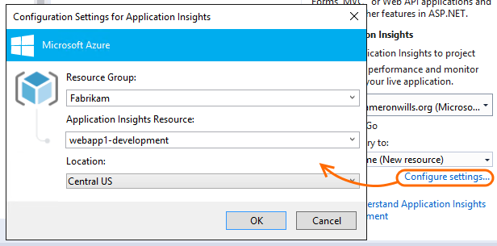
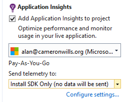
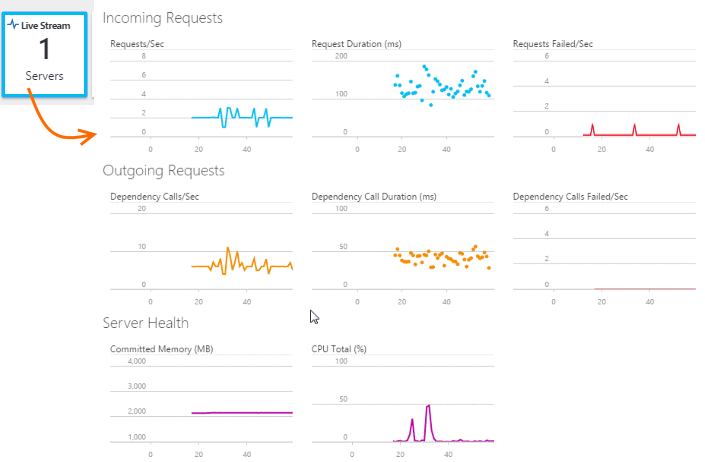

<properties 
	pageTitle="Set up web app analytics for ASP.NET with Application Insights" 
	description="Configure performance, availability and usage analytics for your ASP.NET website, hosted on-premises or in Azure." 
	services="application-insights" 
    documentationCenter=".net"
	authors="alancameronwills" 
	manager="douge"/>

<tags 
	ms.service="application-insights" 
	ms.workload="tbd" 
	ms.tgt_pltfrm="ibiza" 
	ms.devlang="na" 
	ms.topic="get-started-article" 
	ms.date="05/25/2016" 
	ms.author="awills"/>

# Set up Application Insights for ASP.NET

[Visual Studio Application Insights](app-insights-overview.md) monitors your live application to help you [detect and diagnose performance issues and exceptions](app-insights-detect-triage-diagnose.md), and [discover how your app is used](app-insights-overview-usage.md).  It works for apps that are hosted on your own on-premises IIS servers or on Azure VMs, as well as Azure web apps.

[AZURE.INCLUDE [app-insights-selector-get-started](../../includes/app-insights-selector-get-started.md)]

The Application Insights SDK sends analytics telemetry from your live web application to the Azure portal, where you can sign in and see charts of your app's performance and usage. 

You'll also be able to investigate and correlate specific requests, exceptions, and log events.  You can use the API to add telemetry to monitor performance and usage in detail.

## Before you start

You need:

* A subscription to [Microsoft Azure](http://azure.com). If your team or organization has an Azure subscription, the owner can add you to it, using your [Microsoft account](http://live.com).
* Visual Studio 2013 update 3 or later.

##  Add Application Insights to your project in Visual Studio

### If it's a new project...

When you create a new project in Visual Studio, make sure Application Insights is selected. 

Select an account with an Azure sign-in. You might be invited to re-enter your credentials. (Or, if you don't sign in, the code of the SDK will be added, and you can configure it later.)

### ... or if it's an existing project

Right click the project in Solution Explorer, and choose **Add Application Insights** or **Configure Application Insights**.

### Setup options

* If this is your first time, you'll be invited to sign in or sign up to Microsoft Azure. 

* If this app is part of a bigger application, you might want to use **Configure settings** to put it in the same resource group as the other components. You can also change the name of the resource to be different from the project name, which is useful if you want to separate the telemetry from different stamps of your app.

    

* Debug-only option: There is an option to install the SDK without creating a portal resource. During debug sessions on your development machine, you can see and search the telemetry in Visual Studio, but it isn't sent to the portal. You can add the portal resource later.
    
    

### What did 'Add Application Insights' do?

The command did these steps (which you could instead [do manually](app-insights-asp-net-manual.md) if you prefer):

1. Adds the Application Insights Web SDK NuGet package to your project. To see it in Visual Studio, right-click your project and choose Manage NuGet Packages.
2. Creates an Application Insights resource in [the Azure portal][portal]. This is where you'll see your data. It retrieves the *instrumentation key,* which identifies the resource.
3. Inserts the instrumentation key in `ApplicationInsights.config`, so that the SDK can send telemetry to the portal.

If you don't sign in to Azure initially, the SDK will be installed without connecting it to a resource. You'll be able to see and search the Application Insights telemetry in Visual Studio search window while you're debugging. You can complete the other steps later. 

##  Run your app

Run your application with F5 and try it out: open different pages to generate some telemetry.

In Visual Studio, you'll see a count of the events that have been logged. 

## See telemetry in Visual Studio

To open the Application Insights window in Visual Studio, either click the Application Insights button, or right-click your project in Solution Explorer:

This view shows telemetry generated in the server side of your app. Experiment with the filters, and click any event to see more detail.

[Learn more about Application Insights tools in Visual Studio](app-insights-visual-studio.md).

 
## See telemetry in the portal

Unless you chose *Install SDK only,* you can also see the telemetry at the Application Insights web portal. 

The portal has more charts, analytic tools, and dashboards than Visual Studio. 

Open your Application Insights resource in the [Azure portal][portal].

If you didn't sign in to Azure when you added the Application Ingsights to this app, do that now. Select **Configure Application Insights**. Doing that will enable you to continue to see telemetry from your live app after you've deployed it. The telemetry will appear in the Application Insights portal.

### Live Stream

For a quick view of your telemetry data when you're debugging or right after a deployment, use Live Stream. 

Live Stream is designed so that you can verify that your app is working OK right after a deployment.

It shows data from just the past few minutes, and doesn't retain any data.

It requires the 2.1.0-beta1 or later version of the SDK.  

### Search: individual events

Open Search to investigate individual requests and their associated events. 

[Learn more about search](app-insights-diagnostic-search.md)

* *No associated events?* Set up [server exceptions](app-insights-asp-net-exceptions.md) and [dependencies](app-insights-asp-net-dependencies.md).

### Metrics: aggregated data

Look for aggregated data in the Overview charts. At first, you'll just see one or two points. For example:

Click through any chart to see more detailed metrics. [Learn more about metrics.][perf]

* *No user or page data?* - [Add user & page data](app-insights-web-track-usage.md)

### Analytics: Powerful query language

As you accumulate more data, you can run queries both to aggregate data and to find individual instances. [Analytics]() is a powerful tool for both for understanding performance and usage, and for diagnostic purposes.

## No data?

* In Visual Studio, make sure your app is sending telemetry. You should see traces in the Output window, and in the Diagnostics Hub.
* Make sure you're looking at the right thing in Azure. Sign in at the [Azure portal](https://portal.azure.com), click "Browse >", "Application Insights", and then select your app.
* Use the application, opening different pages so that it generates some telemetry.
* Open the [Search][diagnostic] blade, to see individual events. Sometimes events take a little while longer to come through the metrics pipeline.
* Wait a few seconds and click Refresh.
* See [Troubleshooting][qna].

## Publish your app

Now deploy your application and watch the data accumulate.

Use [Live Stream](#live-stream) to monitor the first few minutes of a deployment or re-deployment tell you whether your app is working correctly. Especially when you're replacing an older version, you want to know whether performance has improved. If there's a problem, you might want to revert to the old version.

#### Trouble on your build server?

See [this Troubleshooting item](app-insights-asp-net-troubleshoot-no-data.md#NuGetBuild).

> [AZURE.NOTE] If your app generates a lot of telemetry (and you are using the ASP.NET SDK version 2.0.0-beta3 or later), the adaptive sampling module will automatically reduce the volume that is sent to the portal by sending only a representative fraction of events. However, events that are related to the same request will be selected or deselected as a group, so that you can navigate between related events. 
> [Learn about sampling](app-insights-sampling.md).

## Next steps

- [User & page data](../article/application-insights/app-insights-javascript.md#selector1)
- [Exceptions](../article/application-insights/app-insights-asp-net-exceptions.md#selector1)
- [Dependencies](../article/application-insights/app-insights-asp-net-dependencies.md#selector1)
- [Availability](../article/application-insights/app-insights-monitor-web-app-availability.md#selector1)

## To upgrade to future SDK versions

To upgrade to a [new release of the SDK](app-insights-release-notes-dotnet.md), open NuGet package manager again and filter on installed packages. Select Microsoft.ApplicationInsights.Web and choose Upgrade.

If you made any customizations to ApplicationInsights.config, save a copy of it before you upgrade, and afterwards merge your changes into the new version.

## Video

> [AZURE.VIDEO getting-started-with-application-insights]

<!--Link references-->

[api]: app-insights-api-custom-events-metrics.md
[apikey]: app-insights-api-custom-events-metrics.md#ikey
[availability]: app-insights-monitor-web-app-availability.md
[azure]: ../insights-perf-analytics.md
[client]: app-insights-javascript.md
[detect]: app-insights-detect-triage-diagnose.md
[diagnostic]: app-insights-diagnostic-search.md
[knowUsers]: app-insights-overview-usage.md
[metrics]: app-insights-metrics-explorer.md
[netlogs]: app-insights-asp-net-trace-logs.md
[perf]: app-insights-web-monitor-performance.md
[portal]: http://portal.azure.com/
[qna]: app-insights-troubleshoot-faq.md
[redfield]: app-insights-monitor-performance-live-website-now.md
[roles]: app-insights-resources-roles-access-control.md
[start]: app-insights-overview.md

 
