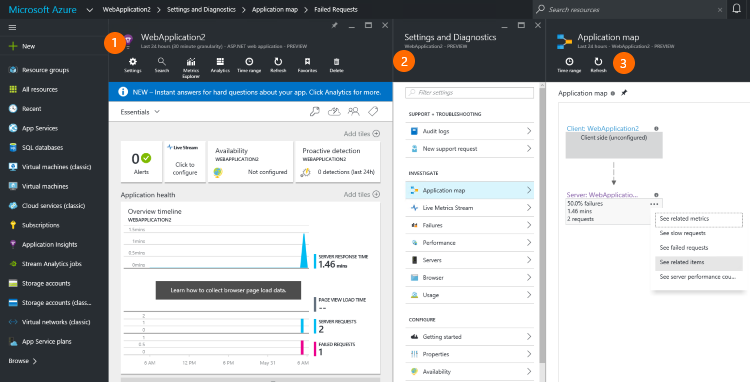

<properties 
	pageTitle="Set up web app analytics for ASP.NET with Application Insights" 
	description="Configure performance, availability and usage analytics for your ASP.NET website, hosted on-premises or in Azure." 
	services="application-insights" 
    documentationCenter=".net"
	authors="alancameronwills" 
	manager="douge"/>

<tags 
	ms.service="application-insights" 
	ms.workload="tbd" 
	ms.tgt_pltfrm="ibiza" 
	ms.devlang="na" 
	ms.topic="get-started-article" 
	ms.date="05/25/2016" 
	ms.author="awills"/>

# Set up Application Insights for ASP.NET

[Visual Studio Application Insights](app-insights-overview.md) monitors your live application to help you [detect and diagnose performance issues and exceptions](app-insights-detect-triage-diagnose.md), and [discover how your app is used](app-insights-overview-usage.md).  It works for apps that are hosted on your own on-premises IIS servers or on cloud VMs, as well as Azure web apps.

[AZURE.INCLUDE [app-insights-selector-get-started](../../includes/app-insights-selector-get-started.md)]

## Before you start

You need:

* Visual Studio 2013 update 3 or later. Later is better.
* A subscription to [Microsoft Azure](http://azure.com). If your team or organization has an Azure subscription, the owner can add you to it, using your [Microsoft account](http://live.com). 

##  1. Add Application Insights SDK

### If it's a new project...

Make sure Application Insights is selected when you create a new project in Visual Studio. 

### ... or if it's an existing project

Right click the project in Solution Explorer, and choose **Add Application Insights Telemetry** or **Configure Application Insights**.

##  2. Run your app

Run your application with F5 and try it out: open different pages to generate some telemetry.

In Visual Studio, you'll see a count of the events that have been logged. 

## 3. See your telemetry...

### ... in Visual Studio

Open the Application Insights window in Visual Studio: Either click the Application Insights button, or right-click your project in Solution Explorer:

This view shows telemetry generated in the server side of your app. Experiment with the filters, and click any event to see more detail.

[Learn more about Application Insights tools in Visual Studio](app-insights-visual-studio.md).

 
### ... in the portal

Unless you chose *Install SDK only,* you can also see the telemetry at the Application Insights web portal. 

The portal has more charts, analytic tools, and dashboards than Visual Studio. 

Open your Application Insights resource in the [Azure portal](https://portal.azure.com/).

The portal opens on a view of the telemetry from your app:

1. On your application's Overview blade, you see a summary of key performance metrics. Click any chart to open more data.
2. From the Settings blade you can open a variety of views on your telemetry, as well as configuring the portal.
3. The Application Map is particularly useful when your application has several components.  

[Learn more about using Application Insights in the Azure portal](app-insights-dashboard.md).

## What did 'Add Application Insights' do?

Application Insights sends telemetry from your app to the Application Insights portal (which is hosted in Microsoft Azure):

So the command did three things:

1. Add the Application Insights Web SDK NuGet package to your project. To see it in Visual Studio, right-click your project and choose Manage NuGet Packages.
2. Create an Application Insights resource in [the Azure portal](https://portal.azure.com/). This is where you'll see your data. It retrieves the *instrumentation key,* which identifies the resource.
3. Inserts the instrumentation key in `ApplicationInsights.config`, so that the SDK can send telemetry to the portal.

If you want, you can [do these steps manually](app-insights-asp-net-manual.md).

## Setup options

* SDK only: Installs the SDK in your project without creating a resource in the Application Insights portal. While you're debugging on your development machine, you'll  be able to see telemetry in Visual Studio. 
    
    

    You can configure a portal resource later. You'll need this in order to continue monitoring the app after you deploy it to test or production servers. 

* Resource name and group: Azure resources belong to resource groups, which help you manage access. If this app is part of a bigger application, use **Configure settings** to put it in the same resource group as the other components. 

    You can also change the name of the resource to be different from the project name, which is useful if you want to separate the telemetry from different stamps of your app.

    

## What's next?

| | 
|---|---
|**[Working with Application Insights in Visual Studio](app-insights-visual-studio.md)** Debugging with telemetry, diagnostic search, drill through to code.|
|**[Working with the Application Insights portal](app-insights-dashboards.md)** Dashboards, powerful diagnostic and analytic tools, alerts, a live dependency map of your application, and telemetry export. |
|**[Add more data](app-insights-asp-net-more.md)** Monitor usage, availability, dependencies, exceptions. Integrate traces from logging frameworks. Write custom telemetry. | 

