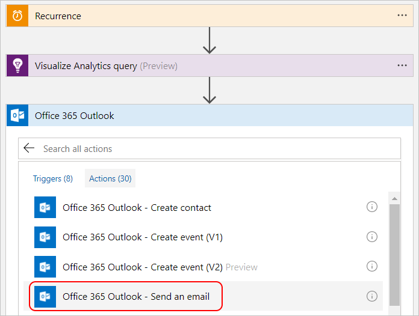

# Automate Application Insights processes with the Connector for Microsoft Flow

Do you find yourself repeatedly running the same queries on your telemetry data to check that
your service is functioning properly? Looking to automate these queries for finding trends and
anomalies and build your own workflows around them? Well, Application Insights Connector (preview) for Microsoft Flow is just what you need!
With this integration, numerous processes can now be automated without writing a single line of code. After you create a flow using an Application Insights action it automatically runs your Application Insights Analytics query. You can add additional actions as well. Flow makes hundreds of actions available. For example, you could use Flow to automatically send an email notification, or create a bug in Visual Studio Team Services. You can also use one of the many [templates](https://ms.flow.microsoft.com/en-us/connectors/shared_applicationinsights/?slug=azure-application-insights) available for the Connector for Microsoft Flow. These templates speed up the process of creating a flow. 

<!--The Application Insights connector also works with [Azure Power Apps](https://powerapps.microsoft.com/en-us/) and [Azure Logic Apps](https://azure.microsoft.com/en-us/services/logic-apps/?v=17.23h). --> 

## Tutorial for creating a flow for Application Insights

In this tutorial, you will learn how to create a flow that uses the Analytics auto-cluster algorithm to group attributes in the data for a web application. The flow automatically sends the results by email. This is just one example of how you can use Microsoft Flow and Application Insights Analytics together. 

### Step 1: Create a flow
1. Sign in at:  http://flow.microsoft.com and select *My Flows*.
2. Click *Create a flow from blank*.

### Step 2: Create a trigger for your flow
1. Choose *Schedule* and then *Schedule - Recurrence*.
2. Set the *Frequency* to Day with an *Interval* of 1.


### Step 3: Add an Azure Application Insights action
1. Click *New step* and then on *Add an action*.
2. Search for Azure Application Insights.
3. Click Azure Application Insights – Visualize Analytics query Preview.


### Step 4: Connect to an Application Insights resource
>[!Note]
>You need an Application ID and an API Key for your resource to complete this step. You can retrieve them from the Azure Portal as demonstrated in the following diagram:

 

- Provide a name for your connection along with the Application ID and API Key.


### Step 5: Specify the Analytics query and chart type
This example selects the failed requests within the last day and correlates them with exceptions that occurred as part of the operation. Analytics correlates based on the operation_Id identifier. The query then segments the results using the autocluster algorithm. 
When creating your own queries, make sure to verify that they are working properly in Analytics before adding it to your flow.

- Add the following Analytics query and select the Html table chart type. 

```
requests
| where timestamp > ago(1d)
| where success == "False"
| project name, operation_Id
| join ( exceptions
    | project problemId, outerMessage, operation_Id
) on operation_Id
| evaluate autocluster()
```


### Step 6: Configure the flow to send email

1. Click *New step* and then select *Add an action*.
2. Search for Office 365 Outlook.
3. Click Office 365 Outlook – Send an email.

4. In the email action add the following data:
 - Specify the email address of the recipient
 - Provide a subject for the email
 - Place your cursor in the *Body* field, and from the dynamic content menu that opens on the right, select *Body*.
 - Click on Show advanced options.

5. From the dynamic content menu do the following:
- Select Attachment Name
- Select Attachment Content
- Select Yes in the *Is HTML* field

### Step 7: Save and test your flow
- Add a name to your flow and click *Create flow*.


You can either wait for the trigger to run this action, or you can run the flow immediately by [running the trigger on demand](https://flow.microsoft.com/blog/run-now-and-six-more-services/).


## Next steps

- Learn more about creating [Analytics queries](app-insights-analytics-using.md).
- Learn more about [Microsoft Flow](https://ms.flow.microsoft.com).


<!--Link references-->


