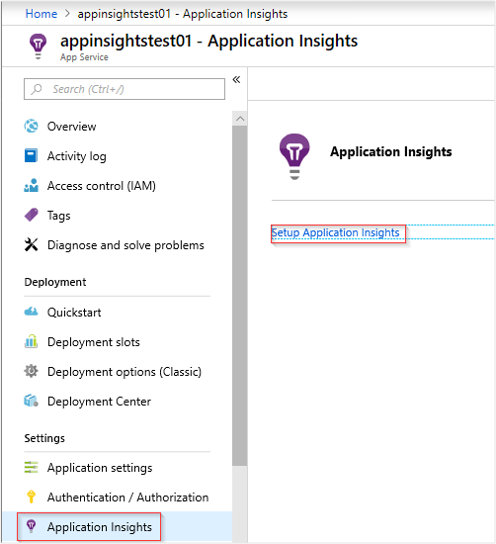
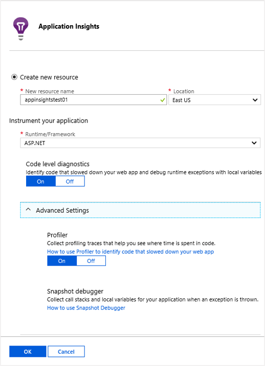

# Monitor Azure web app performance
In the [Azure Portal](https://portal.azure.com) you can set up application performance monitoring for your [Azure web apps](../app-service/app-service-web-overview.md). [Azure Application Insights](app-insights-overview.md) instruments your app to send telemetry about its activities to the Application Insights service, where it is stored and analyzed. There, metric charts and search tools can be used to help diagnose issues, improve performance, and assess usage.

## Run time or build time
You can configure monitoring by instrumenting the app in either of two ways:

* **Run-time** - You can select a performance monitoring extension when your web app is already live. It isn't necessary to rebuild or re-install your app. You get a standard set of packages that monitor response times, success rates, exceptions, dependencies, and so on. 
* **Build time** - You can install a package in your app in development. This option is more versatile. In addition to the same standard packages, you can write code to customize the telemetry or to send your own telemetry. You can log specific activities or record events according to the semantics of your app domain. 

## Run time instrumentation with Application Insights
If you're already running a web app in Azure, you already get some monitoring: request and error rates. Add Application Insights to get more, such as response times, monitoring calls to dependencies, smart detection, and the powerful Log Analytics query language. 

1. **Select Application Insights** in the Azure control panel for your web app.

    

   * Choose to create a new resource, unless you already set up an Application Insights resource for this application. 

    > [!NOTE]
    > When you click **OK** to create the new resource you will be prompted to **Apply monitoring settings**. Selecting **Continue** will link your new Application Insights resource to your web app, doing so will also **trigger a restart of your web app**. 

    

2. After specifying which resource to use, you can choose how you want application insights to collect data per platform for your application.

    

3. **Instrument your web app** after Application Insights has been installed.

   **Enable client side monitoring** for page view and user telemetry.

   * Select Settings > Application Settings
   * Under App Settings, add a new key value pair:

    Key: `APPINSIGHTS_JAVASCRIPT_ENABLED`

    Value: `true`
   * **Save** the settings and **Restart** your app.
4. Explore your app's monitoring data by selecting **Settings** > **Application Insights** > **View more in Application Insights**.

Later, you can build the app with Application Insights if you want.

*How do I remove Application Insights, or switch to sending to another resource?*

* In Azure, open the web app control blade, and under Settings, open **Application Insights**. You can turn off Application Insights by clicking **Disable** at the top, or select a new resource in the **Change your resource** section.

## Build the app with Application Insights
Application Insights can provide more detailed telemetry by installing an SDK into your app. In particular, you can collect trace logs, [write custom telemetry](app-insights-api-custom-events-metrics.md), and get more detailed exception reports.

1. **In Visual Studio** (2013 update 2 or later), configure Application Insights for your project.

    Right-click the web project, and select **Add > Application Insights** or **Project** > **Application Insights** > **Configure Application Insights**.

    

    If you're asked to sign in, use the credentials for your Azure account.

    The operation has two effects:

   1. Creates an Application Insights resource in Azure, where telemetry is stored, analyzed and displayed.
   2. Adds the Application Insights NuGet package to your code (if it isn't there already), and configures it to send telemetry to the Azure resource.
2. **Test the telemetry** by running the app in your development machine (F5).
3. **Publish the app** to Azure in the usual way. 

*How do I switch to sending to a different Application Insights resource?*

* In Visual Studio, right-click the project, choose **Configure Application Insights** and choose the resource you want. You get the option to create a new resource. Rebuild and redeploy.

## More telemetry

* [Web page load data](app-insights-javascript.md)
* [Custom telemetry](app-insights-api-custom-events-metrics.md)

## Video

> [!VIDEO https://channel9.msdn.com/events/Connect/2016/100/player]

## Next steps
* [Run the profiler on your live app](app-insights-profiler.md).
* [Azure Functions](https://github.com/christopheranderson/azure-functions-app-insights-sample) - monitor Azure Functions with Application Insights
* [Enable Azure diagnostics](../monitoring-and-diagnostics/azure-diagnostics-configure-application-insights.md) to be sent to Application Insights.
* [Monitor service health metrics](../azure-monitor/platform/data-collection.md) to make sure your service is available and responsive.
* [Receive alert notifications](../monitoring-and-diagnostics/monitoring-overview-alerts.md) whenever operational events happen or metrics cross a threshold.
* Use [Application Insights for JavaScript apps and web pages](app-insights-javascript.md) to get client telemetry from the browsers that visit a web page.
* [Set up Availability web tests](app-insights-monitor-web-app-availability.md) to be alerted if your site is down.

