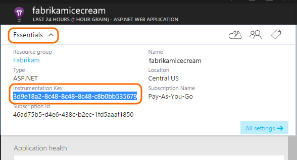
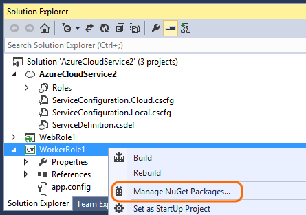
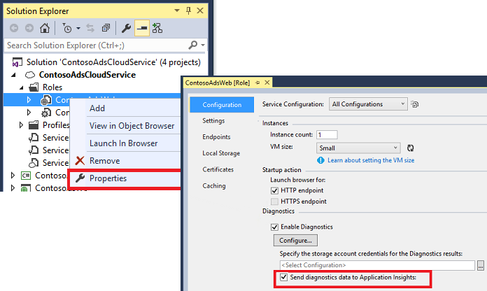
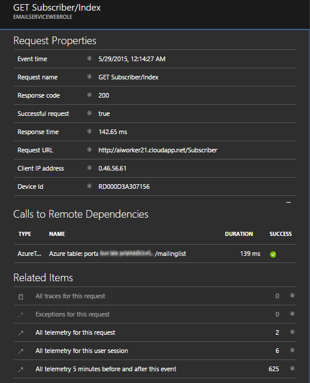
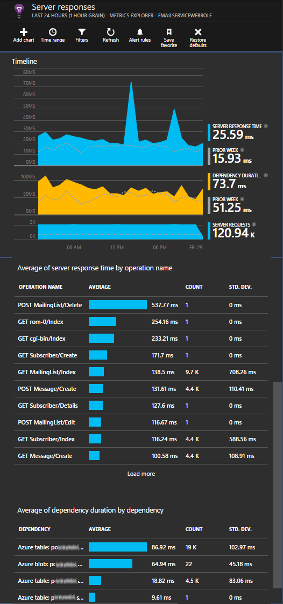
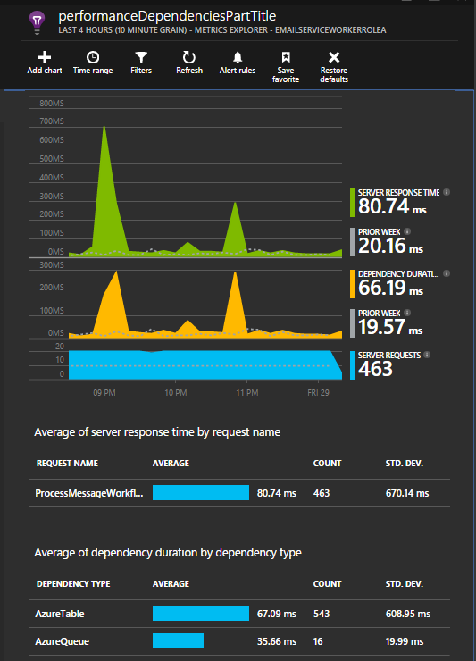
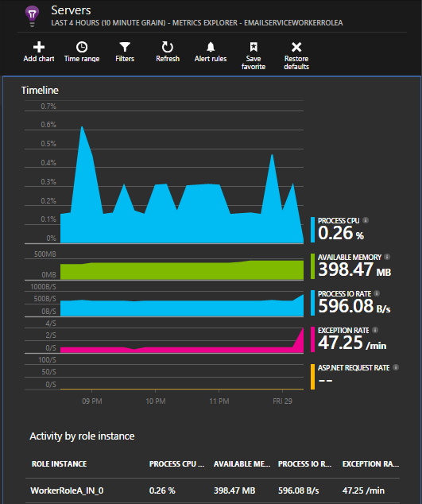
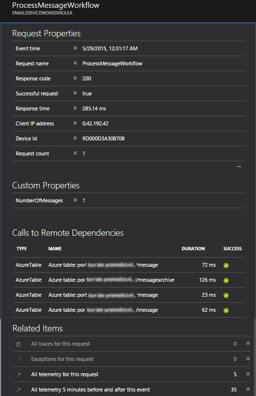

<properties
   pageTitle="Application Insights for Azure Cloud Services"
   description="Monitor your web and worker roles effectively with Application Insights"
   services="application-insights"
   documentationCenter=""
   authors="soubhagyadash"
   manager="douge"
   editor="alancameronwills"/>

<tags
   ms.service="application-insights"
   ms.devlang="na"
   ms.tgt_pltfrm="ibiza"
   ms.topic="article"
   ms.workload="tbd"
   ms.date="03/02/2016"
   ms.author="sdash"/>

# Application Insights for Azure Cloud Services


*Application Insights is in preview*

[Microsoft Azure Cloud service apps](https://azure.microsoft.com/services/cloud-services/) can be monitored by [Visual Studio Application Insights][start] for availability, performance, failures and usage. With the feedback you get about the performance and effectiveness of your app in the wild, you can make informed choices about the direction of the design in each development lifecycle.


You'll need a subscription with [Microsoft Azure](http://azure.com). Sign in with a Microsoft account, which you might have for Windows, XBox Live, or other Microsoft cloud services. 


#### Sample Application instrumented with Application Insights

Take a look at this [sample application](https://github.com/Microsoft/ApplicationInsights-Home/tree/master/Samples/AzureEmailService) in which Application Insights is added to a cloud service with two worker roles hosted in Azure. 

What follows tells you how to adapt your own cloud service project in the same way.

## Create an Application Insights resource for each role

An Application Insights resource is where your telemetry data will be analyzed and displayed.  

1.  In the [Azure portal][portal], create a new Application Insights resource. For application type, choose ASP.NET app. 

    

2.  Take a copy of the Instrumentation Key. You'll need this shortly to configure the SDK.

    


It's usually [best to create a separate resource for the data from each web and worker role](app-insights-separate-resources.md). 

As an alternative, you could send data from all the roles to just one resource, but set a [default property][apidefaults] so that you can filter or group the results from each role.

## <a name="sdk"></a>Install the SDK in each project


1. In Visual Studio, edit the NuGet packages of your cloud app project.

    


2. For web roles, add the [Application Insights for Web] (http://www.nuget.org/packages/Microsoft.ApplicationInsights.Web) NuGet package. This version of the SDK includes modules that add server context such as role information. For worker roles, use [Application Insights for Windows Servers](https://www.nuget.org/packages/Microsoft.ApplicationInsights.WindowsServer/).

    


3. Configure the SDK to send data to the Application Insights resource.

    Set the instrumentation key as a configuration setting in the file `ServiceConfiguration.Cloud.cscfg`. ([Sample code](https://github.com/Microsoft/ApplicationInsights-Home/blob/master/Samples/AzureEmailService/AzureEmailService/ServiceConfiguration.Cloud.cscfg)).
 
    ```XML
     <Role name="WorkerRoleA"> 
      <Setting name="APPINSIGHTS_INSTRUMENTATIONKEY" value="YOUR IKEY" /> 
     </Role>
    ```
 
    In a suitable startup function, set the instrumentation key from the configuration setting:

    ```C#
     TelemetryConfiguration.Active.InstrumentationKey = RoleEnvironment.GetConfigurationSettingValue("APPINSIGHTS_INSTRUMENTATIONKEY");
    ```

    Note, the same name `APPINSIGHTS_INSTRUMENTATIONKEY` of the configuration setting will be used by Azure Diagnostics reporting. 


    Do this for each role in your application. See the examples:
 
 * [Web role](https://github.com/Microsoft/ApplicationInsights-Home/blob/master/Samples/AzureEmailService/MvcWebRole/Global.asax.cs#L27)
 * [Worker role](https://github.com/Microsoft/ApplicationInsights-Home/blob/master/Samples/AzureEmailService/WorkerRoleA/WorkerRoleA.cs#L232)
 * [For web pages](https://github.com/Microsoft/ApplicationInsights-Home/blob/master/Samples/AzureEmailService/MvcWebRole/Views/Shared/_Layout.cshtml#L13)   

4. Set the ApplicationInsights.config file to be copied always to the output directory. 

    (In the .config file, you'll see messages asking you to place the instrumentation key there. However, for cloud applications it's better to set it from the .cscfg file. This ensures that the role is correctly identified in the portal.)


#### Run and publish the app

Run your app, and sign into Azure. Open the Application Insights resources you created, and you'll see individual data points appearing in [Search](app-insights-diagnostic-search.md), and aggregated data in [Metric Explorer](app-insights-metrics-explorer.md). 

Add more telemetry - see the sections below - and then publish your app to get live diagnostic and usage feedback. 


#### No data?

* Open the [Search][diagnostic] tile, to see individual events.
* Use the application, opening different pages so that it generates some telemetry.
* Wait a few seconds and click Refresh.
* See [Troubleshooting][qna].


## More telemetry

The sections below show how to get additional telemetry from different aspects of your application.


## Track Requests from Worker roles

In web roles, the requests module automatically collects data about HTTP requests. See the [sample MVCWebRole](https://github.com/Microsoft/ApplicationInsights-Home/tree/master/Samples/AzureEmailService/MvcWebRole) for examples of how you can override the default collection behavior. 

You can capture the performance of calls to worker roles by tracking them in the same way as HTTP requests. In Application Insights, the Request telemetry type measures a unit of named server side work that can be timed and can independently succeed or fail. While HTTP requests are captured automatically by the SDK, you can insert your own code to track requests to worker roles.

See the two sample worker roles instrumented to report requests: [WorkerRoleA](https://github.com/Microsoft/ApplicationInsights-Home/tree/master/Samples/AzureEmailService/WorkerRoleA) and [WorkerRoleB](https://github.com/Microsoft/ApplicationInsights-Home/tree/master/Samples/AzureEmailService/WorkerRoleB)

## Azure Diagnostics

[Azure Diagnostics](../vs-azure-tools-diagnostics-for-cloud-services-and-virtual-machines.md) data includes role management events, performance counters, and application logs. You can have these sent to Application Insights so that you can see them alongside the rest of your telemetry, making it easier to diagnose issues.

Azure diagnostics are particularly useful if a role fails unexpectedly, or fails to start.

1. Right-click the Role (not the project!) to open its Properties, and select **Enable Diagnostics**, **Send diagnostics to Application Insights**.

    

    **Or if your app is already published and running**, open Server Explorer or Cloud Explorer, right-click your app and select the same option.

3.  Select the same Application Insights resource as your other telemetry.

    If you want, you can set a different resource in different service configurations (Cloud, Local) to help keep the development data separate from live data.

3. Optionally, [exclude some of the Azure diagnostics](app-insights-azure-diagnostics.md) that you want to be forwarded to Application Insights. The default is everything.

### View Azure diagnostic events

Where to find the diagnostics:

* Performance counters are displayed as custom metrics. 
* Windows event logs are shown as traces and custom events.
* Application logs, ETW logs and any diagnostics infrastructure logs appear as traces.

To see performance counters and counts of events, open [Metrics Explorer](app-insights-metrics-explorer.md) and add a new chart:


Use [Search](app-insights-diagnostic-search.md) to search across the various trace logs sent by Azure Diagnostics. For example if you had an unhanded exception in a Role which caused the Role to crash and recycle, that information would show up in the Application channel of Windows Event Log. You can use the Search functionality to look at the Windows Event Log error and get the full stack trace for the exception enabling you to find the root cause of the issue.


## App diagnostics

Azure diagnostics automatically includes log entries that your app generates using System.Diagnostics.Trace. 

But if you already use the Log4N or NLog frameworks, you can also [capture their log traces][netlogs].

[Track custom events and metrics][api] in client or server or both, to learn more about your application's performance and usage.

## Dependencies

Application Insights SDK can report calls that your app makes to external dependencies such as REST apis and SQL servers. This lets you see whether a particular dependency is causing slow responses or failures.

If your application uses .NET framework 4.6 or later, you don't need to do anything else. 

Otherwise, set up the web/worker role with the [Application Insights Agent](app-insights-monitor-performance-live-website-now.md) also known as "Status Monitor".

To use the Application Insights Agent with your web/worker roles:

* Add the [AppInsightsAgent](https://github.com/Microsoft/ApplicationInsights-Home/tree/master/Samples/AzureEmailService/WorkerRoleA/AppInsightsAgent) folder and the two files in it to your web/worker role projects. Be sure to set their build properties so that they are always copied into the output directory. These files install the agent.
* Add the start up task to the CSDEF file as shown [here](https://github.com/Microsoft/ApplicationInsights-Home/tree/master/Samples/AzureEmailService/AzureEmailService/ServiceDefinition.csdef#L18).
* NOTE: *Worker roles* require three environment variables as shown [here](https://github.com/Microsoft/ApplicationInsights-Home/tree/master/Samples/AzureEmailService/AzureEmailService/ServiceDefinition.csdef#L44). This is not required for web roles.

### Dependency reports

Here's an example of what you see at the Application Insights portal:

* Rich diagnostics with automatically correlated requests and dependencies:

    

* Performance of the web role, with dependency information:

    

* Here's a screenshot on the requests and dependency information for a worker role:

    

## Exceptions

See [Monitoring Exceptions in Application Insights](app-insights-asp-net-exceptions.md) for information on how you can collect unhandled exceptions from different web application types.

The sample web role has MVC5 and Web API 2 controllers. The unhandled exceptions from the 2 are captured with the following:

* [AiHandleErrorAttribute](https://github.com/Microsoft/ApplicationInsights-Home/blob/master/Samples/AzureEmailService/MvcWebRole/Telemetry/AiHandleErrorAttribute.cs) set up [here](https://github.com/Microsoft/ApplicationInsights-Home/blob/master/Samples/AzureEmailService/MvcWebRole/App_Start/FilterConfig.cs#L12) for MVC5 controllers
* [AiWebApiExceptionLogger](https://github.com/Microsoft/ApplicationInsights-Home/blob/master/Samples/AzureEmailService/MvcWebRole/Telemetry/AiWebApiExceptionLogger.cs) set up [here](https://github.com/Microsoft/ApplicationInsights-Home/blob/master/Samples/AzureEmailService/MvcWebRole/App_Start/WebApiConfig.cs#L25) for Web API 2 controllers

For worker roles, there are two ways to track exceptions.

* TrackException(ex)
* If you have added the Application Insights trace listener NuGet package, you can use System.Diagnostics.Trace to log exceptions. [Code example.](https://github.com/Microsoft/ApplicationInsights-Home/blob/master/Samples/AzureEmailService/WorkerRoleA/WorkerRoleA.cs#L107)

## Performance Counters

The following counters are collected by default:

    * \Process(??APP_WIN32_PROC??)\% Processor Time
	* \Memory\Available Bytes
	* \.NET CLR Exceptions(??APP_CLR_PROC??)\# of Exceps Thrown / sec
	* \Process(??APP_WIN32_PROC??)\Private Bytes
	* \Process(??APP_WIN32_PROC??)\IO Data Bytes/sec
	* \Processor(_Total)\% Processor Time

In addition, the following are also collected for web roles:

	* \ASP.NET Applications(??APP_W3SVC_PROC??)\Requests/Sec	
	* \ASP.NET Applications(??APP_W3SVC_PROC??)\Request Execution Time
	* \ASP.NET Applications(??APP_W3SVC_PROC??)\Requests In Application Queue

You can specify additional custom or other windows performance counters as shown [here](https://github.com/Microsoft/ApplicationInsights-Home/blob/master/Samples/AzureEmailService/WorkerRoleA/ApplicationInsights.config#L14)

  

## Correlated Telemetry for Worker Roles

It is a rich diagnostic experience, when you can see what led to a failed or high latency request. With web roles, the SDK automatically sets up correlation between related telemetry. 
For worker roles, you can use a custom telemetry initializer to set a common Operation.Id context attribute for all the telemetry to achieve this. 
This will allow you to see whether the latency/failure issue was caused due to a dependency or your code, at a glance! 

Here's how:

* Set the correlation Id into a CallContext as shown [here](https://github.com/Microsoft/ApplicationInsights-Home/blob/master/Samples/AzureEmailService/WorkerRoleA/WorkerRoleA.cs#L36). In this case, we are using the Request ID as the correlation id
* Add a custom TelemetryInitializer implementation, that will set the Operation.Id to the correlationId set above. Shown here: [ItemCorrelationTelemetryInitializer](https://github.com/Microsoft/ApplicationInsights-Home/blob/master/Samples/AzureEmailService/WorkerRoleA/Telemetry/ItemCorrelationTelemetryInitializer.cs#L13)
* Add the custom telemetry initializer. You could do that in the ApplicationInsights.config file, or in code as shown [here](https://github.com/Microsoft/ApplicationInsights-Home/blob/master/Samples/AzureEmailService/WorkerRoleA/WorkerRoleA.cs#L233)

That's it! The portal experience is already wired up to help you see all associated telemetry at a glance:




## Client telemetry

[Add the JavaScript SDK to your web pages][client] to get browser-based telemetry such as page view counts, page load times, script exceptions, and to let you write custom telemetry in your page scripts.

## Availability tests

[Set up web tests][availability] to make sure your application stays live and responsive.


## Example

[The example](https://github.com/Microsoft/ApplicationInsights-Home/tree/master/Samples/AzureEmailService) monitors a service that has a web role and two worker roles.

## Exception "method not found" on running in Azure Cloud Services

Did you build for .NET 4.6? 4.6 is not automatically supported in Azure Cloud Services roles. [Install 4.6 on each role](../cloud-services/cloud-services-dotnet-install-dotnet.md) before running your app.

## Related topics

* [Configure sending Azure Diagnostics to Application Insights](app-insights-azure-diagnostics.md)
* [Using PowerShell to send Azure diagnostics to Application Insights](app-insights-powershell-azure-diagnostics.md)


[api]: app-insights-api-custom-events-metrics.md
[apidefaults]: app-insights-api-custom-events-metrics.md#default-properties
[apidynamicikey]: app-insights-separate-resources.md#dynamic-ikey
[availability]: app-insights-monitor-web-app-availability.md
[azure]: app-insights-azure.md
[client]: app-insights-javascript.md
[diagnostic]: app-insights-diagnostic-search.md
[netlogs]: app-insights-asp-net-trace-logs.md
[portal]: http://portal.azure.com/
[qna]: app-insights-troubleshoot-faq.md
[redfield]: app-insights-monitor-performance-live-website-now.md
[start]: app-insights-overview.md 
