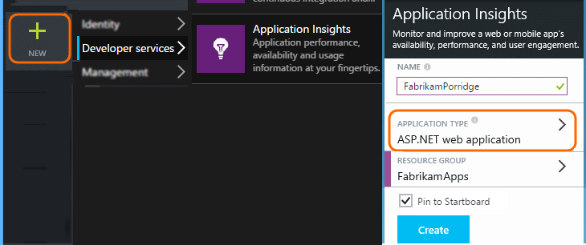
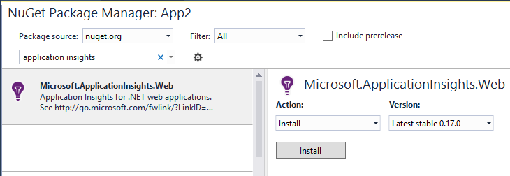

---
title: Application Insights for Azure Cloud Services | Microsoft Docs
description: Monitor your web and worker roles effectively with Application Insights
services: application-insights
documentationcenter: ''
keywords: "WAD2AI, Azure Diagnostics"
author: mrbullwinkle
manager: carmonm
ms.assetid: 5c7a5b34-329e-42b7-9330-9dcbb9ff1f88
ms.service: application-insights
ms.devlang: na
ms.tgt_pltfrm: ibiza
ms.topic: conceptual
ms.workload: tbd
ms.date: 09/05/2018
ms.author: mbullwin

---
# Application Insights for Azure Cloud Services
[Microsoft Azure Cloud service apps](https://azure.microsoft.com/services/cloud-services/) can be monitored by [Application Insights][start] for availability, performance, failures, and usage by combining data from Application Insights' SDKs with [Azure Diagnostics](https://docs.microsoft.com/azure/monitoring-and-diagnostics/azure-diagnostics) data from your Cloud Services. With the feedback you get about the performance and effectiveness of your app in the wild, you can make informed choices about the direction of the design in each development lifecycle.


## Before you start
You'll need:

* A subscription with [Microsoft Azure](http://azure.com). Sign in with a Microsoft account, which you might have for Windows, XBox Live, or other Microsoft cloud services. 
* Microsoft Azure tools 2.9 or later
* Developer Analytics Tools 7.10 or later

## Quick start
The quickest and easiest way to monitor your cloud service with Application Insights is to choose that option when you publish your service to Azure.


This option instruments your app at run time, giving you all the telemetry you need to monitor requests, exceptions, and dependencies in your web role, as well as performance counters from your worker roles. Any diagnostic traces generated by your app are also sent to Application Insights.

If that's all you need, you're done! Next steps are [viewing metrics from your app](app-insights-metrics-explorer.md), [querying your data with Analytics](app-insights-analytics.md), and maybe setting up a [dashboard](app-insights-dashboards.md). You might want to set up [availability tests](app-insights-monitor-web-app-availability.md) and [add code to your web pages](app-insights-javascript.md) to monitor performance in the browser.

But you can also get more options:

* Send data from different components and build configurations to separate resources.
* Add custom telemetry from your app.

If those options are of interest to you, read on.

## Sample Application instrumented with Application Insights
Take a look at this [sample application](https://github.com/Microsoft/ApplicationInsights-Home/tree/master/Samples/AzureEmailService) in which Application Insights is added to a cloud service with two worker roles hosted in Azure. 

What follows tells you how to adapt your own cloud service project in the same way.

## Plan resources and resource groups
The telemetry from your app is stored, analyzed and displayed in an Azure resource of type Application Insights. 

Each resource belongs to a resource group. Resource groups are used for managing costs, for granting access to team members, and to deploy updates in a single coordinated transaction. For example, you could [write a script to deploy](../azure-resource-manager/resource-group-template-deploy.md) an Azure Cloud Service and its Application Insights monitoring resources all in one operation.

### Resources for components
The recommended scheme is to create a separate resource for each component of your application - that is, each web role and worker role. You can analyze each component separately, but can create a [dashboard](app-insights-dashboards.md) that brings together the key charts from all the components, so that you can compare and monitor them together. 

An alternative scheme is to send the telemetry from more than one role to the same resource, but [add a dimension property to each telemetry item](app-insights-api-filtering-sampling.md#add-properties-itelemetryinitializer) that identifies its source role. In this scheme, metric charts such as exceptions normally show an aggregation of the counts from the different roles, but you can segment the chart by the role identifier when required. Searches can also be filtered by the same dimension. This alternative makes it a bit easier to view everything at the same time, but could also lead to some confusion between the roles.

Browser telemetry is usually included in the same resource as its server-side web role.

Put the Application Insights resources for the different components in one resource group. This makes it easy to manage them together. 

### Separating development, test, and production
If you are developing custom events for your next feature while the previous version is live, you want to send the development telemetry to a separate Application Insights resource. Otherwise it will be hard to find your test telemetry among all the traffic from the live site.

To avoid this situation, create separate resources for each build configuration or 'stamp' (development, test, production, ...) of your system. Put the resources for each build configuration in a separate resource group. 

To send the telemetry to the appropriate resources, you can set up the Application Insights SDK so that it picks up a different instrumentation key depending on the build configuration. 

## Create an Application Insights resource for each role
If you've decided to create a separate resource for each role - and perhaps a separate set for each build configuration - then it's easiest to create them all in the Application Insights portal. (If you create resources a lot, you can [automate the process](app-insights-powershell.md).

1. In the [Azure portal][portal], create a new Application Insights resource. For application type, choose ASP.NET app. 

    
2. Each resource is identified by an Instrumentation Key. You might need this later if you want to manually configure or verify the configuration of the SDK.


## Set up Azure Diagnostics for each role
Set this option to monitor your app with Application Insights. For web roles, this provides performance monitoring, alerts, and diagnostics, as well as usage analysis. For other roles, you can search and monitor Azure diagnostics such as restart, performance counters, and calls to System.Diagnostics.Trace. 

1. In Visual Studio Solution Explorer, under &lt;YourCloudService&gt;, Roles, open the properties of each role.
2. In **Configuration**, set **Send diagnostics data to Application Insights** and select the appropriate Application Insights resource that you created earlier.

If you have decided to use a separate Application Insights resource for each build configuration, select the configuration first.


This has the effect of inserting your Application Insights instrumentation keys into the files named `ServiceConfiguration.*.cscfg`. ([Sample code](https://github.com/Microsoft/ApplicationInsights-Home/blob/master/Samples/AzureEmailService/AzureEmailService/ServiceConfiguration.Cloud.cscfg)).

If you want to vary the level of diagnostic information sent to Application Insights, you can do so [by editing the `.cscfg` files directly](app-insights-azure-diagnostics.md).

## <a name="sdk"></a>Install the SDK in each project
This option adds the ability to add custom business telemetry to any role, for a closer analysis of how your application is used and performs.

In Visual Studio, configure the Application Insights SDK for each cloud app project.

1. **Web roles**: Right-click the project and choose **Configure Application Insights** or **Add > Application Insights telemetry**.

2. **Worker roles**: 
 * Right-click the project and select **Manage NuGet Packages**.
 * Add [Application Insights for Windows Servers](https://www.nuget.org/packages/Microsoft.ApplicationInsights.WindowsServer/).

    

3. Configure the SDK to send data to the Application Insights resource.

    In a suitable startup function, set the instrumentation key from the configuration setting in the ``.cscfg file``:
 
    ```csharp
   
     TelemetryConfiguration.Active.InstrumentationKey = RoleEnvironment.GetConfigurationSettingValue("APPINSIGHTS_INSTRUMENTATIONKEY");
    ```
   
    Do this for each role in your application. See the examples:
   
   * [Web role](https://github.com/Microsoft/ApplicationInsights-Home/blob/master/Samples/AzureEmailService/MvcWebRole/Global.asax.cs#L27)
   * [Worker role](https://github.com/Microsoft/ApplicationInsights-Home/blob/master/Samples/AzureEmailService/WorkerRoleA/WorkerRoleA.cs#L232)
   * [For web pages](https://github.com/Microsoft/ApplicationInsights-Home/blob/master/Samples/AzureEmailService/MvcWebRole/Views/Shared/_Layout.cshtml#L13) 
4. Set the ApplicationInsights.config file to be copied always to the output directory. 
   
    (In the .config file, you'll see messages asking you to place the instrumentation key there. However, for cloud applications it's better to set it from the ``.cscfg file``. This ensures that the role is correctly identified in the portal.)

#### Run and publish the app
Run your app, and sign into Azure. Open the Application Insights resources you created, and you'll see individual data points appearing in [Search](app-insights-diagnostic-search.md), and aggregated data in [Metric Explorer](app-insights-metrics-explorer.md). 

Add more telemetry - see the sections below - and then publish your app to get live diagnostic and usage feedback. 

#### No data?
* Open the [Search][diagnostic] tile, to see individual events.
* Use the application, opening different pages so that it generates some telemetry.
* Wait a few seconds and click Refresh.
* See [Troubleshooting][qna].

## View Azure Diagnostic events
Where to find the [Azure Diagnostics](https://docs.microsoft.com/azure/monitoring-and-diagnostics/azure-diagnostics) information in Application Insights:

* Performance counters are displayed as custom metrics. 
* Windows event logs are shown as traces and custom events.
* Application logs, ETW logs, and any diagnostics infrastructure logs appear as traces.

To see performance counters and counts of events, open [Metrics Explorer](app-insights-metrics-explorer.md) and add a new chart:


Use [Search](app-insights-diagnostic-search.md) or an [Analytics query](app-insights-analytics-tour.md) to search across the various trace logs sent by Azure Diagnostics. For example, suppose you have an unhandled exception which caused a Role to crash and recycle. That information would show up in the Application channel of Windows Event Log. You can use Search to look at the Windows Event Log error and get the full stack trace for the exception. This will help you find the root cause of the issue.


## More telemetry
The sections below show how to get additional telemetry from different aspects of your application.

## Track Requests from Worker roles
In web roles, the requests module automatically collects data about HTTP requests. See the [sample MVCWebRole](https://github.com/Microsoft/ApplicationInsights-Home/tree/master/Samples/AzureEmailService/MvcWebRole) for examples of how you can override the default collection behavior. 

You can capture the performance of calls to worker roles by tracking them in the same way as HTTP requests. In Application Insights, the Request telemetry type measures a unit of named server-side work that can be timed and can independently succeed or fail. While HTTP requests are captured automatically by the SDK, you can insert your own code to track requests to worker roles.

See the two sample worker roles instrumented to report requests: [WorkerRoleA](https://github.com/Microsoft/ApplicationInsights-Home/tree/master/Samples/AzureEmailService/WorkerRoleA) and [WorkerRoleB](https://github.com/Microsoft/ApplicationInsights-Home/tree/master/Samples/AzureEmailService/WorkerRoleB)

## Exceptions
See [Monitoring Exceptions in Application Insights](app-insights-asp-net-exceptions.md) for information on how you can collect unhandled exceptions from different web application types.

The sample web role has MVC5 and Web API 2 controllers. The unhandled exceptions from the two are captured with the following handlers:

* [AiHandleErrorAttribute](https://github.com/Microsoft/ApplicationInsights-Home/blob/master/Samples/AzureEmailService/MvcWebRole/Telemetry/AiHandleErrorAttribute.cs) set up [here](https://github.com/Microsoft/ApplicationInsights-Home/blob/master/Samples/AzureEmailService/MvcWebRole/App_Start/FilterConfig.cs#L12) for MVC5 controllers
* [AiWebApiExceptionLogger](https://github.com/Microsoft/ApplicationInsights-Home/blob/master/Samples/AzureEmailService/MvcWebRole/Telemetry/AiWebApiExceptionLogger.cs) set up [here](https://github.com/Microsoft/ApplicationInsights-Home/blob/master/Samples/AzureEmailService/MvcWebRole/App_Start/WebApiConfig.cs#L25) for Web API 2 controllers

For worker roles, there are two ways to track exceptions:

* TrackException(ex)
* If you have added the Application Insights trace listener NuGet package, you can use **System.Diagnostics.Trace** to log exceptions. [Code example.](https://github.com/Microsoft/ApplicationInsights-Home/blob/master/Samples/AzureEmailService/WorkerRoleA/WorkerRoleA.cs#L107)

## Performance Counters
The following counters are collected by default:

    * \Process(??APP_WIN32_PROC??)\% Processor Time
    * \Memory\Available Bytes
    * \.NET CLR Exceptions(??APP_CLR_PROC??)\# of Exceps Thrown / sec
    * \Process(??APP_WIN32_PROC??)\Private Bytes
    * \Process(??APP_WIN32_PROC??)\IO Data Bytes/sec
    * \Processor(_Total)\% Processor Time

For web roles, these counters are also collected:

    * \ASP.NET Applications(??APP_W3SVC_PROC??)\Requests/Sec
    * \ASP.NET Applications(??APP_W3SVC_PROC??)\Request Execution Time
    * \ASP.NET Applications(??APP_W3SVC_PROC??)\Requests In Application Queue

You can specify additional custom or other windows performance counters by editing ApplicationInsights.config [as in this example](https://github.com/Microsoft/ApplicationInsights-Home/blob/master/Samples/AzureEmailService/WorkerRoleA/ApplicationInsights.config#L14).

  

## Correlated Telemetry for Worker Roles
It is a rich diagnostic experience, when you can see what led to a failed or high latency request. With web roles, the SDK automatically sets up correlation between related telemetry. 
For worker roles, you can use a custom telemetry initializer to set a common Operation.Id context attribute for all the telemetry to achieve this. 
This allows you to see whether the latency/failure issue was caused due to a dependency or your code, at a glance! 

Here's how:

* Set the correlation Id into a CallContext as shown [here](https://github.com/Microsoft/ApplicationInsights-Home/blob/master/Samples/AzureEmailService/WorkerRoleA/WorkerRoleA.cs#L36). In this case, we are using the Request ID as the correlation id
* Add a custom TelemetryInitializer implementation, to set the Operation.Id to the correlationId set above. There's an example here: [ItemCorrelationTelemetryInitializer](https://github.com/Microsoft/ApplicationInsights-Home/blob/master/Samples/AzureEmailService/WorkerRoleA/Telemetry/ItemCorrelationTelemetryInitializer.cs#L13)
* Add the custom telemetry initializer. You could do that in the ApplicationInsights.config file, or in code as shown [here](https://github.com/Microsoft/ApplicationInsights-Home/blob/master/Samples/AzureEmailService/WorkerRoleA/WorkerRoleA.cs#L233).

## Client telemetry
[Add the JavaScript SDK to your web pages][client] to get browser-based telemetry such as page view counts, page load times, script exceptions, and to let you write custom telemetry in your page scripts.

## Availability tests
[Set up web tests][availability] to make sure your application stays live and responsive.

## Display everything together
To get an overall picture of your system, you can bring the key monitoring charts together on one [dashboard](app-insights-dashboards.md). For example, you could pin the request and failure counts of each role. 

If your system uses other Azure services such as Stream Analytics, include their monitoring charts as well. 

If you have a client mobile app, use [App Center](app-insights-mobile-center-quickstart.md). Create queries in [Analytics](app-insights-analytics.md) to display the event counts, and pin them to the dashboard.

## Example
[The example](https://github.com/Microsoft/ApplicationInsights-Home/tree/master/Samples/AzureEmailService) monitors a service that has a web role and two worker roles.

## Exception "method not found" on running in Azure Cloud Services
Did you build for .NET 4.6? 4.6 is not automatically supported in Azure Cloud Services roles. [Install 4.6 on each role](../cloud-services/cloud-services-dotnet-install-dotnet.md) before running your app.

## Video

> [!VIDEO https://channel9.msdn.com/events/Connect/2016/100/player]

## Next steps
* [Configure sending Azure Diagnostics to Application Insights](app-insights-azure-diagnostics.md)
* [Automate creation of Application Insights resources](app-insights-powershell.md)
* [Automate Azure diagnostics](app-insights-powershell-azure-diagnostics.md)
* [Azure Functions](https://github.com/christopheranderson/azure-functions-app-insights-sample)

[api]: app-insights-api-custom-events-metrics.md
[availability]: app-insights-monitor-web-app-availability.md
[azure]: app-insights-azure.md
[client]: app-insights-javascript.md
[diagnostic]: app-insights-diagnostic-search.md
[netlogs]: app-insights-asp-net-trace-logs.md
[portal]: http://portal.azure.com/
[qna]: app-insights-troubleshoot-faq.md
[redfield]: app-insights-monitor-performance-live-website-now.md
[start]: app-insights-overview.md 
