<properties
	pageTitle="Dashboards in the Application Insights portal"
	description="After you've configured your app to send telemetry to Application Insights, this guide shows you how to find your way around the portal."
	services="application-insights"
    documentationCenter=""
	authors="alancameronwills"
	manager="douge"/>

<tags
	ms.service="application-insights"
	ms.workload="tbd"
	ms.tgt_pltfrm="ibiza"
	ms.devlang="multiple"
	ms.topic="article" 
	ms.date="03/13/2016"
	ms.author="awills"/>

# Dashboards and navigation in the Application Insights portal

After you have [set up Application Insights on your project](app-insights-overview.md), telemetry data about your app's performance and usage will appear in your project's Application Insights resource in the [Azure portal](https://portal.azure.com).

## The dashboard

When you sign in to the [Azure portal](https://portal.azure.com), you first get to the dashboard. You can customize it or put it into full screen mode. 

The dashboard is particularly useful for monitoring a solution made up of multiple applications, no matter where they're hosted. And if you have Azure components such as Stream Analytics as part of your system, you can add their monitoring charts to the dashboard too.

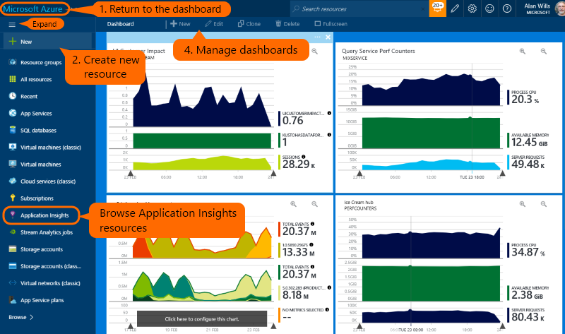

1. Click the top corner anytime to get back to the dashboard.
2. **+ New** creates a new resource. An [Application Insights resource](app-insights-create-new-resource.md) is a place to store and analyze telemetry from your app.
3. The navigation bar opens your existing resources.
4. Edit and create dashboards using the dashboard toolbar. You can [create different dashboards](#dashboards) for different applications.

## Find your telemetry

Sign in to the [Azure portal](https://portal.azure.com) and browse to the Application Insights resource that you created for your app.

The overview page gives you some basic telemetry, plus links to more.
The contents depend on the type of your app, and can be customized.

## The app overview blade

The overview blade (page) for your app shows a summary of the key diagnostic metrics of your app, and is a gateway to the other features of the portal.

Click:

* **Any chart or tile** to see more detail.
* **Settings** to get to predefined pages of other metrics.
* **Metrics Explorer** to create metrics pages of your own choice.
* **Search** to investigate specific instances of events such as requests, exceptions or log traces.

### Customize the overview blade 

Choose what you want to see on the overview. In Customize, you can insert section titles, drag tiles and charts around, remove items, and add new tiles and charts from the gallery.

## Dashboards

The Azure portal dashboard is the home page you see when you first sign in to [the portal](https://portal.azure.com). On it, you can bring together charts and tiles (groups of charts) from multiple resources. 

If you have a system made up of several components - for example, a web app, a backend server, and perhaps some Azure services - you can show the key performance indicators of all the components on one screen. 

If you have more than one application, you can create and switch between several dashboards.

When you're looking at a blade or chart that's particularly interesting, you can pin it to the dashboard. You'll see it next time you return there.

You can save more than one dashboard and switch between them. When you pin a chart or blade, they're added to the current dashboard.

For example, you might have one dashboard for displaying full screen in the team room, and another for general development.

On the dashboard, a blade appears as a tile: click it to go to the blade. A chart replicates the chart in its original location.

## Metrics blades

When you click through from the overview blade to get more detail, you're in Metrics Explorer (even if it has a more specific title).

You can also use the Metrics Explorer button to create a new blade, which you can edit and then save.

### Editing charts and grids

To add a new chart to the blade:

Select an existing or new chart to edit what it shows:

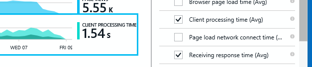

You can display more than one metric on a chart, though there are restrictions about the combinations that can be displayed together. As soon as you choose one metric, some of the others are disabled. 

If you coded [custom metrics](app-insights-api-custom-events-metrics.md#track-metric) into your app (calls to TrackMetric, and metrics attached to TrackEvent calls) they will be listed here.

### Segment your data

Select a chart or grid, switch on grouping and pick a property to group by:

If you coded custom metrics into your app and they include [property values](app-insights-api-custom-events-metrics.md#properties), you'll be able to select the property in the list.

Is the chart too small for segmented data? Adjust its height:

### Filter your data

To see just the metrics for a selected set of property values:

If you don't select any values for a particular property, it's the same as selecting them all: there is no filter on that property.

Notice the counts of events alongside each property value. When you select values of one property, the counts alongside other property values are adjusted.

### Save your metrics blade

When you've created some charts, save them as a favorite. You can choose whether to share it with other team members, if you use an organizational account.

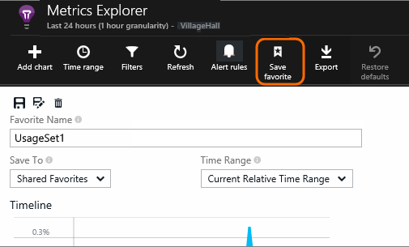

To see the blade again, **go to the overview blade** and open Favorites:

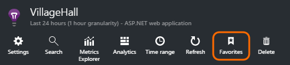

If you chose Relative time range when you saved, the blade will be updated with the latest metrics. If you chose Absolute time range, it will show the same data every time.

### Reset the blade

If you edit a blade but then you'd like to get back to the original saved set, just click Reset.

## Time range

You can change the Time range covered by the charts or grids on any blade.

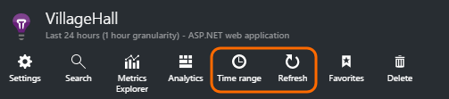

If you're expecting some data that hasn't appeared yet, click Refresh. Charts refresh themselves at intervals, but the intervals are longer for larger time ranges. In release mode, it can take a while for data to come through the analysis pipeline onto a chart.

To zoom into part of a chart, drag over it and then click the magnifier symbol:

## Granularity and point values

Hover your mouse over the chart to display the values of the metrics at that point.

The value of the metric at a particular point is aggregated over the preceding sampling interval. 

The sampling interval or "granularity" is shown at the top of the blade. 

You can adjust the granularity in the Time range blade:

The granularities available depend on the time range you select. The explicit granularities are alternatives to the "automatic" granularity for the time range. 

## Search

Search displays individual events such as page views, requests, exceptions, log traces, and custom events.  It doesn't show aggregated metrics or instances of the TrackMetric() call.

> [AZURE.NOTE] If your app generates a lot of telemetry (and you are using the ASP.NET SDK version 2.0.0-beta3 or later), the adaptive sampling module will automatically reduce the volume that is sent to the portal by sending only a representative fraction of events. However, events that are related to the same request will be selected or deselected as a group, so that you can navigate between related events. [Learn about sampling](app-insights-sampling.md).

Open diagnostic search:

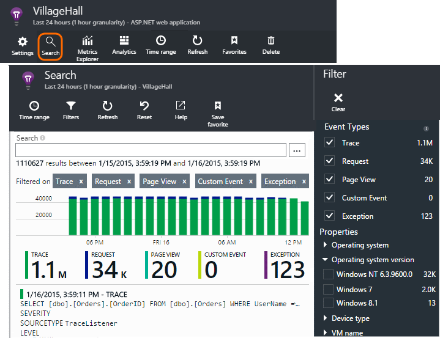

Open the Filter blade and choose the event types you want to see. (If, later, you want to restore the filters with which you opened the blade, click Reset.)

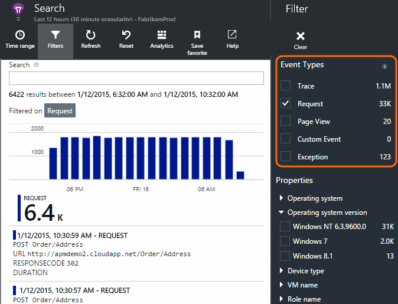

### Filter on property values

You can filter events on the values of their properties. The available properties depend on the event types you selected. 

For example, pick out requests with a specific response code.

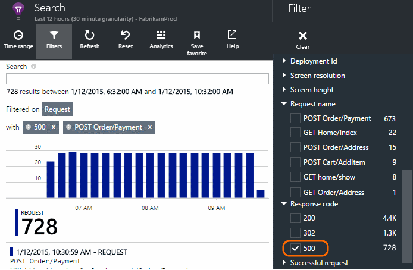

Choosing no values of a particular property has the same effect as choosing all values; it switches off filtering on that property.

> [AZURE.NOTE] If your app generates a lot of telemetry, the adaptive sampling module will automatically reduce the volume that is sent to the portal by sending only a representative fraction of events. Events that are part of the same operation will be selected or deselected as a group, so that you can navigate between related events. [Learn about sampling.](app-insights-sampling.md)

### Narrow your search

Notice that the counts to the right of the filter values show how many occurrences there are in the current filtered set. 

In this example, it's clear that the `Reports/Employees` request results in the majority of the 500 errors:

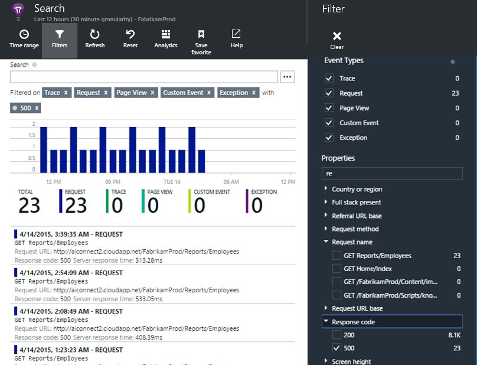

Additionally if you want to also see what other events were happening during this time, you can check **Include events with undefined properties**.

### Save your search

When you've set all the filters you want, you can save the search as a favorite. If you work in an organizational account, you can choose whether to share it with other team members.

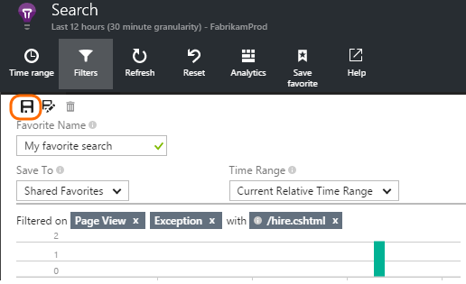

To see the search again, **go to the overview blade** and open Favorites:

If you saved with Relative time range, the re-opened blade has the latest data. If you saved with Absolute time range, you see the same data every time.

## Analytics

[Analytics](app-insights-analytics.md) is the advanced search feature with which you can diagnose and understand performance questions about your app.

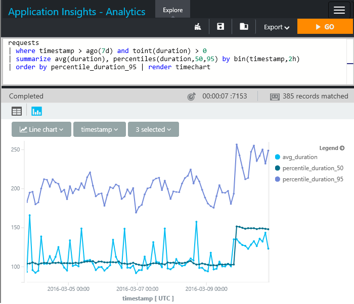

Click the Analytics tile to see it.
