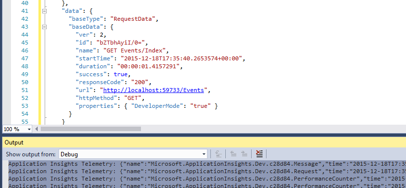

<properties 
	pageTitle="Data retention and storage in Application Insights" 
	description="Retention and privacy policy statement" 
	services="application-insights" 
    documentationCenter=""
	authors="alancameronwills" 
	manager="douge"/>

<tags 
	ms.service="application-insights" 
	ms.workload="tbd" 
	ms.tgt_pltfrm="ibiza" 
	ms.devlang="na" 
	ms.topic="article" 
	ms.date="05/17/2016" 
	ms.author="awills"/>

# Data collection, retention and storage in Application Insights 

*Application Insights is in preview.*

When you install [Visual Studio Application Insights][start] SDK in your app, it sends telemetry about your app to the Cloud. Naturally, responsible developers want to know exactly what data is sent, what happens to the data, and how they can keep control of it. In particular, could sensitive data be sent, where is it stored, and how secure is it? 

First, the short answer:

* The standard telemetry modules that run "out of the box" are unlikely to send sensitive data to the service. The telemetry is concerned with load, performance and usage metrics, exception reports, and other diagnostic data. The main user data visible in the diagnostic reports are URLs; but your app shouldn't in any case put sensitive data in plain text in a URL.
* You can write code that sends additional custom telemetry to help you with diagnostics and monitoring usage. (This extensibility is a great feature of Application Insights.) It would be possible, by mistake, to write this code so that it includes personal and other sensitive data. If your application works with such data, you should apply strong review processes to all the code you write.
* While developing and testing your app, it's easy to inspect what's being sent by the SDK. The data appears in the debugging output windows of the IDE and browser. 
* The data is held in [Microsoft Azure](http://azure.com) servers in the USA. (But your app can run anywhere.) Azure has [strong security processes and meets a broad range of compliance standards](https://azure.microsoft.com/support/trust-center/). Only you and your designated team have access to your data. Microsoft staff can have restricted access to it only under specific limited circumstances with your knowledge. It's encrypted in transit, though not in the servers.

The rest of this article elaborates more fully on these answers. It's designed to be self-contained, so that you can show it to colleagues who aren't part of your immediate team.

## What is Application Insights?

[Visual Studio Application Insights][start] is a service provided by Microsoft that helps you improve the performance and usability of your live application. It monitors your application all the time it's running, both during testing and after you've published or deployed it. Application Insights creates charts and tables that show you, for example, what times of day you get most users, how responsive the app is, and how well it is served by any external services that it depends on. If there are crashes, failures or performance issues, you can search through the telemetry data in detail to diagnose the cause. And the service will send you emails if there are any changes in the availability and performance of your app.

In order to get this functionality, you install an Application Insights SDK in your application, which becomes part of its code. When your app is running, the SDK monitors its operation and sends telemetry to the Application Insights service. This is a cloud service hosted by [Microsoft Azure](http://azure.com). (But Application Insights works for any applications, not just those that are hosted in Azure.)

The Application Insights service stores and analyzes the telemetry. To see the analysis or search through the stored telemetry, you sign in to your Azure account and open the Application Insights resource for your application. You can also share access to the data with other members of your team, or with specified Azure subscribers.

You can have data exported from the Application Insights service, for example to a database or to external tools. You provide each tool with a special key that you obtain from the service. The key can be revoked if necessary. 

Application Insights SDKs are available for a range of application types: web services hosted in your own J2EE or ASP.NET servers, or in Azure; web clients - that is, the code running in a web page; desktop apps and services; device apps such as Windows Phone, iOS, and Android. They all send telemetry to the same service.

## What data does it collect?

### How is the data is collected?

There are three sources of data:

* The SDK, which you integrate with your app either [in development](app-insights-asp-net.md) or [at run time](app-insights-monitor-performance-live-website-now.md). There are different SDKs for different application types. There's also an [SDK for web pages](app-insights-javascript.md), which loads into the end-user's browser along with the page.

 * Each SDK has a number of [modules](app-insights-configuration-with-applicationinsights-config.md), which use different techniques to collect different types of telemetry.
 * If you install the SDK in development, you can use its API to send your own telemetry, in addition to the standard modules. This custom telemetry can include any data you want to send.
* In some web servers, there are also agents that run alongside the app and send telemetry about CPU, memory, and network occupancy. For example, Azure VMs, Docker hosts, and [J2EE servers](app-insights-java-agent.md) can have such agents.
* [Availability tests](app-insights-monitor-web-app-availability.md) are processes run by Microsoft that send requests to your web app at regular intervals. The results are sent to the Application Insights service.

### What kinds of data are collected?

The main categories are:

* [Web server telemetry](app-insights-asp-net.md) - HTTP requests.  Uri, time taken to process the request, response code, client IP address. Session id.
* [Web pages](app-insights-javascript.md) - Page, user and session counts. Page load times. Exceptions. Ajax calls.
* Performance counters - Memory, CPU, IO, Network occupancy.
* Client and server context - OS, locale, device type, browser, screen resolution.
* [Exceptions](app-insights-asp-net-exceptions.md) and crashes - **stack dumps**, build id, CPU type. 
* [Dependencies](app-insights-asp-net-dependencies.md) - calls to external services such as REST, SQL, AJAX. URI or connection string, duration, success, command.
* [Availability tests](app-insights-monitor-web-app-availability.md) - duration of test and steps, responses.
* [Trace logs](app-insights-search-diagnostic-logs.md) and [custom telemetry](app-insights-api-custom-events-metrics.md) - **anything you code into your logs or telemetry**.

[More detail](#data-sent-by-application-insights).

## How can I verify what's being collected?

If you're developing the app using Visual Studio, run the app in debug mode (F5). The telemetry appears in the Output window. From there, you can copy it and format it as JSON for easy inspection. 

There's also a more readable view in the Diagnostics window.

For web pages, open your browser's debugging window.

### Can I write code to filter the telemetry before it is sent?

This would be possible by writing a [telemetry processor plugin](app-insights-api-filtering-sampling.md).

## How long is the data kept? 

Raw data points (that is, items that you can inspect in Diagnostic Search) are kept for 7 days. If you need to keep data longer than that, you can use [continuous export](app-insights-export-telemetry.md) to copy it to a storage account.

Aggregated data (that is, counts, averages and other statistical data that you see in Metric Explorer) are retained at a grain of 1 minute for 30 days, and 1 hour or 1 day (depending on type) for at least 90 days.

## Who can access the data?

The data is visible to you and, if you have an organization account, your team members. 

It can be exported by you and your team members and could be copied to other locations and passed on to other people.

#### What does Microsoft do with the information my app sends to Application Insights?

Microsoft uses the data only in order to provide the service to you.

## Where is the data held? 

* In the USA. 

#### Can it be stored somewhere else, for example in Europe? 

* Not at present. 

#### Does that mean my app has to be hosted in the USA?

* No. Your application can run anywhere, either in your own on-premises hosts or in the Cloud.

## How secure is my data?  

Application Insights is an Azure Service in Preview. While in Preview we are working towards protecting your data per the policies described in the [Azure Security, Privacy, and Compliance white paper](http://go.microsoft.com/fwlink/?linkid=392408).

The data is stored in Microsoft Azure servers. For accounts in the Azure Portal, account restrictions are described in the [Azure Security, Privacy, and Compliance document](http://go.microsoft.com/fwlink/?linkid=392408). For accounts in the Visual Studio Team Services Portal, the [Visual Studio Team Services Data Protection](http://download.microsoft.com/download/8/E/E/8EE6A61C-44C2-4F81-B870-A267F1DF978C/MicrosoftVisualStudioOnlineDataProtection.pdf) document applies. 

Access to your data by Microsoft personnel is restricted. We access your data only with your permission and if it is necessary to support your use of Application Insights. 

Data in aggregate across all our customers' applications (such as data rates and average size of traces) is used to improve Application Insights.

#### Could someone else's telemetry interfere with my Application Insights data?

They could send additional telemetry to your account by using the instrumentation key, which can be found in the code of your web pages. With enough additional data, your metrics would not correctly represent your app's performance and usage.

If you share code with other projects, remember to remove your instrumentation key.

## Is the data encrypted? 

Not inside the servers at present.

All data is encrypted as it moves between data centers.

#### Is the data encrypted in transit from my application to Application Insights servers?

Yes, we use https to send data to the portal from nearly all SDKs, including web servers, devices and HTTPS web pages. The only exception is data sent from plain HTTP web pages. 

## Personally Identifiable Information

#### Could Personally Identifiable Information (PII) be sent to Application Insights? 

Yes, it's possible. 

As general guidance:

* Most standard telemetry (that is, telemetry sent without you writing any code) does not include explicit PII. However, it might be possible to identify individuals by inference from a collection of events.
* Exception and trace messages could contain PII
* Custom telemetry - that is, calls such as TrackEvent that you write in code using the API or log traces - can contain any data you choose.

The table at the end of this document contains more detailed descriptions of the data collected.

#### Am I responsible for complying with laws and regulations in regard to PII?

Yes. It is your responsibility to ensure that the collection and use of the data complies with laws and regulations, and with the Microsoft Online Services Terms.

You should inform your customers appropriately about the data your application collects and how the data is used.

#### Can my users turn off Application Insights?

Not directly. We don't provide a switch that your users can operate to turn off Application Insights.

However, you can implement such a feature in your application. All the SDKs include an API setting that turns off telemetry collection. 

#### My application is unintentionally collecting sensitive information. Can Application Insights scrub this data so it isn't retained?

Application Insights does not filter or delete your data. You should manage the data appropriately and avoid sending such data to Application Insights.

## Data sent by Application Insights

The SDKs vary between platforms, and there are are several components that you can install. (Refer to [Application Insights - get started][start].) Each component sends different data.

#### Classes of data sent in different scenarios

Your action  | Data classes collected (see next table)
---|---
[Add Application Insights SDK to a .NET web project][greenbrown] | ServerContext Inferred Perf counters Requests **Exceptions** Session users
[Install Status Monitor on IIS][redfield]|Dependencies ServerContext Inferred Perf counters
[Add Application Insights SDK to a Java web app][java]|ServerContext Inferred Request Session users
[Add JavaScript SDK to web page][client]|ClientContext  Inferred Page ClientPerf Ajax
[Add SDK to Windows Store app][windows]|DeviceContext Users Crash data
[Define default properties][apiproperties]|**Properties** on all standard and custom events
[Call TrackMetric][api]|Numeric values **Properties**
[Call Track*][api]|Event name **Properties**
[Call TrackException][api]|**Exceptions** Stack dump **Properties**
SDK can't collect data. For example:   - can't access perf counters  -  exception in telemetry initializer | SDK diagnostics
 

For [SDKs for other platforms][platforms], see their documents.

#### The classes of collected data

Collected data class | Includes (not an exhaustive list) 
---|---
**Properties**|**Any data - determined by your code**
DeviceContext |Id, IP, Locale, Device model, network, network type, OEM name, screen resolution, Role Instance, Role Name, Device Type
ClientContext |OS, locale, language, network, window resolution
Session | session id
ServerContext |Machine name, locale, OS, device, user session, user context, operation 
Inferred |geo location from IP address, timestamp, OS, browser
Metrics | Metric name and value
Events | Event name and value
PageViews | URL and page name or screen name
Client perf | URL/page name, browser load time
Ajax | HTTP calls from web page to server
Requests |URL, duration, response code
Dependencies|Type(SQL, HTTP, ...), connection string or URI, sync/async, duration, success, SQL statement (with Status Monitor)
**Exceptions** | Type, **message**, call stacks, source file and line number, thread id
Crashes | Process id, parent process id, crash thread id; application patch, id, build;  exception type, address, reason; obfuscated symbols and registers, binary start and end addresses, binary name and path, cpu type
Trace | **Message** and severity level
Perf counters | Processor time, available memory, request rate, exception rate, process private bytes, IO rate, request duration, request queue length
Availability | Web test response code, duration of each test step, test name, timestamp, success, response time, test location
SDK diagnostics | Trace message or Exception 

You can [switch off some of the data by editing ApplicationInsights.config][config]

## Credits

This product includes GeoLite2 data created by MaxMind, available from [http://www.maxmind.com](http://www.maxmind.com).

## Videos

#### Introduction

> [AZURE.VIDEO application-insights-introduction]

#### Get started

> [AZURE.VIDEO getting-started-with-application-insights]

<!--Link references-->

[api]: app-insights-api-custom-events-metrics.md
[apiproperties]: app-insights-api-custom-events-metrics.md#properties
[client]: app-insights-javascript.md
[config]: app-insights-configuration-with-applicationinsights-config.md
[greenbrown]: app-insights-asp-net.md
[java]: app-insights-java-get-started.md
[platforms]: app-insights-platforms.md
[pricing]: http://azure.microsoft.com/pricing/details/application-insights/
[redfield]: app-insights-monitor-performance-live-website-now.md
[start]: app-insights-overview.md
[windows]: app-insights-windows-get-started.md

 