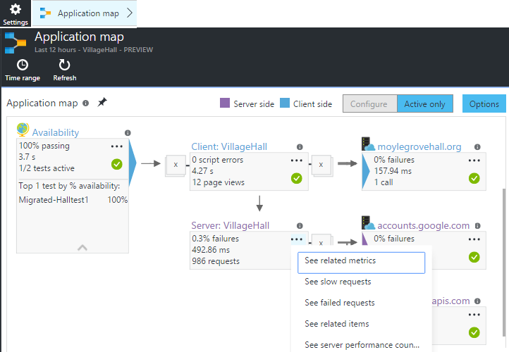
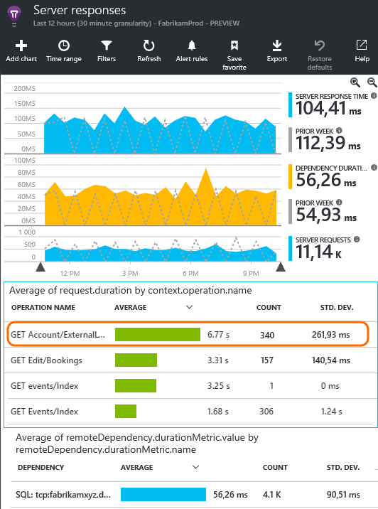
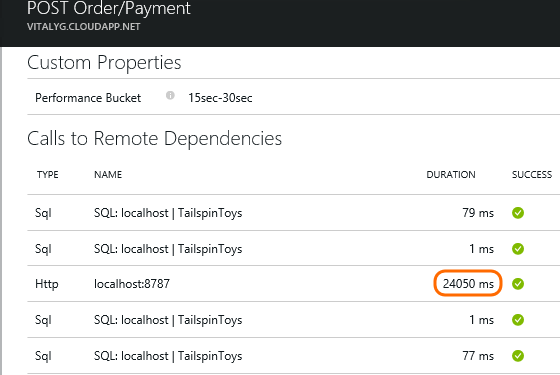
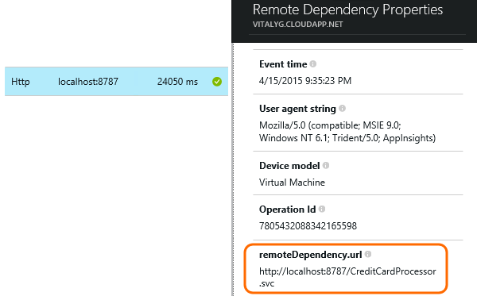
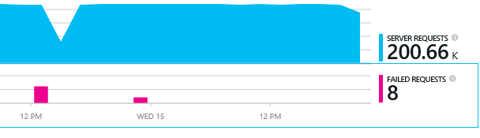

<properties 
	pageTitle="Diagnosing issues with dependencies in Application Insights" 
	description="Find failures and slow performance caused by dependencies" 
	services="application-insights" 
    documentationCenter=""
	authors="alancameronwills" 
	manager="douge"/>

<tags 
	ms.service="application-insights" 
	ms.workload="tbd" 
	ms.tgt_pltfrm="ibiza" 
	ms.devlang="na" 
	ms.topic="article" 
	ms.date="05/12/2016" 
	ms.author="awills"/>
 
# Diagnosing issues with dependencies in Application Insights


A *dependency* is an external component that is called by your app. It's typically a service called using HTTP, or a database, or a file system. Or in your web page script, it can be an AJAX call back to the server. In Visual Studio Application Insights, you can easily see how long your application waits for dependencies and how often a dependency call fails.

## Where you can use it

Out of the box dependency monitoring is currently available for:

* ASP.NET web apps and services running on an IIS server or on Azure
* [Java web apps](app-insights-java-agent.md)
* [Web pages](https://azure.microsoft.com/blog/ajax-collection-in-application-insights/)

For other types, such as device apps, you can write your own monitor using the [TrackDependency API](app-insights-api-custom-events-metrics.md#track-dependency).

The out-of-the-box dependency monitor currently reports calls to these  types of dependencies:

* ASP.NET
 * SQL databases
 * ASP.NET web and WCF services that use HTTP-based bindings
 * Local or remote HTTP calls
 * Azure DocumentDb, table, blob storage, and queue
* Java
 * Calls to a database through a [JDBC](http://docs.oracle.com/javase/7/docs/technotes/guides/jdbc/) driver, such as MySQL, SQL Server, PostgreSQL or SQLite.
* Web pages
 * [AJAX calls](app-insights-javascript.md)

Again, you could write your own SDK calls to monitor other dependencies.

## To set up dependency monitoring

Install the appropriate agent for the host server.

Platform | Install
---|---
IIS Server | Either [install Status Monitor on your server](app-insights-monitor-performance-live-website-now.md) or [Upgrade your application to .NET framework 4.6 or later](http://go.microsoft.com/fwlink/?LinkId=528259) and install the [Application Insights SDK](app-insights-asp-net.md)  in your app.
Azure Web App | [Application Insights Extension](../azure-portal/insights-perf-analytics.md)
Java web server | [Java web apps](app-insights-java-agent.md)
Web pages | [JavaScript monitor](app-insights-javascript.md) (No additional setup beyond web page monitoring)
Azure Cloud Service |  [Use startup task](app-insights-cloudservices.md#dependencies) or [Install .NET framework 4.6+](../cloud-services/cloud-services-dotnet-install-dotnet.md)  

The Status Monitor for IIS Servers doesn't need you to rebuild your source project with the Application Insights SDK. 

## Application Map

Application Map acts as a visual aid to discovering dependencies between the components of your application. 



From the boxes, you can navigate to relevant dependency and other charts.

Click the small [x] to collapse a subtree.

Pin the map to the [dashboard](app-insights-dashboards.md), where it will be fully functional.

[Learn more](app-insights-app-map.md).

## <a name="diagnosis"></a> Diagnosing dependency performance issues in the web server

To assess the performance of requests at your server:


Scroll down to look at the grid of requests:



The top one is taking very long. Let's see if we can find out where the time is spent.

Click that row to see individual request events:


Click any long-running instance to inspect it further.

> [AZURE.NOTE] Scroll down a bit to choose an instance. Latency in the pipeline might mean that the data for the top instances is incomplete.

Scroll down to the remote dependency calls related to this request:



It looks like most of the time servicing this request was spent in a call to a local service. 

Select that row to get more information:




The detail includes sufficient information to diagnose the problem.


## Failures

If there are failed requests, click the chart.



Click through a request type and request instance, to find a failed call to a remote dependency.


## Custom dependency tracking

The standard dependency-tracking module automatically discovers external dependencies such as databases and REST APIs. But you might want some additional components to be treated in the same way. 

You can write code that sends dependency information, using the same [TrackDependency API](app-insights-api-custom-events-metrics.md#track-dependency) that is used by the standard modules.

For example, if you build your code with an assembly that you didn't write yourself, you could time all the calls to it, to find out what contribution it makes to your response times. To have this data displayed in the dependency charts in Application Insights, send it using `TrackDependency`.

```C#

            var success = false;
            var startTime = DateTime.UtcNow;
            var timer = System.Diagnostics.Stopwatch.StartNew();
            try
            {
                success = dependency.Call();
            }
            finally
            {
                timer.Stop();
                telemetry.TrackDependency("myDependency", "myCall", startTime, timer.Elapsed, success);
            }
```

If you want to switch off the standard dependency tracking module, remove the reference to DependencyTrackingTelemetryModule in [ApplicationInsights.config](app-insights-configuration-with-applicationinsights-config.md).


## Ajax

See [Web pages](app-insights-javascript.md).


 