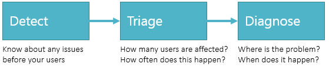
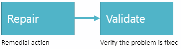
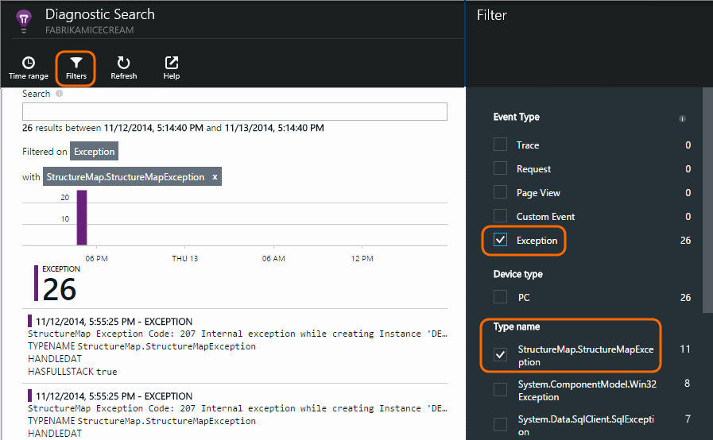
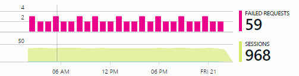

<properties
	pageTitle="Detect, Triage, Diagnose J2EE web apps"
	description="Analyse crashes and detect  and diagnose performance issues in your Java web applications"
	authors="alancameronwills"
	services="application-insights"
    documentationCenter=""
	manager="douge"/>

<tags
	ms.service="application-insights"
	ms.workload="tbd"
	ms.tgt_pltfrm="ibiza"
	ms.devlang="na"
	ms.topic="article" 
	ms.date="09/09/2015"
	ms.author="awills"/>

# Detect, Triage and Diagnose J2EE apps with Application Insights

*Application Insights is in preview.*


After you've published your application, Application Insights helps you make sure it's running OK and performing well. If there's a problem, you want to know about it soon, and then you want to know what to do about it.

* *"A couple of days ago, we deployed a 'minor' hotfix. We didn't run a broad test pass, but unfortunately some unexpected change got merged into the payload, causing incompatibility between the front and back ends. Immediately, server exceptions surged, our alert fired, and we were made aware of the situation. A few clicks away on the Application Insights portal, we got enough information from exception callstacks to narrow down the problem. We rolled back immediately and limited the damage. Application Insights has made this part of the devops cycle very easy and actionable."*

We can think of this part of the devops cycle as a pipeline:




Once you've diagnosed the problem, you know where to focus your efforts - whether it's debugging your code, allocating more memory, or following up with a dependency. Finally, you can check that your fix has worked:





Let's see how Application Insights works at each stage of the pipeline.

Application Insights works for devices apps and web applications. In this walkthrough, we'll focus on a web application. We'll follow the OBS team in Fabrikam Bank, who are responsible for the online banking system. They have [added Application Insights to their web projects](app-insights-java-get-started.md).  


## Detect poor availability


Marcela Markova is a test specialist on the OBS team, and takes the lead on monitoring online performance. She sets up several [web tests][availability]:

* A single-URL test for the main landing page for the app, http://fabrikambank.com/onlinebanking/. She sets criteria of HTTP code 200 and text 'Welcome!'. If this test fails, there's something seriously wrong with the network or the servers, or maybe a deployment issue. (Or someone has changed the Welcome! message on the page without letting her know.)


* A deeper multi-step test, which logs in and gets a current account listing, checking a few key details on each page. This test verifies that the link to the accounts database is working. She uses a fictitious customer id: a few of them are maintained for test purposes.


With these tests set up, Marcela is confident that the team will quickly know about any outage.  


Failures show up as red dots on the web test chart:


But more importantly, an alert about any failure will be emailed to the development team. In that way, they know about it before nearly all of the customers.


## Monitor performance metrics


On the overview page in Application Insights, there's a chart that shows a variety of [key metrics][perf].


Browser page load time is derived from telemetry sent directly from web pages. Server response time, server request count and failed request count are all measured in the web server and sent to Application Insights from there.


The Failed Request count indicates cases where users have seen an error - typically following an exception thrown in the code. Maybe they see a message saying "Sorry we couldn't update your details right now" or, at absolute embarrassing worst, a stack dump on the user's screen, courtesy of the web server.


Marcela likes to look at these charts from time to time. The absence of failed requests is encouraging, although when she changes the range of the chart to cover the past week, occasional failures appear. This is an acceptable level in a busy server.  But if there is a sudden jump in failures, or in some of the other metrics such as server response time, Marcela wants to know about it immediately. It might indicate an unforeseen problem caused by a code release, or a failure in a dependency such as a database, or maybe an ungraceful reaction to a high load of requests.


Marcela doesn't just sit around waiting for alerts. Soon after every redeployment, she takes a look at [response times][perf] - both the overall figure and the table of slowest requests, as well as exception counts.  


She can assess the performance effect of every deployment, typically comparing each week with the last. If there's a sudden worsening, she raises that with the relevant developers.

There are also charts for dependencies, performance counters, exceptions, usage data, and many more metrics and events.

#### Alerts

So she sets two [alerts][metrics]: one for response times greater than a typical threshold, and another for a rate of failed requests greater than the current background.


Together with the availability alerts, these give her confidence that she'll know about it as soon as anything unusual happens.  


It's also possible to set alerts on a wide variety of other metrics. For example, you can receive emails if the exception count becomes high, or the available memory goes low, or if there is a peak in client requests.


## Detecting exceptions


Uncaught exceptions are reported to Application Insights automatically. 


In addition, you can send reports of exceptions that you catch by inserting calls to [trackException()](app-insights-api-custom-events-metrics.md#track-exception) into the handler:  

``` Java

   TelemetryClient telemetry = new TelemetryClient();
   try {
    ...
   } catch (Exception ex) {
    // Set up some properties:
    Map<String, String> properties = new HashMap<String, String>();
    properties.put("Game", currentGame.getName());

    Map<String, Double> measurements = new HashMap<String, Double>();
    measurements.put("Users", currentGame.getUsers().getCount());

    // Send the exception telemetry:
    telemetry.trackException(ex, properties, measurements);
   }

```


The Fabrikam Bank team has evolved the practice of always sending telemetry on an exception, unless there's an obvious recovery.  

They typically attach properties that might be useful in diagnosis.

Exceptions and events show up in the [Diagnostic Search][diagnostic] blade. You can drill into them to see the additional properties and stack trace.




## Triage


Triage - assessing the severity and extent of a problem - is the first step after detection. Should we call out the team at midnight? Or can it be left until the next convenient gap in the backlog? There are some key questions in triage.


How much is it happening? The charts on the Overview blade give some perspective to a problem. For example, the Fabrikam application generated four web test alerts one night. Looking at the chart in the morning, the team could see that there were indeed some red dots, though still most of the tests were green. Drilling into the availability chart, it was clear that all of these intermittent problems were from one test location. This was obviously a network issue affecting only one route, and would most likely clear itself.  


By contrast, a dramatic and stable rise in the graph of exception counts or response times is obviously something to panic about.


A useful triage tactic is Try It Yourself. If you run into the same problem, you know it's real.


What fraction of users are affected? To obtain a rough answer, divide the failure rate by the session count.




In the case of slow response, compare the table of slowest-responding requests with the usage frequency of each page.


How important is the blocked scenario? If this is a functional problem blocking a particular user story, does it matter much? If customers can't pay their bills, this is serious; if they can't change their screen color preferences, maybe it can wait. The detail of the event or exception, or the identity of the slow page, tells you where customers are having trouble.


## Diagnosis


Diagnosis isn't quite the same as debugging. Before you start tracing through the code, you should have a rough idea of why, where and when the issue is occurring.


**When does it happen?** The historical view provided by the event and metric charts makes it easy to correlate effects with possible causes. If there are intermittent peaks in response time or exception rates, look at the request count: if it peaks at the same time, then it looks like a resource problem. Do you need to assign more CPU or memory? Or is it a dependency that can't manage the load?


**Is it us?**  If you have a sudden drop in performance of a particular type of request - for example when the customer wants an account statement - then there's a possibility it might be an external subsystem rather than your web application. In Metrics Explorer, select the Dependency Failure rate and Dependency Duration rates and compare their histories over the past few hours or days with the problem you detected. If there are correlating changes, then an external subsystem might be to blame.  


Some slow dependency issues are geolocation problems. Fabrikam Bank uses Azure virtual machines, and discovered that they had inadvertently located their web server and account server in different countries. A dramatic improvement was brought about by migrating one of them.


**What did we do?** If the issue doesn't appear to be in a dependency, and if it wasn't always there, it's probably caused by a recent change. The historical perspective provided by the metric and event charts makes it easy to correlate any sudden changes with deployments. That narrows down the search for the problem.


**What's going on?** Some problems occur only rarely and can be difficult to track down by testing offline. All we can do is to try to capture the bug when it occurs live. You can inspect the stack dumps in exception reports. In addition, you can write tracing calls, either with your favourite logging framework or with trackTrace() or trackEvent().  


Fabrikam had an intermittent problem with inter-account transfers, but only with certain account types. To understand better what was happening, they inserted trackTrace() calls at key points in the code, attaching the account type as a property to each call. That made it easy to filter out just those traces in Diagnostic Search. They also attached parameter values as properties and measures to the trace calls.


## Dealing with it


Once you've diagnosed the issue, you can make a plan to fix it. Maybe you need to roll back a recent change, or maybe you can just go ahead and fix it. Once the fix is done, Application Insights will tell you whether you succeeded.  


Fabrikam Bank's development team take a more structured approach to performance measurement than they used to before they used Application Insights.

* They set performance targets in terms of specific measures in the Application Insights overview page.

* They design performance measures into the application from the start, such as the metrics that measure user progress through 'funnels.'  


## Usage

Application Insights can also be used to learn what users do with an app. Once it's running smoothly, the team would like to know which features are the most popular, what users like or have difficulty with, and how often they come back. That will help them prioritize their upcoming work. And they can plan to measure the success of each feature as part of the development cycle. [Read more][usage].


## Monitoring user activity

When response time is consistently good and there are few exceptions, the dev team can think about how to improve the users' experience, and how to encourage more users to achieve the desired goals.


For example, a typical user journey through the web site has a clear 'funnel': Many customers look at the rates of different types of loan; some of them fill in the quotation form; and of those who get a quotation, a few go ahead and take out the loan.


By considering where the greatest numbers of customers drop out, the business can work out how to get more users through to the bottom of the funnel. In some cases there might be a user experience (UX) failure - for example, the 'next' button is hard to find, or the instructions aren't obvious. More likely, there are more significant business reasons for drop-outs: maybe the loan rates are too high.

Whatever the reasons, the data helps the team work out what users are doing. More tracking calls can be inserted to work out more detail. trackEvent() can be used to count any user actions, from the fine detail of individual button clicks to significant achievements such as paying off a loan.

The team is getting used to having information about user activity. Nowadays, whenever they design a new feature, they work out how they will get feedback about its usage. They design tracking calls into the feature from the start. They use the feedback to improve the feature in each development cycle.


## Your applications

So that's how one team use Application Insights not just to fix individual issues, but to improve their development lifecycle. I hope it has given you some ideas about how Application Insights can help you improve the performance of your own applications.

## Video

[AZURE.VIDEO performance-monitoring-application-insights]

<!--Link references-->

[api]: app-insights-api-custom-events-metrics.md
[availability]: app-insights-monitor-web-app-availability.md
[diagnostic]: app-insights-diagnostic-search.md
[metrics]: app-insights-metrics-explorer.md
[perf]: app-insights-web-monitor-performance.md
[usage]: app-insights-web-track-usage.md
 
