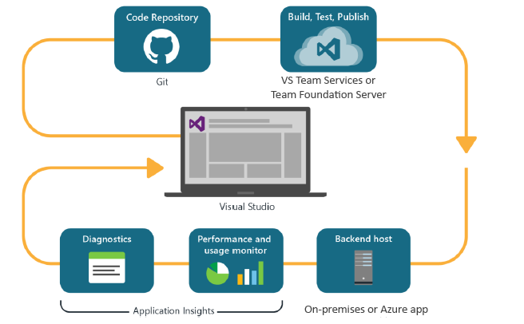
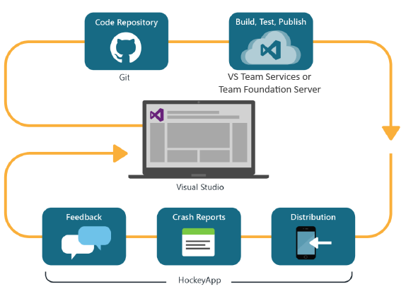

<properties
	pageTitle="Developer Analytics"
	description="DevOps with Visual Studio, Application Insights, and HockeyApp"
	authors="alancameronwills"
	services="application-insights"
    documentationCenter=""
	manager="douge"/>

<tags
	ms.service="application-insights"
	ms.workload="tbd"
	ms.tgt_pltfrm="ibiza"
	ms.devlang="na"
	ms.topic="article" 
	ms.date="05/18/2016"
	ms.author="awills"/>

# Developer Analytics with Application Insights and HockeyApp

*Application Insights is in preview.*

Many projects operate a rapid [DevOps](https://en.wikipedia.org/wiki/DevOps) cycle. They build and distribute their applications, get feedback about how it performs and what users do with it, and then use that knowledge to plan further development cycles. 

To monitor usage and performance, it's important to have telemetry from the live application, as well as feedback from the users themselves. 

Many systems are built from multiple components: a web service, backend processors or data stores, and client software running either in the user's browser or as an app in a phone or other device. The telemetry from these different components has to be taken together.

Some releases have restricted distribution to designated testers; we have also organized flighting (tests of new features with restricted audiences), and A|B testing (parallel tests of alternative UI).

Managing distributions and integrating monitoring over multiple client and server components isn’t a trivial task. This process is an essential part of the architecture of the application: we can’t create a system of this kind without an iterative development cycle and good monitoring tools.

In this article, we'll look at how the monitoring aspects of the devOps cycle fit in with the other parts of the process. 

If you'd like to look at a specific example, there's [an interesting case study](http://aka.ms/mydrivingdocs) that has multiple client and server components.

## A DevOps cycle

Visual Studio and Developer Analytics tools offer a well-integrated devOps experience. For example, here is a typical cycle for a web application (which could be Java, Node.js, or ASP.NET):

* A developer checks in to the code repository, or merges into the main branch. The repository is Git in this illustration, but it could equally be [Team Foundation Version Control](https://www.visualstudio.com/docs/tfvc/overview).
* The changes trigger a build and unit test. The build service can be in [Visual Studio Team Services or its on-premises counterpart, Team Foundation Server](https://www.visualstudio.com/docs/vsts-tfs-overview). 
* A successful build and unit test can [trigger an automatic deployment](https://www.visualstudio.com/docs/release/author-release-definition/more-release-definition). The web app host can be either your own web server or Microsoft Azure. 
* Telemetry from the live app is sent to [Application Insights](app-insights-overview.md), both from the server and [from client browsers](app-insights-javascript.md). There, you can analyse both the performance of the app and usage patterns. Powerful [search tools](app-insights-analytics.md) help you diagnose any issues. [Alerts](app-insights-alerts.md) make sure you know about a problem as soon as it arises. 
* Your next development cycle is informed by your analysis of the live telemetry.

### Device and desktop apps

For device and desktop apps, the distribution part of the cycle is slightly different, because we aren't just uploading to one or two servers. Instead, a successful build and unit test can [trigger uploading to HockeyApp](https://support.hockeyapp.net/kb/third-party-bug-trackers-services-and-webhooks/how-to-use-hockeyapp-with-visual-studio-team-services-vsts-or-team-foundation-server-tfs). HockeyApp supervises distribution to your team of test users (or to the general public, if you prefer). 

HockeyApp also collects performance and usage data, in the forms of:

* Verbatim user feedback with screenshots
* Crash reports
* Custom telemetry coded by you.

Once again, the devOps cycle is completed as you make your future development plans in the light of the feedback gained.

## Setting up Developer Analytics

For each component of your application - mobile or web or desktop - the steps are basically the same. For many types of app, Visual Studio automatically performs some of these steps.

1. Add the appropriate SDK to your app. For device apps, it's HockeyApp, and for web services it's Application Insights. Each has several variants for different platforms. (It's also possible to use either SDK for desktop apps, though we recommend HockeyApp.)
2. Register your app with the Application Insights or HockeyApp portal, depending on the SDK you used. This is where you'll see analytics from your live app. You get an instrumentation key or ID that you configure into your app so that the SDK knows where to send its telemetry.
3. Add custom code (if desired) to log events or metrics, to help you with diagnostics or to analyze performance or usage. There's a lot of monitoring built in, so you won't need this on your first cycle.
3. For device apps:
 * Upload a debug build to HockeyApp. From there you can distribute it to a team of test users. Whenever you upload subsequent builds, the team will be notified.
 * When you set up your continuous build service, create a release definition that uses the plug-in step to upload to HockeyApp.
 
Here are the detailed instructions for different types of app:

* [ASP.NET web app](app-insights-asp-net.md) 
* [Java web app](app-insights-java-get-started.md)
* [Node.js web app](https://github.com/Microsoft/ApplicationInsights-node.js)
* [iOS app](https://support.hockeyapp.net/kb/client-integration-ios-mac-os-x-tvos/hockeyapp-for-ios)
* [Mac OS X app](https://support.hockeyapp.net/kb/client-integration-ios-mac-os-x-tvos/hockeyapp-for-mac-os-x)
* [Android app](https://support.hockeyapp.net/kb/client-integration-android/hockeyapp-for-android-sdk)
* [Universal Windows app](https://support.hockeyapp.net/kb/client-integration-windows-and-windows-phone/how-to-create-an-app-for-uwp)
* [Windows Phone 8 and 8.1 app](https://support.hockeyapp.net/kb/client-integration-windows-and-windows-phone/hockeyapp-for-windows-phone-silverlight-apps-80-and-81)
* [Windows Presentation Foundation app](https://support.hockeyapp.net/kb/client-integration-windows-and-windows-phone/hockeyapp-for-windows-wpf-apps)

