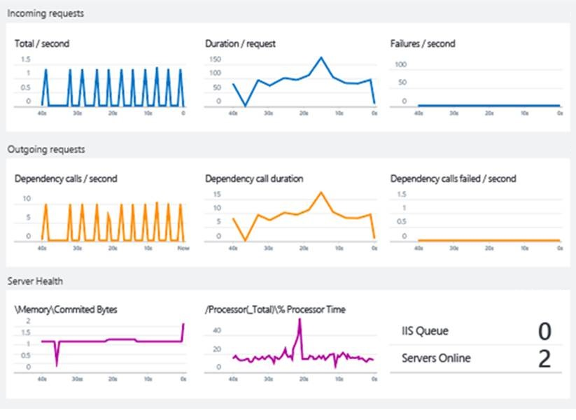
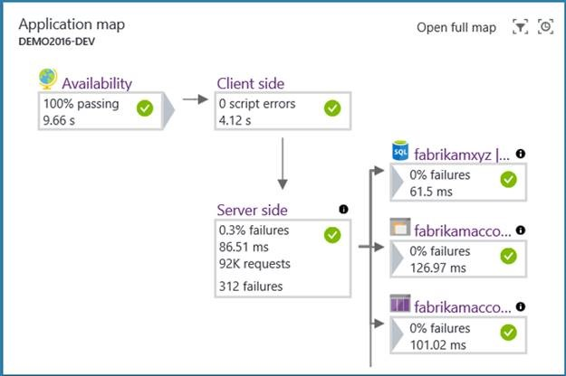
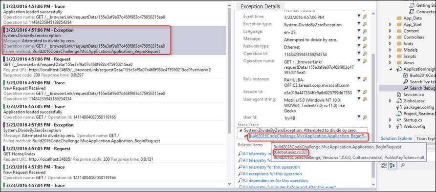
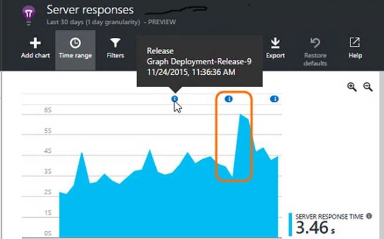

# Deep diagnostics for web apps and services with Application Insights
## Why do I need Application Insights?
Application Insights monitors your running web app. It tells you about failures and performance issues, and helps you analyze how customers use your app. It works for apps running on many platforms (ASP.NET, J2EE, Node.js, ...) and is hosted either in the Cloud or on-premises. 

It's essential to monitor a modern application while it is running. Most importantly, you want to detect failures before most of your customers do. You also want to discover and fix performance issues that, while not catastrophic, perhaps slow things down or cause some inconvenience to your users. And when the system is performing to your satisfaction, you want to know what the users are doing with it: Are they using the latest feature? Are they succeeding with it?

Modern web applications are developed in a cycle of continuous delivery: release a new feature or improvement; observe how well it works for the users; plan the next increment of development based on that knowledge. A key part of this cycle is the observation phase. Application Insights provides the tools to monitor a web application for performance and usage.

The most important aspect of this process is diagnostics and diagnosis. If the application fails, then business is being lost. The prime role of a monitoring framework is therefore to detect failures reliably, notify you immediately, and to present you with the information needed to diagnose the problem. This is exactly what Application Insights does.

### Where do bugs come from?
Failures in web systems typically arise from configuration issues or bad interactions between their many components. The first task when tackling a live site incident is therefore to identify the locus of the problem: which component or relationship is the cause?

Some of us, those with gray hair, can remember a simpler era in which a computer program ran in one computer. The developers would test it thoroughly before shipping it; and having shipped it, would rarely see or think about it again. The users would have to put up with the residual bugs for many years. 

Things are so very different now. Your app has a plethora of different devices to run on, and it can be difficult to guarantee the exact same behavior on each one. Hosting apps in the cloud means bugs can be fixed fast, but it also means continuous competition and the expectation of new features at frequent intervals. 

In these conditions, the only way to keep a firm control on the bug count is automated unit testing. It would be impossible to manually re-test everything on every delivery. Unit test is now a commonplace part of the build process. Tools such as the Xamarin Test Cloud help by providing automated UI testing on multiple browser versions. These testing regimes allow us to hope that the rate of bugs found inside an app can be kept to a minimum.

Typical web applications have many live components. In addition to the client (in a browser or device app) and the web server, there's likely to be substantial backend processing. Perhaps the backend is a pipeline of components, or a looser collection of collaborating pieces. And many of them won't be in your control - they're external services on which you depend.

In configurations like these, it can be difficult and uneconomical to test for, or foresee, every possible failure mode, other than in the live system itself. 

### Questions ...
Some questions we ask when we're developing a web system:

* Is my app crashing? 
* What exactly happened? - If it failed a request, I want to know how it got there. We need a trace of events...
* Is my app fast enough? How long does it take to respond to typical requests?
* Can the server handle the load? When the rate of requests rises, does the response time hold steady?
* How responsive are my dependencies - the REST APIs, databases and other components that my app calls. In particular, if the system is slow, is it my component, or am I getting slow responses from someone else?
* Is my app Up or Down? Can it be seen from around the world? Let me know if it stops....
* What is the root cause? Was the failure in my component or a dependency? Is it a communication issue?
* How many users are impacted? If I have more than one issue to tackle, which is the most important?

## What is Application Insights?

1. Application Insights instruments your app and sends telemetry about it while the app is running. Either you can build the Application Insights SDK into the app, or you can apply instrumentation at runtime. The former method is more flexible, as you can add your own telemetry to the regular modules.
2. The telemetry is sent to the Application Insights portal, where it is stored and processed. (Although Application Insights is hosted in Microsoft Azure, it can monitor any web apps - not just Azure apps.)
3. The telemetry is presented to you in the form of charts and tables of events.

There are two main types of telemetry: aggregated and raw instances. 

* Instance data includes, for example, a report of a request that has been received by your web app. You can find for and inspect the details of a request using the Search tool in the Application Insights portal. The instance would include data such as how long your app took to respond to the request, as well as the requested URL, approximate location of the client, and other data.
* Aggregated data includes counts of events per unit time, so that you can compare the rate of requests with the response times. It also includes averages of metrics such as request response times.

The main categories of data are:

* Requests to your app (usually HTTP requests), with data on URL, response time, and success or failure.
* Dependencies - REST and SQL calls made by your app, also with URI, response times and success
* Exceptions, including stack traces.
* Page view data, which come from the users' browsers.
* Metrics such as performance counters, as well as metrics you write yourself. 
* Custom events that you can use to track business events
* Log traces used for debugging.

## Case Study: Real Madrid F.C.
The web service of [Real Madrid Football Club](http://www.realmadrid.com/) serves about 450 million fans around the world. Fans access it both through web browsers and the Club's mobile apps. Fans can not only book tickets, but also access information and video clips on results, players and upcoming games. They can search with filters such as numbers of goals scored. There are also links to social media. The user experience is highly personalized, and is designed as a two-way communication to engage fans.

The solution [is a system of services and applications on Microsoft Azure](https://www.microsoft.com/en-us/enterprise/microsoftcloud/realmadrid.aspx). Scalability is a key requirement: traffic is variable and can reach very high volumes during and around matches.

For Real Madrid, it's vital to monitor the system's performance. Azure Application Insights provides a comprehensive view across the system, ensuring a reliable and high level of service. 

The Club also gets in-depth understanding of its fans: where they are (only 3% are in Spain), what interest they have in players, historical results, and upcoming games, and how they respond to match outcomes.

Most of this telemetry data is automatically collected with no added code, which  simplified the solution and reduced operational complexity.  For Real Madrid, Application Insights deals with 3.8 billion telemetry points each month.

Real Madrid uses the Power BI module to view their telemetry.

## Smart detection
[Proactive diagnostics](app-insights-proactive-diagnostics.md) is a recent feature. Without any special configuration by you, Application Insights automatically detects and alerts you about unusual rises in failure rates in your app. It's smart enough to ignore a background of occasional failures, and also rises that are simply proportionate to a rise in requests. So for example, if there's a failure in one of the services you depend on, or if the new build you just deployed isn't working so well, then you'll know about it as soon as you look at your email. (And there are webhooks so that you can trigger other apps.)

Another aspect of this feature performs a daily in-depth analysis of your telemetry, looking for unusual patterns of performance that are hard to discover. For example, it can find slow performance associated with a particular geographical area, or with a particular browser version.

In both cases, the alert not only tells you the symptoms it's discovered, but also gives you data you need to help diagnose the problem, such as relevant exception reports.

Customer Samtec said: "During a recent feature cutover, we found an under-scaled database that was hitting its resource limits and causing timeouts. Proactive detection alerts came through literally as we were triaging the issue, very near real time as advertised. This alert coupled with the Azure platform alerts helped us almost instantly fix the issue. Total downtime < 10 minutes."

## Live Metrics Stream
Deploying the latest build can be an anxious experience. If there are any problems, you want to know about them right away, so that you can back out if necessary. Live Metrics Stream gives you key metrics with a latency of about one second.

And lets you immediately inspect a sample of any failures or exceptions.

## Application Map
Application Map automatically discovers your application topology, laying the performance information on top of it, to let you easily identify performance bottlenecks and problematic flows across your distributed environment. It allows you to discover application dependencies on Azure Services. You can triage the problem by understanding if it is code-related or dependency related and from a single place drill into related diagnostics experience. For example, your application may be failing due to performance degradation in SQL tier. With application map, you can see it immediately and drill into the SQL Index Advisor or Query Insights experience.

## Application Insights Analytics
With [Analytics](app-insights-analytics.md), you can write arbitrary queries in a powerful SQL-like language.  Diagnosing across the entire app stack becomes easy as various perspectives get connected and you can ask the right questions to correlate Service Performance with Business Metrics and Customer Experience. 

You can query all your telemetry instance and metric raw data stored in the portal. The language includes filter, join, aggregation, and other operations. You can calculate fields and perform statistical analysis. There are both tabular and graphical visualizations.

For example, it's easy to:

* Segment your application’s request performance data by customer tiers to understand their experience.
* Search for specific error codes or custom event names during live site investigations.
* Drill down into the app usage of specific customers to understand how features are acquired and adopted.
* Track sessions and response times for specific users to enable support and operations teams to provide instant customer support.
* Determine frequently used app features to answer feature prioritization questions.

Customer DNN said: "Application Insights has provided us with the missing part of the equation for being able to combine, sort, query, and filter data as needed. Allowing our team to use their own ingenuity and experience to find data with a powerful query language has allowed us to find insights and solve problems we didn't even know we had. A lot of interesting answers come from the questions starting with *'I wonder if...'.*"

## Development tools integration
### Configuring Application Insights
Visual Studio and Eclipse have tools to configure the correct SDK packages for the project you are developing. There's a menu command to add Application Insights.

If you happen to be using a trace logging framework such as Log4N, NLog, or System.Diagnostics.Trace, then you get the option to send the logs to Application Insights along with the other telemetry, so that you can easily correlate the traces with requests, dependency calls, and exceptions.

### Search telemetry in Visual Studio
While developing and debugging a feature, you can view and search the telemetry directly in Visual Studio, using the same search facilities as in the web portal.

And when Application Insights logs an exception, you can view the data point in Visual Studio and jump straight to the relevant code.

During debugging, you have the option to keep the telemetry in your development machine, viewing it in Visual Studio but without sending it to the portal. This local option avoids mixing debugging with production telemetry.

### Build annotations
If you use Azure DevOps to build and deploy your app, deployment annotations show up on charts in the portal. If your latest release had any effect on the metrics, it becomes obvious.

### Work items
When an alert is raised, Application Insights can automatically create a work item in your work tracking system.

## But what about...?
* [Privacy and storage](app-insights-data-retention-privacy.md) - Your telemetry is kept on Azure secure servers.
* Performance - the impact is very low. Telemetry is batched.
* [Pricing](app-insights-pricing.md) - You can get started for free, and that continues while you're in low volume.

## Video

> [!VIDEO https://channel9.msdn.com/events/Connect/2016/112/player]

## Next steps
Getting started with Application Insights is easy. The main options are:

* Instrument an already-running web app. This gives you all the built-in performance telemetry. It's available for [Java](app-insights-java-live.md) and [IIS servers](app-insights-monitor-performance-live-website-now.md), and also for [Azure web apps](app-insights-azure.md).
* Instrument your project during development. You can do this for [ASP.NET](app-insights-asp-net.md) or [Java](app-insights-java-get-started.md) apps, as well as [Node.js](app-insights-nodejs.md) and a host of [other types](app-insights-platforms.md). 
* Instrument [any web page](app-insights-javascript.md) by adding a short code snippet.

