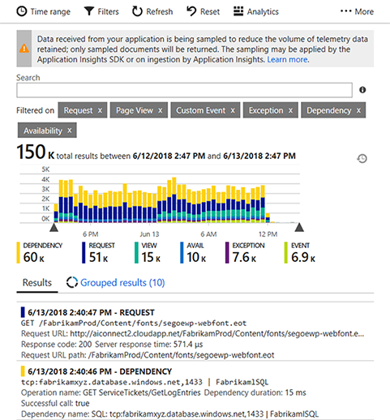
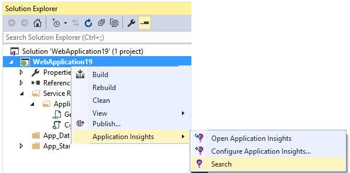
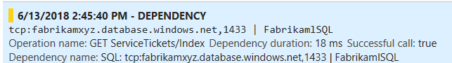
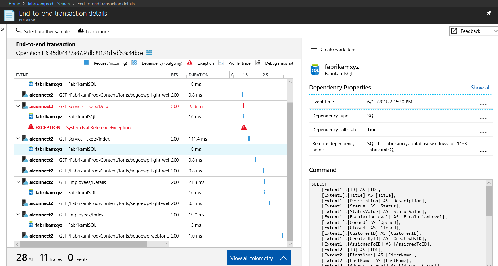
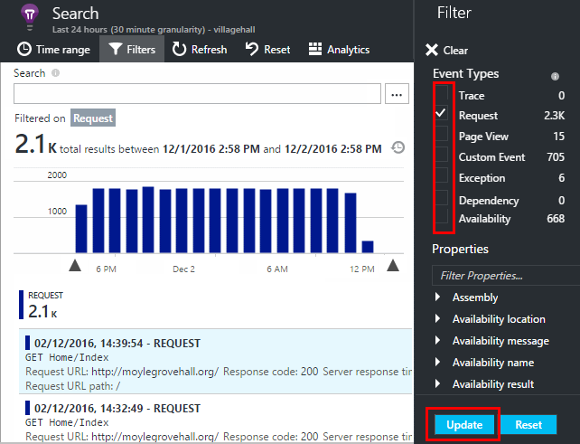
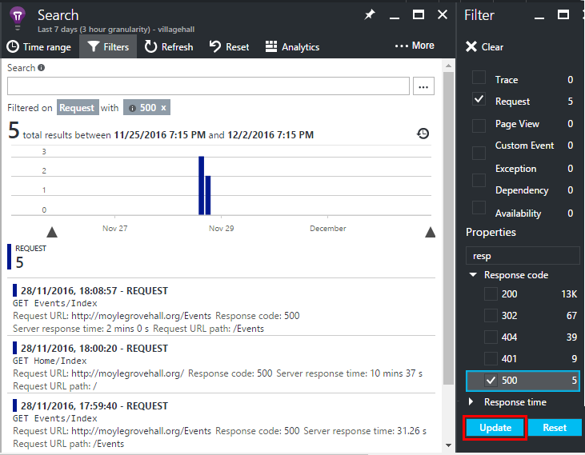
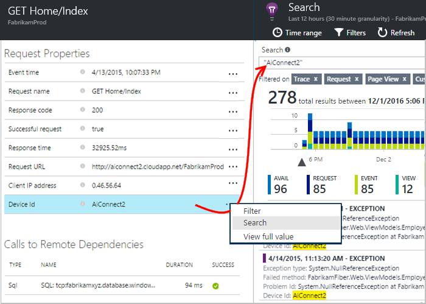
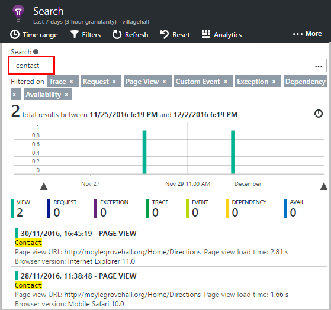
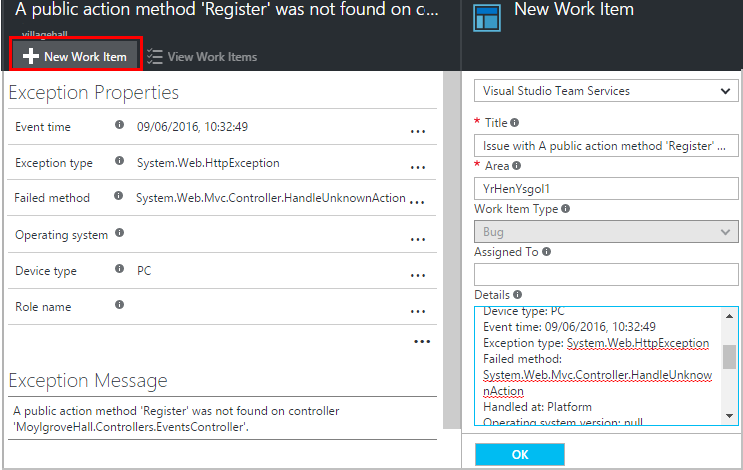

---
title: Using Search in Azure Application Insights | Microsoft Docs
description: Search and filter raw telemetry sent by your web app.
services: application-insights
documentationcenter: ''
author: mrbullwinkle
manager: carmonm

ms.assetid: 2a437555-8043-45ec-937a-225c9bf0066b
ms.service: application-insights
ms.workload: tbd
ms.tgt_pltfrm: ibiza
ms.devlang: na
ms.topic: conceptual
ms.date: 09/20/2018
ms.author: mbullwin

---
# Using Search in Application Insights
Search is a feature of [Application Insights](app-insights-overview.md) that you use to find and explore individual telemetry items, such as page views, exceptions, or web requests. And you can view log traces and events that you have coded.

(For more complex queries over your data, use [Analytics](app-insights-analytics-tour.md).)

## Where do you see Search?

### In the Azure portal

You can open diagnostic search explicitly from the Application Insights Overview blade of your application:

The main body of Diagnostic Search is a list of telemetry items - server requests, page views, custom events that you have coded, and so on. At the top of the list is a summary chart showing counts of events over time.

Click Refresh to get new events.

### In Visual Studio

In Visual Studio, there's also an Application Insights Search window. It's most useful for displaying telemetry events generated by the application that you're debugging. But it can also show the events collected from your published app at the Azure portal.

Open the Search window in Visual Studio:

The Search window has features similar to the web portal:

The Track Operation tab is available when you open a request or a page view. An 'operation' is a sequence of events that is associated with to a single request or page view. For example, dependency calls, exceptions, trace logs, and custom events might be part of a single operation. The Track Operation tab shows graphically the timing and duration of these events in relation to the request or page view. 

## Inspect individual items

Select any telemetry item to see key fields and related items.

This will launch the end-to-end transaction details view:

## Filter event types
Open the Filter blade and choose the event types you want to see. (If, later, you want to restore the filters with which you opened the blade, click Reset.)

The event types are:

* **Trace** - [Diagnostic logs](app-insights-asp-net-trace-logs.md) including TrackTrace, log4Net, NLog, and System.Diagnostic.Trace calls.
* **Request** - HTTP requests received by your server application, including pages, scripts, images, style files, and data. These events are used to create the request and response overview charts.
* **Page View** - [Telemetry sent by the web client](app-insights-javascript.md), used to create page view reports. 
* **Custom Event** - If you inserted calls to TrackEvent() in order to [monitor usage](app-insights-api-custom-events-metrics.md), you can search them here.
* **Exception** - Uncaught [exceptions in the server](app-insights-asp-net-exceptions.md), and those that you log by using TrackException().
* **Dependency** - [Calls from your server application](app-insights-asp-net-dependencies.md) to other services such as REST APIs or databases, and AJAX calls from your [client code](app-insights-javascript.md).
* **Availability** - Results of [availability tests](app-insights-monitor-web-app-availability.md).

## Filter on property values
You can filter events on the values of their properties. The available properties depend on the event types you selected. 

For example, pick out requests with a specific response code. 

Choosing no values of a particular property has the same effect as choosing all values. It switches off filtering on that property.

### Narrow your search
Notice that the counts to the right of the filter values show how many occurrences there are in the current filtered set. 

In this example, it's clear that the 'Rpt/Employees' request results in most of the '500' errors:

## Find events with the same property
Find all the items with the same property value:

## Search the data

> [!NOTE]
> To write more complex queries, open [**Analytics**](app-insights-analytics-tour.md) from the top of the Search blade.
> 

You can search for terms in any of the property values. This is particularly useful if you have written [custom events](app-insights-api-custom-events-metrics.md) with property values. 

You might want to set a time range, as searches over a shorter range are faster. 

Search for complete words, not substrings. Use quotation marks to enclose special characters.

| string | is *not* found by | but these do find it |
| --- | --- | --- |
| HomeController.About |home controller out | homecontroller about "homecontroller.about"|
|United States|Uni ted|united states united AND states "united states"

Here are the search expressions you can use:

| Sample query | Effect |
| --- | --- |
| `apple` |Find all events in the time range whose fields include the word "apple" |
| `apple AND banana`  `apple banana` |Find events that contain both words. Use capital "AND", not "and".  Short form. |
| `apple OR banana` |Find events that contain either word. Use "OR", not "or". |
| `apple NOT banana` |Find events that contain one word but not the other. |

## Sampling
If your app generates a lot of telemetry (and you are using the ASP.NET SDK version 2.0.0-beta3 or later), the adaptive sampling module automatically reduces the volume that is sent to the portal by sending only a representative fraction of events. However, events that are related to the same request are selected or deselected as a group, so that you can navigate between related events. 

[Learn about sampling](app-insights-sampling.md).

## Create work item
You can create a bug in GitHub or Azure DevOps with the details from any telemetry item. 

The first time you do this, you are asked to configure a link to your Azure DevOps organization and project.

(You can also configure the link on the Work Items blade.)

## Send more telemetry to Application Insights
In addition to the out-of-the-box telemetry sent by Application Insights SDK, you can:

* Capture log traces from your favorite logging framework in [.NET](app-insights-asp-net-trace-logs.md) or [Java](app-insights-java-trace-logs.md). This means you can search through your log traces and correlate them with page views, exceptions, and other events. 
* [Write code](app-insights-api-custom-events-metrics.md) to send custom events, page views, and exceptions. 

[Learn how to send logs and custom telemetry to Application Insights](app-insights-asp-net-trace-logs.md).

## Q & A
### How much data is retained?

See the [Limits summary](app-insights-pricing.md#limits-summary).

### How can I see POST data in my server requests?
We don't log the POST data automatically, but you can use [TrackTrace or log calls](app-insights-asp-net-trace-logs.md). Put the POST data in the message parameter. You can't filter on the message in the same way you can filter on properties, but the size limit is longer.

## Video

> [!VIDEO https://channel9.msdn.com/events/Connect/2016/112/player]

## Next steps
* [Write complex queries in Analytics](app-insights-analytics-tour.md)
* [Send logs and custom telemetry to Application Insights](app-insights-asp-net-trace-logs.md)
* [Set up availability and responsiveness tests](app-insights-monitor-web-app-availability.md)
* [Troubleshooting](app-insights-troubleshoot-faq.md)
