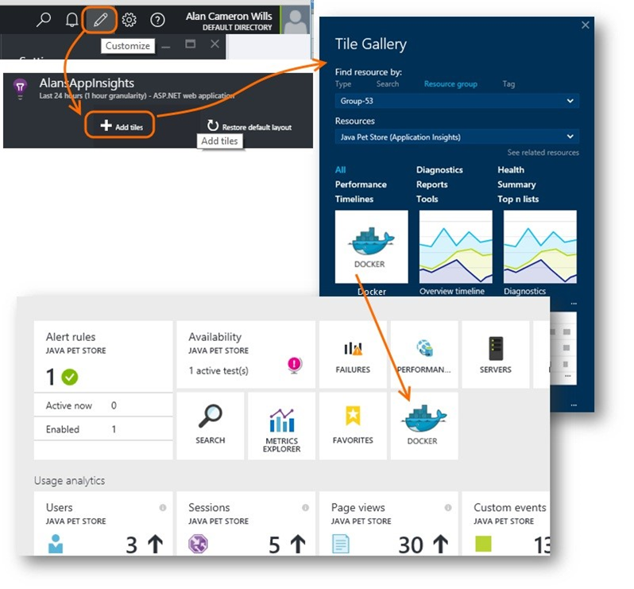
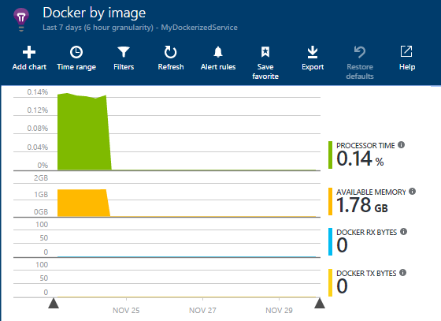
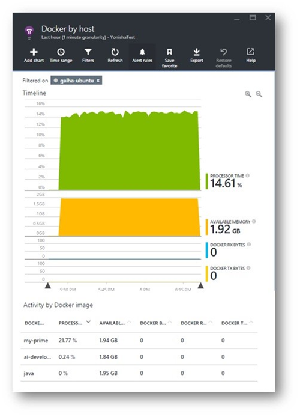

<properties 
	pageTitle="Monitor a Docker host in Application Insights" 
	description="Docker host perf counters, events and exceptions can be displayed on Application Insights, along with the telemetry from the containerized apps." 
	services="application-insights" 
    documentationCenter=""
	authors="alancameronwills" 
	manager="douge"/>

<tags 
	ms.service="application-insights" 
	ms.workload="tbd" 
	ms.tgt_pltfrm="ibiza" 
	ms.devlang="na" 
	ms.topic="article" 
	ms.date="11/20/2015" 
	ms.author="awills"/>
 
# Monitor a Docker host in Application Insights

Performance counters and exception reports from a [Docker](https://www.docker.com/) host can be charted on Application Insights. Install the [Application Insights](app-insights-overview.md)  app in a container in your host, and it will display overall performance counters for the host, as well as for the other images.

With Docker you distribute your apps in lightweight containers complete with all dependencies. They'll run on any host machine that runs a Docker Engine.

Application Insights can monitor the performance and activity of your Docker host and containers.

(And of course, if you own the source of any of the apps in the containers, [install the Application Insights SDK](app-insights-java-live) on each of them to get detailed performance logging and usage tracking.)

## Create an Application Insights resource

An Application Insights resource is the place where you'll view and analyze your data. It's hosted in the Microsoft Azure portal.

1.	You'll need a subscription to [Microsoft Azure](https://azure.com). (There's a pay-as-you-go option where you don't pay anything if you don't use services, and you can use the free tier of Application Insights.)
2.	Sign into the [Azure Portal](https://portal.azure.com), and create a new Application Insights resource. Choose Other for the application type. (This choice just affects the initial selection of charts you see, and it isn't too important.)

    
3.	You can always get to your new monitoring resource by using Browse, All. But you probably also opted to put a tile for your app on the Home dashboard that you see whenever you go to the portal.

    Open the new resource now.
4.	Add the Docker tile: Choose **Edit**, then **Add tiles**, and drag the Docker tile from the gallery. It will just show empty charts at first.

    

5. Click the **Essentials** drop-down and copy the Instrumentation Key. You'll use this to tell the SDK where to send its telemetry.

Keep that browser window handy, as you'll come back to it soon to look at your telemetry.

## Install Application Insights on your host
 
Now that you've got somewhere to display the telemetry, you can set up the app that will collect and send it.
1.	Sign in to your Docker host.
2.	Search for the Microsoft Application Insights image on Docker Hub and pull it to your host. 
3.	Set the instrumentation key:

    docker run -v /var/run/docker.sock:/docker.sock -d microsoft/applicationinsights ikey=000000-1111-2222-3333-444444444

4. Run the image.

## View your telemetry

Go back to your Application Insights resource in the Azure portal.

You'll shortly see data arriving from the Docker container, especially if you have other containers running on your Docker engine.

Click through any of the charts to see more detail.

Here are some of the views you can get.

### Perf counters by host, activity by image

Click any image name for more detail.
To customize the view, click any chart, the grid heading, or use Add Chart. 

[Learn more about metrics explorer](app-insights-metrics-explorer.md).

## Individual events

To investigate individual events, click [Search](app-insights-diagnostic-search.md). Search and filter 
to find the events you want. Click any event to get more detail.
 
## Exceptions by container name
 

## Q & A

*What does Application Insights give me that I can't get from Docker?*

* Detailed breakdown of performance counters by container and image.
* Integrate container and app data in one dashboard.
* [Export telemetry](app-insights-export-telemetry.md) for further analysis to a database, Power BI or other dashboard.

*How do I get telemetry from the app itself?*

* Install the Application Insights SDK in the app. 
Learn how for: [Java web apps](app-insights-java-get-started.md), [Windows web apps](app-insights-asp-net.md).
