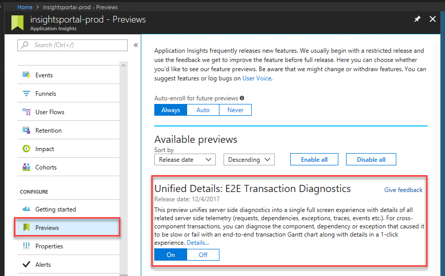
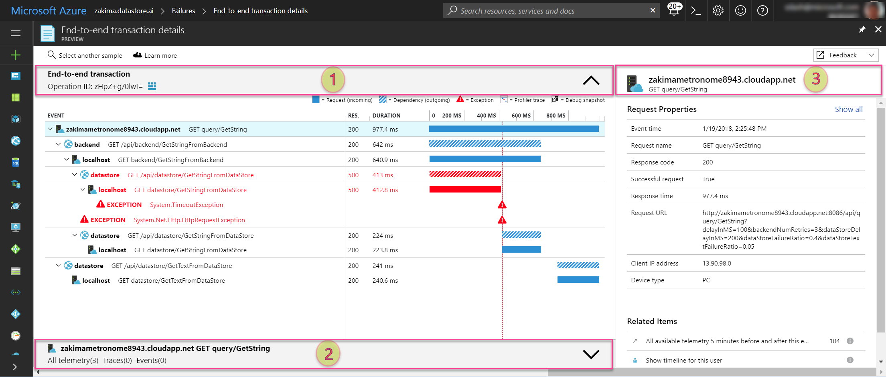
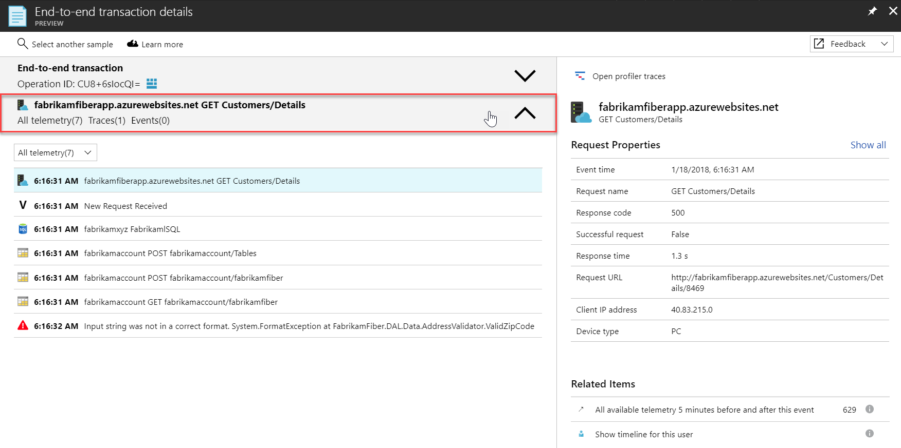
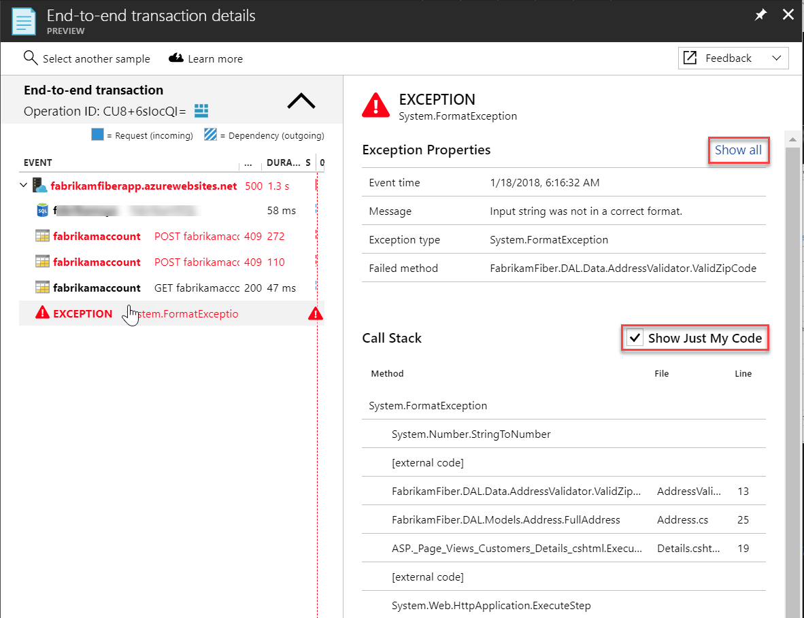
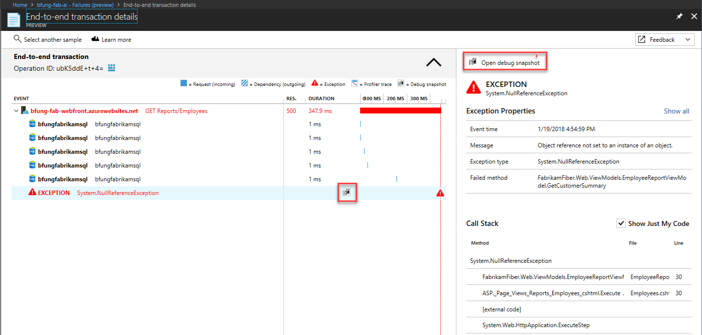

---
title: Azure Application Insights Transaction Diagnostics | Microsoft Docs
description: Application Insights E2E transaction Diagnostics
services: application-insights
documentationcenter: .net
author: SoubhagyaDash
manager: victormu

ms.service: application-insights
ms.workload: TBD
ms.tgt_pltfrm: ibiza
ms.devlang: multiple
ms.topic: article
ms.date: 01/19/2018
ms.author: sdash

---
# Unified Cross Component Transaction Diagnostics
*This experience is currently in preview and replaces the existing server-side diagnostics blades*

This preview introduces a unified diagnostics experience with correlated server-side telemetry across all components into a single view. You can diagnose the application component, dependency, or exception that caused the transaction to be slow or fail. You do not need to navigate to other Application Insights resources (for the other components), or load more UI to get to the details. All of the diagnostic detail from all components is readily available on the right pane with a single click.

## A note on Components
Components are independently deployable units of your distributed/microservices application. You have code-level visibility or access to telemetry generated by these application components. 

* Components are different from "observed" external dependencies such as SQL, EventHub etc. which your team/organization would typically not have access to (code or telemetry).
* Components run on any number of server/role/container instances.
* Components can be separate Application Insights instrumentation keys (in different subscriptions for that matter) or different roles reporting to a single Application Insights instrumentation key. This experience shows the detail across all components regardless of how they have been set up.

> [!Tip]
> For best results, ensure all components are instrumented with the latest Application Insights stable SDKs. Also, if they are different Application Insights resources, ensure you have appropriate rights to view their telemetry.

## Enable and Access
Enable "Unified details: E2E Transaction Diagnostics" from the [preview experiences list](app-insights-previews.md)

This preview is currently available for server-side requests, dependencies, and exceptions. You can access the new experience from Search results, Performance, or Failure triage experiences. The preview replaces the corresponding classic details blades. 

## Transaction Diagnostics Experience 
This view has three key parts: a cross component transaction chart, a time-sequence list of all telemetry from a specific component-operation, and the details pane for any selected telemetry item on the left.

**1. Cross Component Transaction Chart**
 
 This chart provides a timeline with horizontal bars for the duration of requests and dependencies across components. Any exceptions collected are also marked on the timeline. 
 
 * The top row on this chart represents the entry point, the incoming request to the first component called in this transaction. The duration is the total time taken for the transaction to complete.
 * Any calls to external dependencies are simple non-collapsible rows, with icons representing the dependency type.
 * Calls to other components are collapsible rows. Each row corresponds to a specific operation invoked at the component.
 * By default, the request, dependency, or exception that you had clicked on to arrive here, is selected on the chart.
 * Select any row to see its details on the right. Clicking on the profiler icon on a request row, or debug snapshot icon on an exception row opens respective detail.

> [!NOTE] 
Calls to other components have two rows: one representing the outbound call (dependency) from the caller component, and the other is the inbound request at the called component. The latter is called localhost to help differentiate between them. Use the top-right corner feedback channel to let us know if you find this presentation useful or otherwise.

**2. Time sequenced Telemetry of the selected Component-Operation**

Any row selected in the Cross Component Transaction Chart is related to an operation invoked at a particular component. This selected Component-Operation is reflected in the title of the bottom section. Open this section to see a flat time-sequence of all the telemetry related to that particular operation. You can select any telemetry item in this list to see corresponding details on the right.

**3. Details Pane**

This pane shows the detail of selected item from either of the two sections on the left. "Show all" lists all of the standard attributes collected. Any custom attributes are separately listed below the standard set.

## Profiler and Snapshot debugger
[Application Insights profiler](app-insights-profiler.md) or [Snapshot debugger](app-insights-snapshot-debugger.md) help with code level diagnostics of performance and failure issues. With this experience, you can see profiler traces or snapshots from any component with a single click.

## FAQ
1. *I see a single component on the chart, the others are only showing as external dependencies without any detail of what happened within those components.*

Potential reasons:
* Are the other components instrumented with Application Insights?
* Are they using the latest stable Application Insights SDK? 
* If these components are separate Application Insights resources, do you have required access to them?
If you do have access and the components are instrumented with the latest Application Insights SDKs, let us know via the top right feedback channel.

2. *I only have external dependencies. Should I care for this preview?*

Yes. The new experience unifies all related server-side telemetry into a single view. The older detail blades will be replaced by this experience in the future, so try it out and give us your feedback. Here's what it looks like for a single component transaction:

3. *I see duplicate rows for the dependencies.*

At this time, we are showing the outbound dependency call from the caller and the inbound request at the called component separately. Typically, the two look identical with only a duration difference from the network round trip. To help distinguish between the 2, we are calling the component receiving the request "localhost" with a server icon. This row will immediately follow the dependency row. Is this presentation confusing? Give us your feedback!

4. *What about clock skews across different component instances?*

Timelines are adjusted for clock skews in the transaction chart. You can see the exact timestamps in the details pane or using Analytics. 

5. *This new experience is missing most of the related items queries?*

By design. All of the related items, indeed across all components are already available on the left side (top and bottom sections). The new experience has two related items that the left side doesn't cover: all telemetry from five minutes before and after this event & the user timeline.

6. *This new experience does not have X that I loved in the older blades.*

Give us feedback! We want to address your concerns before this experience is generally available at which time the older blades will be deprecated. For now, you can disable the preview to go back to the older blades.

## Known Issues
* The failures samples from Application Map link to the older detail blades.
* The autocluster based insights in the search results link to the older detail blades.
* Work item integration is not available from the new experience.
