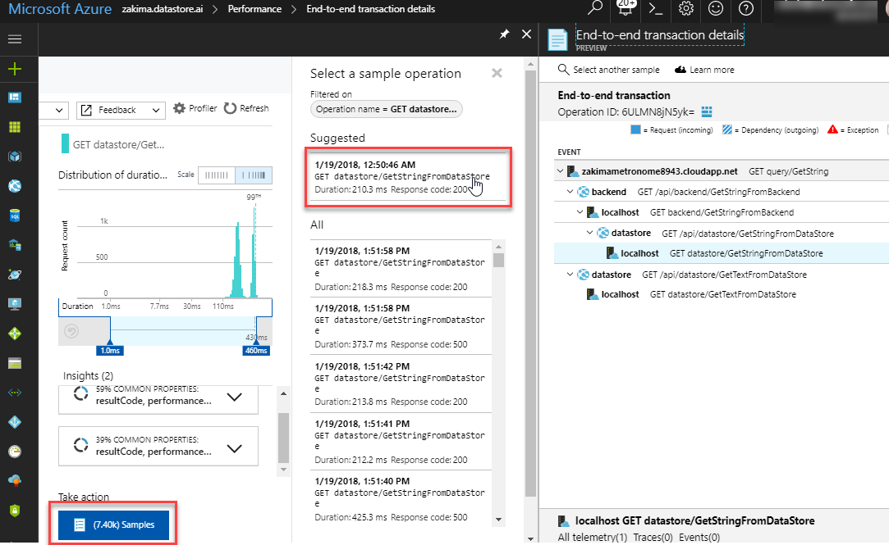

---
title: Azure Application Insights Transaction Diagnostics | Microsoft Docs
description: Application Insights E2E transaction Diagnostics
services: application-insights
documentationcenter: .net
author: SoubhagyaDash
manager: victormu

ms.service: application-insights
ms.workload: TBD
ms.tgt_pltfrm: ibiza
ms.devlang: multiple
ms.topic: article
ms.date: 01/19/2018
ms.author: sdash

---
# Unified Cross Component Transaction Diagnostics
*This experience is currently in preview and replaces the existing server side diagnostics blades*

This preview introduces a new unified diagnostics experience with correlated server side telemetry across all components into a single full screen Gantt chart and detailes pane. You can diagnose the application component, external dependency or exception that caused the transaction to be slow or fail with all related telemetry. You do not need to navigate to other Application Insights resources (for the other components), or load more UI to get to the details. All of the diagnostic detail from all components is readily available on the right pane with a single click.

## A note on Components
Components are independently deployable units of your distributed/microservices application. You have code-level visibility or access to telemetry generated by these application components. 

* These are different from "observed" external dependencies such as SQL, EventHub etc. which your team/organization would typically not have access to (code or telemetry).
* Components can be separate Application Insights instrumentation keys (in different subscriptions for that matter) or different roles reporting to a single Application Insights instrumentation key. This experience will show the detail across all components regardless of how they have been set up, so long as you have the right permissions.

## Access Transaction Diagnostics
Enable "New details: End-to-End Transaction Diagnostics" from the [preview experiences list](app-insights-previews.md)
You can access the new experience from Search results, or request, dependency or exception details from the Performance or Failure triage experiences. The preview replaces the corresponding classic details blades. 

## New Experience

## Next steps

- [Write custom telemetry](app-insights-api-custom-events-metrics.md)
- Onboard all components of your micro service on Application Insights. Check out [supported platforms](app-insights-platforms.md).
- See [data model](application-insights-data-model.md) for Application Insights types and data model.
- Learn how to [extend and filter telemetry](app-insights-api-filtering-sampling.md).
