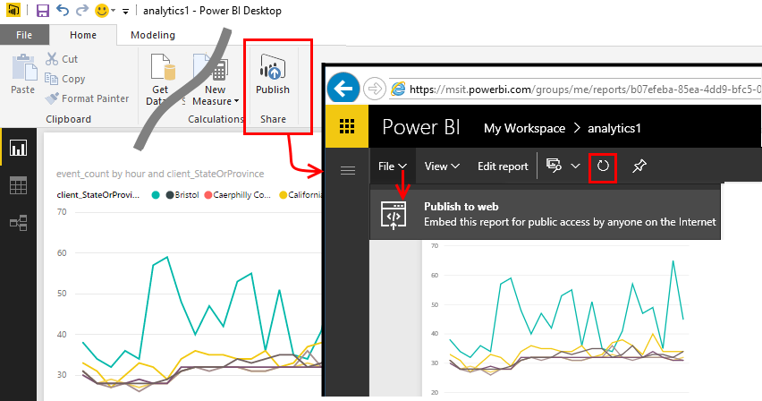
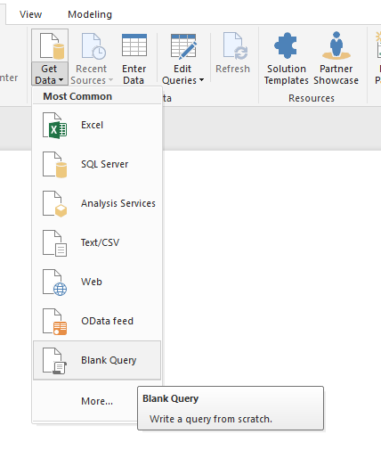
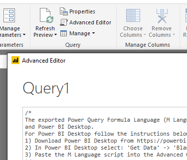
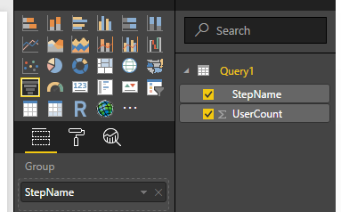
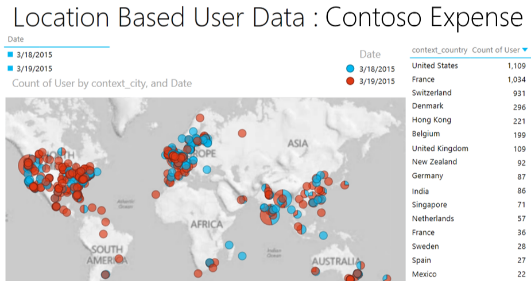

---
title: Export to Power BI from Azure Application Insights | Microsoft Docs
description: Analytics queries can be displayed in Power BI.
services: application-insights
documentationcenter: ''
author: mrbullwinkle
manager: carmonm

ms.assetid: 7f13ea66-09dc-450f-b8f9-f40fdad239f2
ms.service: application-insights
ms.workload: tbd
ms.tgt_pltfrm: ibiza
ms.devlang: na
ms.topic: conceptual
ms.date: 08/10/2018
ms.author: mbullwin
---

# Feed Power BI from Application Insights
[Power BI](http://www.powerbi.com/) is a suite of business tools that helps you analyze data and share insights. Rich dashboards are available on every device. You can combine data from many sources, including Analytics queries from [Azure Application Insights](app-insights-overview.md).

There are three methods of exporting Application Insights data to Power BI:

* [**Export Analytics queries**](#export-analytics-queries). This is the preferred method. Write any query you want and export it to Power BI. You can place this query on a dashboard, along with any other data.
* [**Continuous export and Azure Stream Analytics**](app-insights-export-stream-analytics.md). This method is useful if you want to store your data for long periods of time. If you don't have an extended data retention requirement, use the export analytics query method. Continuous export and Stream Analytics involves more work to set up and additional storage overhead.
* [**Power BI adapter**](#power-pi-adapter). The set of charts is predefined, but you can add your own queries from any other sources.

> [!NOTE]
> The Power BI adapter is now **deprecated**. The predefined charts for this solution are populated by static uneditable queries. You do not have the ability to edit these queries and depending on certain properties of your data it is possible for the connection to Power BI to be successful, but no data is populated. This is due to exclusion criteria that are set within the hardcoded query. While this solution may still work for some customers, due to the lack of flexiblity of the adapter the recommended solution is to use the [**export Analytics query**](#export-analytics-queries) functionality.

## Export Analytics queries
This route allows you to write any Analytics query you like, or export from Usage Funnels, and then export that to a Power BI dashboard. (You can add to the dashboard created by the adapter.)

### One time: install Power BI Desktop
To import your Application Insights query, you use the desktop version of Power BI. Then you can publish it to the web or to your Power BI cloud workspace. 

Install [Power BI Desktop](https://powerbi.microsoft.com/en-us/desktop/).

### Export an Analytics query
1. [Open Analytics and write your query](app-insights-analytics-tour.md).
2. Test and refine the query until you're happy with the results. Make sure that the query runs correctly in Analytics before you export it.
3. On the **Export** menu, choose **Power BI (M)**. Save the text file.
   
    
4. In Power BI Desktop, select **Get Data** > **Blank Query**. Then, in the query editor, under **View**, select **Advanced Editor**.

    Paste the exported M Language script into the Advanced Editor.

    

1. To allow Power BI to access Azure, you might have to provide credentials. Use **Organizational account** to sign in with your Microsoft account.
   
    

    If you need to verify the credentials, use the **Data Source Settings** menu command in the query editor. Be sure to specify the credentials you use for Azure, which might be different from your credentials for Power BI.
2. Choose a visualization for your query, and select the fields for x-axis, y-axis, and segmenting dimension.
   
    
3. Publish your report to your Power BI cloud workspace. From there, you can embed a synchronized version into other web pages.
   
    
4. Refresh the report manually at intervals, or set up a scheduled refresh on the options page.

### Export a Funnel
1. [Make your Funnel](usage-funnels.md).
2. Select **Power BI**.

   

3. In Power BI Desktop, select **Get Data** > **Blank Query**. Then, in the query editor, under **View**, select **Advanced Editor**.

   

   Paste the exported M Language script into the Advanced Editor. 

   

4. Select items from the query, and choose a Funnel visualization.

   

5. Change the title to make it meaningful, and publish your report to your Power BI cloud workspace. 

   

## Troubleshooting

You might encounter errors pertaining to credentials or the size of the dataset. Here is some information about what to do about these errors.

### Unauthorized (401 or 403)
This can happen if your refresh token has not been updated. Try these steps to ensure you still have access:

1. Sign into the Azure portal, and make sure you can access the resource.
2. Try to refresh the credentials for the dashboard.

 If you do have access and refreshing the credentials does not work, please open a support ticket.

### Bad Gateway (502)
This is usually caused by an Analytics query that returns too much data. Try using a smaller time range for the query. 

If reducing the dataset coming from the Analytics query doesn't meet your requirements, consider using the [API](https://dev.applicationinsights.io/documentation/overview) to pull a larger dataset. Here's how to convert the M-Query export to use the API.

1. Create an [API key](https://dev.applicationinsights.io/documentation/Authorization/API-key-and-App-ID).
2. Update the Power BI M script that you exported from Analytics by replacing the Azure Resource Manager URL with the Application Insights API.
   * Replace **https://management.azure.com/subscriptions/...**
   * with, **https://api.applicationinsights.io/beta/apps/...**
3. Finally, update the credentials to basic, and use your API key.
  

**Existing script**
 ```
 Source = Json.Document(Web.Contents("https://management.azure.com/subscriptions/xxxxxxxx-xxxx-xxxx-xxxx-xxxxxxxxxxxx/resourcegroups//providers/microsoft.insights/components//api/query?api-version=2014-12-01-preview",[Query=[#"csl"="requests",#"x-ms-app"="AAPBI"],Timeout=#duration(0,0,4,0)]))
 ```
**Updated script**
 ```
 Source = Json.Document(Web.Contents("https://api.applicationinsights.io/beta/apps/<APPLICATION_ID>/query?api-version=2014-12-01-preview",[Query=[#"csl"="requests",#"x-ms-app"="AAPBI"],Timeout=#duration(0,0,4,0)]))
 ```

## About sampling
If your application sends a lot of data, you might want to use the adaptive sampling feature, which sends only a percentage of your telemetry. The same is true if you have manually set sampling either in the SDK or on ingestion. [Learn more about sampling](app-insights-sampling.md).

## Power BI adapter (deprecated)
This method creates a complete dashboard of telemetry for you. The initial dataset is predefined, but you can add more data to it.

### Get the adapter
1. Sign in to [Power BI](https://app.powerbi.com/).
2. Open **Get Data** , **Services**.

    

3. Select **Get it now** under Application Insights.

   
4. Provide the details of your Application Insights resource, and then **Sign-in**.

    

     This information can be found in the Application Insights Overview pane:

     

5. Open the newly created Application Insights Power BI App.

6. Wait a minute or two for the data to be imported.

    

You can edit the dashboard, combining the Application Insights charts with those of other sources, and with Analytics queries. You can get more charts in the visualization gallery, and each chart has parameters you can set.

After the initial import, the dashboard and the reports continue to update daily. You can control the refresh schedule on the dataset.

## Next steps
* [Power BI - Learn](http://www.powerbi.com/learning/)
* [Analytics tutorial](app-insights-analytics-tour.md)

