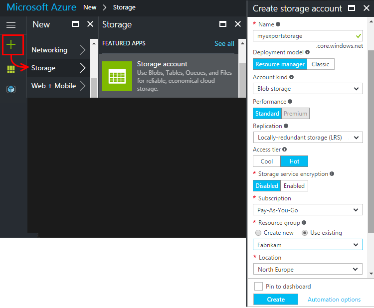
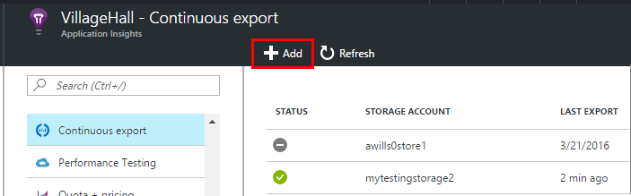
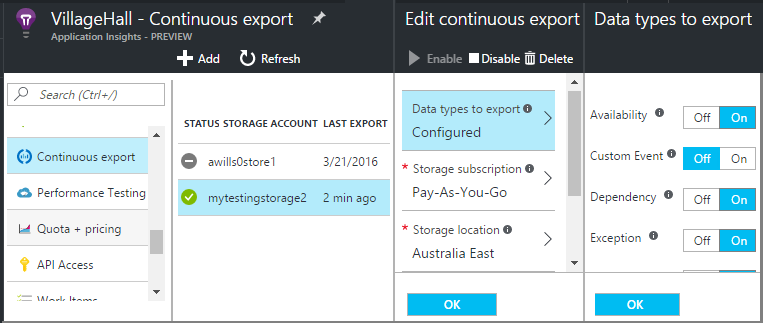
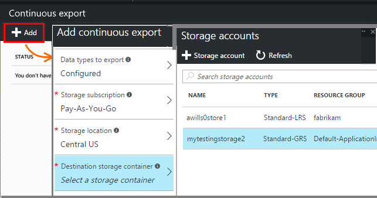
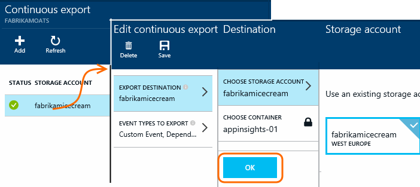

<properties 
	pageTitle="Continuous export of telemetry from Application Insights" 
	description="Export diagnostic and usage data to storage in Microsoft Azure, and download it from there." 
	services="application-insights" 
    documentationCenter=""
	authors="alancameronwills" 
	manager="douge"/>

<tags 
	ms.service="application-insights" 
	ms.workload="tbd" 
	ms.tgt_pltfrm="ibiza" 
	ms.devlang="na" 
	ms.topic="article" 
	ms.date="07/21/2016" 
	ms.author="awills"/>
 
# Export telemetry from Application Insights

Want to keep your telemetry for longer than the standard retention period? Or process it in some specialized way? Continuous Export is ideal for this. The events you see in the Application Insights portal can be exported to storage in Microsoft Azure in JSON format. From there you can download your data and write whatever code you need to process it.  

Continuous Export is available in the free trial period and on the [Standard and Premium pricing plans](https://azure.microsoft.com/pricing/details/application-insights/).

Before you set up continuous export, there are some alternatives you might want to consider:

* [The Export button](app-insights-metrics-explorer.md#export-to-excel) at the top of a metrics or search blade lets you transfer tables and charts to an Excel spreadsheet. 
* [Analytics](app-insights-analytics.md) provides a powerful query  language for telemetry, and also can export results.
* If you're looking to [explore your data in Power BI](http://blogs.msdn.com/b/powerbi/archive/2015/11/04/explore-your-application-insights-data-with-power-bi.aspx), you can do that without using Continuous Export.

## Create a storage account

If you don't already have a "classic" storage account, create one now.

1. Create a storage account in your subscription in the [Azure portal](https://portal.azure.com).

    

2. Create a container.

    

##  Set up Continuous Export

On your application's Overview blade in the Application Insights portal, open Continuous Export: 

Add an export, and choose an [Azure storage account](../storage/storage-introduction.md) where you want to put the data:

Choose the event types you'd like to export:

Once you've created your export, it starts going. (You only get data that arrives after you create the export.) 

There can be a delay of about an hour before data appears in the blob.

If you want to change the event types later, just edit the export:

To stop the stream, click Disable. When you click Enable again, the stream will restart with new data. You won't get the data that arrived in the portal while export was disabled.

To stop the stream permanently, delete the export. Doing so doesn't delete your data from storage.

#### Can't add or change an export?

* To add or change exports, you need Owner, Contributor or Application Insights Contributor access rights. [Learn about roles][roles].

##  What events do you get?

The exported data is the raw telemetry we receive from your application, except that we add location data which we calculate from the client IP address. 

Data that has been discarded by [sampling](app-insights-sampling.md) is not included in the exported data.

Other calculated metrics are not included. For example, we don't export average CPU utilisation, but we do export the raw telemetry from which the average is computed.

The data also includes the results of any [availability web tests](app-insights-monitor-web-app-availability.md) you have set up. 

> [AZURE.NOTE] **Sampling.** If your application sends a lot of data and you are using the Application Insights SDK for ASP.NET version 2.0.0-beta3 or later, the adaptive sampling feature may operate and send only a percentage of your telemetry. [Learn more about sampling.](app-insights-sampling.md)

##  Inspect the data

You can inspect the storage directly in the portal. Click **Browse**, select your storage account, and then open **Containers**.

To inspect Azure storage in Visual Studio, open **View**, **Cloud Explorer**. (If you don't have that menu command, you need to install the Azure SDK: Open the **New Project** dialog, expand Visual C#/Cloud and choose **Get Microsoft Azure SDK for .NET**.)

When you open your blob store, you'll see a container with a set of blob files. The URI of each file derived from your Application Insights resource name, its instrumentation key, telemetry-type/date/time. (The resource name is all lowercase, and the instrumentation key omits dashes.)

The date and time are UTC and are when the telemetry was deposited in the store - not the time it was generated. So if you write code to download the data, it can move linearly through the data.

Here's the form of the path:

    $"{applicationName}_{instrumentationKey}/{type}/{blobDeliveryTimeUtc:yyyy-MM-dd}/{ blobDeliveryTimeUtc:HH}/{blobId}_{blobCreationTimeUtc:yyyyMMdd_HHmmss}.blob"
  
Where 

-	`blobCreationTimeUtc` is time when blob was created in the internal staging storage
-	`blobDeliveryTimeUtc` is the time when blob is copied to the export destination storage

##  Data format

* Each blob is a text file that contains multiple '\n'-separated rows. It contains the telemetry processed over a time period of roughly half a minute.
* Each row represents a telemetry data point such as a request or page view.
* Each row is an unformatted JSON document. If you want to sit and stare at it, open it in Visual Studio and choose Edit, Advanced, Format File:

Time durations are in ticks, where 10 000 ticks = 1ms. For example, these values show a time of 1ms to send a request from the browser, 3ms to receive it, and 1.8s to process the page in the browser:

	"sendRequest": {"value": 10000.0},
	"receiveRequest": {"value": 30000.0},
	"clientProcess": {"value": 17970000.0}

[Detailed data model reference for the property types and values.](app-insights-export-data-model.md)

## Processing the data

On a small scale, you can write some code to pull apart your data, read it into a spreadsheet, and so on. For example:

    private IEnumerable<T> DeserializeMany<T>(string folderName)
    {
      var files = Directory.EnumerateFiles(folderName, "*.blob", SearchOption.AllDirectories);
      foreach (var file in files)
      {
         using (var fileReader = File.OpenText(file))
         {
            string fileContent = fileReader.ReadToEnd();
            IEnumerable<string> entities = fileContent.Split('\n').Where(s => !string.IsNullOrWhiteSpace(s));
            foreach (var entity in entities)
            {
                yield return JsonConvert.DeserializeObject<T>(entity);
            }
         }
      }
    }

For a larger code sample, see [using a worker role][exportasa].

## Delete your old data
Please note that you are responsible for managing your storage capacity and deleting the old data if necessary. 

## If you regenerate your storage key...

If you change the key to your storage, continuous export will stop working. You'll see a notification in your Azure account. 

Open the Continuous Export blade and edit your export. Edit the Export Destination, but just leave the same storage selected. Click OK to confirm.

The continuous export will restart.

## Export samples

* [Export to SQL using a worker role][exportcode]
* [Export to SQL using Stream Analytics][exportasa]
* [Export to Power BI using Stream Analytics](app-insights-export-power-bi.md)
 * Note that this isn't the standard way to use Power BI. There's [an adaptor](http://blogs.msdn.com/b/powerbi/archive/2015/11/04/explore-your-application-insights-data-with-power-bi.aspx) which doesn't require Continuous Export.

On larger scales, consider [HDInsight](https://azure.microsoft.com/services/hdinsight/) - Hadoop clusters in the cloud. HDInsight provides a variety of technologies for managing and analyzing big data.

## Q & A

* *But all I want is a one-time download of a chart.*  
 
    Yes, you can do that. At the top of the blade, click [Export Data](app-insights-metrics-explorer.md#export-to-excel).

* *I set up an export, but there's no data in my store.*

    Did Application Insights receive any telemetry from your app since you set up the export? You'll only receive new data.

* *I tried to set up an export, but was denied access*

    If the account is owned by your organization, you have to be a member of the owners or contributors groups.

* *Can I export straight to my own on-premises store?* 

    No, sorry. Our export engine currently only works with Azure storage at this time.  

* *Is there any limit to the amount of data you put in my store?* 

    No. We'll keep pushing data in until you delete the export. We'll stop if we hit the outer limits for blob storage, but that's pretty huge. It's up to you to control how much storage you use.  

* *How many blobs should I see in the storage?*

 * For every data type you selected to export, a new blob is created every minute (if data is available). 
 * In addition, for applications with high traffic, additional partition units are allocated. In this case each unit creates a blob every minute.

* *I regenerated the key to my storage or changed the name of the container, and now the export doesn't work.*

    Edit the export and open the export destination blade. Leave the same storage selected as before, and click OK to confirm. Export will restart. If the change was within the past few days, you won't lose data.

* *Can I pause the export?*

    Yes. Click Disable.

## Code samples

* [Stream Application Insights to Power BI](app-insights-export-power-bi.md)
* [Parse exported JSON using a worker role][exportcode]
* [Export to SQL using Stream Analytics][exportasa]

* [Detailed data model reference for the property types and values.](app-insights-export-data-model.md)

<!--Link references-->

[exportcode]: app-insights-code-sample-export-telemetry-sql-database.md
[exportasa]: app-insights-code-sample-export-sql-stream-analytics.md
[roles]: app-insights-resources-roles-access-control.md

 
