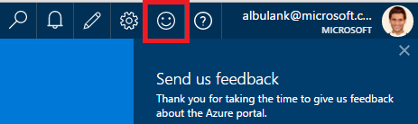
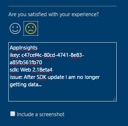
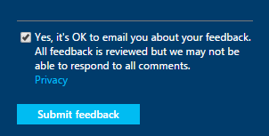

<properties 
	pageTitle="How to get technical support from Application Insights development team | Microsoft Azure" 
	description="When you have a case that requires special support from Application Insights development team, this is how you can submit the details to get support." 
	services="application-insights" 
    documentationCenter=""
	authors="alexbulankou" 
	manager="douge"/>
 
<tags 
	ms.service="application-insights" 
	ms.workload="tbd" 
	ms.tgt_pltfrm="ibiza" 
	ms.devlang="na" 
	ms.topic="article" 
	ms.date="06/01/2016" 
	ms.author="albulank"/>
	
# How to get technical support from Application Insights development team
	
When you have a technical issue with [Visual Studio Application Insights](app-insights-overview.md), here are your options for getting help:

## 1. Check the documents

* Missing data? Check: [sampling](app-insights-sampling.md), [quotas and throttling](app-insights-pricing.md).
* Troubleshooting: [ASP.NET](app-insights-troubleshoot-faq.md) | [Java](app-insights-java-troubleshoot.md)

## 2. Search the forums

* [MSDN forum](https://social.msdn.microsoft.com/Forums/vstudio/home?forum=ApplicationInsights)
* [StackOverflow](http://stackoverflow.com/questions/tagged/ms-application-insights)

## 3. Azure Support Plan?

There are situations where you would like developers to investigate your specific case. 

If you have a [support plan with Microsoft Azure](https://azure.microsoft.com/support/plans/) you can [open a support ticket](https://portal.azure.com/?#blade/Microsoft_Azure_Support/HelpAndSupportBlade).

## 4. Contact the Application Insights team

If you don't have a support plan, our development team is happy to offer best effort support to Application Insights customers as we prepare for the General Availability milestone. We are introducing **a new support option**: You can describe your case to us by submitting a feedback form on Azure portal and have a developer on the Application Insights team contact you back to help resolve your issue.


1. In the [Application Insights portal](https://portal.azure.com), click the smiley face at the top right corner:  

       

2. In the comment box please make sure to specify **AppInsights** as the first line and then include the following information:   

    ```

    AppInsights   
    ikey: <instrumentation key>   
    sdk: <SDK that you are using, including name and version>  
    issue: <please describe the problem you are having>

    ```   

       

3. Check "Yes, it is ok to email you". 

      

An engineer on the Application Insights team will get in touch with you soon. As we are providing this service on best effort basis, no formal SLA can be given at this point.


