<properties
	pageTitle="Get started with Visual Studio Application Insights | Microsoft Azure"
	description="Analyze usage, availability, and performance of your on-premises or Microsoft Azure web application with Visual Studio Application Insights."
	services="application-insights"
    documentationCenter=""
	authors="alancameronwills"
	manager="douge"/>

<tags
	ms.service="application-insights"
	ms.workload="tbd"
	ms.tgt_pltfrm="ibiza"
	ms.devlang="na"
	ms.topic="hero-article"
	ms.date="06/06/2016"
	ms.author="awills"/>

# Get started with Visual Studio Application Insights

*Application Insights is in preview.*

Detect issues, solve problems and continuously improve your applications. Quickly diagnose any problems in your live application. Understand what your users do with it.

Configuration is very easy, and you'll see results within minutes.

We currently support iOS, Android, and Windows apps, J2EE and ASP.NET web applications, and WCF services. Web apps can run on Azure or your own on-premises servers. Our JavaScript SDK runs on any web page.

[Take a look at the intro animation](https://www.youtube.com/watch?v=fX2NtGrh-Y0).

## Get started

Start with any combination, in any order, of the entry points that appear in the following diagram. Follow the path that works for you.

Application Insights works by adding an SDK into your app, which sends telemetry to the [Azure portal](https://portal.azure.com). There are different SDKs for the various combinations of platforms, languages, and IDEs that are supported.

You'll need an account in [Microsoft Azure](http://azure.com). You might already have access to a group account through your organization, or you might want to get a Pay-as-you-go account. Application Insights has a free tier, so you won't need to pay until your app is popular. Review the [pricing page](https://azure.microsoft.com/pricing/details/application-insights/).

What you want | What to do | What you get
---|---|---
 <a href="app-insights-asp-net.md">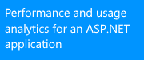</a> | <a href="app-insights-asp-net.md">Add Application Insights SDK to your web project</a>    | 
<a href="app-insights-monitor-performance-live-website-now.md">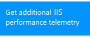</a> <a href="app-insights-monitor-performance-live-website-now.md">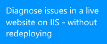</a>|<a href="app-insights-monitor-performance-live-website-now.md">Install Status Monitor on your IIS server</a>    | <a href="app-insights-monitor-performance-live-website-now.md">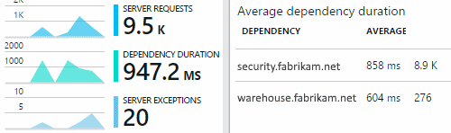</a>
<a href="insights-perf-analytics.md">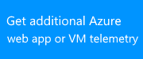</a>|<a href="insights-perf-analytics.md">Enable Insights in your Azure web app or VM</a>    | 
<a href="app-insights-java-get-started.md">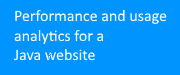</a>|<a href="app-insights-java-get-started.md">Add the SDK to your Java project</a>  | <a href="app-insights-java-get-started.md">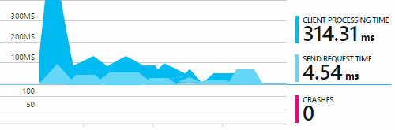</a>
<a href="app-insights-web-track-usage.md">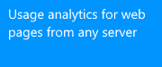</a>|<a href="app-insights-web-track-usage.md">Insert the Application Insights script into your web pages</a>  | <a href="app-insights-web-track-usage.md">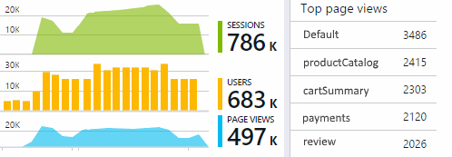</a>
<a href="app-insights-monitor-web-app-availability.md">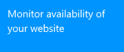</a>|<a href="app-insights-monitor-web-app-availability.md">Create web tests</a>  | <a href="app-insights-monitor-web-app-availability.md">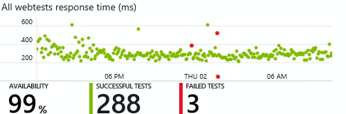</a>
<a href="app-insights-platforms.md">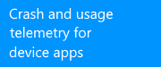</a>|<a href="http://hockeyapp.net">Use HockeyApp</a>  | <a href="http://hockeyapp.net">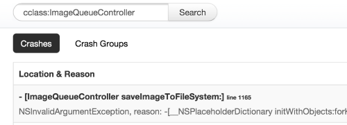</a>

## Support and feedback

* Questions and issues:
 * [Troubleshooting][qna]
 * [MSDN Forum](https://social.msdn.microsoft.com/Forums/vstudio/en-US/home?forum=ApplicationInsights)
 * [StackOverflow](http://stackoverflow.com/questions/tagged/ms-application-insights)
* Suggestions:
 * [UserVoice](https://visualstudio.uservoice.com/forums/357324)
* Code samples
 * [Code samples](app-insights-code-samples.md)

## Video

> [AZURE.VIDEO 218]

> [AZURE.VIDEO usage-monitoring-application-insights]

> [AZURE.VIDEO performance-monitoring-application-insights]

<!--Link references-->

[qna]: app-insights-troubleshoot-faq.md
