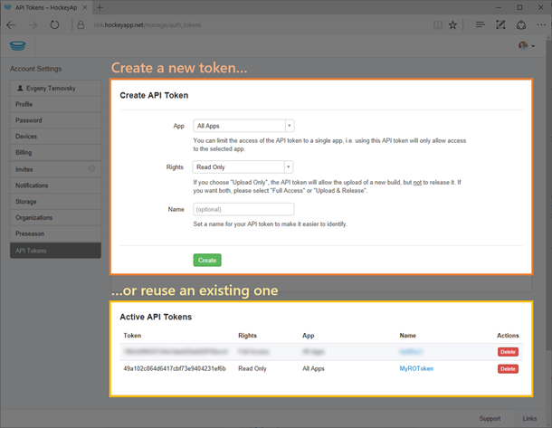
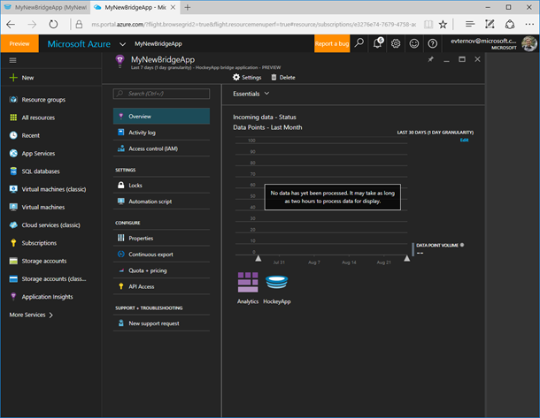
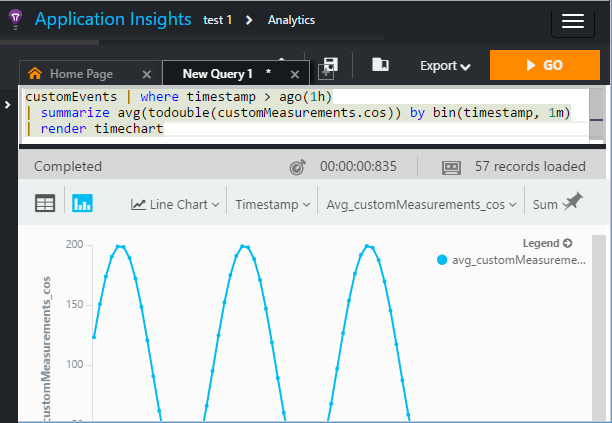
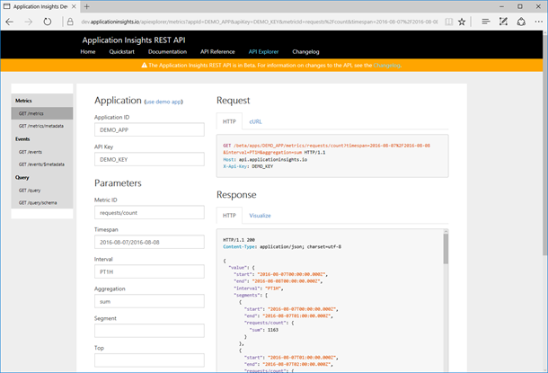

<properties 
	pageTitle="Exploring HockeyApp data in Application Insights | Microsoft Azure" 
	description="Analyze usage and performance of your Azure app with Application Insights." 
	services="application-insights" 
    documentationCenter="windows"
	authors="alancameronwills" 
	manager="douge"/>

<tags 
	ms.service="application-insights" 
	ms.workload="tbd" 
	ms.tgt_pltfrm="ibiza" 
	ms.devlang="na" 
	ms.topic="article" 
	ms.date="08/25/2016" 
	ms.author="awills"/>

#  Exploring HockeyApp data in Application Insights

[HockeyApp](https://azure.microsoft.com/services/hockeyapp/) is the recommended platform for monitoring live device and desktop apps. From HockeyApp, you can send telemetry to monitor usage, performance, as well as getting crash data. This stream of data can be queried using the powerful [Analytics](app-insights-analytics.md) feature of [Visual Studio Application Insights](app-insights-overview.md). In addition, you can [export the data](app-insights-export-telemetry.md) and query it using the [telemetry query API](https://dev.applicationinsights.io/). To enable these features, you set up a bridge that relays the HockeyApp data to Application Insights.

## The HockeyApp Bridge app

The HockeyApp Bridge App is the core feature that enables you to access your HockeyApp data in Application Insights through the Analytics, Continuous Export, and API features. Any data collected by HockeyApp after the creation of the HockeyApp Bridge App will be accessible from these features. Let’s see how to set up one of these Bridge Apps.

Open the [tokens section](https://rink.hockeyapp.net/manage/auth_tokens) of your account settings in HockeyApp. Either create a new token or reuse an existing one. The minimum rights required are "read only":

Next, open the Microsoft Azure portal. Click “New”, “Developer Services”, and “Application Insights.” Under “Application Type”, select “HockeyApp Bridge application”:

You don't need to set a name - this will automatically be set from the HockeyApp name.

The HockeyApp bridge fields appear. 

Enter the HockeyApp token you noted earlier. This action populates the “HockeyApp Application” dropdown menu with all your HockeyApp applications. Select the one you want to use, and complete the remainder of the fields. Soon, your new resource is ready to use. 

Note that the data takes a few minutes to start flowing.

That’s it! Any data collected in your HockeyApp-instrumented app from this point forward is now also available to you in the Analytics, Continuous Export, and API features of Application Insights.

Let’s briefly review each of these features now available to you.

## Analytics

Analytics is a powerful tool for ad-hoc querying of your data, allowing you to diagnose and analyze your telemetry and quickly discover root causes and patterns.

* [Learn more about Analytics](app-insights-analytics-tour.md)
* [Introduction video](https://channel9.msdn.com/events/Build/2016/T666)
* [Advanced concepts video](https://channel9.msdn.com/Events/Build/2016/P591)

## Continuous export

Continuous Export allows you to export your data into an Azure Blob Storage container. This is very useful if you need to keep your data for longer than the retention period currently offered by Application Insights. You can keep the data in blob storage, process it into a SQL Database, or your preferred data warehousing solution.

[Learn more about Continuous Export](app-insights-export-telemetry.md)

## Application Insights REST API

The Application Insights REST APIs allow you to access all your app's event and metric data with a powerful and simple REST API and easily integrate your data into other data query and visualization products such as Power BI, Excel and others.

[Learn more](https://dev.applicationinsights.io/)

## Next steps

* [Apply Analytics to your data](app-insights-analytics-tour.md)

