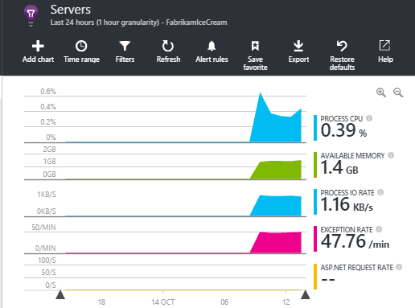

<properties 
	pageTitle="How do I ... in Application Insights" 
	description="FAQ in Application Insights." 
	services="application-insights" 
    documentationCenter=""
	authors="alancameronwills" 
	manager="douge"/>

<tags 
	ms.service="application-insights" 
	ms.workload="tbd" 
	ms.tgt_pltfrm="ibiza" 
	ms.devlang="na" 
	ms.topic="article" 
	ms.date="02/05/2016" 
	ms.author="awills"/>

# How do I ... in Application Insights?

## Get an email when ...

### Email if my site goes down

Set an [availability web test](app-insights-monitor-web-app-availability.md).

### Email if my site is overloaded

Set an [alert](app-insights-alerts.md) on **Server response time**. A threshold between 1 and 2 seconds should work.


Your app might also show signs of strain by returning failure codes. Set an alert on **Failed requests**.

If you want to set an alert on **Server exceptions**, you might have to do [some additional setup](app-insights-asp-net-exceptions.md) in order to see data.

### Email on exceptions

1. [Set up exception monitoring](app-insights-asp-net-exceptions.md)
2. [Set an alert](app-insights-alerts.md) on the Exception count metric


### Email on an event in my app

Let's suppose you'd like to get an email when a specific event occurs. Application Insights doesn't provide this facility directly, but it can [send an alert when a metric crosses a threshold](app-insights-alerts.md). 

Alerts can be set on [custom metrics](app-insights-api-custom-events-metrics.md#track-metric), though not custom events. Write some code to increase a metric when the event occurs:

    telemetry.TrackMetric("Alarm", 10);

or:

    var measurements = new Dictionary<string,double>();
    measurements ["Alarm"] = 10;
    telemetry.TrackEvent("status", null, measurements);

Because alerts have two states, you have to send a low value when you consider the alert to have ended:

    telemetry.TrackMetric("Alarm", 0.5);

Create a chart in [metric explorer](app-insights-metrics-explorer.md) to see your alarm:


Now set an alert to fire when the metric goes above a mid value for a short period:


Set the averaging period to the minimum. 

You'll get emails both when the metric goes above and below the threshold.

Some points to consider:

* An alert has two states ("alert" and "healthy"). The state is evaluated only when a metric is received.
* An email is sent only when the state changes. This is why you have to send both high and low-value metrics. 
* To evaluate the alert, the average is taken of the received values over the preceding period. This occurs every time a metric is received, so emails can be sent more frequently than the period you set.
* Since emails are sent both on "alert" and "healthy", you might want to consider re-thinking your one-shot event as a two-state condition. For example, instead of a "job completed" event, have a "job in progress" condition, where you get emails at the start and end of a job.

### Set up alerts automatically

[Use PowerShell to create new alerts](app-insights-alerts.md#set-alerts-by-using-powershell)

## Use PowerShell to Manage Application Insights

* [Create new resources](app-insights-powershell-script-create-resource.md)
* [Create new alerts](app-insights-alerts.md#set-alerts-by-using-powershell)

## Application versions and stamps

### Separate the results from dev, test and prod

* For different environmnents, set up different ikeys
* For different stamps (dev, test, prod) tag the telemetry with different property values

[Learn more](app-insights-separate-resources.md)
 

### Filter on build number

When you publish a new version of your app, you'll want to be able to separate the telemetry from different builds.

You can set the Application Version property so that you can filter [search](app-insights-diagnostic-search.md) and [metric explorer](app-insights-metrics-explorer.md) results. 


There are several different methods of setting the Application Version property.

* Set directly:

    `telemetryClient.Context.Component.Version = typeof(MyProject.MyClass).Assembly.GetName().Version;`

* Wrap that line in a [telemetry initializer](app-insights-api-custom-events-metrics.md#telemetry-initializers) to ensure that all TelemetryClient instances are set consistently.

* [ASP.NET] Set the version in `BuildInfo.config`. The web module will pick up the version from the BuildLabel node. Include this file in your project and remember to set the Copy Always property in Solution Explorer.

    ```XML

    <?xml version="1.0" encoding="utf-8"?>
    <DeploymentEvent xmlns:xsi="http://www.w3.org/2001/XMLSchema-instance" xmlns:xsd="http://www.w3.org/2001/XMLSchema" xmlns="http://schemas.microsoft.com/VisualStudio/DeploymentEvent/2013/06">
      <ProjectName>AppVersionExpt</ProjectName>
      <Build type="MSBuild">
        <MSBuild>
          <BuildLabel kind="label">1.0.0.2</BuildLabel>
        </MSBuild>
      </Build>
    </DeploymentEvent>

    ```
* [ASP.NET] Generate BuildInfo.config automatically in MSBuild. To do this, add a few lines to your .csproj file:

    ```XML

    <PropertyGroup>
      <GenerateBuildInfoConfigFile>true</GenerateBuildInfoConfigFile>    <IncludeServerNameInBuildInfo>true</IncludeServerNameInBuildInfo>
    </PropertyGroup> 
    ```

    This generates a file called *yourProjectName*.BuildInfo.config. The Publish process renames it to BuildInfo.config.

    The build label contains a placeholder (AutoGen_...) when you build with Visual Studio. But when built with MSBuild, it is populated with the correct version number.

    To allow MSBuild to generate version numbers, set the version like `1.0.*` in AssemblyReference.cs

## Monitor backend servers and desktop apps

[Use the Windows Server SDK module](app-insights-windows-desktop.md).


## Visualize data

#### Dashboard with metrics from multiple apps

* In [Metric Explorer](app-insights-metrics-explorer.md), customize your chart and save it as a favorite. Pin it to the Azure dashboard.
* 

#### Dashboard with data from other sources and Application Insights

* [Export telemetry to Power BI](app-insights-export-power-bi.md). 

Or

* Use SharePoint as your dashboard, displaying data in SharePoint web parts. [Use continuous export and Stream Analytics to export to SQL](app-insights-code-sample-export-sql-stream-analytics.md).  Use PowerView to examine the database, and create a SharePoint web part for PowerView.


### Complex filtering, segmentation and joins

* [Use continuous export and Stream Analytics to export to SQL](app-insights-code-sample-export-sql-stream-analytics.md).  Use PowerView to examine the database.

<a name="search-specific-users"></a>
### Filter out anonymous or authenticated users

If your users sign in, you can set the [authenticated user id](app-insights-api-custom-events-metrics.md#authenticated-users). (It doesn't happen automatically.) 

You can then:

* Search on specific user ids


* Filter metrics to either anonymous or authenticated users


## Modify property names or values

Create a [filter](app-insights-api-filtering-sampling.md#filtering). This lets you modify or filter telemetry before it is sent from your app to Application Insights.

## List specific users and their usage

If you just want to [search for specific users](#search-specific-users), you can set the [authenticated user id](app-insights-api-custom-events-metrics.md#authenticated-users).

If you want a list of users with data such as what pages they look at or how often they log in, you have two options:

* [Set authenticated user id](app-insights-api-custom-events-metrics.md#authenticated-users), [export to a database](app-insights-code-sample-export-sql-stream-analytics.md) and use suitable tools to analyze your user data there.
* If you have only a small number of users, send custom events or metrics, using the data of interest as the metric value or event name, and setting the user id as a property. To analyze page views, replace the standard JavaScript trackPageView call. To analyze server-side telemetry, use a telemetry initializer to add the user id to all server telemetry. You can then filter and segment metrics and searches on the user id.


## Reduce traffic from my app to Application Insights

* In [ApplicationInsights.config](app-insights-configuration-with-applicationinsights-config.md), disable any modules you don't need, such the performance counter collector.
* Use [Sampling and filtering](app-insights-api-filtering-sampling.md) at the SDK.
* In your web pages, Limit the number of Ajax calls reported for every page view. In the script snippet after `instrumentationKey:...` , insert: `,maxAjaxCallsPerView:3` (or a suitable number).
* If you're using [TrackMetric](app-insights-api-custom-events-metrics.md#track-metric), compute the aggregate of batches of metric values before sending the result. There's an overload of TrackMetric() that provides for that.


Learn more about [pricing and quotas](app-insights-pricing.md).

## Disable telemetry

To **dynamically stop and start** the collection and transmission of telemetry from the server:

```

    using  Microsoft.ApplicationInsights.Extensibility;

    TelemetryConfiguration.Active.DisableTelemetry = true;
```


To **disable selected standard collectors** - for example, performance counters, HTTP requests, or dependencies - delete or comment out the relevant lines in [ApplicationInsights.config](app-insights-api-custom-events-metrics.md). You could do this, for example, if you want to send your own TrackRequest data.


## View system performance counters

Among the metrics you can show in metrics explorer are a set of system performance counters. There's a predefined blade titled **Servers** that displays several of them.



### If you see no performance counter data

* **IIS server** on your own machine or on a VM. [Install Status Monitor](app-insights-monitor-performance-live-website-now.md). 
* **Azure web site** - we don't support performance counters yet. There are several metrics you can get as a standard part of the Azure web site control panel.
* **Unix server** - [Install collectd](app-insights-java-collectd.md)

### To display more performance counters

* First, [add a new chart](app-insights-metrics-explorer.md) and see if the counter is in the basic set that we offer.
* If not, [add the counter to the set collected by the performance counter module](app-insights-web-monitor-performance.md#system-performance-counters).


