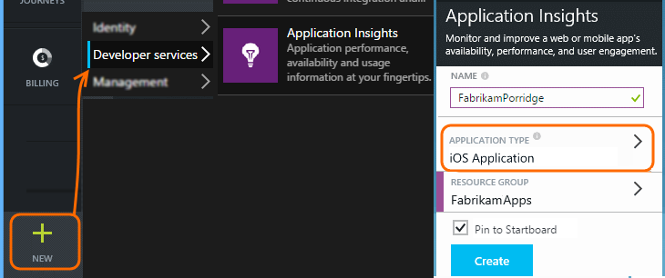

<properties
    pageTitle="Analytics for iOS apps | Microsoft Azure"
    description="Analyze usage and performance of your iOS app."
    services="application-insights"
    documentationCenter="ios"
    authors="alancameronwills"
    manager="douge"/>

<tags
    ms.service="application-insights"
    ms.workload="tbd"
    ms.tgt_pltfrm="ibiza"
    ms.devlang="na"
    ms.topic="get-started-article"
    ms.date="11/15/2015"
    ms.author="awills"/>

# Analytics for iOS apps

Visual Studio Application Insights lets you monitor your mobile application for usage, events, and crashes.

> [AZURE.NOTE] We recommend [HockeyApp](http://support.hockeyapp.net/kb/client-integration-ios-mac-os-x/hockeyapp-for-ios) to get crash reports, analytics, distribution and feedback management.

## Requirements

You'll need:

* A subscription with [Microsoft Azure](http://azure.com). You sign in with a Microsoft account, which you might have for Windows, XBox Live, or other Microsoft cloud services.
* Xcode 6 or later.
* The SDK runs on devices with iOS 6.0 or later.

## Create an Application Insights resource

In the [Azure portal][portal], create a new Application Insights resource. Pick the iOS option.

The blade that opens is the place where you'll see performance and usage data about your app. To get back to it next time you login to Azure, you should find a tile for it on the start screen. Alternatively click Browse to find it.

## Setup

Please follow the [setup guide](https://github.com/Microsoft/ApplicationInsights-iOS#setup) to install the SDK in your app.

## View your data in Application Insights

Run your app to generate some telemetry.

Return to http://portal.azure.com and browse to your Application Insights resource.

Click **Search** to open [Diagnostic Search][diagnostic] - that's where the first events will appear. If you don't see anything, wait a minute or two and click **Refresh**.

As your app is used, data will appear in the overview blade.

Click any chart to get more detail. For example, crashes:

## Next Steps

[Track usage of your app][track]

[Diagnostic search][diagnostic]

[Metric Explorer][metrics]

[Troubleshooting][qna]

<!--Link references-->

[diagnostic]: app-insights-diagnostic-search.md
[metrics]: app-insights-metrics-explorer.md
[portal]: http://portal.azure.com/
[qna]: app-insights-troubleshoot-faq.md
[track]: app-insights-api-custom-events-metrics.md
