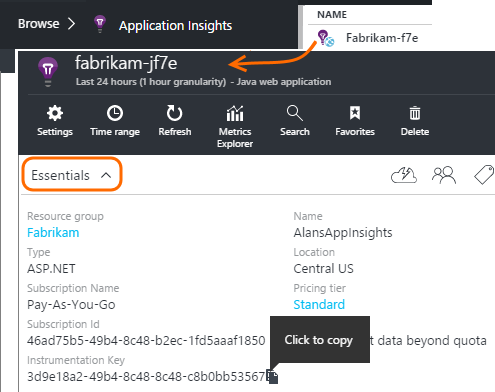
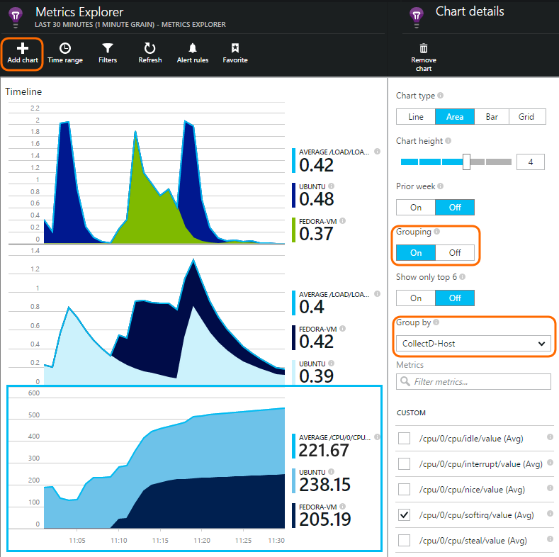

<properties 
	pageTitle="collectd: perf stats for Java on Unix in Application Insights" 
	description="Extended monitoring of your Java website with the CollectD plug-in for Application Insights" 
	services="application-insights" 
    documentationCenter="java"
	authors="alancameronwills" 
	manager="douge"/>

<tags 
	ms.service="application-insights" 
	ms.workload="tbd" 
	ms.tgt_pltfrm="ibiza" 
	ms.devlang="na" 
	ms.topic="article" 
	ms.date="03/02/2016" 
	ms.author="awills"/>
 
# collectd: Unix performance metrics in Application Insights

*Application Insights is in Preview.*

To explore Unix system performance metrics in [Application Insights](app-insights-overview.md), install [collectd](http://collectd.org/), together with its Application Insights plug-in. This open-source solution gathers a variety of system and network statistics.

Typically you'll use collectd if you have already [instrumented your Java web service with Application Insights][java], so that you have more data to help you to enhance your app's performance or diagnose problems. 


## Get your instrumentation key

In the [Microsoft Azure portal](https://portal.azure.com), open the [Application Insights](app-insights-overview.md) resource where you want the data to appear. (Or [create a new resource](app-insights-create-new-resource.md).)

Take a copy of the instrumentation key, which identifies the resource.




## Install collectd and the plug-in

On your Unix server machine(s):

1. Install [collectd](http://collectd.org/) version 5.4.0 or later.
2. Download the [Application Insights collectd writer plugin](https://azuredownloads.blob.core.windows.net/applicationinsights/sdk.html). Note the version number.
3. Copy the plugin JAR into `/usr/share/collectd/java`.
3. Edit `/etc/collectd/collectd.conf`:
 * Ensure that [the Java plugin](https://collectd.org/wiki/index.php/Plugin:Java) is enabled.
 * Update the JVMArg for the java.class.path to include the following JAR. Update the version number to match the one you downloaded:
  * `/usr/share/collectd/java/applicationinsights-collectd-0.9.4.jar`
 * Add this snippet, using the Instrumentation Key from your resource:

```

     LoadPlugin "com.microsoft.applicationinsights.collectd.ApplicationInsightsWriter"
     <Plugin ApplicationInsightsWriter>
        InstrumentationKey "Your key"
     </Plugin>
```

Here's part of a sample configuration file:

    ...
    # collectd plugins
    LoadPlugin cpu
    LoadPlugin disk
    LoadPlugin load
    ...

    # Enable Java Plugin
    LoadPlugin "java"

    # Configure Java Plugin
    <Plugin "java">
      JVMArg "-verbose:jni"
      JVMArg "-Djava.class.path=/usr/share/collectd/java/applicationinsights-collectd-0.9.4.jar:/usr/share/collectd/java/collectd-api.jar"

      # Enabling Application Insights plugin
      LoadPlugin "com.microsoft.applicationinsights.collectd.ApplicationInsightsWriter"
                
      # Configuring Application Insights plugin
      <Plugin ApplicationInsightsWriter>
        InstrumentationKey "12345678-1234-1234-1234-123456781234"
      </Plugin>

      # Other plugin configurations ...
      ...
    </Plugin>
.   ...

Configure other [collectd plugins](https://collectd.org/wiki/index.php/Table_of_Plugins), which can collect a variety of data from different sources.

Restart collectd according to its [manual](https://collectd.org/wiki/index.php/First_steps).

## View the data in Application Insights

In your Application Insights resource, open [Metrics Explorer and add charts][metrics], selecting the metrics you want to see from the Custom category.



By default, the metrics are aggregated across all host machines from which the metrics were collected. To view the metrics per host, in the Chart details blade, turn on Grouping and then choose to group by CollectD-Host.


## To exclude upload of specific statistics

By default, the Application Insights plugin will send all the data collected by all the enabled collectd 'read' plugins. 

To exclude data from specific plugins or data sources:

* Edit the configuration file. 
* In `<Plugin ApplicationInsightsWriter>`, add directive lines like this:

Directive | Effect
---|---
`Exclude disk` | Exclude all data collected by the `disk` plugin
`Exclude disk:read,write` | Exclude the sources named `read` and `write` from the `disk` plugin.

Separate directives with a newline.


## Problems?

*I don't see data in the portal*

* Open [Search][diagnostic] to see if the raw events have arrived. Sometimes they take longer to appear in metrics explorer.
* Enable tracing in the Application Insights plugin. Add this line within `<Plugin ApplicationInsightsWriter>`:
 *  `SDKLogger true`
* Open a terminal and start collectd in verbose mode, to see any issues it is reporting:
 * `sudo collectd -f`


<!--Link references-->

[api]: app-insights-api-custom-events-metrics.md
[apiexceptions]: app-insights-api-custom-events-metrics.md#track-exception
[availability]: app-insights-monitor-web-app-availability.md
[diagnostic]: app-insights-diagnostic-search.md
[eclipse]: app-insights-java-eclipse.md
[java]: app-insights-java-get-started.md
[javalogs]: app-insights-java-trace-logs.md
[metrics]: app-insights-metrics-explorer.md
[usage]: app-insights-web-track-usage.md

 
