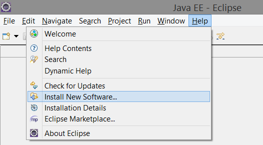
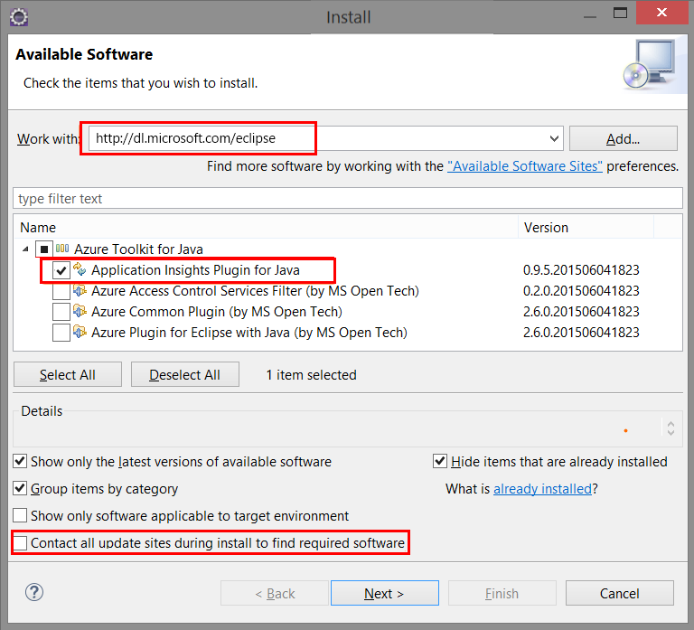
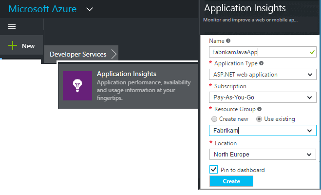
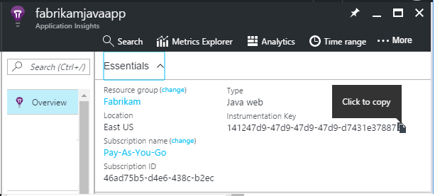
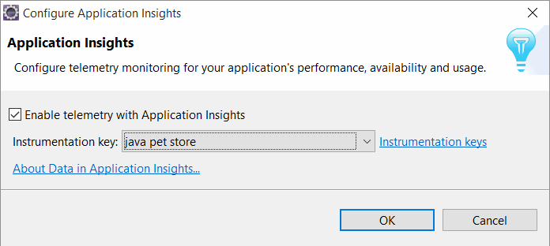
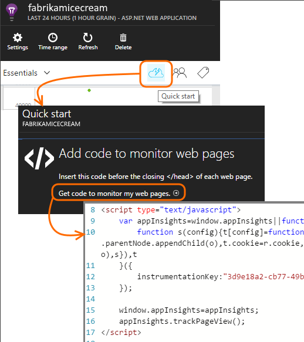
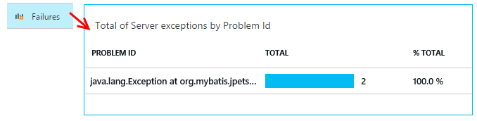
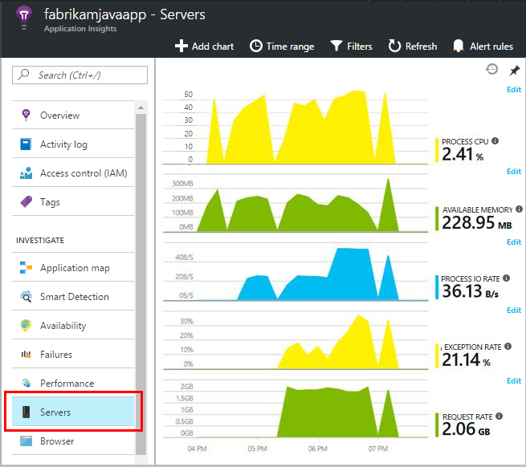
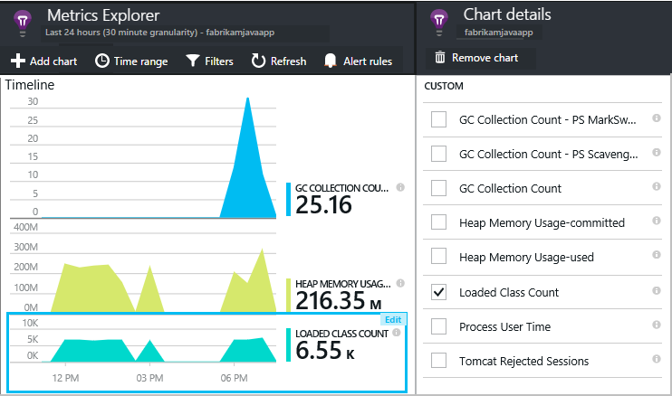
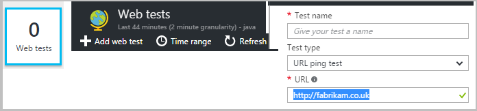

# Get started with Application Insights with Java in Eclipse
The Application Insights SDK sends telemetry from your Java web application so that you can analyze usage and performance. The Eclipse plug-in for Application Insights automatically installs the SDK in your project so that you get out of the box telemetry, plus an API that you can use to write custom telemetry.   

## Prerequisites
Currently the plug-in works for Maven projects and Dynamic Web Projects in Eclipse.
([Add Application Insights to other types of Java project][java].)

You'll need:

* Oracle JRE 1.6 or later
* A subscription to [Microsoft Azure](https://azure.microsoft.com/).
* [Eclipse IDE for Java EE Developers](http://www.eclipse.org/downloads/), Indigo or later.
* Windows 7 or later, or Windows Server 2008 or later

## Install the SDK on Eclipse (one time)
You only have to do this one time per machine. This step installs a toolkit which can then add the SDK to each Dynamic Web Project.

1. In Eclipse, click Help, Install New Software.

    
2. The SDK is in http://dl.microsoft.com/eclipse, under Azure Toolkit.
3. Uncheck **Contact all update sites...**

    

Follow the remaining steps for each Java project.

## Create an Application Insights resource in Azure
1. Sign in to the [Azure portal](https://portal.azure.com).
2. Create a new Application Insights resource. Set the application type to Java web application.  

      

4. Find the instrumentation key of the new resource. You'll need to paste this into your code project shortly.  

      

## Add Application Insights to your project
1. Add Application Insights from the context menu of your Java web project.

    
2. Paste the instrumentation key that you got from the Azure portal.

    

The key is sent along with every item of telemetry and tells Application Insights to display it in your resource.

## Run the application and see metrics
Run your application.

Return to your Application Insights resource in Microsoft Azure.

HTTP requests data will appear on the overview blade. (If it isn't there, wait a few seconds and then click Refresh.)


Click through any chart to see more detailed metrics.


[Learn more about metrics.][metrics]

And when viewing the properties of a request, you can see the telemetry events associated with it such as requests and exceptions.


## Client-side telemetry
From the QuickStart blade, click Get code to monitor my web pages:



Insert the code snippet in the head of your HTML files.

#### View client-side data
Open your updated web pages and use them. Wait a minute or two, then return to Application Insights and open the usage blade. (From the Overview blade, scroll down and click Usage.)

Page view, user, and session metrics will appear on the usage blade:


[Learn more about setting up client-side telemetry.][usage]

## Publish your application
Now publish your app to the server, let people use it, and watch the telemetry show up on the portal.

* Make sure your firewall allows your application to send telemetry to these ports:

  * dc.services.visualstudio.com:443
  * dc.services.visualstudio.com:80
  * f5.services.visualstudio.com:443
  * f5.services.visualstudio.com:80
* On Windows servers, install:

  * [Microsoft Visual C++ Redistributable](http://www.microsoft.com/download/details.aspx?id=40784)

    (This enables performance counters.)

## Exceptions and request failures
Unhandled exceptions are automatically collected:



To collect data on other exceptions, you have two options:

* [Insert calls to TrackException in your code](app-insights-api-custom-events-metrics.md#trackexception).
* [Install the Java Agent on your server](app-insights-java-agent.md). You specify the methods you want to watch.

## Monitor method calls and external dependencies
[Install the Java Agent](app-insights-java-agent.md) to log specified internal methods and calls made through JDBC, with timing data.

## Performance counters
On your Overview blade, scroll down and click the  **Servers** tile. You'll see a range of performance counters.



### Customize performance counter collection
To disable collection of the standard set of performance counters, add the following code under the root node of the ApplicationInsights.xml file:

```XML

    <PerformanceCounters>
       <UseBuiltIn>False</UseBuiltIn>
    </PerformanceCounters>
```

### Collect additional performance counters
You can specify additional performance counters to be collected.

#### JMX counters (exposed by the Java Virtual Machine)

```XML

    <PerformanceCounters>
      <Jmx>
        <Add objectName="java.lang:type=ClassLoading" attribute="TotalLoadedClassCount" displayName="Loaded Class Count"/>
        <Add objectName="java.lang:type=Memory" attribute="HeapMemoryUsage.used" displayName="Heap Memory Usage-used" type="composite"/>
      </Jmx>
    </PerformanceCounters>
```

* `displayName` – The name displayed in the Application Insights portal.
* `objectName` – The JMX object name.
* `attribute` – The attribute of the JMX object name to fetch
* `type` (optional) - The type of JMX object’s attribute:
  * Default: a simple type such as int or long.
  * `composite`: the perf counter data is in the format of 'Attribute.Data'
  * `tabular`: the perf counter data is in the format of a table row

#### Windows performance counters
Each [Windows performance counter](https://msdn.microsoft.com/library/windows/desktop/aa373083.aspx) is a member of a category (in the same way that a field is a member of a class). Categories can either be global, or can have numbered or named instances.

```XML

    <PerformanceCounters>
      <Windows>
        <Add displayName="Process User Time" categoryName="Process" counterName="%User Time" instanceName="__SELF__" />
        <Add displayName="Bytes Printed per Second" categoryName="Print Queue" counterName="Bytes Printed/sec" instanceName="Fax" />
      </Windows>
    </PerformanceCounters>
```

* displayName – The name displayed in the Application Insights portal.
* categoryName – The performance counter category (performance object) with which this performance counter is associated.
* counterName – The name of the performance counter.
* instanceName – The name of the performance counter category instance, or an empty string (""), if the category contains a single instance. If the categoryName is Process, and the performance counter you'd like to collect is from the current JVM process on which your app is running, specify `"__SELF__"`.

Your performance counters are visible as custom metrics in [Metrics Explorer][metrics].



### Unix performance counters
* [Install collectd with the Application Insights plugin](app-insights-java-collectd.md) to get a wide variety of system and network data.

## Availability web tests
Application Insights can test your website at regular intervals to check that it's up and responding well. [To set up][availability], scroll down to click Availability.



You'll get charts of response times, plus email notifications if your site goes down.


[Learn more about availability web tests.][availability]

## Diagnostic logs
If you're using Logback or Log4J (v1.2 or v2.0) for tracing, you can have your trace logs sent automatically to Application Insights where you can explore and search on them.

[Learn more about diagnostic logs][javalogs]

## Custom telemetry
Insert a few lines of code in your Java web application to find out what users are doing with it or to help diagnose problems.

You can insert code both in web page JavaScript and in the server-side Java.

[Learn about custom telemetry][track]

## Next steps
#### Detect and diagnose issues
* [Add web client telemetry][usage] to get performance telemetry from the web client.
* [Set up web tests][availability] to make sure your application stays live and responsive.
* [Search events and logs][diagnostic] to help diagnose problems.
* [Capture Log4J or Logback traces][javalogs]

#### Track usage
* [Add web client telemetry][usage] to monitor page views and basic user metrics.
* [Track custom events and metrics](app-insights-web-track-usage.md) to learn about how your application is used, both at the client and the server.

<!--Link references-->

[availability]: app-insights-monitor-web-app-availability.md
[diagnostic]: app-insights-diagnostic-search.md
[java]: app-insights-java-get-started.md
[javalogs]: app-insights-java-trace-logs.md
[metrics]: app-insights-metrics-explorer.md
[track]: app-insights-api-custom-events-metrics.md
[usage]: app-insights-javascript.md
