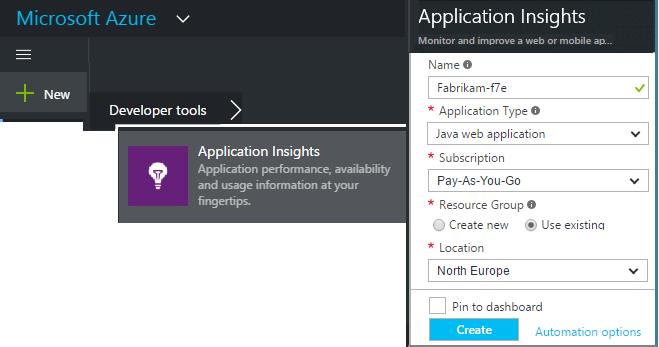
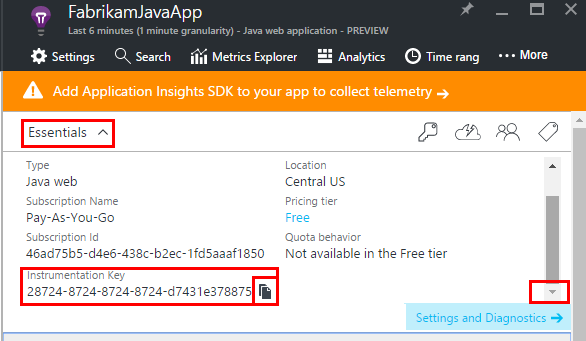
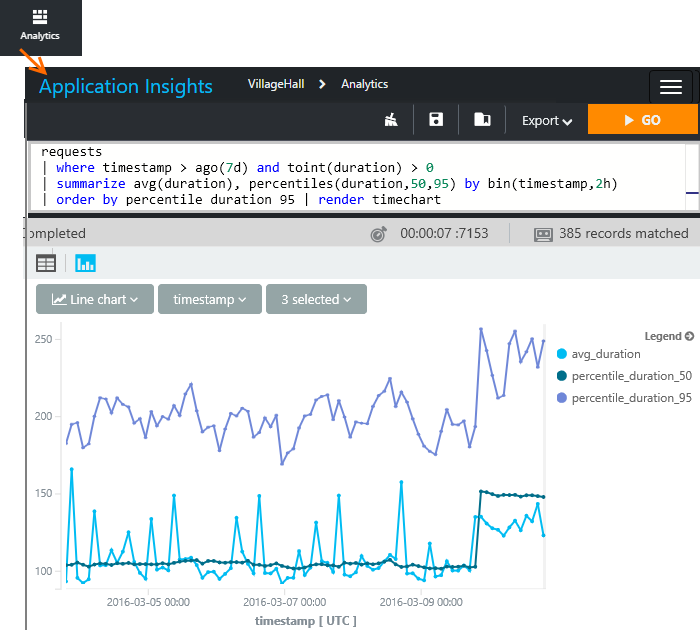
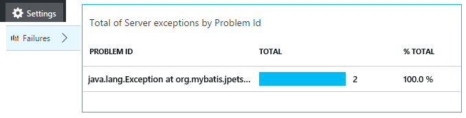
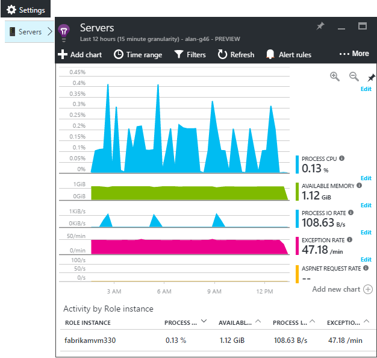
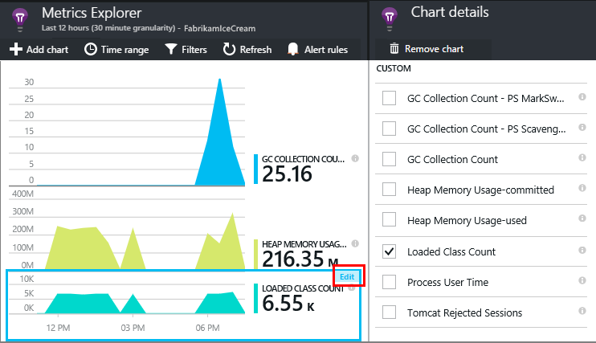
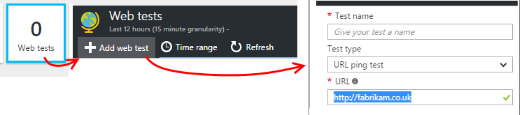

<properties
	pageTitle="Java web app analytics with Application Insights | Microsoft Azure"
	description="Monitor performance and usage of your Java website with Application Insights. "
	services="application-insights"
    documentationCenter="java"
	authors="alancameronwills"
	manager="douge"/>

<tags
	ms.service="application-insights"
	ms.workload="tbd"
	ms.tgt_pltfrm="ibiza"
	ms.devlang="na"
	ms.topic="get-started-article"
	ms.date="08/11/2016"
	ms.author="awills"/>

# Get started with Application Insights in a Java web project

*Application Insights is in Preview.*

[AZURE.INCLUDE [app-insights-selector-get-started](../../includes/app-insights-selector-get-started.md)]

[Application Insights](https://azure.microsoft.com/services/application-insights/) is an extensible analytics service that helps you understand the performance and usage of your live application. Use it to [detect and diagnose performance issues and exceptions](app-insights-detect-triage-diagnose.md), and [write code][api] to track what users do with your app.

Application Insights supports Java apps running on Linux, Unix, or Windows.

You need:

* Oracle JRE 1.6 or later, or Zulu JRE 1.6 or later
* A subscription to [Microsoft Azure](https://azure.microsoft.com/). (You could start with the [free trial](https://azure.microsoft.com/pricing/free-trial/).)

*If you have a web app that's already live, you could follow the alternative procedure to [add the SDK at runtime in the web server](app-insights-java-live.md). That alternative avoids rebuilding the code, but you don't get the option to write code to track user activity.*

## 1. Get an Application Insights instrumentation key

1. Sign in to the [Microsoft Azure portal](https://portal.azure.com).
2. Create an Application Insights resource. Set the application type to Java web application.

    
4. Find the instrumentation key of the new resource. You'll need to paste this key into your code project shortly.

    

## 2. Add the Application Insights SDK for Java to your project

*Choose the appropriate way for your project.*

#### If you're using Eclipse to create a Maven or Dynamic Web project ...

Use the [Application Insights SDK for Java plug-in][eclipse].

#### If you're using Maven...

If your project is already set up to use Maven for build, merge the following code to your pom.xml file.

Then, refresh the project dependencies to get the binaries downloaded.

    <repositories>
       <repository>
          <id>central</id>
          <name>Central</name>
          <url>http://repo1.maven.org/maven2</url>
       </repository>
    </repositories>

    <dependencies>
      <dependency>
        <groupId>com.microsoft.azure</groupId>
        <artifactId>applicationinsights-web</artifactId>
        <!-- or applicationinsights-core for bare API -->
        <version>[1.0,)</version>
      </dependency>
    </dependencies>

* *Build or checksum validation errors?* Try using a specific version, such as: `<version>1.0.n</version>`. You'll find the latest version in the [SDK release notes](https://github.com/Microsoft/ApplicationInsights-Java#release-notes) or in our [Maven artifacts](http://search.maven.org/#search%7Cga%7C1%7Capplicationinsights).
* *Need to update to a new SDK?* Refresh your project's dependencies.

#### If you're using Gradle...

If your project is already set up to use Gradle for build, merge the following code to your build.gradle file.

Then refresh the project dependencies to get the binaries downloaded.

    repositories {
      mavenCentral()
    }

    dependencies {
      compile group: 'com.microsoft.azure', name: 'applicationinsights-web', version: '1.+'
      // or applicationinsights-core for bare API
    }

* *Build or checksum validation errors? Try using a specific version, such as:* `version:'1.0.n'`. *You'll find the latest version in the [SDK release notes](https://github.com/Microsoft/ApplicationInsights-Java#release-notes).*
* *To update to a new SDK*
 * Refresh your project's dependencies.

#### Otherwise ...

Manually add the SDK:

1. Download the [Application Insights SDK for Java](https://azuredownloads.blob.core.windows.net/applicationinsights/sdk.html).
2. Extract the binaries from the zip file and add them to your project.

### Questions...

* *What's the relationship between the `-core` and `-web` components in the zip?*

 * `applicationinsights-core` gives you the bare API. You always need this component.
 * `applicationinsights-web` gives you metrics that track HTTP request counts and response times. You can omit this component if you don't want this telemetry automatically collected. For example, if you want to write your own.

* *To update the SDK when we publish changes*
 * Download the latest [Application Insights SDK for Java](https://azuredownloads.blob.core.windows.net/applicationinsights/sdk.zip) and replace the old ones.
 * Changes are described in the [SDK release notes](https://github.com/Microsoft/ApplicationInsights-Java#release-notes).

## 3. Add an Application Insights .xml file

Add ApplicationInsights.xml to the resources folder in your project, or make sure it is added to your project’s deployment class path. Copy the following XML into it.

Substitute the instrumentation key that you got from the Azure portal.

    <?xml version="1.0" encoding="utf-8"?>
    <ApplicationInsights xmlns="http://schemas.microsoft.com/ApplicationInsights/2013/Settings" schemaVersion="2014-05-30">

      <!-- The key from the portal: -->

      <InstrumentationKey>** Your instrumentation key **</InstrumentationKey>

      <!-- HTTP request component (not required for bare API) -->

      <TelemetryModules>
        <Add type="com.microsoft.applicationinsights.web.extensibility.modules.WebRequestTrackingTelemetryModule"/>
        <Add type="com.microsoft.applicationinsights.web.extensibility.modules.WebSessionTrackingTelemetryModule"/>
        <Add type="com.microsoft.applicationinsights.web.extensibility.modules.WebUserTrackingTelemetryModule"/>
      </TelemetryModules>

      <!-- Events correlation (not required for bare API) -->
      <!-- These initializers add context data to each event -->

      <TelemetryInitializers>
        <Add   type="com.microsoft.applicationinsights.web.extensibility.initializers.WebOperationIdTelemetryInitializer"/>
        <Add type="com.microsoft.applicationinsights.web.extensibility.initializers.WebOperationNameTelemetryInitializer"/>
        <Add type="com.microsoft.applicationinsights.web.extensibility.initializers.WebSessionTelemetryInitializer"/>
        <Add type="com.microsoft.applicationinsights.web.extensibility.initializers.WebUserTelemetryInitializer"/>
        <Add type="com.microsoft.applicationinsights.web.extensibility.initializers.WebUserAgentTelemetryInitializer"/>

      </TelemetryInitializers>
    </ApplicationInsights>

* The instrumentation key is sent along with every item of telemetry and tells Application Insights to display it in your resource.
* The HTTP Request component is optional. It automatically sends telemetry about requests and response times to the portal.
* Events correlation is an addition to the HTTP request component. It assigns an identifier to each request received by the server, and adds this identifier as a property to every item of telemetry as the property 'Operation.Id'. It allows you to correlate the telemetry associated with each request by setting a filter in [diagnostic search][diagnostic].
* The Application Insight key can be passed dynamically from Azure portal as a system property (-DAPPLICATION_INSIGHTS_IKEY=your_ikey). If there is no property defined, it checks for environment variable (APPLICATION_INSIGHTS_IKEY) in Azure Appsettings. If both the properties are undefined, the default InstrumentationKey is used from ApplicationInsights.xml. This helps in managing different InstrumentationKeys for different environment dynamically.

### Alternative ways to set the instrumentation key

Application Insights SDK looks for the key in this order:

1. System property: -DAPPLICATION_INSIGHTS_IKEY=your_ikey
2. Environment variable: APPLICATION_INSIGHTS_IKEY
3. Configuration file: ApplicationInsights.xml

You can also [set it in code](app-insights-api-custom-events-metrics.md#ikey):

    telemetryClient.InstrumentationKey = "...";

## 4. Add an HTTP filter

The last configuration step allows the HTTP request component to log each web request. (Not required if you just want the bare API.)

Locate and open the web.xml file in your project, and merge the following code under the web-app node, where your application filters are configured.

To get the most accurate results, the filter should be mapped before all other filters.

    <filter>
      <filter-name>ApplicationInsightsWebFilter</filter-name>
      <filter-class>
        com.microsoft.applicationinsights.web.internal.WebRequestTrackingFilter
      </filter-class>
    </filter>
    <filter-mapping>
       <filter-name>ApplicationInsightsWebFilter</filter-name>
       <url-pattern>/*</url-pattern>
    </filter-mapping>

#### If you're using MVC 3.1 or later

Edit these elements to include the Application Insights package:

    <context:component-scan base-package=" com.springapp.mvc, com.microsoft.applicationinsights.web.spring"/>

    <mvc:interceptors>
        <mvc:interceptor>
            <mvc:mapping path="/**"/>
            <bean class="com.microsoft.applicationinsights.web.spring.RequestNameHandlerInterceptorAdapter" />
        </mvc:interceptor>
    </mvc:interceptors>

#### If you're using Struts 2

Add this item to the Struts configuration file (usually named struts.xml or struts-default.xml):

     <interceptors>
       <interceptor name="ApplicationInsightsRequestNameInterceptor" class="com.microsoft.applicationinsights.web.struts.RequestNameInterceptor" />
     </interceptors>
     <default-interceptor-ref name="ApplicationInsightsRequestNameInterceptor" />

(If you have interceptors defined in a default stack, the interceptor can simply be added to that stack.)

## 5. Run your application

Either run it in debug mode on your development machine, or publish to your server.

## 6. View your telemetry in Application Insights

Return to your Application Insights resource in [Microsoft Azure portal](https://portal.azure.com).

HTTP requests data appears on the overview blade. (If it isn't there, wait a few seconds and then click Refresh.)

[Learn more about metrics.][metrics]

Click through any chart to see more detailed aggregated metrics.

> Application Insights assumes the format of HTTP requests for MVC applications is: `VERB controller/action`. For example, `GET Home/Product/f9anuh81`, `GET Home/Product/2dffwrf5` and `GET Home/Product/sdf96vws` are grouped into `GET Home/Product`. This grouping enables meaningful aggregations of requests, such as number of requests and average execution time for requests.

### Instance data 

Click through a specific request type to see individual instances. 

Two kinds of data are displayed in Application Insights: aggregated data, stored and displayed as averages, counts, and sums; and instance data - individual reports of HTTP requests, exceptions, page views, or custom events.

When viewing the properties of a request, you can see the telemetry events associated with it such as requests and exceptions.

### Analytics: Powerful query language

As you accumulate more data, you can run queries both to aggregate data and to find individual instances. [Analytics]() is a powerful tool for both for understanding performance and usage, and for diagnostic purposes.

## 7. Install your app on the server

Now publish your app to the server, let people use it, and watch the telemetry show up on the portal.

* Make sure your firewall allows your application to send telemetry to these ports:

 * dc.services.visualstudio.com:443
 * f5.services.visualstudio.com:443

* On Windows servers, install:

 * [Microsoft Visual C++ Redistributable](http://www.microsoft.com/download/details.aspx?id=40784)

    (This component enables performance counters.)

## Exceptions and request failures

Unhandled exceptions are automatically collected:

To collect data on other exceptions, you have two options:

* [Insert calls to trackException() in your code][apiexceptions]. 
* [Install the Java Agent on your server](app-insights-java-agent.md). You specify the methods you want to watch.

## Monitor method calls and external dependencies

[Install the Java Agent](app-insights-java-agent.md) to log specified internal methods and calls made through JDBC, with timing data.

## Performance counters

Open **Settings**, **Servers**, to see a range of performance counters.

### Customize performance counter collection

To disable collection of the standard set of performance counters, add the following code under the root node of the ApplicationInsights.xml file:

    <PerformanceCounters>
       <UseBuiltIn>False</UseBuiltIn>
    </PerformanceCounters>

### Collect additional performance counters

You can specify additional performance counters to be collected.

#### JMX counters (exposed by the Java Virtual Machine)

    <PerformanceCounters>
      <Jmx>
        <Add objectName="java.lang:type=ClassLoading" attribute="TotalLoadedClassCount" displayName="Loaded Class Count"/>
        <Add objectName="java.lang:type=Memory" attribute="HeapMemoryUsage.used" displayName="Heap Memory Usage-used" type="composite"/>
      </Jmx>
    </PerformanceCounters>

*	`displayName` – The name displayed in the Application Insights portal.
*	`objectName` – The JMX object name.
*	`attribute` – The attribute of the JMX object name to fetch
*	`type` (optional) - The type of JMX object’s attribute:
 *	Default: a simple type such as int or long.
 *	`composite`: the perf counter data is in the format of 'Attribute.Data'
 *	`tabular`: the perf counter data is in the format of a table row

#### Windows performance counters

Each [Windows performance counter](https://msdn.microsoft.com/library/windows/desktop/aa373083.aspx) is a member of a category (in the same way that a field is a member of a class). Categories can either be global, or can have numbered or named instances.

    <PerformanceCounters>
      <Windows>
        <Add displayName="Process User Time" categoryName="Process" counterName="%User Time" instanceName="__SELF__" />
        <Add displayName="Bytes Printed per Second" categoryName="Print Queue" counterName="Bytes Printed/sec" instanceName="Fax" />
      </Windows>
    </PerformanceCounters>

*	displayName – The name displayed in the Application Insights portal.
*	categoryName – The performance counter category (performance object) with which this performance counter is associated.
*	counterName – The name of the performance counter.
*	instanceName – The name of the performance counter category instance, or an empty string (""), if the category contains a single instance. If the categoryName is Process, and the performance counter you'd like to collect is from the current JVM process on which your app is running, specify `"__SELF__"`.

Your performance counters are visible as custom metrics in [Metrics Explorer][metrics].

### Unix performance counters

* [Install collectd with the Application Insights plugin](app-insights-java-collectd.md) to get a wide variety of system and network data.

## Get user and session data

OK, you're sending telemetry from your web server. Now to get the full 360-degree view of your application, you can add more monitoring:

* [Add telemetry to your web pages][usage] to monitor page views and user metrics.
* [Set up web tests][availability] to make sure your application stays live and responsive.

## Capture log traces

You can use Application Insights to slice and dice logs from Log4J, Logback, or other logging frameworks. You can correlate the logs with HTTP requests and other telemetry. [Learn how][javalogs].

## Send your own telemetry

Now that you've installed the SDK, you can use the API to send your own telemetry.

* [Track custom events and metrics][api] to learn what users are doing with your application.
* [Search events and logs][diagnostic] to help diagnose problems.

## Availability web tests

Application Insights can test your website at regular intervals to check that it's up and responding well. [To set up][availability], click Web tests.

You'll get charts of response times, plus email notifications if your site goes down.

[Learn more about availability web tests.][availability] 

## Questions? Problems?

[Troubleshooting Java](app-insights-java-troubleshoot.md)

## Next steps

For more information, see the [Java Developer Center](/develop/java/).

<!--Link references-->

[api]: app-insights-api-custom-events-metrics.md
[apiexceptions]: app-insights-api-custom-events-metrics.md#track-exception
[availability]: app-insights-monitor-web-app-availability.md
[diagnostic]: app-insights-diagnostic-search.md
[eclipse]: app-insights-java-eclipse.md
[javalogs]: app-insights-java-trace-logs.md
[metrics]: app-insights-metrics-explorer.md
[usage]: app-insights-web-track-usage.md
