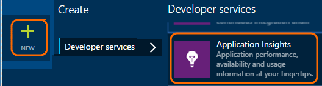

<properties 
	pageTitle="Application Insights for Java web apps that are already live" 
	description="Start monitoring a web application that is already running on your server" 
	services="application-insights" 
    documentationCenter="java"
	authors="alancameronwills" 
	manager="douge"/>

<tags 
	ms.service="application-insights" 
	ms.workload="tbd" 
	ms.tgt_pltfrm="ibiza" 
	ms.devlang="na" 
	ms.topic="article" 
	ms.date="07/21/2015" 
	ms.author="awills"/>
 
# Application Insights for Java web apps that are already live

*Application Insights is in Preview.*

If you have a web application that is already running on your J2EE server, you can start monitoring it with [Appliction Insight](app-insights-overview.md) without the need to make code changes or recompile your project. With this option, you get information about HTTP requests sent to your server, unhandled exceptions and performance counters.

You'll need a subscription to [Microsoft Azure](http://azure.com).

> [AZURE.NOTE] The procedure on this page adds the SDK to your web app at runtime. This is useful if you don't want to update or rebuild your source code. But if you can, we recommend you [add the SDK to the source code](app-insights-java-get-started.md) instead. That gives you more options such as writing code to track user activity.

## 1. Get an Application Insights instrumentation key

1. Log into the [Microsoft Azure Portal](https://portal.azure.com)
2. Create a new Application Insights resource

    
3. Set the application type to Java web application.

    
4. Find the instrumentation key of the new resource. You'll need to paste this into your code project shortly.

    

## 2. Download the SDK

1. Download the [Application Insights SDK for Java](http://dl.windowsazure.com/applicationinsights/javabin/sdk.zip). 
2. On your server, extract the SDK contents to the directory from which your project binaries are loaded. If you’re using Tomcat, this would typically be under `webapps\<your_app_name>\WEB-INF\lib`

## 3. Add an Application Insights xml file

Create ApplicationInsights.xml in the folder in which you added the SDK. Put into it the following XML.

Substitute the instrumentation key that you got from the Azure portal.

    <?xml version="1.0" encoding="utf-8"?>
    <ApplicationInsights xmlns="http://schemas.microsoft.com/ApplicationInsights/2013/Settings" schemaVersion="2014-05-30">

      <!-- The key from the portal: -->

      <InstrumentationKey>** Your instrumentation key **</InstrumentationKey>

      <!-- HTTP request component (not required for bare API) -->

      <TelemetryModules>
        <Add type="com.microsoft.applicationinsights.web.extensibility.modules.WebRequestTrackingTelemetryModule"/>
        <Add type="com.microsoft.applicationinsights.web.extensibility.modules.WebSessionTrackingTelemetryModule"/>
        <Add type="com.microsoft.applicationinsights.web.extensibility.modules.WebUserTrackingTelemetryModule"/>
      </TelemetryModules>

      <!-- Events correlation (not required for bare API) -->
      <!-- These initializers add context data to each event -->

      <TelemetryInitializers>
        <Add   type="com.microsoft.applicationinsights.web.extensibility.initializers.WebOperationIdTelemetryInitializer"/>
        <Add type="com.microsoft.applicationinsights.web.extensibility.initializers.WebOperationNameTelemetryInitializer"/>
        <Add type="com.microsoft.applicationinsights.web.extensibility.initializers.WebSessionTelemetryInitializer"/>
        <Add type="com.microsoft.applicationinsights.web.extensibility.initializers.WebUserTelemetryInitializer"/>
        <Add type="com.microsoft.applicationinsights.web.extensibility.initializers.WebUserAgentTelemetryInitializer"/>

      </TelemetryInitializers>
    </ApplicationInsights>

* The instrumentation key is sent along with every item of telemetry and tells Application Insights to display it in your resource.
* The HTTP Request component is optional. It automatically sends telemetry about requests and response times to the portal.
* Events correlation is an addition to the HTTP request component. It assigns an identifier to each request received by the server, and adds this as a property to every item of telemetry as the property 'Operation.Id'. It allows you to correlate the telemetry associated with each request by setting a filter in [diagnostic search](app-insights-diagnostic-search.md).

## 4. Add an HTTP filter

Locate and open the web.xml file in your project, and merge the following snippet of code under the web-app node, where your application filters are configured.

To get the most accurate results, the filter should be mapped before all other filters.

    <filter>
      <filter-name>ApplicationInsightsWebFilter</filter-name>
      <filter-class>
        com.microsoft.applicationinsights.web.internal.WebRequestTrackingFilter
      </filter-class>
    </filter>
    <filter-mapping>
       <filter-name>ApplicationInsightsWebFilter</filter-name>
       <url-pattern>/*</url-pattern>
    </filter-mapping>

## 5. Restart your web app

## 6. View your telemetry in Application Insights

Return to your Application Insights resource in [Microsoft Azure Portal](https://portal.azure.com).

HTTP requests data will appear on the overview blade. (If it isn't there, wait a few seconds and then click Refresh.)

 

Click through any chart to see more detailed metrics. 

 

And when viewing the properties of a request, you can see the telemetry events associated with it such as requests and exceptions.
 

[Learn more about metrics.](app-insights-metrics-explorer.md)

## Next steps

* [Add telemetry to your web pages](app-insights-web-track-usage.md) to monitor page views and user metrics.
* [Set up web tests](app-insights-monitor-web-app-availability.md) to make sure your application stays live and responsive.
* [Capture log traces](app-insights-java-trace-logs.md)
* [Search events and logs](app-insights-diagnostic-search.md) to help diagnose problems.

 