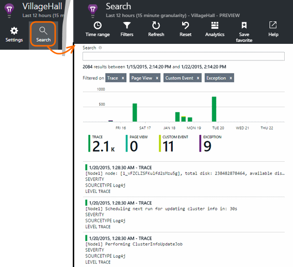

# Explore Java trace logs in Application Insights
If you're using Logback or Log4J (v1.2 or v2.0) for tracing, you can have your trace logs sent automatically to Application Insights where you can explore and search on them.

## Install the Java SDK

Install [Application Insights SDK for Java][java], if you haven't already done that.

(If you don't want to track HTTP requests, you can omit most of the .xml configuration file, but you must at least include the `InstrumentationKey` element. You should also call `new TelemetryClient()` to initialize the SDK.)


## Add logging libraries to your project
*Choose the appropriate way for your project.*

#### If you're using Maven...
If your project is already set up to use Maven for build, merge one of the following snippets of code into your pom.xml file.

Then refresh the project dependencies, to get the binaries downloaded.

*Logback*

```XML

    <dependencies>
       <dependency>
          <groupId>com.microsoft.azure</groupId>
          <artifactId>applicationinsights-logging-logback</artifactId>
          <version>[1.0,)</version>
       </dependency>
    </dependencies>
```

*Log4J v2.0*

```XML

    <dependencies>
       <dependency>
          <groupId>com.microsoft.azure</groupId>
          <artifactId>applicationinsights-logging-log4j2</artifactId>
          <version>[1.0,)</version>
       </dependency>
    </dependencies>
```

*Log4J v1.2*

```XML

    <dependencies>
       <dependency>
          <groupId>com.microsoft.azure</groupId>
          <artifactId>applicationinsights-logging-log4j1_2</artifactId>
          <version>[1.0,)</version>
       </dependency>
    </dependencies>
```

#### If you're using Gradle...
If your project is already set up to use Gradle for build, add one of the following lines to the `dependencies` group in your build.gradle file:

Then refresh the project dependencies, to get the binaries downloaded.

**Logback**

```

    compile group: 'com.microsoft.azure', name: 'applicationinsights-logging-logback', version: '1.0.+'
```

**Log4J v2.0**

```
    compile group: 'com.microsoft.azure', name: 'applicationinsights-logging-log4j2', version: '1.0.+'
```

**Log4J v1.2**

```
    compile group: 'com.microsoft.azure', name: 'applicationinsights-logging-log4j1_2', version: '1.0.+'
```

#### Otherwise ...
Download and extract the appropriate appender, then add the appropriate library to your project:

| Logger | Download | Library |
| --- | --- | --- |
| Logback |[SDK with Logback appender](https://aka.ms/xt62a4) |applicationinsights-logging-logback |
| Log4J v2.0 |[SDK with Log4J v2 appender](https://aka.ms/qypznq) |applicationinsights-logging-log4j2 |
| Log4j v1.2 |[SDK with Log4J v1.2 appender](https://aka.ms/ky9cbo) |applicationinsights-logging-log4j1_2 |

## Add the appender to your logging framework
To start getting traces, merge the relevant snippet of code to the Log4J or Logback configuration file: 

*Logback*

```XML

    <appender name="aiAppender" 
      class="com.microsoft.applicationinsights.logback.ApplicationInsightsAppender">
    </appender>
    <root level="trace">
      <appender-ref ref="aiAppender" />
    </root>
```

*Log4J v2.0*

```XML

    <Configuration packages="com.microsoft.applicationinsights.Log4j">
      <Appenders>
        <ApplicationInsightsAppender name="aiAppender" />
      </Appenders>
      <Loggers>
        <Root level="trace">
          <AppenderRef ref="aiAppender"/>
        </Root>
      </Loggers>
    </Configuration>
```

*Log4J v1.2*

```XML

    <appender name="aiAppender" 
         class="com.microsoft.applicationinsights.log4j.v1_2.ApplicationInsightsAppender">
    </appender>
    <root>
      <priority value ="trace" />
      <appender-ref ref="aiAppender" />
    </root>
```

The Application Insights appenders can be referenced by any configured logger, and not necessarily by the root logger (as shown in the code samples above).

## Explore your traces in the Application Insights portal
Now that you've configured your project to send traces to Application Insights, you can view and search these traces in the Application Insights portal, in the [Search][diagnostic] blade.



## Next steps
[Diagnostic search][diagnostic]

<!--Link references-->

[diagnostic]: app-insights-diagnostic-search.md
[java]: app-insights-java-get-started.md


