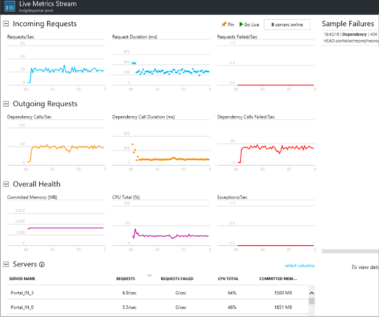
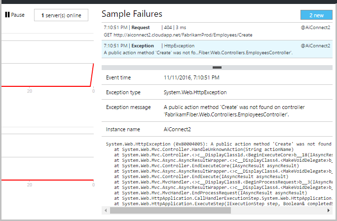

# Live Metrics Stream: instant metrics for close monitoring
Live Metrics Stream shows you your [Application Insights](app-insights-overview.md) metrics right at this very moment, with a near-real-time latency of one second. This immediate monitoring is very useful when you’re releasing a new build and want to make sure that everything is working as expected, or investigating an incident in real time.

Unlike [Metrics Explorer](app-insights-metrics-explorer.md), Live Metrics Stream displays a fixed set of metrics. The data persists only for as long as it's on the chart, and is then discarded.

Live Metrics Stream data is free: it doesn't add to your bill. It is available for ASP.NET and Java applications.

 [Live Metrics Stream video](https://www.youtube.com/watch?v=zqfHf1Oi5PY)

## Live failures

If any failures or exceptions are logged, Live Stream picks out a sample of them. Click **Pause** to hold a specific sample, and select an event to show its details.

Live Metrics Stream is available with the latest version of [Application Insights SDK for web](https://www.nuget.org/packages/Microsoft.ApplicationInsights.Web/).

## Filter by server instance

If you want to monitor a particular server role instance, you can filter by server.

## Troubleshooting

No data? Live Metrics Stream uses a different port than other Application Insights telemetry. Make sure [those ports](app-insights-ip-addresses.md) are open in your firewall.

## Next steps
* [Monitoring usage with Application Insights](app-insights-web-track-usage.md)
* [Using Diagnostic Search](app-insights-diagnostic-search.md)

