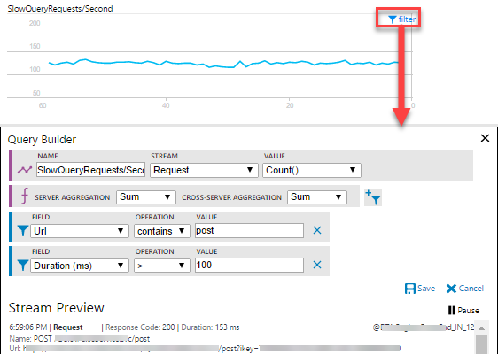
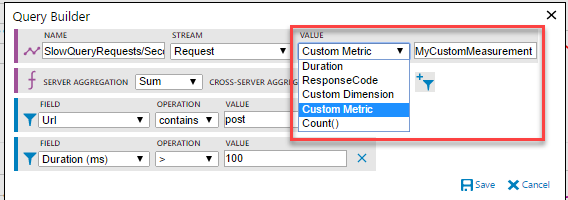

# Custom Live Metrics and Events: Monitor & Diagnose with 1-second latency 
Live Metrics Stream shows you your [Application Insights](app-insights-overview.md) metrics and events with a near-real-time latency of one second. This instant monitoring helps to reduce Mean Time To Detect and Diagnose, and help you meet SLAs. You can:
* Monitor custom KPIs live: Experiment with filters, slicing & dicing your existing Application Insights telemetry to get the most relevant KPIs instantly from the portal. No code or config changes, or deployments necessary. Any custom metrics or measurements you may be sending are available as well.
* Live Detect and Diagnose: See request and dependency failures as they happen along with detailed exception traces. Filter out any known issues to focus on real/new ones.
* Live Debugging: Repro an issue and see all related telemetry live, with custom filtering down to a specific session ID (or with any custom attributes) that identifies the repro interaction. Collect information from any/all servers to get a head start into fixing the issue.
* Instantly see how your resource consumption reacts to load: Monitor *any* windows performance counter live, as you run load tests, or monitor production to act before anything is adversely affected. No config changes, or deployments required.
* Validate a fix being released. Ensure update to your service is going well as it happens. Validate that the failure you fixed no longer happen.
* Easily identify a server that is having issues, and filter all the KPI/live feed to just that server.

Live Metrics & Events Stream data is free: it doesn't add to your bill. The data is streamed from your servers on-demand when you open the portal experience. The data persists only for as long as it's on the chart, and is then discarded. The full functionality is available for ASP.NET classic applications, and .NET core applications only have a fixed set of live metrics and sample failures currently. We are getting all supported SDKs up to par for the latest live streaming capabilities. 

We collect the live stream from your application instances before any sampling, or any custom TelemetryProcessors are applied. 

 [Live Metrics Stream video](https://www.youtube.com/watch?v=zqfHf1Oi5PY)

Access live metrics & events by clicking either the option in the left, or the button on the Overview blade:


## Custom Live KPI
You can monitor custom KPI live by applying arbitrary filters on any Application Insights telemetry from the portal. Click the filter control that shows when you mouse-over any of the charts. The following chart is plotting a custom Request count KPI with filters on URL and Duration attributes. Validate your filters with the Stream Preview section that shows a live feed of telemetry that matches the criteria you have specified at any point in time. 



You can monitor a value different from Count. The options depend on the type of stream, which could be any Application Insights telemetry: requests, dependencies, exceptions, traces, events, or metrics. It can be your own [custom measurement](app-insights-api-custom-events-metrics.md#properties):



In addition to Application Insights telemetry, you can also monitor any Windows performance counter by selecting that from the stream options, and providing the name of the performance counter.

Live metrics are aggregated at two points: locally on each server, and then across all servers. You can change the default at either by selecting other options in the respective drop-downs.

## Sample Telemetry: Custom Live Diagnostic Events
By default, the live feed of events shows samples of failed requests and dependency calls, exceptions, events, and traces. Click the filter icon to see the applied criteria at any point in time. 


As with metrics, you can specify any arbitrary criteria to any of the Application Insights telemetry types. In this example, we are selecting specific request failures, traces, and events. We are also selecting all exceptions and dependency failures.


Note: Currently, for Exception message-based criteria, use the outermost exception message. In the preceding example, to filter out the benign exception with inner exception message (follows the "<--" delimiter) "The client disconnected." use a message not-contains "Error reading request content" criteria.

See the details of an item in the live feed by clicking it. You can pause the feed either by clicking **Pause** or simply scrolling down, or clicking an item. Live feed will resume after you scroll back to the top, or by clicking the counter of items collected while it was paused.


## Filter by server instance

If you want to monitor a particular server role instance, you can filter by server.


## SDK Requirements
Custom Live Metrics Stream is available with version 2.4.0-beta2 or newer of [Application Insights SDK for web](https://www.nuget.org/packages/Microsoft.ApplicationInsights.Web/). Remember to select "Include Prerelease" option from NuGet package manager.

## Authenticated Channel
The custom filters criteria you specify are sent back to the Live Metrics component in the Application Insights SDK. The filters could potentially contain sensitive information such as customerIDs. You can make the channel secure with a secret API key in addition to the instrumentation key.
### Create an API Key


### Add API key to Configuration
In the applicationinsights.config file, add the AuthenticationApiKey to the QuickPulseTelemetryModule:
``` XML

<Add Type="Microsoft.ApplicationInsights.Extensibility.PerfCounterCollector.QuickPulse.QuickPulseTelemetryModule, Microsoft.AI.PerfCounterCollector">
      <AuthenticationApiKey>YOUR-API-KEY-HERE</AuthenticationApiKey>
</Add> 

```
Or in code, set it on the QuickPulseTelemetryModule:

``` C#

    module.AuthenticationApiKey = "YOUR-API-KEY-HERE";

```

However, if you recognize and trust all the connected servers, you can try the custom filters without the authenticated channel. This option is available for six months. This override is required once every new session, or when a new server comes online.


>[!NOTE]
>We strongly recommend that you set up the authenticated channel before entering potentially sensitive information like CustomerID in the filter criteria.
>

## Troubleshooting

No data? If your application is in a protected network: Live Metrics Stream uses a different IP addresses than other Application Insights telemetry. Make sure [those IP addresses](app-insights-ip-addresses.md) are open in your firewall.


## Next steps
* [Monitoring usage with Application Insights](app-insights-web-track-usage.md)
* [Using Diagnostic Search](app-insights-diagnostic-search.md)

