<properties 
	pageTitle="Exploring Metrics in Application Insights" 
	description="How to interpret charts on metric explorer, and how to customize metric explorer blades." 
	services="application-insights" 
    documentationCenter=""
	authors="alancameronwills" 
	manager="douge"/>

<tags 
	ms.service="application-insights" 
	ms.workload="tbd" 
	ms.tgt_pltfrm="ibiza" 
	ms.devlang="na" 
	ms.topic="article" 
	ms.date="02/06/2016" 
	ms.author="awills"/>
 
# Exploring Metrics in Application Insights

Metrics in [Application Insights][start] are measured values and counts of events that are sent in telemetry from your application. They help you detect performance issues and watch trends in how your application is being used. There's a wide range of standard metrics, and you can also create your own custom metrics and events.

Metrics and event counts are displayed in charts of aggregated values such as sums, averages, or counts.

Here's a sample chart:

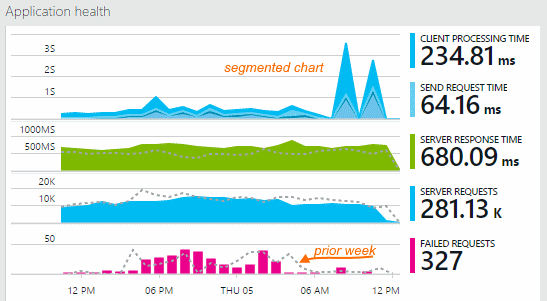

Some charts are segmented: the total height of the chart at any point is the sum of the metrics displayed. The legend by default shows the largest quantities.

Dotted lines show the value of the metric one week previously.

## Time range

You can change the Time range covered by the charts or grids on any blade.

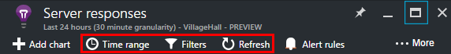

If you're expecting some data that hasn't appeared yet, click Refresh. Charts refresh themselves at intervals, but the intervals are longer for larger time ranges. In release mode, it can take a while for data to come through the analysis pipeline onto a chart.

To zoom into part of a chart, drag over it and then click the magnifier symbol:

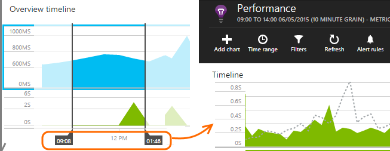

## Granularity and point values

Hover your mouse over the chart to display the values of the metrics at that point.

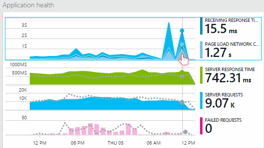

The value of the metric at a particular point is aggregated over the preceding sampling interval. 

The sampling interval or "granularity" is shown at the top of the blade. 

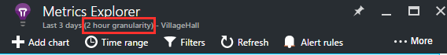

You can adjust the granularity in the Time range blade:

The granularities available depend on the time range you select. The explicit granularities are alternatives to the "automatic" granularity for the time range. 

## Metrics Explorer

Click through any chart on the overview blade to see a more detailed set of related charts and grids. You can edit these charts and grids to focus on the details you're interested in.

Or you can just click the Metrics Explorer button in the head of the overview blade.

For example, click through the web app's Failed Requests chart:

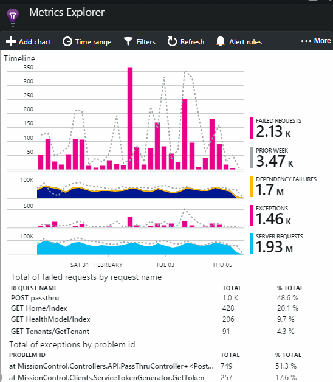

## What do the figures mean?

The legend at the side by default usually shows the aggregated value over the period of the chart. If you hover over the chart, it shows the value at that point.

Each data point on the chart is an aggregate of the data values received in the preceding sampling interval or "granularity". The granularity is shown at the top of the blade, and varies with the overall timescale of the chart.

Metrics can be aggregated in different ways: 

 * **Sum** adds up the values of all the data points received over the sampling interval, or the period of the chart.
 * **Average** divides the Sum by the number of data points received over the interval.
 * **Unique** counts are used for counts of users and accounts. Over the sampling interval, or over the period of the chart, the figure shows the count of different users seen in that time.

You can change the aggregation method:

The default method for each metric is shown when you create a new chart:

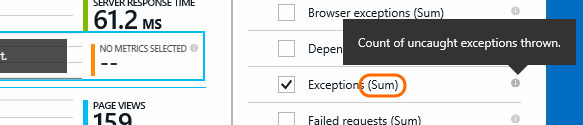

## Editing charts and grids

To add a new chart to the blade:

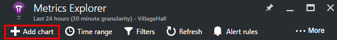

Select **Edit** on an existing or new chart to edit what it shows:

You can display more than one metric on a chart, though there are restrictions about the combinations that can be displayed together. As soon as you choose one metric, some of the others are disabled. 

If you coded [custom metrics][track] into your app (calls to TrackMetric and TrackEvent) they will be listed here.

## Segment your data

You can split a metric by property - for example, to compare page views on clients with different operating systems. 

Select a chart or grid, switch on grouping and pick a property to group by:

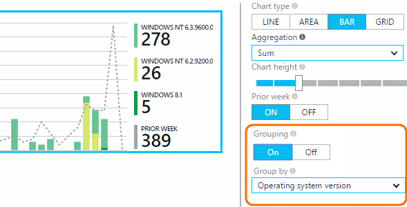

> [AZURE.NOTE] When you use grouping, the Area and Bar chart types provide a stacked display. This is suitable where the Aggregation method is Sum. But where the aggregation type is Average, choose the Line or Grid display types. 

If you coded [custom metrics][track] into your app and they include property values, you'll be able to select the property in the list.

Is the chart too small for segmented data? Adjust its height:

## Filter your data

To see just the metrics for a selected set of property values:

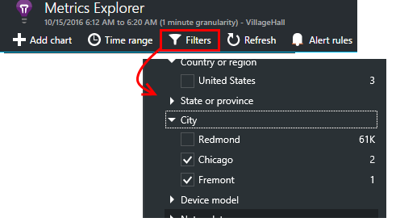

If you don't select any values for a particular property, it's the same as selecting them all: there is no filter on that property.

Notice the counts of events alongside each property value. When you select values of one property, the counts alongside other property values are adjusted.

Filters apply to all the charts on a blade. If you want different filters applied to different charts, create and save different metrics blades. If you want, you can pin charts from different blades to the dashboard, so that you can see them alongside each other.

### Remove bot and web test traffic

Use the filter **Real or synthetic traffic** and check **Real**.

You can also filter by **Source of synthetic traffic**.

### To add properties to the filter list

Would you like to filter telemetry on a category of your own choosing? For example, maybe you divide up your users into  different categories, and you would like segment your data by these categories.

[Create your own property](app-insights-api-custom-events-metrics.md#properties). Set it in a [Telemetry Initializer](app-insights-api-custom-events-metrics.md#telemetry-initializers) to have it appear in all telemetry - including the standard telemetry sent by different SDK modules.

## Edit the chart type

Notice that you can switch between grids and graphs:

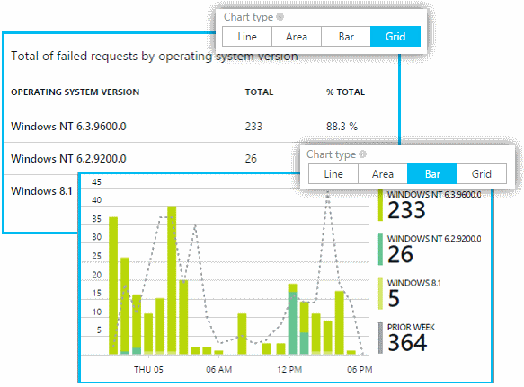

## Save your metrics blade

When you've created some charts, save them as a favorite. You can choose whether to share it with other team members, if you use an organizational account.

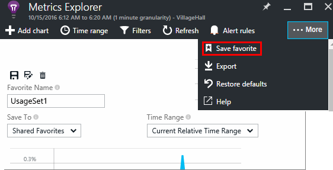

To see the blade again, **go to the overview blade** and open Favorites:

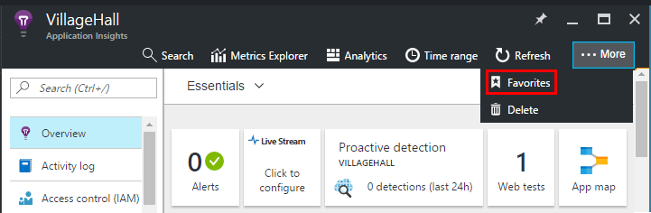

If you chose Relative time range when you saved, the blade will be updated with the latest metrics. If you chose Absolute time range, it will show the same data every time.

## Reset the blade

If you edit a blade but then you'd like to get back to the original saved set, just click Reset.

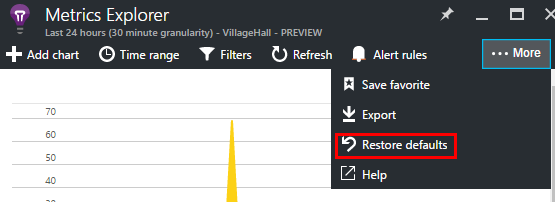

## Live Metrics Stream: instant metrics for close monitoring

Live Metrics Stream shows you your application metrics right at this very moment, with a near real time latency of 1 second. This is extremely useful when you’re releasing a new build and want to make sure that everything is working as expected, or investigating an incident in real time.

Unlike Metrics Explorer, Live Metrics Stream displays a fixed set of metrics. The data persists only for as long as it's on the chart, and is then discarded. 

Live Metrics Stream is available with Application Insights SDK for ASP.NET, version 2.1.0 or later.

## Set alerts

To be notified by email of unusual values of any metric, add an alert. You can choose either to send the email to the account administrators, or to specific email addresses.

[Learn more about alerts][alerts].

## Export to Excel

You can export metric data that is displayed in Metric Explorer to an Excel file. The exported data includes data from all charts and tables as seen in the portal. 

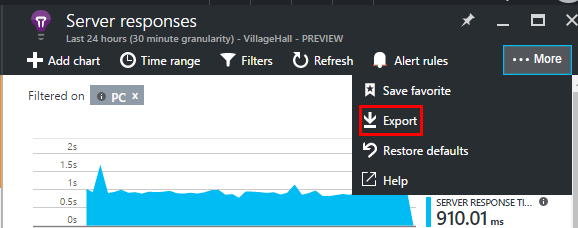

The data for each chart or table is exported to a separate sheet in the Excel file.

What you see is what gets exported. Change the time range or filters if you want to change the range of data exported. For tables, if the **load more** command is showing, you can click it before you click Export, to have more data exported.

*Export works only for Internet Explorer and Chrome at present. We're working on adding support for other browsers.*

## Continuous Export

If you want data continuously exported so that you can process it externally, consider using [Continuous export](app-insights-export-telemetry.md).

### Power BI

If you want even richer views of your data, you can [export to Power BI](http://blogs.msdn.com/b/powerbi/archive/2015/11/04/explore-your-application-insights-data-with-power-bi.aspx).

## Analytics

[Analytics](app-insights-analytics.md) is a more versatile way to analyze your telemetry using a powerful query language. Use it if you want to combine or compute results from metrics, or perform an in-deph exploration of your app's recent performance. On the other hand, use Metrics Explorer if you want automatic refresh, charts on the dashboard, and alerts.

## Troubleshooting

*I don't see any data on my chart.*

* Filters apply to all the charts on the blade. Make sure that, while you're focusing on one chart, you didn't set a filter that excludes all the data on another. 

    If you want to set different filters on different charts, create them in different blades, save them as separate favorites. If you want, you can pin them to the dashboard so that you can see them alongside each other.

* If you group a chart by a property that is not defined on the metric, then there will be nothing on the chart. Try clearing 'group by', or choose a different grouping property.
* Performance data (CPU, IO rate, and so on) is available for Java web services, Windows desktop apps, [IIS web apps and services if you install status monitor](app-insights-monitor-performance-live-website-now.md), and [Azure Cloud Services](app-insights-azure.md). It isn't available for Azure websites.

## Next steps

* [Monitoring usage with Application Insights](app-insights-overview-usage.md)
* [Using Diagnostic Search](app-insights-diagnostic-search.md)

<!--Link references-->

[alerts]: app-insights-alerts.md
[start]: app-insights-overview.md
[track]: app-insights-api-custom-events-metrics.md

 