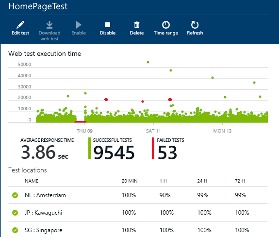
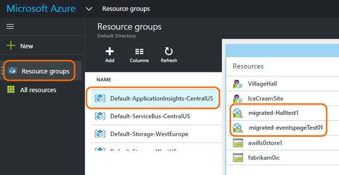
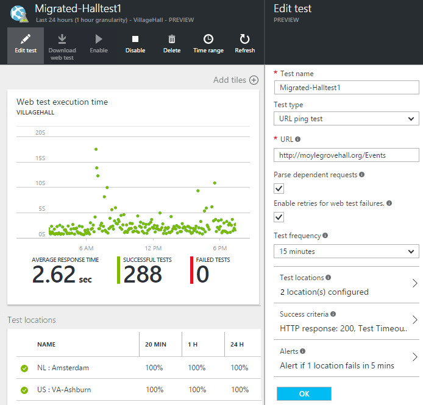

<properties 
	pageTitle="Migrate Azure Endpoint to Application Insights Availability Tests" 
	description="We are moving your classic Azure Endpoint Monitoring tests into Application Insights availability tests. We expect to switch over to them during the week of August 22, 2016."
	services="application-insights" 
    documentationCenter=""
	authors="soubhagyadash" 
	manager="douge"/>

<tags 
	ms.service="application-insights" 
	ms.workload="tbd" 
	ms.tgt_pltfrm="ibiza" 
	ms.devlang="na" 
	ms.topic="article" 
	ms.date="07/25/2016" 
	ms.author="awills"/>
 
# Moving from Azure Endpoint Monitoring to Application Insights Availability Tests

Do you use [Endpoint monitoring](https://blogs.msdn.microsoft.com/mast/2013/03/03/windows-azure-portal-update-configure-web-endpoint-status-monitoring-preview/) for your Azure apps? During the week of August 22, 2016, we'll replace them with the new and more powerful [Availability tests](app-insights-monitor-web-app-availability.md). We have already created some of the new tests, although they're disabled until August 22nd 2016. 

You can edit the new tests and do the switch yourself if you want. You'll find them [Azure portal](https://portal.azure.com) in the Default-ApplicationInsights-CentralUS resource group.

## What are Availability tests?

Availability testing is a feature of Azure that continually checks that any web site or service is up and running by sending HTTP requests to it (single ping tests or Visual Studio web tests) from up to 16 locations worldwide. 

In the [classic Azure portal](https://manage.windowsazure.com), these tests were called Endpoint Monitoring. They were more limited in scope. The new availability tests are a substantial improvement:

* Up to 10 Visual Studio web tests or ping tests per Application Insights resource. 
* Up to 16 locations worldwide to send test requests to your web app. Greater control of test success criteria. 
* Test any web site or service - not just Azure web apps.
* Test retries: reduce false-positive alerts due to transient network issues. 
* Webhooks can receive HTTP POST notifications for the alerts.

Read more about [Availability tests here](app-insights-monitor-web-app-availability.md).

Availability tests are part of [Visual Studio Application Insights](app-insights-overview.md), which is an extensible analytics service for any web application.

## So what's happening to my endpoint tests?

* We have copied your endpoint monitoring tests to the new Application Insights Availability tests.
* The new Availability tests are currently disabled, and the old Endpoint tests are still running.
* The alerting rules have *not* been migrated. The new tests have initially been set up with a default rule:
 * Triggers when more than 1 location reports failures in 5 minutes.
 * Sends email to the subscription admins.

In the [Azure portal](https://portal.azure.com), you can find the migrated tests in the "Default-ApplicationInsights-CentralUS" resource group. The test names are prefixed "Migrated-". 

## What do I need to do?

* If we somehow missed migrating your tests, the new availability tests are [easy to set up](app-insights-monitor-web-app-availability.md).

### Option A: Do nothing. Leave it to us.

**During the week of August 22nd, 2016,** we will:

* Disable the old endpoint tests.
* Enable the migrated Availability tests.

### Option B: You manage and/or enable the new tests.

* Review and edit the new Availability tests in the new [Azure portal](https://portal.azure.com). 
 * Review the trigger criteria
 * Review the email recipients
* Enable the new tests
* Delete the old endpoint tests [in the classic portal](https://manage.windowsazure.com). We recommend this to avoid duplicate alerts and reduce the load of test traffic on your web site. If not, we'll delete them on August 22nd, 2016.

### Option C: Opt out

If you don't want to use Availability tests, you can delete them in [Azure portal](https://portal.azure.com). There's also an Unsubscribe link at the bottom of the notification emails.

We will still delete the old endpoint tests on August 22nd, 2016. 

## How do I edit the new tests?

Sign in to the [Azure portal](https://portal.azure.com) and find the 'Migrated-' web tests: 

Edit and/or enable the test:

## Why is this happening?

Better service. The old endpoint service was much narrower. You could provide just two URLs for simple ping tests from 3  geo locations on an Azure VM or web app. The new tests can run multi-step web tests from up to 16 locations, and you can specify up to 10 tests for one application. You can test any URL - it doesn't have to be an Azure site.

The new tests are configured separately from the web app or VM that you're testing. 

We are migrating the tests to ensure you continue to have control over them while using the new portal. 

## What is Application Insights?

The new availability tests are part of [Visual Studio Application Insights](app-insights-overview.md). Here's a [2-minute video](http://go.microsoft.com/fwlink/?LinkID=733921).

## Am I paying for the new tests?

The migrated tests are set up in an Application Insights resource in the default Free plan. This allows collection of up to 5 million data points. That easily covers the data volume your tests will use currently. 

Of course, if you like Application Insights and create more availability tests, or adopt more of its performance monitoring and diagnostic features, then you'll generate more data points.  However, the result would only be that you might hit the quota for the Free plan. You will not receive a bill unless you opt in for the Standard or Premium plans. 

[Learn more about Application Insights pricing and quota monitoring](app-insights-pricing.md). 

## What is and isn't migrated?

Preserved from your old endpoint tests:

* Endpoint URL to be tested.
* Geo locations from which the requests are sent.
* Test frequency remains 5 minutes.
* Test timeout remains 30 seconds. 

Not migrated:

* Alert trigger rule. The rule we have set up triggers when 1 location reports failures in 5 minutes.
* Alert recipients. Notification emails will be sent to the subscription owners and co-owners. 

## How do I find the new tests?

You can edit any of the new tests now if you want. Sign in to the [Azure portal](https://portal.azure.com), open **Resource Groups** and select **Default-ApplicationInsights-CentralUS**. In that group, you'll find the new web tests. [Learn about the new availability tests](app-insights-monitor-web-app-availability.md).

Please note that the new alert emails will be sent from this address: App Insights Alerts (ai-noreply@microsoft.com)

## What happens if I do nothing?

Option A will apply. We will enable the migrated tests, and set up the default alert rules as mentioned above. You will have to add any custom alert rules, recipients as mentioned above. We will disable the legacy endpoint monitoring tests. 

## Where can I provide feedback on this? 

We appreciate your feedback. Please [email us](mailto:vsai@microsoft.com). 

