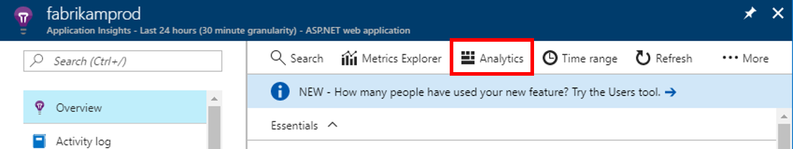
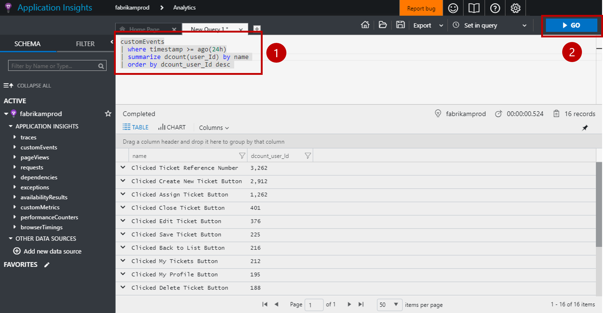
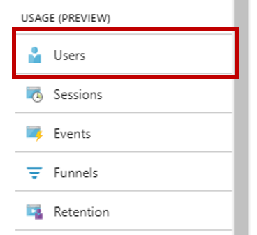
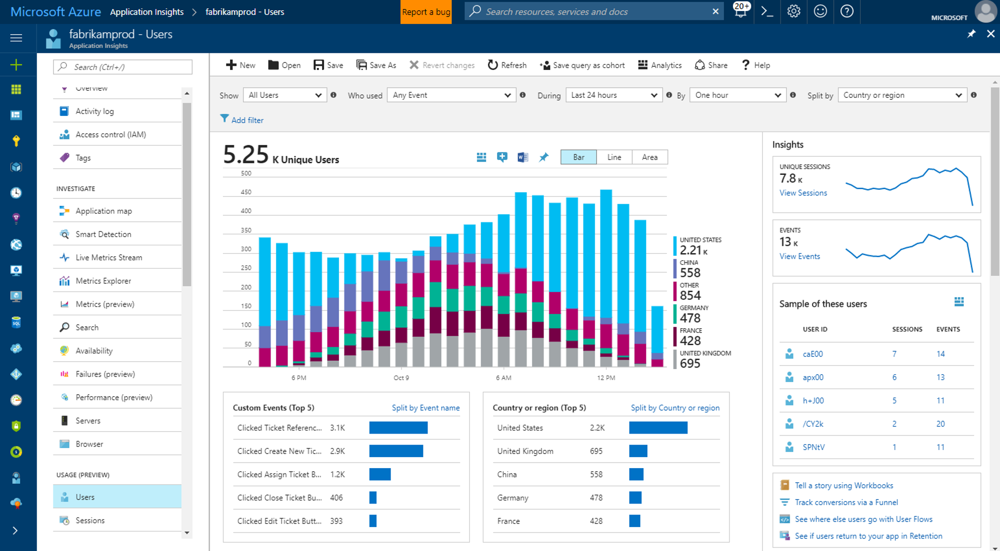
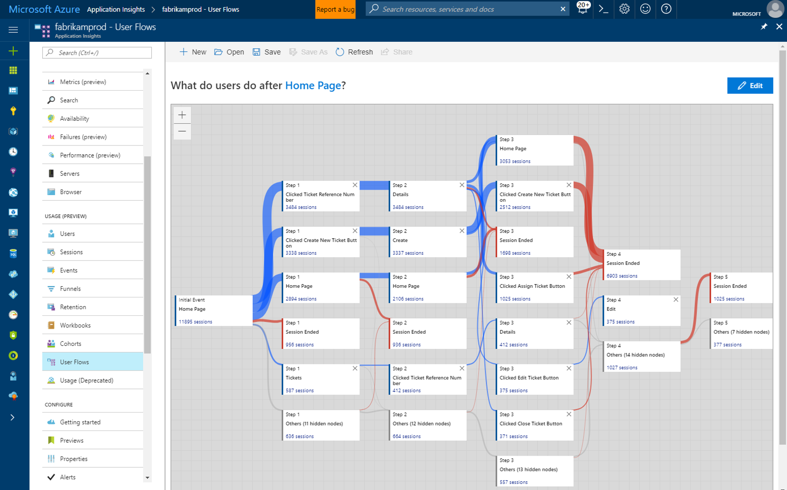

# Start analyzing your mobile app with App Center and Application Insights

This quickstart guides you through connecting your app's App Center instance to Application Insights. With Application Insights, you can query, segment, filter, and analyze your telemetry with more powerful tools than are available from the [Analytics](https://docs.microsoft.com/mobile-center/analytics/) service of App Center.

## Prerequisites

To complete this quickstart, you need:

- An Azure subscription.
- An iOS, Android, Xamarin, Universal Windows, or React Native app.
 
If you don't have an Azure subscription, create a [free](https://azure.microsoft.com/free/) account before you begin.

## Onboard to App Center

Before you can use Application Insights with your mobile app, you need to onboard your app to [App Center](https://docs.microsoft.com/mobile-center/). Application Insights does not receive telemetry from your mobile app directly. Instead, your app sends custom event telemetry to App Center. Then, App Center continuously exports copies of these custom events into Application Insights as the events are received.

To onboard your app, follow the App Center quickstart for each platform your app supports. Create separate App Center instances for each platform:

* [iOS](https://docs.microsoft.com/mobile-center/sdk/getting-started/ios).
* [Android](https://docs.microsoft.com/mobile-center/sdk/getting-started/android).
* [Xamarin](https://docs.microsoft.com/mobile-center/sdk/getting-started/xamarin).
* [Universal Windows](https://docs.microsoft.com/mobile-center/sdk/getting-started/uwp).
* [React Native](https://docs.microsoft.com/mobile-center/sdk/getting-started/react-native).

## Track events in your app

After your app is onboarded to App Center, it needs to be modified to send custom event telemetry using the App Center SDK. Custom events are the only type of App Center telemetry that is exported to Application Insights.

To send custom events from iOS apps, use the `trackEvent` or `trackEvent:withProperties` methods in the App Center SDK. [Learn more about tracking events from iOS apps.](https://docs.microsoft.com/mobile-center/sdk/analytics/ios)

```Swift
MSAnalytics.trackEvent("Video clicked")
```

To send custom events from Android apps, use the `trackEvent` method in the App Center SDK. [Learn more about tracking events from Android apps.](https://docs.microsoft.com/mobile-center/sdk/analytics/android)

```Java
Analytics.trackEvent("Video clicked")
```

To send custom events from other app platforms, use the `trackEvent` methods in their App Center SDKs.

To make sure your custom events are being received, go to the **Events** tab under the **Analytics** section in App Center. It can take a couple minutes for events to show up from when they're sent from your app.

## Create an Application Insights resource

Once your app is sending custom events and these events are being received by App Center, you need to create an App Center-type Application Insights resource in the Azure portal:

1. Log in to the [Azure portal](https://portal.azure.com/).
2. Select **Create a resource** > **Management Tools** > **Application Insights**.

    

    A configuration box will appear. Use the table below to fill out the input fields.

    | Settings        |  Value           | Description  |
   | ------------- |:-------------|:-----|
   | **Name**      | Some globally unique value, like "myApp-iOS" | Name that identifies the app you are monitoring |
   | **Application Type** | App Center application | Type of app you are monitoring |
   | **Resource Group**     | A new resource group, or an existing one from the menu | The resource group in which to create the new Application Insights resource |
   | **Location** | A location from the menu | Choose a location near you, or near where your app is hosted |

3. Click **Create**.

If your app supports multiple platforms (iOS, Android, etc.), it's best to create separate Application Insights resources, one for each platform.

## Export to Application Insights

In your new Application Insights resource on the **Overview** page in the **Essentials** section at the top, copy the instrumentation key for this resource.

In the App Center instance for your app:

1. On the **Settings** page, click **Export**.
2. Choose **New Export**, pick **Application Insights**, then click **Customize**.
3. Paste your Application Insights instrumentation key into the box.
4. Consent to increasing the usage of the Azure subscription containing your Application Insights resource. Each Application Insights resource is free for the first 1 GB of data received per month. [Learn more about Application Insights pricing.](https://azure.microsoft.com/pricing/details/application-insights/)

Remember to repeat this process for each platform your app supports.

Once [export](https://docs.microsoft.com/mobile-center/analytics/export) is set up, each custom event received by App Center is copied into Application Insights. It can take several minutes for events to reach Application Insights, so if they don't show up immediately, wait a bit before diagnosing further.

To give you more data when you first connect, the most recent 48 hours of custom events in App Center are automatically exported to Application Insights.

## Start monitoring your app

Application Insights can query, segment, filter, and analyze the custom event telemetry from your apps, beyond the analytics tools App Center provides.

1. **Query your custom event telemetry.** From the Application Insights **Overview** page, choose **Analytics**. 

   

   The Application Insights Analytics portal associated with your Application Insights resource will open. The Analytics portal lets you directly query your data using the Log Analytics query language, so you can ask arbitrarily complex questions about your app and its users.
   
   Open a new tab in the Analytics portal, then paste in the following query. It returns a count of how many distinct users have sent each custom event from your app in the last 24 hours, sorted by these distinct counts.

   ```AIQL
   customEvents
   | where timestamp >= ago(24h)
   | summarize dcount(user_Id) by name 
   | order by dcount_user_Id desc 
   ```

   

   1. Select the query by clicking anywhere on the query in the text editor.
   2. Then click **Go** to run the query. 

   Learn more about [Application Insights Analytics](app-insights-analytics.md) and the [Log Analytics query language](https://aka.ms/LogAnalyticsLanguageReference).


2. **Segment and filter your custom event telemetry.** From the Application Insights **Overview** page, choose **Users** in the table of contents.

   

   The Users tool shows how many users of your app clicked certain buttons, visited certain screens, or performed any other action that you are tracking as an event with the App Center SDK. If you've been looking for a way to segment and filter your App Center events, the Users tool is a great choice.

    

   For example, segment your usage by geography by choosing **Country or region** in the **Split by** dropdown menu.

3. **Analyze conversion, retention, and navigation patterns in your app.** From the Application Insights **Overview** page, choose **User Flows** in the table of contents.

   

   The User Flows tool visualizes which events users send after some starting event. It's useful for getting an overall picture of how users navigate through your app. It can also reveal places where many users are churning from your app, or repeating the same actions over and over.

   In addition to User Flows, Application Insights has several other user behavior analytics tools to answer specific questions:

   * **Funnels** for analyzing and monitoring conversion rates.
   * **Retention** for analyzing how well your app retains users over time.
   * **Workbooks** for combining visualizations and text into a shareable report.
   * **Cohorts** for naming and saving specific groups of users or events so they can be easily referenced from other analytics tools.

## Clean up resources

If you do not want to continue using Application Insights with App Center, turn off export in App Center and delete the Application Insights resource. This will prevent you from being charged further by Application Insights for this resource.

To turn off export in App Center:

1. In App Center, go to **Settings** and choose **Export**.
2. Click the Application Insights export you want to delete, then click **Delete export** at the bottom and confirm.

To delete the Application Insights resource:

1. In the left-hand menu of the Azure portal, click **Resource groups** and then choose the resource group in which your Application Insights resource was created.
2. Open the Application Insights resource you want to delete. Then click **Delete** in the top menu of the resource and confirm. This will permanently delete the copy of the data that was exported to Application Insights.

## Next steps

> [!div class="nextstepaction"]
> [Understand how customers are using your app](app-insights-usage-overview.md)
