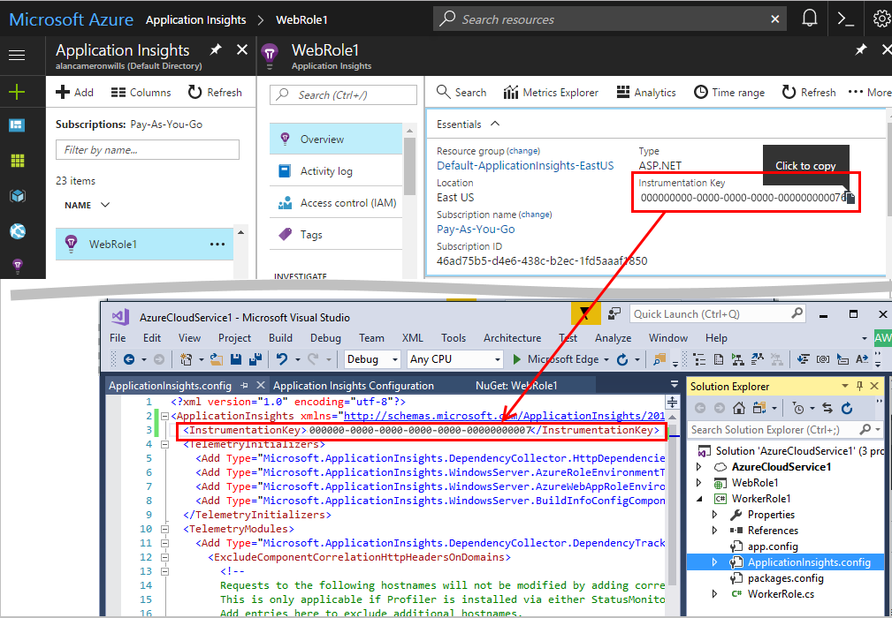
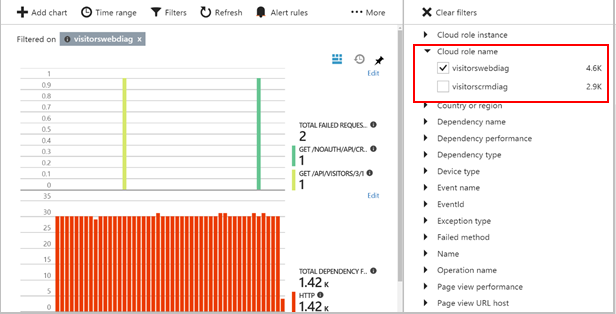
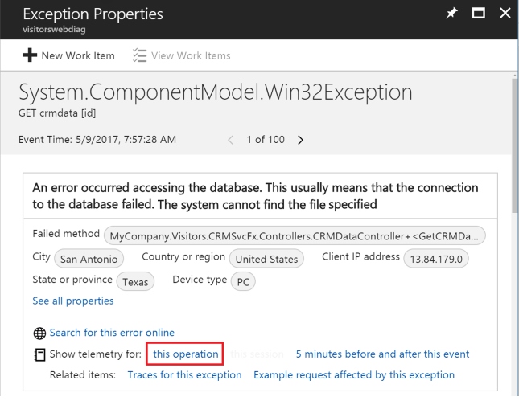
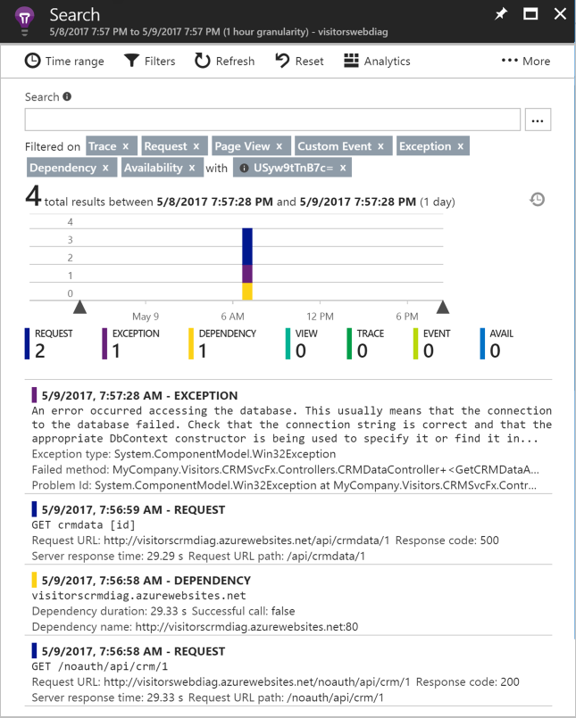

---
title: Azure Application Insights support for multiple components, microservices, and containers | Microsoft Docs
description: Monitoring apps that consist of multiple components or roles for performance and usage.
services: application-insights
documentationcenter: ''
author: mrbullwinkle
manager: carmonm

ms.service: application-insights
ms.workload: tbd
ms.tgt_pltfrm: ibiza
ms.devlang: na
ms.topic: conceptual
ms.date: 09/17/2018
ms.author: mbullwin

---
# Monitor multi-component applications with Application Insights (preview)

You can monitor apps that consist of multiple server components, roles, or services with [Azure Application Insights](app-insights-overview.md). The health of the components and the relationships between them are displayed on a single Application Map. You can trace individual operations through multiple components with automatic HTTP correlation. Container diagnostics can be integrated and correlated with application telemetry. Use a single Application Insights resource for all the components of your application. 


We use 'component' here to mean any functioning part of a large application. For example, a typical business application may consist of client code running in web browsers, talking to one or more web app services, which in turn use back end services. Server components may be hosted on-premises on in the cloud, or may be Azure web and worker roles, or may run in containers such as Docker or Service Fabric. 

### Sharing a single Application Insights resource 

The key technique here is to send telemetry from every component in your application to the same Application Insights resource, but use the `cloud_RoleName` property to distinguish components when necessary. The Application Insights SDK adds the `cloud_RoleName` property to the telemetry components emit. For example, the SDK will add a web site name, or service role name to the `cloud_RoleName` property. You can override this value with a telemetryinitializer. The Application Map uses the `cloud_RoleName` property to identify the components on the map.

For more information about how do override the `cloud_RoleName` property see [Add properties: ITelemetryInitializer](app-insights-api-filtering-sampling.md#add-properties-itelemetryinitializer).  

In some cases, this may not be appropriate, and you may prefer to use separate resources for different groups of components. For example, you might need to use different resources for management or billing purposes.

With that caveat, we'll assume in the rest of this document that you want to send data from multiple components to one Application Insights resource.

## Configure multi-component applications

To get a multi-component application map, you need to achieve these goals:

* **Install the latest pre-release** Application Insights package in each component of the application. 
* **Share a single Application Insights resource** for all the components of your application.
* **Enable Composite Application Map** in the Previews blade.

Configure each component of your application using the appropriate method for its type. ([ASP.NET](app-insights-asp-net.md), [Java](app-insights-java-get-started.md), [Node.js](app-insights-nodejs.md), [JavaScript](app-insights-javascript.md).)

### 1. Install the latest pre-release package

Update or install the Application Insights packages in the project for each server component. If you're using Visual Studio:

1. Right-click a project and select **Manage NuGet Packages**. 
2. Select **Include prerelease**.
3. If Application Insights packages appear in Updates, select them. 

    Otherwise, browse for and install the appropriate package:
    
    * Microsoft.ApplicationInsights.WindowsServer
    * Microsoft.ApplicationInsights.ServiceFabric - for components running as guest executables and Docker containers running a in Service Fabric application
    * Microsoft.ApplicationInsights.ServiceFabric.Native - for reliable services in ServiceFabric applications
    * Microsoft.ApplicationInsights.Kubernetes for components running in Docker on Kubernetes

### 2. Share a single Application Insights resource

* In Visual Studio, right-click a project and select **Configure Application Insights**, or **Application Insights > Configure**. For the first project, use the wizard to create an Application Insights resource. For subsequent projects, select the same resource.
* If there is no Application Insights menu, configure manually:

   1. In [Azure portal](https://portal,azure.com), open the Application Insights resource you already created for another component.
   2. In the Overview blade, open the Essentials drop-down tab, and copy the **Instrumentation Key.**
   3. In your project, open ApplicationInsights.config and insert: `<InstrumentationKey>your copied key</InstrumentationKey>`




### 3. Enable Composite Application Map

In the Azure portal, open the resource for your application. Under the CONFIGURE sub-heading, click Previews to open the Previews blade. In the Previews blade, enable *Composite Application Map*.

### 4. Enable Docker metrics (Optional) 

If a component runs in a Docker hosted on an Azure Windows VM, you can collect additional metrics from the container. Insert this in your [Azure diagnostics](../monitoring-and-diagnostics/azure-diagnostics.md) configuration file:

```
"DiagnosticMonitorConfiguration": {
        ...
        "sinks": "applicationInsights",
        "DockerSources": {
                "Stats": {
                    "enabled": true,
                    "sampleRate": "PT1M"
                }
            },
        ...
    }
    ...   
    "SinksConfig": {
        "Sink": [{
            "name": "applicationInsights",
            "ApplicationInsights": "<your instrumentation key here>"
        }]
    }
    ...
}

```

## Use cloud_RoleName to separate components

The `cloud_RoleName` property is attached to all telemetry. It identifies the component - the role or service - that originates the telemetry. (It is not the same as cloud_RoleInstance, which separates identical roles that are running in parallel on multiple server processes or machines.)

In the portal, you can filter or segment your telemetry using this property. In this example, the Failures blade is filtered to show just information from the front-end web service, filtering out failures from the CRM API backend:



## Trace operations between components

You can trace from one component to another, the calls made while processing an individual operation.




Click through to a correlated list of telemetry for this operation across the front-end web server and the back-end API:




## Next steps

* [Separate telemetry from Development, Test, and Production](app-insights-separate-resources.md)
