<properties
	pageTitle="Diagnose performance issues on a running IIS website | Microsoft Azure"
	description="Monitor a website's performance without re-deploying it. Use standalone or with Application Insights SDK to get dependency telemetry."
	services="application-insights"
    documentationCenter=".net"
	authors="alancameronwills"
	manager="douge"/>

<tags
	ms.service="application-insights"
	ms.workload="tbd"
	ms.tgt_pltfrm="ibiza"
	ms.devlang="na"
	ms.topic="get-started-article"
	ms.date="07/28/2016"
	ms.author="awills"/>

# Instrument web apps at runtime with Application Insights

*Application Insights is in preview.*

You can instrument a live web app with Visual Studio Application Insights, without having to modify or redeploy your code. In your apps are hosted by an on-premises IIS server, you install Status Monitor; or if they're Azure web apps or run in an Azure VM, you can install the Application Insights extension. (There are also separate articles about instrumenting [live J2EE web apps](app-insights-java-live.md) and [Azure Cloud Services](app-insights-cloudservices.md).)

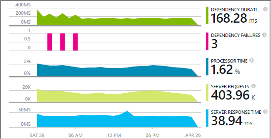

You have a choice of three ways to apply Application Insights to your .NET web applications:

* **Build time:** [Add the Application Insights SDK][greenbrown] to your web app code. 
* **Run time:** Instrument your web app on the server, as described below, without rebuilding and redeploying the code.
* **Both:** Build the SDK into your web app code, and also apply the run-time extensions. Get the best of both options. 

Here's a summary of what you get in each way:

||Build time|Run time|
|---|---|---|
|Requests & exceptions|Yes|Yes|
|[More detailed exceptions](app-insights-asp-net-exceptions.md)||Yes|
|[Dependency diagnostics](app-insights-asp-net-dependencies.md)|On .NET 4.6+|Yes|
|[System performance counters](app-insights-web-monitor-performance.md#system-performance-counters)||IIS or Azure cloud service, not Azure web app|
|[API for custom telemetry][api]|Yes||
|[Trace log integration](app-insights-asp-net-trace-logs.md)|Yes||
|[Page view & user data](app-insights-javascript.md)|Yes||
|No need to rebuild code|No||

## Instrument your web app at run time

You need a [Microsoft Azure](http://azure.com) subscription.

### If your app is hosted on your IIS server

1. On your IIS web server, sign in with administrator credentials.
2. Download and run the [Status Monitor installer](http://go.microsoft.com/fwlink/?LinkId=506648).
4. In the installation wizard, sign in to Microsoft Azure.

    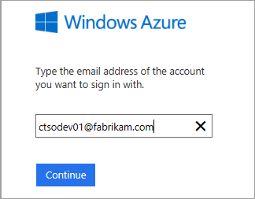

    *Connection errors? See [Troubleshooting](#troubleshooting).*

5. Pick the installed web application or website that you want to monitor, then configure the resource in which you want to see the results in the Application Insights portal.

    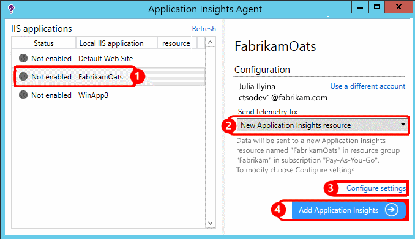

    Normally, you choose to configure a new resource and [resource group][roles].

    Otherwise, use an existing resource if you already set up [web tests][availability] for your site, or [web client monitoring][client].

6. Restart IIS.

    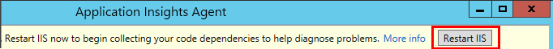

    Your web service will be interrupted for a short while.

6. Notice that ApplicationInsights.config has been inserted into the web apps that you want to monitor.

    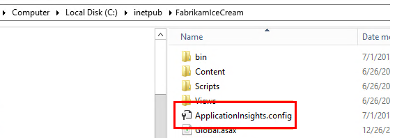

   There are also some changes to web.config.

#### Want to (re)configure later?

After you complete the wizard, you can re-configure the agent whenever you want. You can also use this if you installed the agent but there was some trouble with the initial setup.

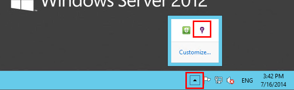

### If your app runs as an Azure Web App

1. In the [Azure portal](https://portal.azure.com), create an Application Insights resource with type ASP.NET. This will be where your application telemetry will be stored, analyzed and displayed.

    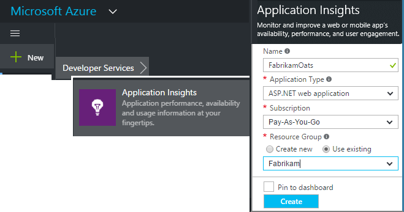
     
2. Now open the control blade of your Azure Web App, open **Tools > Performance Monitoring** add the Application Insights extension.

    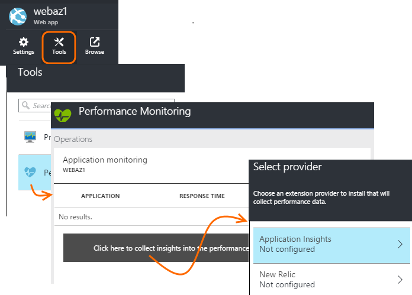

    Select the Application Insights resource you just created.

### If it's an Azure cloud services project

[Add scripts to web and worker roles](app-insights-cloudservices.md).

## View performance telemetry

Sign into [the Azure portal](https://portal.azure.com), browse Application Insights and open the resource that you created.

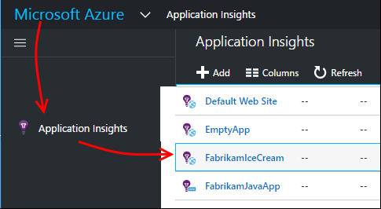

Open the Performance blade to see request, response time, dependency and other data.

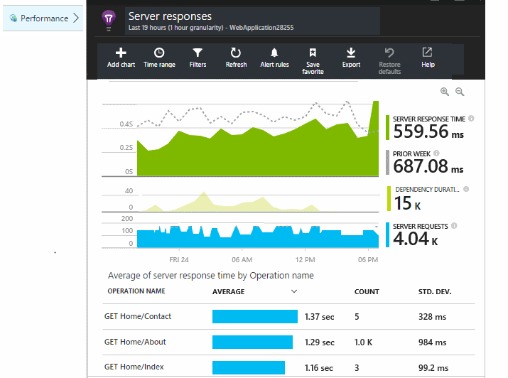

Click any chart to open a more detailed view.

You can [edit, rearrange, save](app-insights-metrics-explorer.md), and pin charts or the whole blade to a [dashboard](app-insights-dashboards.md).

## Dependencies

The Dependency Duration chart shows the time taken by calls from your app to external components such as databases, REST APIs, or Azure blob storage.

To segment the chart by calls to different dependencies: Edit the chart, turn on Grouping, and then group by Dependency, Dependency Type or Dependency Performance.

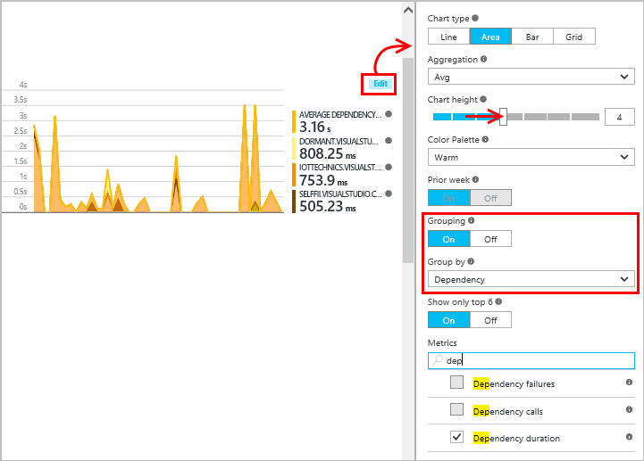

## Performance counters 

(Not for Azure web apps.) Click Servers on the overview blade to see charts of server performance counters such as CPU occupancy and memory usage.

If you have several server instances, you might want to edit the charts to group by Role instance.

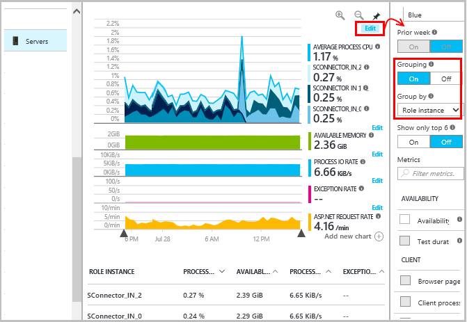

You can also [change the set of performance counters that are reported by the SDK](app-insights-configuration-with-applicationinsights-config.md#nuget-package-3). 

## Exceptions

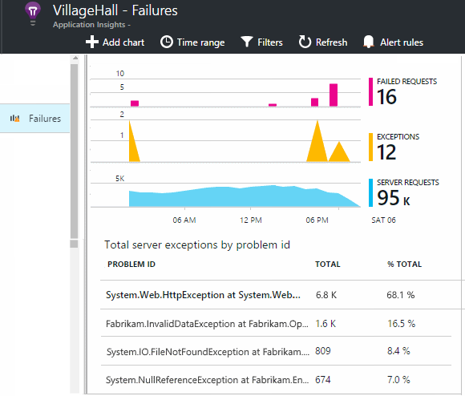

You can drill down to specific exceptions (from the last seven days) and get stack traces and context data.

## Sampling

If your application sends a lot of data and you are using the Application Insights SDK for ASP.NET version 2.0.0-beta3 or later, the adaptive sampling feature may operate and send only a percentage of your telemetry. [Learn more about sampling.](app-insights-sampling.md)

## Troubleshooting

### Connection errors

You need to open [some outgoing ports](app-insights-ip-addresses.md#outgoing-ports) in your server's firewall to allow Status Monitor to work.

### No telemetry?

  * Use your site, to generate some data.
  * Wait a few minutes to let the data arrive, then click **Refresh**.
  * Open Diagnostic Search (the Search tile) to see individual events. Events are often visible in Diagnostic Search before aggregate data appears in the charts.
  * Open Status Monitor and select your application on left pane. Check if there are any diagnostics messages for this application in the "Configuration notifications" section:

  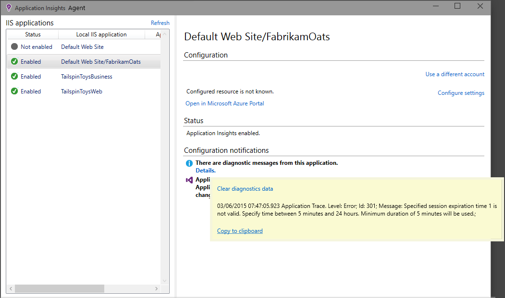

  * Make sure your server firewall allows outgoing traffic on the ports listed above.
  * On the server, if you see a message about "insufficient permissions", try the following:
    * In IIS Manager, select your application pool, open **Advanced Settings**, and under **Process Model** note the identity.
    * In Computer management control panel, add this identity to the Performance Monitor Users group.
  * If you have MMA/SCOM installed on your server, some versions can conflict. Uninstall both SCOM and Status Monitor, and re-install the latest versions.
  * See [Troubleshooting][qna].

## System Requirements

OS support for Application Insights Status Monitor on Server:

- Windows Server 2008
- Windows Server 2008 R2
- Windows Server 2012
- Windows server 2012 R2

with latest SP and .NET Framework 4.0 and 4.5

On the client side Windows 7, 8 and 8.1, again with .NET Framework 4.0 and 4.5

IIS support is: IIS 7, 7.5, 8, 8.5
(IIS is required)

## Automation with PowerShell

You can start and stop monitoring by using PowerShell.

First import the Application Insights module:

`Import-Module 'C:\Program Files\Microsoft Application Insights\Status Monitor\PowerShell\Microsoft.Diagnostics.Agent.StatusMonitor.PowerShell.dll'`

Find out which apps are being monitored:

`Get-ApplicationInsightsMonitoringStatus [-Name appName]`

* `-Name` (Optional) The name of a web app.
* Displays the Application Insights monitoring status for each web app (or the named app) in this IIS server.

* Returns `ApplicationInsightsApplication` for each app:
 * `SdkState==EnabledAfterDeployment`: App is being monitored, and was instrumented at run time, either by the Status Monitor tool, or by `Start-ApplicationInsightsMonitoring`.
 * `SdkState==Disabled`: The app is not instrumented for Application Insights. Either it was never instrumented, or run-time monitoring was disabled with the Status Monitor tool or with `Stop-ApplicationInsightsMonitoring`.
 * `SdkState==EnabledByCodeInstrumentation`: The app was instrumented by adding the SDK to the source code. Its SDK cannot be updated or stopped.
 * `SdkVersion` shows the version in use for monitoring this app.
 * `LatestAvailableSdkVersion`shows the version currently available on the NuGet gallery. To upgrade the app to this version, use `Update-ApplicationInsightsMonitoring`.

`Start-ApplicationInsightsMonitoring -Name appName -InstrumentationKey 00000000-000-000-000-0000000`

* `-Name` The name of the app in IIS
* `-InstrumentationKey` The ikey of the Application Insights resource where you want the results to be displayed.

* This cmdlet only affects apps that are not already instrumented - that is, SdkState==NotInstrumented.

    The cmdlet does not affect an app that is already instrumented, either at build time by adding the SDK to the code, or at run time by a previous use of this cmdlet.

    The SDK version used to instrument the app is the version that was most recently downloaded to this server.

    To download the latest version, use Update-ApplicationInsightsVersion.

* Returns `ApplicationInsightsApplication` on success. If it fails, it logs a trace to stderr.

    
          Name                      : Default Web Site/WebApp1
          InstrumentationKey        : 00000000-0000-0000-0000-000000000000
          ProfilerState             : ApplicationInsights
          SdkState                  : EnabledAfterDeployment
          SdkVersion                : 1.2.1
          LatestAvailableSdkVersion : 1.2.3

`Stop-ApplicationInsightsMonitoring [-Name appName | -All]`

* `-Name` The name of an app in IIS
* `-All` Stops monitoring all apps in this IIS server for which `SdkState==EnabledAfterDeployment`

* Stops monitoring the specified apps and removes instrumentation. It only works for apps that have been instrumented at run-time using the Status Monitoring tool or Start-ApplicationInsightsApplication. (`SdkState==EnabledAfterDeployment`)

* Returns ApplicationInsightsApplication.

`Update-ApplicationInsightsMonitoring -Name appName [-InstrumentationKey "0000000-0000-000-000-0000"`]

* `-Name`: The name of a web app in IIS.
* `-InstrumentationKey` (Optional.) Use this to change the resource to which the app's telemetry is sent.
* This cmdlet:
 * Upgrades the named app to the version of the SDK most recently downloaded to this machine. (Only works if `SdkState==EnabledAfterDeployment`)
 * If you provide an instrumentation key, the named app is reconfigured to send telemetry to the resource with that key. (Works if `SdkState != Disabled`)

`Update-ApplicationInsightsVersion`

* Downloads the latest Application Insights SDK to the server.

## Azure template

If the web app is in Azure and you create your resources using an Azure Resource Manager template, you can configure Application Insights by adding this to the resources node:

    {
      resources: [
        /* Create Application Insights resource */
        {
          "apiVersion": "2015-05-01",
          "type": "microsoft.insights/components",
          "name": "nameOfAIAppResource",
          "location": "centralus",
          "kind": "web",
          "properties": { "ApplicationId": "nameOfAIAppResource" },
          "dependsOn": [
            "[concat('Microsoft.Web/sites/', myWebAppName)]"
          ]
        }
       ]
     } 

* `nameOfAIAppResource` - a name for the Application Insights resource
* `myWebAppName` - the id of the web app

## Next steps

* [Create web tests][availability] to make sure your site stays live.
* [Search events and logs][diagnostic] to help diagnose problems.
* [Add web client telemetry][usage] to see exceptions from web page code and to let you insert trace calls.
* [Add Application Insights SDK to your web service code][greenbrown] so that you can insert trace and log calls in the server code.

## Video

#### Performance monitoring

[AZURE.VIDEO app-insights-performance-monitoring]

<!--Link references-->

[api]: app-insights-api-custom-events-metrics.md
[availability]: app-insights-monitor-web-app-availability.md
[client]: app-insights-javascript.md
[diagnostic]: app-insights-diagnostic-search.md
[greenbrown]: app-insights-asp-net.md
[qna]: app-insights-troubleshoot-faq.md
[roles]: app-insights-resources-roles-access-control.md
[usage]: app-insights-web-track-usage.md
