<properties
	pageTitle="Monitor availability and responsiveness of any web site | Microsoft Azure"
	description="Set up web tests in Application Insights. Get alerts if a website becomes unavailable or responds slowly."
	services="application-insights"
    documentationCenter=""
	authors="alancameronwills"
	manager="douge"/>

<tags
	ms.service="application-insights"
	ms.workload="tbd"
	ms.tgt_pltfrm="ibiza"
	ms.devlang="na"
	ms.topic="get-started-article"
	ms.date="06/21/2016"
	ms.author="awills"/>

# Monitor availability and responsiveness of any web site

[AZURE.INCLUDE [app-insights-selector-get-started-dotnet](../../includes/app-insights-selector-get-started-dotnet.md)]

After you've deployed your web application, you can set up web tests to monitor its availability and responsiveness. Application Insights will send web requests at regular intervals from points around the world, and can alert you if your application responds slowly or not at all.

You can set up web tests for any HTTP or HTTPS endpoint that is accessible from the public internet.

There are two types of web test:

* [URL ping test](#set-up-a-url-ping-test): a simple test that you can create in the Azure portal.
* [Multi-step web test](#multi-step-web-tests): which you create in Visual Studio Ultimate or Visual Studio Enterprise and upload to the portal.

You can create up to 10 web tests per application resource.

## Set up a URL ping test

### 1. Create a new resource?

Skip this step if you've already [set up an Application Insights resource][start] for this application, and you want to see the availability data in the same place.

Sign up to [Microsoft Azure](http://azure.com), go to the [Azure portal](https://portal.azure.com), and create a new Application Insights resource.

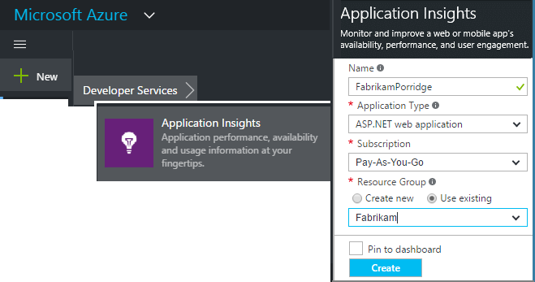

The Overview blade for the new resource will open. To find this at any time in the [Azure portal](https://portal.azure.com), click **Browse**.

### 2. Create a web test

In your Application Insights resource, look for the Availability tile. Click it to open the Web tests blade for your application, and add a web test.

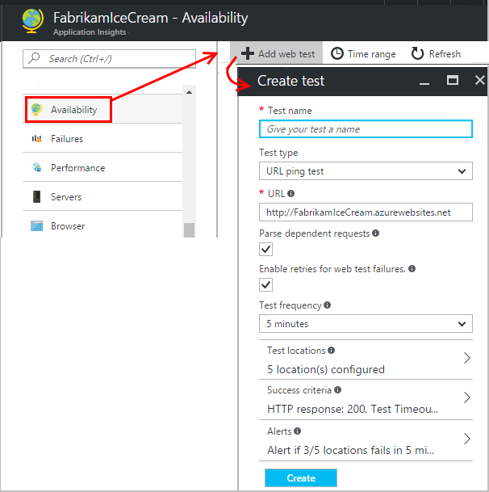

- **The URL** must be visible from the public internet. It can include a query string&#151;so, for example, you can exercise your database a little. If the URL resolves to a redirect, we will follow it up to 10 redirects.
- **Parse dependent requests**: Images, scripts, style files, and other resources of the page are requested as part of the test. The test will fail if all these resources cannot be successfully downloaded within the timeout for the whole test.
- **Enable retries**:  When the test fails, it is retried after a short interval. A failure is reported only if three successive attempts fail. Subsequent tests are then performed at the usual test frequency. Retry is temporarily suspended until the next success. This rule is applied independently at each test location. (We recommend this setting. On average, about 80% of failures disappear on retry.)
- **Test frequency**: Sets how often the test is run from each test location. With a frequency of 5 minutes and five test locations, your site will be tested on average every minute.
- **Test locations** are the places from where our servers send web requests to your URL. Choose more than one so that you can distinguish problems in your website from network issues. You can select up to 16 locations.

- **Success criteria**:

    **Test timeout**: Decrease this to be alerted about slow responses. The test is counted as a failure if the responses from your site have not been received within this period. If you selected **Parse dependent requests**, then all the images, style files, scripts and other dependent resources must have been received within this period.

    **HTTP response**: The returned status code that is counted as a success. 200 is the code that indicates that a normal web page has been returned.

    **Content match**: a string, like "Welcome!" We'll test that it occurs in every response. It must be a plain string, without wildcards. Don't forget that if your page content changes you might have to update it.

- **Alerts** are, by default, sent to you if there are failures in three locations over five minutes. A failure in one location is likely to be a network problem, and not a problem with your site. But you can change the threshold to be more or less sensitive, and you can also change who the emails should be sent to.

    You can set up a [webhook](../azure-portal/insights-webhooks-alerts.md) that is called when an alert is raised. (But note that, at present, query parameters are not passed through as Properties.)

#### Test more URLs

Add more tests. For example, as well as testing your home page, you can make sure your database is running by testing the URL for a search.

### 3. View availability reports

After 1-2 minutes, click **Refresh** on the availability/web tests blade. (It doesn't refresh automatically.)

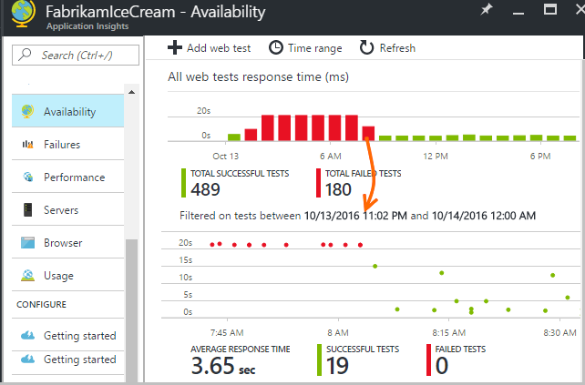

Click any bar on the summary chart at the top for a more detailed view of that time period.

These charts combine results for all the web tests of this application.

#### Components of your web page

Images, style sheets and scripts and other static components of the web page you're testing are requested as part of the test.  

The recorded response time is the time taken for all the components to complete loading.

If any component fails to load, the test is marked failed.

## If you see failures...

Click a red dot.

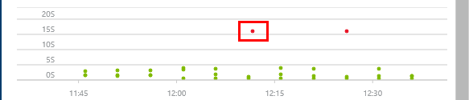

Or, scroll down and click a test where you see less than 100% success.

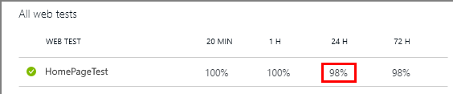

This shows you the results for that test.

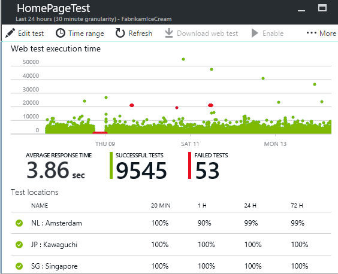

The test is run from several locations&#151;pick one where the results are less than 100%.

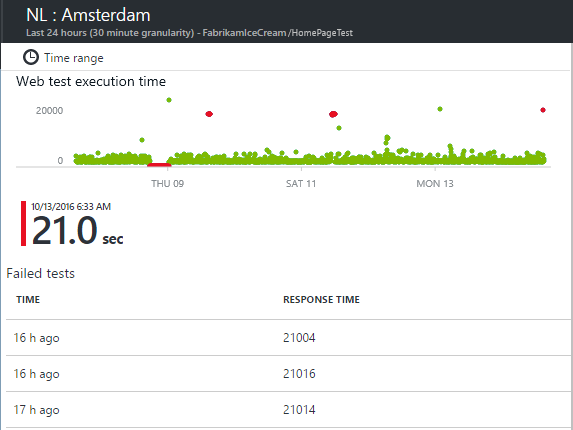

Scroll down to **Failed tests** and pick a result.

Click the result to evaluate it in the portal and see why it failed.

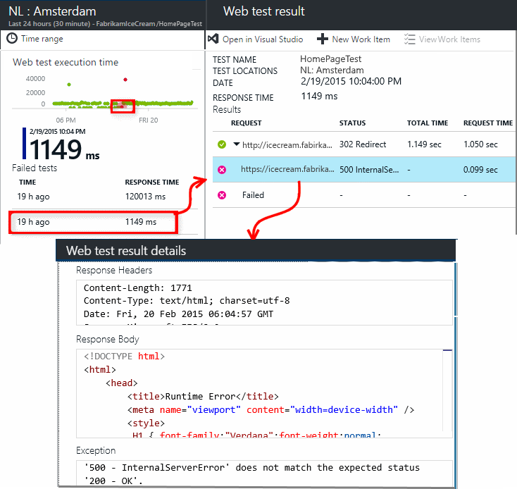

Alternatively, you can download the result file and inspect it in Visual Studio.

*Looks OK but reported as a failure?* Check all the images, scripts, style sheets and any other files loaded by the page. If any of them fails, the test will be reported as failed, even if the main html page loads OK.

## Multi-step web tests

You can monitor a scenario that involves a sequence of URLs. For example, if you are monitoring a sales website, you can test that adding items to the shopping cart works correctly.

To create a multi-step test, you record the scenario by using Visual Studio, and then upload the recording to Application Insights. Application Insights will replay the scenario at intervals and verify the responses.

Note that you can't use coded functions in your tests: the scenario steps must be contained as a script in the .webtest file.

#### 1. Record a scenario

Use Visual Studio Enterprise or Ultimate to record a web session. 

1. Create a web performance test project.

    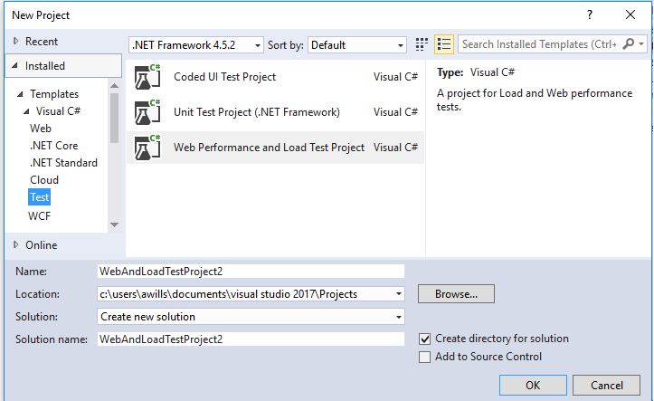

2. Open the .webtest file and start recording.

    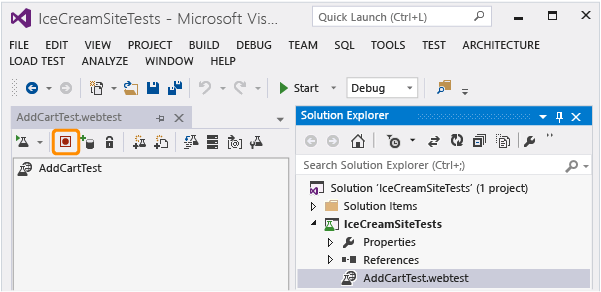

3. Do the user actions you want to simulate in your test: open your website, add a product to the cart, and so on. Then stop your test.

    

    Don't make a long scenario. There's a limit of 100 steps and 2 minutes.

4. Edit the test to:
 - Add validations to check the received text and response codes.
 - Remove any superfluous interactions. You could also remove dependent requests for pictures or to ad or tracking sites.

    Remember that you can only edit the test script - you can't add custom code or call other web tests. Don't insert loops in the test. You can use standard web test plug-ins.

5. Run the test in Visual Studio to make sure it works.

    The web test runner opens a web browser and repeats the actions you recorded. Make sure it works as you expect.

    

#### 2. Upload the web test to Application Insights

1. In the Application Insights portal, create a new web test.

    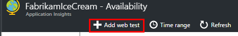

2. Select multi-step test, and upload the .webtest file.

    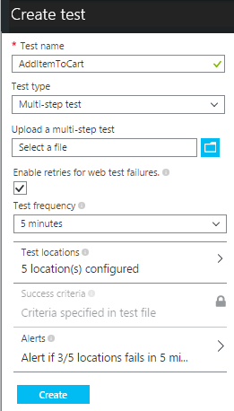

    Set the test locations, frequency, and alert parameters in the same way as for ping tests.

View your test results and any failures in the same way as for single-url tests.

A common reason for failure is that the test runs too long. It mustn't run longer than two minutes.

Don't forget that all the resources of a page must load correctly for the test to succeed, including scripts, style sheets, images and so forth.

Note that the web test must be entirely contained in the .webtest file: you can't use coded functions in the test.

### Plugging time and random numbers into your multi-step test

Suppose you're testing a tool that gets time-dependent data such as stocks from an external feed. When you record your web test, you have to use specific times, but you set them as parameters of the test, StartTime and EndTime.

When you run the test, you'd like EndTime always to be the present time, and StartTime should be 15 minutes ago.

Web Test Plug-ins provide the way to do this.

1. Add a web test plug-in for each variable parameter value you want. In the web test toolbar, choose **Add Web Test Plugin**.

    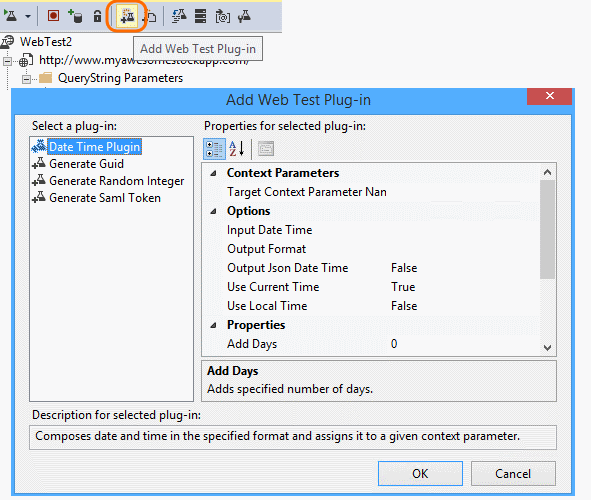

    In this example, we'll use two instances of the Date Time Plug-in. One instance is for "15 minutes ago" and another for "now".

2. Open the properties of each plug-in. Give it a name and set it to use the current time. For one of them, set Add Minutes = -15.

    

3. In the web test parameters, use {{plug-in name}} to reference a plug-in name.

    

Now, upload your test to the portal. It will use the dynamic values on every run of the test.

## Dealing with sign-in

If your users sign in to your app, you have a number of options for simulating sign-in so that you can test pages behind the sign-in. The approach you use depends on the type of security provided by the app.

In all cases, you should create an account just for the purpose of testing. If possible, restrict its permissions so that it's read-only.

* Simple username and password: Just record a web test in the usual way. Delete cookies first.
* SAML authentication. For this, you can use the SAML plugin that is available for web tests.
* Client secret: If your app has a sign-in route that involves a client secret, use that. Azure Active Directory provides this. 
* Open Authentication - for example, signing in with your Microsoft or Google account. Many apps that use OAuth provide the client secret alternative, so the first tactic is to investigate that. If your test has to sign in using OAuth, the general approach is:
 * Use a tool such as Fiddler to examine the traffic between your web browser, the authentication site, and your app. 
 * Perform two or more sign-ins using different machines or browsers, or at long intervals (to allow tokens to expire).
 * By comparing different sessions, identify the token passed back from the authenticating site, that is then passed to your app server after sign-in. 
 * Record a web test using Visual Studio. 
 * Parameterize the tokens, setting the parameter when the token is returned from the authenticator, and using it in the query to the site.
 (Visual Studio will attempt to parameterize the test, but will not correctly parameterize the tokens.)

##  Edit or disable a test

Open an individual test to edit or disable it.

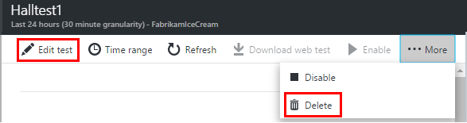

You might want to disable web tests while you are performing maintenance on your service.

## Performance tests

You can run a load test on your website. Like the availability test, you can send either simple requests or multi-step requests from our points around the world. Unlike an availability test, many requests are sent, simulating multiple simultaneous users.

From the Overview blade, open **Settings**, **Performance Tests**. When you create a test, you are invited to connect to or create a Visual Studio Team Services account. 

When the test is complete, you'll be shown response times and success rates.

## Automation

* [Use PowerShell scripts to set up a web test](https://azure.microsoft.com/blog/creating-a-web-test-alert-programmatically-with-application-insights/) automatically. 
* Set up a [webhook](../azure-portal/insights-webhooks-alerts.md) that is called when an alert is raised.

## Questions? Problems?

* *Can I call code from my web test?*

    No. The steps of the test must be in the .webtest file. And you can't call other web tests or use loops. But there are a number of plug-ins that you might find helpful.

* *Is HTTPS supported?*

    Currently, we support SSL 3.0, TLS 1.0, and TLS 2.0.

* *Is there a difference between "web tests" and "availability tests"?*

    We use the two terms interchangeably.

* *I'd like to use availability tests on our internal server that runs behind a firewall.*

    Configure your firewall to permit requests from the [IP addresses 
    of web test agents](app-insights-ip-addresses.md#availability).

* *Uploading a multi-step web test fails*

    There's a size limit of 300K.

    Loops aren't supported.

    References to other web tests aren't supported.

    Data sources aren't supported.

    
* *My multi-step test doesn't complete*

    There's a limit of 100 requests per test.

    The test will be stopped if runs longer than two minutes.

* *How can I run a test with client certificates?*

    We don't support that, sorry.

## Video

> [AZURE.VIDEO monitoring-availability-with-application-insights]

## Next steps

[Search diagnostic logs][diagnostic]

[Troubleshooting][qna]

[IP addresses of web test agents](app-insights-ip-addresses.md)

<!--Link references-->

[azure-availability]: ../insights-create-web-tests.md
[diagnostic]: app-insights-diagnostic-search.md
[qna]: app-insights-troubleshoot-faq.md
[start]: app-insights-overview.md
