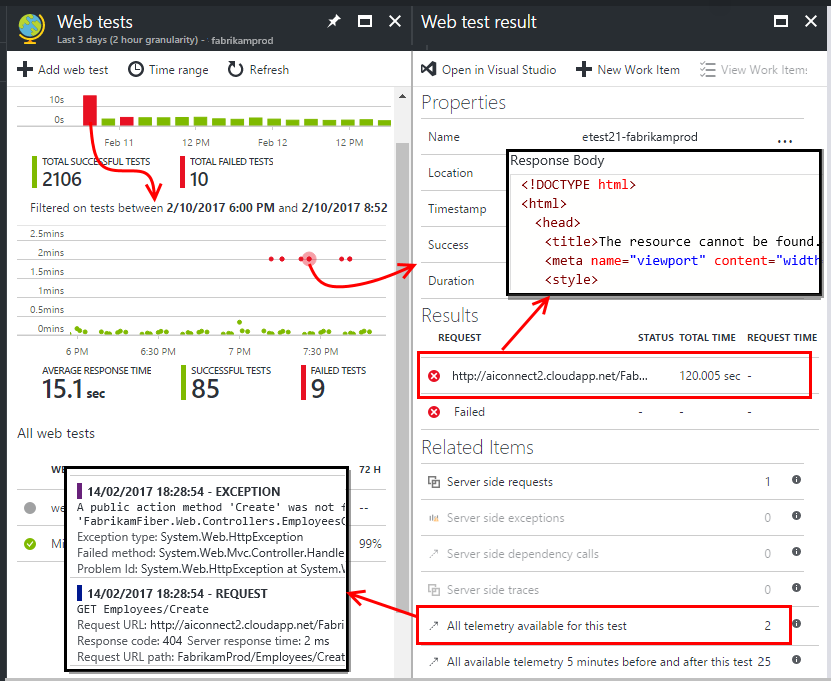

# Monitor availability and responsiveness of any web site
After you've deployed your web app or web site to any server, you can set up web tests to monitor its availability and responsiveness. [Azure Application Insights](app-insights-overview.md) sends web requests to your application at regular intervals from points around the world. It alerts you if your application doesn't respond, or responds slowly.

You can set up web tests for any HTTP or HTTPS endpoint that is accessible from the public internet. You don't have to add anything to the web site you're testing. It doesn't even have to be your site: you could test a REST API service on which you depend.

There are two types of web test:

* [URL ping test](#create): a simple test that you can create in the Azure portal.
* [Multi-step web test](#multi-step-web-tests): which you create in Visual Studio Enterprise and upload to the portal.

You can create up to 10 web tests per application resource.

## 1. Open a resource for your web test reports

**If you have already configured Application Insights** for your web app, open its Application Insights resource in the [Azure portal](https://portal.azure.com).

**Or, if you want to see your reports in a new resource,** sign up to [Microsoft Azure](http://azure.com), go to the [Azure portal](https://portal.azure.com), and create an Application Insights resource.

Click **All resources** to open the Overview blade for the new resource.

## 2. Create a URL ping test
Open the Availability blade and add a web test.

* **The URL** can be any web page you want to test, but it must be visible from the public internet. The URL can include a query string&#151;so, for example, you can exercise your database a little. If the URL resolves to a redirect, we follow it up to 10 redirects.
* **Parse dependent requests**: If this option is checked, the test will request images, scripts, style files, and other files that are part of the web page under test. The recorded response time includes the time taken to get these files. The test fails if all these resources cannot be successfully downloaded within the timeout for the whole test. 

    If the option is not checked, the test only requests the file at the URL you specified.
* **Enable retries**:  If this option is checked, when the test fails, it is retried after a short interval. A failure is reported only if three successive attempts fail. Subsequent tests are then performed at the usual test frequency. Retry is temporarily suspended until the next success. This rule is applied independently at each test location. We recommend this option. On average, about 80% of failures disappear on retry.
* **Test frequency**: Sets how often the test is run from each test location. With a frequency of five minutes and five test locations, your site is tested on average every minute.
* **Test locations** are the places from where our servers send web requests to your URL. Choose more than one so that you can distinguish problems in your website from network issues. You can select up to 16 locations.
* **Success criteria**:

    **Test timeout**: Decrease this value to be alerted about slow responses. The test is counted as a failure if the responses from your site have not been received within this period. If you selected **Parse dependent requests**, then all the images, style files, scripts, and other dependent resources must have been received within this period.

    **HTTP response**: The returned status code that is counted as a success. 200 is the code that indicates that a normal web page has been returned.

    **Content match**: a string, like "Welcome!" We test that an exact case-sensitive match occurs in every response. It must be a plain string, without wildcards. Don't forget that if your page content changes you might have to update it.
* **Alerts** are, by default, sent to you if there are failures in three locations over five minutes. A failure in one location is likely to be a network problem, and not a problem with your site. But you can change the threshold to be more or less sensitive, and you can also change who the emails should be sent to.

    You can set up a [webhook](../monitoring-and-diagnostics/insights-webhooks-alerts.md) that is called when an alert is raised. (But note that, at present, query parameters are not passed through as Properties.)

### Test more URLs
Add more tests. For example, as well as testing your home page, you can make sure your database is running by testing the URL for a search.

## 3. See your web test results

After 5 minutes, click **Refresh** to see test results. 

Click any bar on the summary chart for a more detailed view of that time period.

##  Inspect and edit tests

From the summary page, select a specific test. There, you can see its specific results, and edit or temporarily disable it.

You might want to disable web tests while you are performing maintenance on your service.

## If you see failures
Click a red dot.

From a web test result, you can:

* Inspect the response received from your server.
* Open the telemetry sent by your server app while processing the failed request instance.
* Log an issue or work item in Git or VSTS to track the problem. The bug will contain a link to this event.
* Open the web test result in Visual Studio.

*Looks OK but reported as a failure?* Check all the images, scripts, style sheets, and any other files loaded by the page. If any of them fails, the test is reported as failed, even if the main html page loads OK.

*No related items?* That may be because [sampling](app-insights-sampling.md) is in operation.

## Multi-step web tests
You can monitor a scenario that involves a sequence of URLs. For example, if you are monitoring a sales website, you can test that adding items to the shopping cart works correctly.

> [!NOTE] 
> There is a charge for multi-step web tests. [Pricing scheme](http://azure.microsoft.com/pricing/details/application-insights/).
> 

To create a multi-step test, you record the scenario by using Visual Studio Enterprise, and then upload the recording to Application Insights. Application Insights replays the scenario at intervals and verifies the responses.

> [!NOTE]
> You can't use coded functions or loops in your tests. The test must be contained completely in the .webtest script. However, you can use standard plugins.
>

#### 1. Record a scenario
Use Visual Studio Enterprise to record a web session.

1. Create a Web performance test project.

    

 * *Don't see the Web Performance and Load Test template?* - Close Visual Studio Enterprise. Open **Visual Studio Installer** to modify your Visual Studio Enterprise installation. Under **Individual Components**, select **Web Performance and load testing tools**.

2. Open the .webtest file and start recording.

    
3. Do the user actions you want to simulate in your test: open your website, add a product to the cart, and so on. Then stop your test.

    

    Don't make a long scenario. There's a limit of 100 steps and 2 minutes.
4. Edit the test to:

   * Add validations to check the received text and response codes.
   * Remove any superfluous interactions. You could also remove dependent requests for pictures or to ad or tracking sites.

     Remember that you can only edit the test script - you can't add custom code or call other web tests. Don't insert loops in the test. You can use standard web test plug-ins.
5. Run the test in Visual Studio to make sure it works.

    The web test runner opens a web browser and repeats the actions you recorded. Make sure it works as you expect.

    

#### 2. Upload the web test to Application Insights
1. In the Application Insights portal, create a new web test.

    
2. Select multi-step test, and upload the .webtest file.

    

    Set the test locations, frequency, and alert parameters in the same way as for ping tests.

#### 3. See the results

View your test results and any failures in the same way as single-url tests.

In addition, you can download the test results to view them in Visual Studio.

#### Too many failures?

* A common reason for failure is that the test runs too long. It mustn't run longer than two minutes.

* Don't forget that all the resources of a page must load correctly for the test to succeed, including scripts, style sheets, images, and so forth.

* The web test must be entirely contained in the .webtest script: you can't use coded functions in the test.

### Plugging time and random numbers into your multi-step test
Suppose you're testing a tool that gets time-dependent data such as stocks from an external feed. When you record your web test, you have to use specific times, but you set them as parameters of the test, StartTime and EndTime.

When you run the test, you'd like EndTime always to be the present time, and StartTime should be 15 minutes ago.

Web Test Plug-ins provide the way to do parameterize times.

1. Add a web test plug-in for each variable parameter value you want. In the web test toolbar, choose **Add Web Test Plugin**.

    

    In this example, we use two instances of the Date Time Plug-in. One instance is for "15 minutes ago" and another for "now."
2. Open the properties of each plug-in. Give it a name and set it to use the current time. For one of them, set Add Minutes = -15.

    
3. In the web test parameters, use {{plug-in name}} to reference a plug-in name.

    

Now, upload your test to the portal. It uses the dynamic values on every run of the test.

## Dealing with sign-in
If your users sign in to your app, you have various options for simulating sign-in so that you can test pages behind the sign-in. The approach you use depends on the type of security provided by the app.

In all cases, you should create an account in your application just for the purpose of testing. If possible, restrict the permissions of this test account so that there's no possibility of the web tests affecting real users.

### Simple username and password
Record a web test in the usual way. Delete cookies first.

### SAML authentication
Use the SAML plugin that is available for web tests.

### Client secret
If your app has a sign-in route that involves a client secret, use that route. Azure Active Directory (AAD) is an example of a service that provides a client secret sign-in. In AAD, the client secret is the App Key.

Here's a sample web test of an Azure web app using an app key:

1. Get token from AAD using client secret (AppKey).
2. Extract bearer token from response.
3. Call API using bearer token in the authorization header.

Make sure that the web test is an actual client - that is, it has its own app in AAD - and use its clientId + appkey. Your service under test also has its own app in AAD: the appID URI of this app is reflected in the web test in the “resource” field.

### Open Authentication
An example of open authentication is signing in with your Microsoft or Google account. Many apps that use OAuth provide the client secret alternative, so your first tactic should be to investigate that possibility.

If your test must sign in using OAuth, the general approach is:

* Use a tool such as Fiddler to examine the traffic between your web browser, the authentication site, and your app.
* Perform two or more sign-ins using different machines or browsers, or at long intervals (to allow tokens to expire).
* By comparing different sessions, identify the token passed back from the authenticating site, that is then passed to your app server after sign-in.
* Record a web test using Visual Studio.
* Parameterize the tokens, setting the parameter when the token is returned from the authenticator, and using it in the query to the site.
  (Visual Studio attempts to parameterize the test, but does not correctly parameterize the tokens.)

## Performance tests
You can run a load test on your website. Like the availability test, you can send either simple requests or multi-step requests from our points around the world. Unlike an availability test, many requests are sent, simulating multiple simultaneous users.

From the Overview blade, open **Settings**, **Performance Tests**. When you create a test, you are invited to connect to or create a Visual Studio Team Services account.

When the test is complete, you are shown response times and success rates.

## Automation
* [Use PowerShell scripts to set up a web test](app-insights-powershell.md#add-an-availability-test) automatically.
* Set up a [webhook](../monitoring-and-diagnostics/insights-webhooks-alerts.md) that is called when an alert is raised.

## Questions? Problems?
* *Can I call code from my web test?*

    No. The steps of the test must be in the .webtest file. And you can't call other web tests or use loops. But there are several plug-ins that you might find helpful.
* *Is HTTPS supported?*

    We support TLS 1.1 and TLS 1.2.
* *Is there a difference between "web tests" and "availability tests"?*

    We use the two terms interchangeably.
* *I'd like to use availability tests on our internal server that runs behind a firewall.*

    There are two possible solutions:
    
    * Configure your firewall to permit incoming requests from the [IP addresses
    of our web test agents](app-insights-ip-addresses.md).
    * Write your own code to periodically test your internal server. Run the code as a background process on a test server behind your firewall. Your test process can send its results to Application Insights by using [TrackAvailability()](https://docs.microsoft.com/dotnet/api/microsoft.applicationinsights.telemetryclient.trackavailability) API in the core SDK package. This requires your test server to have outgoing access to the Application Insights ingestion endpoint, but that is a much smaller security risk than the alternative of permitting incoming requests. The results will not appear in the availability web tests blades, but will appear as availability results in Analytics, Search, and Metric Explorer.
* *Uploading a multi-step web test fails*

    There's a size limit of 300 K.

    Loops aren't supported.

    References to other web tests aren't supported.

    Data sources aren't supported.
* *My multi-step test doesn't complete*

    There's a limit of 100 requests per test.

    The test is stopped if it runs longer than two minutes.
* *How can I run a test with client certificates?*

    We don't support that, sorry.

## Next steps
[Search diagnostic logs][diagnostic]

[Troubleshooting][qna]

[IP addresses of web test agents](app-insights-ip-addresses.md)

<!--Link references-->

[azure-availability]: ../insights-create-web-tests.md
[diagnostic]: app-insights-diagnostic-search.md
[qna]: app-insights-troubleshoot-faq.md
[start]: app-insights-overview.md
