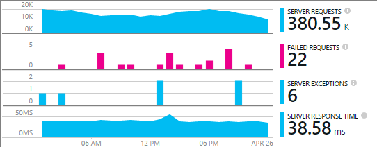
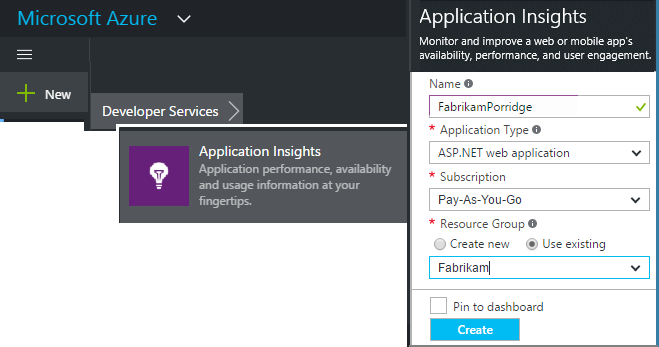

<properties
	pageTitle="Add Application Insights SDK to monitor your Node.js app | Microsoft Azure"
	description="Analyze usage, availability and performance of your on-premises or Microsoft Azure web application with Application Insights."
	services="application-insights"
    documentationCenter=""
	authors="alancameronwills"
	manager="douge"/>

<tags
	ms.service="application-insights"
	ms.workload="tbd"
	ms.tgt_pltfrm="ibiza"
	ms.devlang="na"
	ms.topic="get-started-article"
	ms.date="05/25/2016"
	ms.author="awills"/>


# Add Application Insights SDK to monitor your Node.js app

*Application Insights is in preview.*

[Visual Studio Application Insights](app-insights-overview.md) monitors your live application to help you [detect and diagnose performance issues and exceptions](app-insights-detect-triage-diagnose.md), and [discover how your app is used](app-insights-overview-usage.md). It works for apps that are hosted on your own on-premises IIS servers or on Azure VMs, as well as Azure web apps.


The SDK provides automatic collection of incoming HTTP request rates and responses, performance counters (CPU, memory, RPS), and unhandled exceptions. In addition, you can add custom calls to track dependencies, metrics, or other events.




#### Before you start

You need:

* Visual Studio 2013 or later. Later is better.
* A subscription to [Microsoft Azure](http://azure.com). If your team or organization has an Azure subscription, the owner can add you to it, using your [Microsoft account](http://live.com).

## <a name="add"></a>Create an Application Insights resource

Sign in to the [Azure portal][portal], and create a new Application Insights resource. A [resource][roles] in Azure is an instance of a service. This resource is where telemetry from your app will be analyzed and presented to you.



Choose Other as the application type. The choice of application type sets the default content of the resource blades and the properties visible in [Metrics Explorer][metrics].

#### Copy the Instrumentation Key

The key identifies the resource, and you'll install it soon in the SDK to direct data to the resource.


## <a name="sdk"></a> Install the SDK in your application

```
npm install applicationinsights
```

## Usage

This will enable request monitoring, unhandled exception tracking, and system performance monitoring (CPU/Memory/RPS).

```javascript

var appInsights = require("applicationinsights");
appInsights.setup("<instrumentation_key>").start();
```

The instrumentation key can also be set in the environment variable APPINSIGHTS_INSTRUMENTATIONKEY. If this is done, no argument is required when calling `appInsights.setup()` or `appInsights.getClient()`.

You can try the SDK without sending telemetry: set the instrumentation key to a non-empty string.


## <a name="run"></a> Run your project

Run your application and try it out: open different pages to generate some telemetry.


## <a name="monitor"></a> View your telemetry

Return to the [Azure portal](https://portal.azure.com) and browse to your Application Insights resource.


Look for data in the Overview page. At first, you'll just see one or two points. For example:


Click through any chart to see more detailed metrics. [Learn more about metrics.][perf]

#### No data?

* Use the application, opening different pages so that it generates some telemetry.
* Open the [Search](app-insights-diagnostic-search.md) tile, to see individual events. Sometimes it takes events a little while longer to get through the metrics pipeline.
* Wait a few seconds and click **Refresh**. Charts refresh themselves periodically, but you can refresh manually if you're waiting for some data to show up.
* See [Troubleshooting][qna].

## Publish your app

Now deploy your application to IIS or to Azure and watch the data accumulate.


#### No data after you publish to your server?

Open these ports for outgoing traffic in your server's firewall:

+ `dc.services.visualstudio.com:443`
+ `f5.services.visualstudio.com:443`


#### Trouble on your build server?

Please see [this Troubleshooting item](app-insights-asp-net-troubleshoot-no-data.md#NuGetBuild).


## Customized Usage 

### Disabling auto-collection

```javascript
import appInsights = require("applicationinsights");
appInsights.setup("<instrumentation_key>")
    .setAutoCollectRequests(false)
    .setAutoCollectPerformance(false)
    .setAutoCollectExceptions(false)
    // no telemetry will be sent until .start() is called
    .start();
```

### Custom monitoring

```javascript
import appInsights = require("applicationinsights");
var client = appInsights.getClient();

client.trackEvent("custom event", {customProperty: "custom property value"});
client.trackException(new Error("handled exceptions can be logged with this method"));
client.trackMetric("custom metric", 3);
client.trackTrace("trace message");
```

[Learn more about the telemetry API](app-insights-api-custom-events-metrics.md).

### Using multiple instrumentation keys

```javascript
import appInsights = require("applicationinsights");

// configure auto-collection with one instrumentation key
appInsights.setup("<instrumentation_key>").start();

// get a client for another instrumentation key
var otherClient = appInsights.getClient("<other_instrumentation_key>");
otherClient.trackEvent("custom event");
```

## Examples

### Tracking dependency

```javascript
import appInsights = require("applicationinsights");
var client = appInsights.getClient();

var startTime = Date.now();
// execute dependency call
var endTime = Date.now();

var elapsedTime = endTime - startTime;
var success = true;
client.trackDependency("dependency name", "command name", elapsedTime, success);
```


### Manual request tracking of all "GET" requests

```javascript
var http = require("http");
var appInsights = require("applicationinsights");
appInsights.setup("<instrumentation_key>")
    .setAutoCollectRequests(false) // disable auto-collection of requests for this example
    .start();

// assign common properties to all telemetry sent from the default client
appInsights.client.commonProperties = {
    environment: process.env.SOME_ENV_VARIABLE
};

// track a system startup event
appInsights.client.trackEvent("server start");

// create server
var port = process.env.port || 1337
var server = http.createServer(function (req, res) {
    // track all "GET" requests
    if(req.method === "GET") {
        appInsights.client.trackRequest(req, res);
    }

    res.writeHead(200, { "Content-Type": "text/plain" });
    res.end("Hello World\n");
}).listen(port);

// track startup time of the server as a custom metric
var start = +new Date;
server.on("listening", () => {
    var end = +new Date;
    var duration = end - start;
    appInsights.client.trackMetric("StartupTime", duration);
});
```


<!--Link references-->

[knowUsers]: app-insights-overview-usage.md
[metrics]: app-insights-metrics-explorer.md
[perf]: app-insights-web-monitor-performance.md
[portal]: http://portal.azure.com/
[qna]: app-insights-troubleshoot-faq.md
[roles]: app-insights-resources-roles-access-control.md
