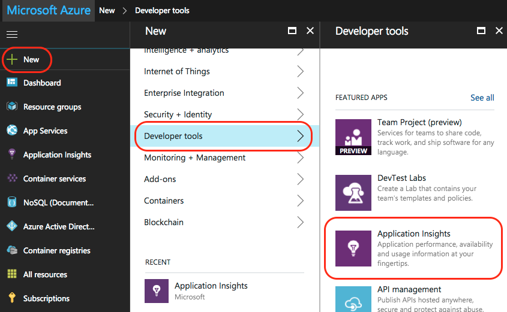
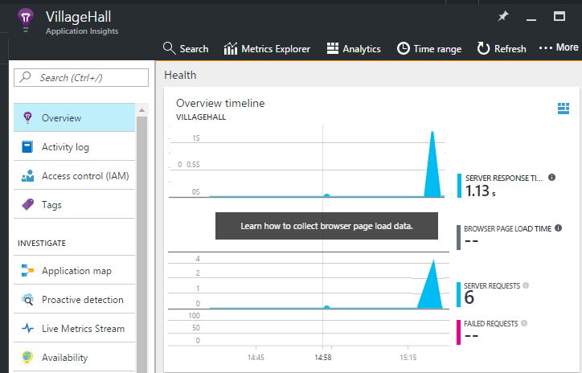
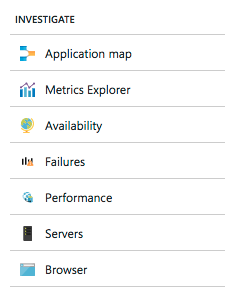

# Monitor your Node.js services and apps with Application Insights

[Azure Application Insights](app-insights-overview.md) monitors your backend services and components after you deploy them to help you [discover and rapidly diagnose performance and other issues](app-insights-detect-triage-diagnose.md). Use it for Node.js services hosted anywhere: your datacenter, Azure VMs and Web Apps, and even other public clouds.

To receive, store, and explore your monitoring data, follow the following instructions to include an agent in your code and set up a corresponding Application Insights resource in Azure. The agent sends data to that resource for further analysis and exploration.

The Node.js agent can automatically monitor incoming and outgoing HTTP requests, several system metrics, and exceptions. Beginning in v0.20, it can also monitor some common third-party packages such as `mongodb`, `mysql`, and `redis`. All events related to an incoming HTTP request are correlated for faster troubleshooting.

You can monitor more aspects of your app and system by manually instrumenting them using the agent API described later.


## Getting Started

Let's step through setting up monitoring for an app or service.

### <a name="resource"></a> Set up an App Insights resource

**Before you start**, make sure you have an Azure subscription or [get a new one for free][azure-free-offer]. If your organization already has an Azure subscription, an administrator can follow [these instructions][add-aad-user] to add you to it.

[azure-free-offer]: https://azure.microsoft.com/en-us/free/
[add-aad-user]: https://docs.microsoft.com/en-us/azure/active-directory/active-directory-users-create-azure-portal

Now log in to the [Azure portal][portal] and create an Application Insights resource as illustrated in the following - click "New" > "Developer tools" > "Application Insights". The resource includes an endpoint for receiving telemetry data, storage for this data, saved reports and dashboards, rule and alert configuration, and more.



On the resource creation page, choose "Node.js Application" from the application type drop-down. The app type determines the default set of dashboards and reports created for you. Don't worry though, any App Insights resource can in fact collect data from any language and platform.


### <a name="agent"></a> Set up the Node.js agent

Now it's time to include the agent in your app so it can gather data.
Start by copying your resource's Instrumentation Key (hereinafter referred to as your `ikey`) from the portal as shown below. The App Insights system uses this key to map data to your Azure resource so you need to specify it in an environment variable or your code for the agent to use.  


Next, add the Node.js agent library to your app's dependencies via package.json. From the root folder of your app, run:

```bash
npm install applicationinsights --save
```

Now you need to explicitly load the library in your code. Because the agent injects instrumentation into many other libraries, you should load it as early as possible, even before other `require` statements. To get started, at the top of your first .js file add:

```javascript
const appInsights = require("applicationinsights");
appInsights.setup("<instrumentation_key>");
appInsights.start();
```

The `setup` method configures the instrumentation key (and thus Azure resource) to be used by default for all tracked items. Call `start` after configuration is finished to begin gathering and sending telemetry data.

You can also provide an ikey via the environment variable APPINSIGHTS\_INSTRUMENTATIONKEY instead of passing it manually to  `setup()` or `getClient()`. This practice lets you keep ikeys out of committed source code and to specify different ikeys for different environments.

Additional configuration options are documented below.

You can try the agent without sending telemetry by setting the instrumentation key to any non-empty string.

### <a name="monitor"></a> Monitor your app

The agent automatically gathers telemetry about the Node.js runtime and some common third-party modules. Use your application now to generate some of this data.

Then, in the [Azure portal][portal] browse to the Application Insights resource you created earlier and look for your first few data points in the Overview timeline, as in the following image. Click through the charts for more details.



Click the Application map button to view the topology discovered for your app, as in the following image. Click through components in the map for more details.


Learn more about your app and troubleshoot problems using the other views available under the "Investigate" section.



#### No data?

Because the agent batches data for submission there may be a delay before items are displayed in the portal. If you don't see data in your resource try some of the following fixes:

* Use the application some more; take more actions to generate more telemetry.
* Click **Refresh** in the portal resource view. Charts automatically refresh themselves periodically but refreshing forces this to happen immediately.
* Verify that [needed outgoing ports](app-insights-ip-addresses.md) are open.
* Open the [Search](app-insights-diagnostic-search.md) tile and look for individual events.
* Check the [FAQ][].


## Agent Configuration

Following are the agent's configuration methods and their default values.

To fully correlate events in a service, be sure to set `.setAutoDependencyCorrelation(true)`. This allows the agent to track context across asynchronous callbacks in Node.js.

```javascript
const appInsights = require("applicationinsights");
appInsights.setup("<instrumentation_key>")
    .setAutoDependencyCorrelation(false)
    .setAutoCollectRequests(true)
    .setAutoCollectPerformance(true)
    .setAutoCollectExceptions(true)
    .setAutoCollectDependencies(true)
    .start();
```

## Agent API

<!-- TODO: Fully document agent API. -->

The .NET agent API is fully described [here](app-insights-api-custom-events-metrics.md).

You can track any request, event, metric, or exception using the Application Insights Node.js client. The following example demonstrates some of the available APIs.

```javascript
let appInsights = require("applicationinsights");
appInsights.setup().start(); // assuming ikey in env var
let client = appInsights.getClient();

client.trackEvent("my custom event", {customProperty: "custom property value"});
client.trackException(new Error("handled exceptions can be logged with this method"));
client.trackMetric("custom metric", 3);
client.trackTrace("trace message");

let http = require("http");
http.createServer( (req, res) => {
  client.trackRequest(req, res); // Place at the beginning of your request handler
});
```

### Track your dependencies

```javascript
let appInsights = require("applicationinsights");
let client = appInsights.getClient();

var success = false;
let startTime = Date.now();
// execute dependency call here....
let duration = Date.now() - startTime;
success = true;

client.trackDependency("dependency name", "command name", duration, success);
```

### Add a custom property to all events

```javascript
appInsights.client.commonProperties = {
	environment: process.env.SOME_ENV_VARIABLE
};
```

### Track HTTP GET requests

```javascript
var server = http.createServer((req, res) => {
	if ( req.method === "GET" ) {
			appInsights.client.trackRequest(req, res);
	}
	// other work here....
	res.end();
});
```

### Track server startup time

```javascript
let start = Date.now();
server.on("listening", () => {
	let duration = Date.now() - start;
	appInsights.client.trackMetric("server startup time", duration);
});
```

## More resources

* [Monitor your telemetry in the portal](app-insights-dashboards.md)
* [Write Analytics queries over your telemetry](app-insights-analytics-tour.md)

<!--references-->

[portal]: https://portal.azure.com/
[FAQ]: app-insights-troubleshoot-faq.md
