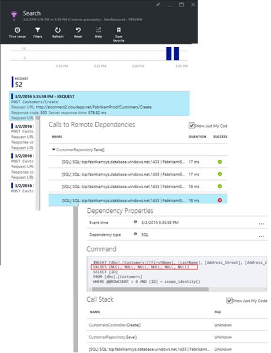

<properties 
	pageTitle="Near Real Time Proactive Diagnostics in Application Insights" 
	description="NRT Proactive Diagnostics automatically notifies you if your server response time shows unusual behavior. No configuration is needed." 
	services="application-insights" 
    documentationCenter=""
	authors="yorac" 
	manager="douge"/>

<tags 
	ms.service="application-insights" 
	ms.workload="tbd" 
	ms.tgt_pltfrm="ibiza" 
	ms.devlang="na" 
	ms.topic="article" 
	ms.date="03/10/2016" 
	ms.author="awills"/>
 
# Near Real Time Proactive Diagnostics

[Visual Studio Application Insights](app-insights-overview.md) automatically notifies you in near real time if an abnormal rise in failed requests rate is detected. To help you triage and diagnose the problem, an analysis of the characteristics of failed requests and related telemetry is provided in the notification. There are also links to the Application Insights portal for further diagnosis. The feature needs no set-up or configuration, as it uses machine learning algorithms to predict the baseline normal failure rate. It needs a certain minimum volume of traffic in order to work. 

This feature works for Java and ASP.NET web apps, hosted in the cloud or on your own servers. It also works for any app that generates request telemetry - for example, if you have a worker role that calls [TrackRequest()](app-insights-api-custom-events-metrics.md#track-request). 

After setting up [Application Insights for your project](app-insights-get-started.md), and provided your app generates a certain minimum amount of telemetry, it takes Proactive Diagnostics rule 24 hours to learn the normal behavior of your app before it is switched on and can send alerts.

Here's a sample alert:

Notice that it tells you:

* The failure rate compared to normal app behavior.
* How many users are affected – so you know how much to worry.
* A characteristic pattern associated with the failures. In this example, there’s a particular response code, request name (operation) and app version. That immediately tells you where to start looking in your code. Other possibilities could be a specific browser or client operating system.
* The exception, log traces, dependency failure (databases or other external components) that appear to be associated with the characterized failed requests.
* Links directly to relevant searches on the telemetry in Application Insights.

Ordinary [metric alerts](app-insights-alerts.md) tell you there might be a problem. But NRT Proactive Diagnostics starts the diagnostic work for you, performing a lot of the analysis you would otherwise have to do yourself. You get the results neatly packaged, helping you to get quickly to the root of the problem.

## Why using this alert? 
Having your app available and performant is key for app success as degradation can have impact on your users. If users are having problems with your web site, you need to know about it immediately and fix the problem before most customers have noticed.

Detecting degradation in your app on various metrics is important, but can be difficult to automate entirely. It takes time to become familiar with the normal behavior of your system: learning the failure rate under load, which requests are most failure-prone, etc. During this period, you learn what abnormal behavior looks like and what is the optimal thresholds to define for reasonable balance that enables detection with fewer false alarms. 

Once detection is made and you are aware of an issue, you still need to have more information when triaging it; what is the scale of the problem and the urgency? how many users are affected? Some of the information can be available in your dashboards, but often you are required to perform some analysis on telemetry to get sufficient view.

Diagnosis of the problem can be a difficult task as problem can be caused by a bug in the code, configuration, storage or other external services (databases, REST services) that the app is using.

## How it works

Near Real Time Proactive Diagnostics monitors the telemetry received from your app, and in particular the failed request rate. This metric usually indicates the number of HTTP requests that returned a response code of 400 or more (unless you have written custom code to [filter](app-insights-api-filtering-sampling.md#filtering) or generate your own [TrackRequest](app-insights-api-custom-events-metrics.md#track-request) calls).

Note: failures response code does not affect this alert, as failed request is determined by ‘Successful request’ == false.

Your app’s performance has a typical pattern of behavior. Some requests will be more prone to failure than others; and the overall failure rate may go up as load increases. Near Real Time Proactive Diagnostics uses machine learning to find these anomalies. 

As telemetry comes into Application Insights from your web app, NRT Proactive Diagnostics compares the current behavior with the patterns seen over the past few days. If abnormal rise in failure rate is observed with comparison to previous performance, an analysis is triggered.

When analysis is triggered, the service performs a cluster analysis on the failed request, to try to identify a pattern of values that characterize the failures. In the example above, the analysis has discovered that most failures are about a specific response code, request name, Server URL host, Role instance and included them in the alert. Also, the analysis has discovered that Client operating system property is distributed over multiple values thus it is not listed.

The analyser then finds exception and dependency failure that are associated with requests in the cluster it has identified, together with an example of any trace logs associated with those requests.

The resulting analysis is sent to you as alert, unless you have configured it not to.

Like the [alerts you set manually](app-insights-alerts.md), you can inspect the state of the alert and configure it in the Alerts blade of your Application Insights resource. But unlike other alerts, you don't need to set up or configure NRT Proactive Diagnosis. If you want, you can disable it or change its target email addresses.

## Triaging and diagnosing an alert

An alert indicates that an anomaly in the failed request rate was detected. It's likely that there is some problem with your app or its environment.

From the percentage of requests and number of users affected, you can decide how urgent the issue is. In the example above, the failure rate of 15% compares with a normal rate of 1.3%, so there's obviously something bad going on. 22 distinct users were affected by failures in a particular operation. If it were your app, you'd be able to assess how serious that is.

In many cases, you will be able to diagnose the problem quickly from the request name, exceptions, dependencies and trace data provided. 

There are some other clues. For example, the dependency failure rate in this example is the same as the exception rate (89.3%). This suggests that the exception arises directly from the dependency failure - giving you a clear idea of where to start looking in your code.

To investigate further, the links in each section will take you straight to a [search page](app-insights-diagnostic-search.md) filtered to the relevant requests, exception, dependency or trace. Or you can open to the [Azure portal](https://portal.azure.com), navigate to the Application Insights resource for your app, and open the Failures blade.

In this example, clicking the search link opens Application Insights search blade on the SQL statement with the root cause: NULLs where provided at mandatory fields and did not pass validation during the save operation.

## Review recent alerts

To review alerts in the portal, open **Settings, Audit logs**.

Click any alert to see its full detail.

## Configure alerts 

Open the Alerts page. The Adaptive Failure Alert is included along with any alerts that you have set manually, and you can see whether it is currently in the alert state.

Click the alert to configure it.

Notice that you can disable the Adaptive Failure Alert, but you can't delete it (or create another one).

## What's the difference ...

NRT Proactive Diagnostics complements other similar but distinct features of Application Insights. 

* [Metric Alerts](app-insights-alerts.md) are set by you and can monitor a wide range of metrics such as CPU occupancy, request rates,  page load times, and so on. You can use them to warn you, for example, if you need to add more resources. By contrast, NRT Proactive Diagnostics cover a small range of critical metrics (currently only failed request rate), designed to notify you in near real time manner once your web app's failed request rate increases significantly compared to web app's normal behavior.

    NRT Proactive Diagnostics automatically adjusts its threshold in response to prevailing conditions.

    NRT Proactive Diagnostics start the diagnostic work for you. 
* [Proactive Detection](app-insights-proactive-detection.md) also uses machine intelligence to discover unusual patterns in your metrics, and no configuration by you is required. But unlike NRT Proactive Diagnostics, the purpose of Proactive Detection is to find segments of your usage manifold that might be badly served - for example, by specific pages on a specific type of browser. The analysis is performed daily, and if any result is found, it's likely to be much less urgent than an alert. By contrast, the analysis for NRT Proactive Diagnostics is performed continuously on incoming telemetry, and you will be notified within minutes if server failure rates are greater than expected.

## If you receive a NRT Proactive Diagnostics alert

*Why have I received this alert?*

*	We detected an anomalous rise in failed requests compared to the normal baseline of the preceding period. After analysis of the failures and associated telemetry, we think that there is a problem that you should look into. 

*Does the notification mean I definitely have a problem?*

*	We try to alert on app disruption, or degradation, although only you can fully understand the semantics and the impact on the app or users.

*So, you guys look at my data?*

*	No. The service is entirely automatic. Only you get the notifications. Your data is [private](app-insights-data-retention-privacy.md).

*Do I have to subscribe to this alert?* 

*	No. Every application sending request telemetry has this alert rule.

*Can I unsubscribe or get the notifications sent to my colleagues instead?*

*	Yes, In Alert rules, click NRT Proactive Diagnostics rule to configure it. You can disable the alert, or change recipients for the alert. 

*I lost the email. Where can I find the notifications in the portal?*

*	In the Audit logs. Click Settings, Audit logs, then any alert to see its full detail.

*Some of the alerts are of known issues and I do not want to receive them.*

*	We have alert suppression on our backlog.

## Feedback please

*We are very interested to know what you think about this. Please send feedback to:* [ainrtpd@microsoft.com](mailto:ainrtpd@microsoft.com).

