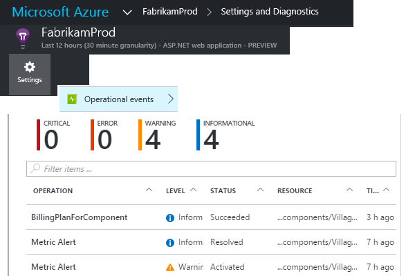
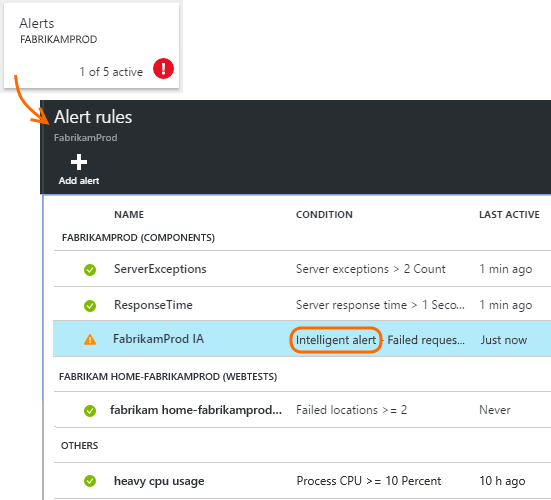
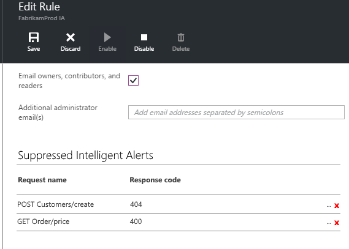

<properties 
	pageTitle="Near Real Time Proactive Diagnostics in Application Insights" 
	description="NRT Proactive Diagnostics automatically notifies you if your server response time shows unusual behavior. No configuration is needed." 
	services="application-insights" 
    documentationCenter=""
	authors="alancameronwills" 
	manager="douge"/>

<tags 
	ms.service="application-insights" 
	ms.workload="tbd" 
	ms.tgt_pltfrm="ibiza" 
	ms.devlang="na" 
	ms.topic="article" 
	ms.date="03/02/2016" 
	ms.author="awills"/>
 
# Near Real Time Proactive Diagnostics

*This feature is in early trials.*

*Please send feedback to:* [ainrtpd@microsoft.com](mailto:ainrtpd@microsoft.com)

[Visual Studio Application Insights](app-insights-overview.md) automatically notifies you in near real time if your web app's failed request rate increases significantly. To help you triage and diagnose the problem, an analysis of the characteristics of failed requests and related telemetry is provided in the notification. There are also links to the Application Insights portal for further diagnosis. The feature needs no set-up or configuration, as it uses machine learning algorithms to predict the baseline normal failure rate. It needs a certain minimum volume of traffic in order to work. 

Here's a sample alert:

Proactive diagnostics are switched on as soon as you set up [Application Insights for your project](app-insights-get-started.md).

## How it works

Near Real Time Proactive Diagnostics monitors the telemetry received from your app, and in particular the failed request rate. This metric usually indicates the number of HTTP requests that returned a response code of 400 or more (unless you have written custom code to [filter](app-insights-api-filtering-sampling.md#filtering) or generate your own [TrackRequest](app-insights-api-custom-events-metrics.md#track-request) calls). 

Based on the previous behavior of this metric, the service predicts what value range should be expected. If the actual value is significantly higher, it generates an alert. 

When an alert is raised, the service performs a cluster analysis on multiple dimensions of the requests, to try to identify a pattern of values that characterize the failures. In the example above, the analysis has discovered that most failures are about a specific request name, but it has found that the failures are independent of host or server instance.

The analyser then finds exceptions and dependency failures that are associated with requests in the cluster it has identified, together with an example of any trace logs associated with those requests.

The resulting analysis is sent to you as an email, unless you have configured it not to.

Like the [alerts you set manually](app-insights-alerts.md), you can inspect the state of the alert and configure it in the Alerts blade of your Application Insights resource. But unlike other alerts, you don't need to set up or configure Adaptive Failure Alert. If you want, you can disable it or change its target email addresses.

## If you receive an alert

An alert indicates that an anomaly in the failed request rate was detected. It's likely that there is some problem with your app or its environment. Maybe the new version you just uploaded isn't working so well; or maybe a dependency such as a database or external resource is malfunctioning.

From the percentage of requests and number of users affected, you can decide how urgent the issue is.

In many cases, you will be able to diagnose the problem quickly from the request name, exceptions, dependencies and other data provided. 

But if you need to investigate further, the links in each section will take you straight to a [search page](app-insights-diagnostic-search.md) filtered to the relevant requests, exception, dependency or trace. Or you can open to the [Azure portal](https://portal.azure.com), navigate to the Application Insights resource for your app, and open the Failures blade.

## Review recent alerts

To review alerts in the portal, open **Settings, Operational events**.

Click any alert to see its full detail.

## Configure alerts 

> **The configuration UX isn't available yet.**
> 
> Instead, please send email to [ainrtpd@microsoft.com](mailto:ainrtpd@microsoft.com).
>
> This is how it might work:

Open the Alerts page. The Adaptive Failure Alert is included along with any alerts that you have set manually, and you can see whether it is currently in the alert state.

Click the alert to configure it.

Notice that you can disable the Adaptive Failure Alert, but you can't delete it (or create another one).

## What's the difference ...

NRT Proactive Diagnostics complements other similar but distinct features of Application Insights. 

* [Metric Alerts](app-insights-alerts.md) are set by you and can monitor a wide range of metrics such as CPU occupancy, request rates,  page load times, and so on. You can use them to warn you, for example, if you need to add more resources. By contrast, NRT Proactive Diagnostics cover a small range of critical metrics (currently only failed request rate), designed to notify you in near real time manner once your web app's failed request rate increases significantly compared to web app's normal behavior.
* [Proactive Detection](app-insights-proactive-detection.md) also uses machine intelligence to discover unusual patterns in your metrics, and no configuration by you is required. But unlike NRT Proactive Diagnostics, the purpose of Proactive Detection is to find segments of your usage manifold that might be badly served - for example, by specific pages on a specific type of browser. The analysis is performed daily, and if any result is found, it's likely to be much less urgent than an alert. By contrast, the analysis for NRT Proactive Diagnostics is performed continuously on incoming telemetry, and you will be notified within minutes if server failure rates are greater than expected.

## Feedback please

*This feature is in early trials. We are very interested to hear your feedback. Please send feedback to:* [ainrtpd@microsoft.com](mailto:ainrtpd@microsoft.com) *or click the feedback link in the alert message.*

