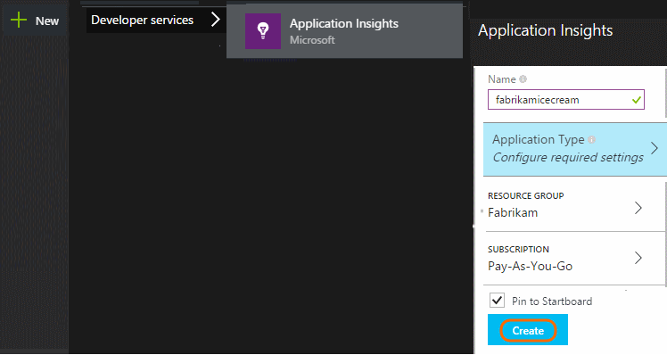
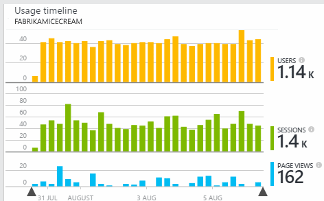
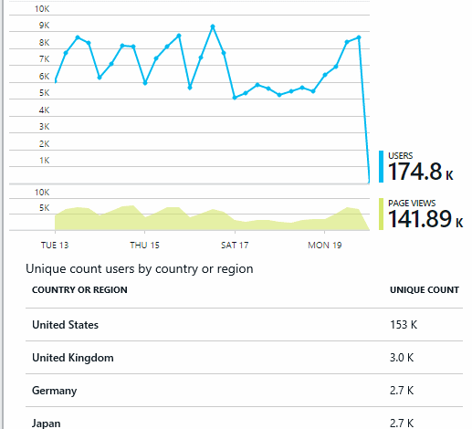
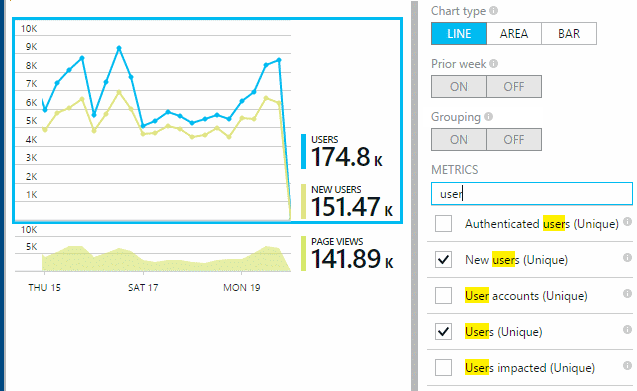
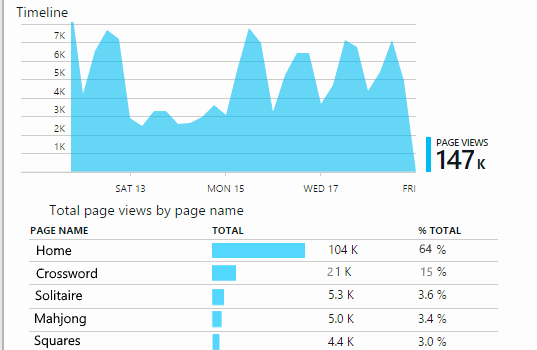
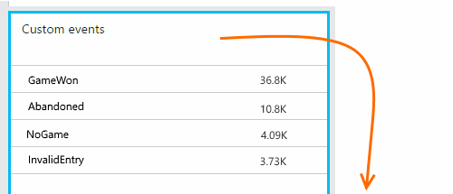
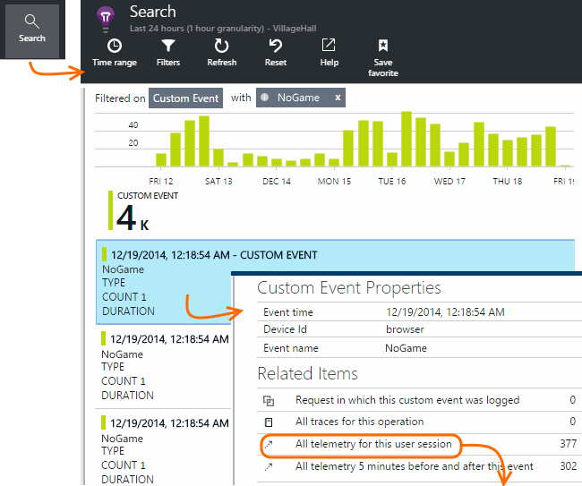
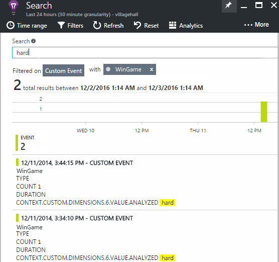

<properties
	pageTitle="Usage analysis with Application Insights"
	description="Overview of usage analytics with Application Insights"
	services="application-insights"
    documentationCenter=""
	authors="alancameronwills"
	manager="douge"/>

<tags
	ms.service="application-insights"
	ms.workload="tbd"
	ms.tgt_pltfrm="ibiza"
	ms.devlang="multiple"
	ms.topic="article" 
	ms.date="04/08/2016"
	ms.author="awills"/>

# Usage analysis with Application Insights

Knowing how people use your application lets you focus your development work on the scenarios that are most important to them, and gain insights into the goals that they find easier or more difficult to achieve.

Application Insights can provide a clear view of your application's usage, helping you to improve your users' experience, and meet your business goals.

Application Insights works for both stand-alone apps (on iOS, Android and Windows) and for web apps (hosted on .NET or J2EE). 

## Add Application Insights to your project

To get started, get a free account with [Microsoft Azure](https://azure.com). (After the trial period, you can continue with the free tier of the service.)

In the [Azure portal](https://portal.azure.com), create an Application Insights resource. This is where you'll see usage and performance data about your app.

**If your app is a device app,** add the Application Insights SDK to your project. The exact procedure varies depending on your [IDE and platform](app-insights-platforms.md). For Windows apps, just right-click the project in Visual Studio and choose "Add Application Insights."

**If it's a web app,** open the Quick Start blade and get the code snippet to add to your web pages. Republish them with this snippet.

You can also add Application Insights to your [ASP.NET](app-insights-asp-net.md) or [J2EE](app-insights-java-get-started.md) server code so as to combine telemetry from both client and server.

### Run your project and see first results

Run your project in debug mode for a few minutes, and then go to the [Azure portal](https://portal.azure.com) and browse to your project resource in Application Insights.

Publish your app to get more telemetry and find out what your users are doing with your app.

## Analytics out of the box

Click the Page Views tile to see usage details.

Hover in the blank part above a graph to see the counts at a particular point. Otherwise, the numbers show the value aggregated over the period, such as an average, a total, or a count of distinct users over the period.

In web applications, users are counted by using cookies. A person who uses several browsers, clears cookies, or uses the privacy feature will be counted several times.

A web session is counted after 30 minutes of inactivity. A session on a phone or other device is counted when the app is suspended for more than a few seconds.

Click through any chart to see more detail. For example:

(This example is from a website, but the charts look similar for apps that run on devices.)

Compare with the previous week to see if things are changing:

Compare two metrics, for example users and new users:

Group (segment) data by a property such as Browser, Operating System, or City:

## Page usage

Click the page views tile to get a a breakdown of your most popular pages:

The example above is from a games website. From it we can instantly see:

* Usage hasn't improved in the past week. Maybe we should think about search engine optimization?
* Many fewer people see the games pages than the Home page. Why doesn't our Home page attract people to play games?
* 'Crossword' is the most popular game. We should give priority to new ideas and improvements there.

## Custom tracking

Let's suppose that instead of implementing each game in a separate web page, you decide to refactor them all into the same single-page app, with most of the functionality coded as Javascript in the web page. This allows the user to switch quickly between one game and another, or even have several games on one page.

But you'd still like Application Insights to log the number of times each game is opened, in exactly the same way as when they were on separate web pages. That's easy: just insert a call to the telemetry module into your JavaScript where you want to record that a new 'page' has opened:

	telemetryClient.trackPageView(game.Name);

## Custom events

You can use telemetry in many ways to understand how your application is being used. But you don't always want to mix the messages up with page views. Instead, use custom events. You can send them from device apps, web pages or a web server:

(JavaScript)

    telemetryClient.trackEvent("GameEnd");

(C#)

    var tc = new Microsoft.ApplicationInsights.TelemetryClient();
    tc.TrackEvent("GameEnd");

(VB)

    Dim tc = New Microsoft.ApplicationInsights.TelemetryClient()
    tc.TrackEvent("GameEnd")

The most frequent custom events are listed on the overview blade.

Click the head of the table to see total numbers of events. You can segment the chart by various attributes such as the event name:

The particularly useful feature of timelines is that you can correlate changes with other metrics and events. For example, at times when more games are played, you'd expect to see a rise in abandoned games as well. But the rise in abandoned games is disproportionate, you'd want to find out whether the high load is causing problems that users find unacceptable.

## Drill into specific events

To get a better understanding of how a typical session goes, you might want to focus on a specific user session that contains a particular type of event.

In this example, we coded a custom event "NoGame" that is called if the user logs out without actually starting a game. Why would a user do that? Maybe if we drill into some specific occurrences, we'll get a clue.

The custom events received from the app are listed by name on the overview blade:

Click through the event of interest, and select a recent specific occurrence:

Let's look at all the telemetry for the session in which that particular NoGame event occurred.

There were no exceptions, so the user wasn't prevented from playing by some failure.

We can filter out all types of telemetry except page views for this session:

And now we can see that this user logged in simply to check the latest scores. Maybe we should consider developing a user story that makes it easier to do that. (And we should implement a custom event to report when this specific story occurs.)

## Filter, search and segment your data with properties
You can attach arbitrary tags and numeric values to events.

JavaScript at client

    appInsights.trackEvent("WinGame",
        // String properties:
        {Game: currentGame.name, Difficulty: currentGame.difficulty},
        // Numeric measurements:
        {Score: currentGame.score, Opponents: currentGame.opponentCount}
    );

C# at server

    // Set up some properties:
    var properties = new Dictionary <string, string>
        {{"game", currentGame.Name}, {"difficulty", currentGame.Difficulty}};
    var measurements = new Dictionary <string, double>
        {{"Score", currentGame.Score}, {"Opponents", currentGame.OpponentCount}};

    // Send the event:
    telemetry.TrackEvent("WinGame", properties, measurements);

VB at server

    ' Set up some properties:
    Dim properties = New Dictionary (Of String, String)
    properties.Add("game", currentGame.Name)
    properties.Add("difficulty", currentGame.Difficulty)

    Dim measurements = New Dictionary (Of String, Double)
    measurements.Add("Score", currentGame.Score)
    measurements.Add("Opponents", currentGame.OpponentCount)

    ' Send the event:
    telemetry.TrackEvent("WinGame", properties, measurements)

Attach properties to page views in the same way:

JavaScript at client

    appInsights.trackPageView("Win",
        {Game: currentGame.Name},
        {Score: currentGame.Score});

In Diagnostic Search, view the properties by clicking through an individual occurrence of an event.

Use the Search field to see event occurrences with a particular property value.

## A | B Testing

If you don't know which variant of a feature will be more successful, release both of them, making each accessible to different users. Measure the success of each, and then move to a unified version.

For this technique, you attach distinct tags to all the telemetry that is sent by each version of your app. You can do that by defining properties in the active TelemetryContext. These default properties are added to every telemetry message that the application sends - not just your custom messages, but the standard telemetry as well.

In the Application Insights portal, you'll then be able to filter and group (segment) your data on the tags, so as to compare the different versions.

C# at server

    using Microsoft.ApplicationInsights.DataContracts;

    var context = new TelemetryContext();
    context.Properties["Game"] = currentGame.Name;
    var telemetry = new TelemetryClient(context);
    // Now all telemetry will automatically be sent with the context property:
    telemetry.TrackEvent("WinGame");

VB at server

    Dim context = New TelemetryContext
    context.Properties("Game") = currentGame.Name
    Dim telemetry = New TelemetryClient(context)
    ' Now all telemetry will automatically be sent with the context property:
    telemetry.TrackEvent("WinGame")

Individual telemetry can override the default values.

You can set up a universal initializer so that all new TelemetryClients automatically use your context.

    // Telemetry initializer class
    public class MyTelemetryInitializer : ITelemetryInitializer
    {
        public void Initialize (ITelemetry telemetry)
        {
            telemetry.Properties["AppVersion"] = "v2.1";
        }
    }

In the app initializer such as Global.asax.cs:

    protected void Application_Start()
    {
        // ...
        TelemetryConfiguration.Active.TelemetryInitializers
        .Add(new MyTelemetryInitializer());
    }

## Build - Measure - Learn

When you use analytics, it becomes an integrated part of your development cycle - not just something you think about to help solve problems. Here are some tips:

* Determine the key metric of your application. Do you want as many users as possible, or would you prefer a small set of very happy users? Do you want to maximize visits or sales?
* Plan to measure each story. When you sketch a new user story or feature, or plan to update an existing one, always think about how you will measure the success of the change. Before coding starts, ask "What effect will this have on our metrics, if it works? Should we track any new events?"
And of course, when the feature is live, make sure you look at the analytics and act on the results.
* Relate other metrics to the key metric. For example, if you add a 'favorites' feature, you'd like to know how often users add favorites. But it's perhaps more interesting to know how often they come back to their favorites. And, most importantly, do customers who use favorites ultimately buy more of your product?
* Canary testing. Set up a feature switch that allows you to make a new feature visible only to some users. Use Application Insights to see whether the new feature is being used in the way you envisaged. Make adjustments, then release it to a wider audience.
* Talk to your users! Analytics is not enough on its own, but complementary to maintaining a good customer relationship.

## Learn more

* [Detect, triage and diagnose crashes and performance issues in your app](app-insights-detect-triage-diagnose.md)
* [Get started with Application Insights on many platforms](app-insights-detect-triage-diagnose.md)

## Video

> [AZURE.VIDEO usage-monitoring-application-insights]

 
