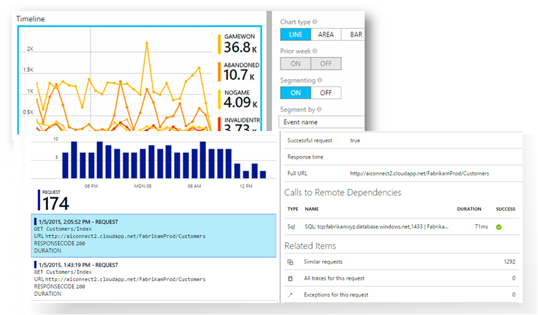
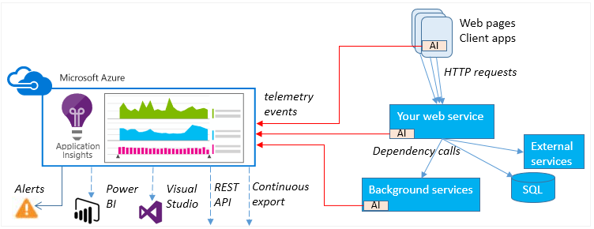
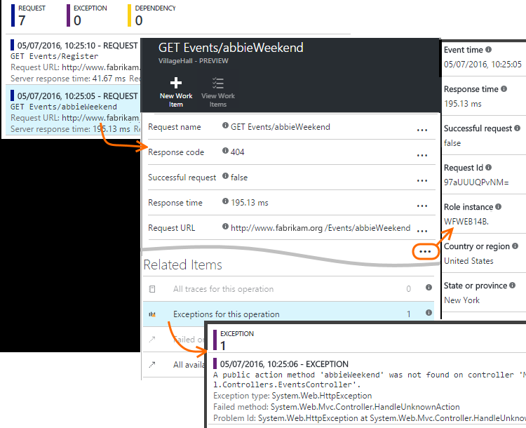
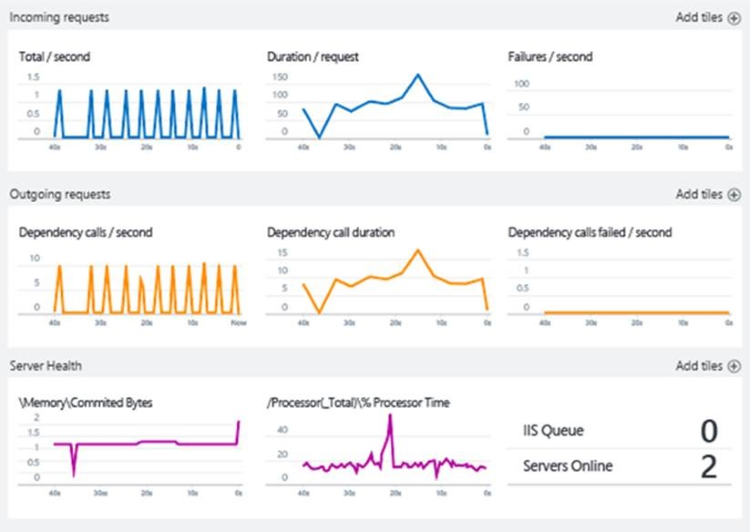
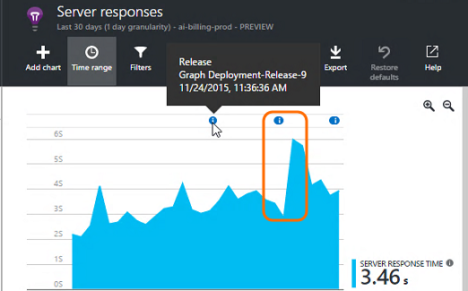
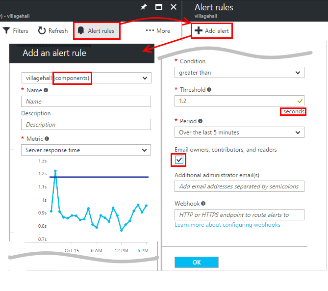
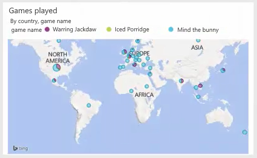

<properties 
	pageTitle="Application Insights tutorial | Microsoft Azure" 
	description="Track usage and performance of your live web application.  Detect, triage and diagnose problems. Continuously monitor and improve success with your users." 
	services="application-insights" 
    documentationCenter=""
	authors="alancameronwills" 
	manager="douge"/>

<tags 
	ms.service="application-insights" 
	ms.workload="tbd" 
	ms.tgt_pltfrm="ibiza" 
	ms.devlang="na" 
	ms.topic="article" 
	ms.date="07/18/2016" 
	ms.author="awills"/>
 
# Application Insights - overview

[Visual Studio Application Insights](app-insights-get-started.md) is an extensible analytics service that monitors your live web application. With it you can detect and diagnose performance issues, and understand what users actually do with your app. It's designed for developers, to help you continuously improve  performance and usability. It works for apps on a wide variety of platforms including .NET, Node.js and J2EE, hosted on-premises or in the cloud. 

[Take a look at the intro animation](https://www.youtube.com/watch?v=fX2NtGrh-Y0).

Application Insights is aimed at the development team. With it, you can:

* [Analyze usage patterns][knowUsers] to understand your users better and continuously improve your app. 
 * Page view counts, new and returning users, geolocation, platforms, and other core usage statistics
 * Trace usage paths to assess the success of each feature.
* [Detect, triage and diagnose][detect] performance issues and fix them before most of your users are aware.
 *  Alerts on performance changes or crashes.
 *  Metrics to help diagnose performance issues, such as response times, CPU usage, dependency tracking.
 *  Availability tests for web apps.
 *  Exception reports and alerts.
 *  Powerful diagnostic log search (including log traces from your favorite logging frameworks).

The SDK for each platform includes a range of modules that monitor the app straight out of the box. In addition, you can code your own telemetry for more detailed and tailored analytics.

Telemetry data collected from your application is stored and analysed in the Azure Portal, where there are intuitive views and powerful tools for fast diagnosis and analysis.

## How it works

You install a small instrumentation package in your application, and set up an Application Insights resource in the Microsoft Azure portal. The instrumentation monitors your app and sends telemetry data to the portal. The portal shows you statistical charts and provides powerful search tools to help you diagnose any problems.

Application Insights has several [standard instrumentation modules](app-insights-configuration-with-applicationinsights-config.md) that collect different types of telemetry such as request response times, exceptions, and dependency calls. You can also [write code to send custom telemetry](app-insights-api-custom-events-metrics.md) to the portal.

### What's the overhead?

The impact on your app's performance is very small. Tracking calls are non-blocking, and are batched and sent in a separate thread. 

## Get an Azure subscription

Application Insights is one of the many services hosted within Microsoft Azure, and telemetry is sent there for analysis and presentation. So before you do anything else, you'll need a subscription to [Microsoft Azure](http://azure.com). It's free to sign up, and you can choose the free [pricing tier](https://azure.microsoft.com/pricing/details/application-insights/) of Application Insights. If your organization already has a subscription, they could add your Microsoft account to it. 

## Get started

There are several ways to get started. Begin with whichever works best for you. You can add the others later.

* **At run time: instrument your web app on the server.** Avoids any update to the code. You need admin access to your server.
 * [**IIS on-premises or on a VM**](app-insights-monitor-performance-live-website-now.md)
 * [**Azure web app or VM**](app-insights-monitor-performance-live-website-now.md#if-your-app-runs-as-an-azure-web-app)
 * [**J2EE**](app-insights-java-live.md)
* **At development time: add Application Insights to your code.** Allows you to write custom telemetry and to instrument back-end and desktop apps.
 * [Visual Studio](app-insights-asp-net.md) 2013 update 2 or later.
 * Java in [Eclipse](app-insights-java-eclipse.md) or [other tools](app-insights-java-get-started.md)
 * [Node.js](app-insights-nodejs.md)
 * [Other platforms](app-insights-platforms.md)
* **[Instrument your web pages](app-insights-javascript.md)** for page view, AJAX and other client-side telemetry.
* **[Availability tests](app-insights-monitor-web-app-availability.md)** - ping your website regularly from our servers.

> [AZURE.NOTE]  At this point, maybe you just want to get on and experiment. But if you'd like to see what Application Insights can do, read on....

## Explore Metrics

Run your app - either in debug mode on your development machine, or by deploying it to a server - and use it for a while. Then sign in to the [Azure portal](https://portal.azure.com).

Navigate to your app's Application Insights overview blade:

The overview allows you to see immediately how your app is performing. You can compare load (in terms of rate of requests) with the time your app too to respond to the requests. If there's a disproportionate rise in response time when the load goes up, you might want to allocate more resources to your app. If it shows more failed responses right after you deployed a new build, then you might want to roll back.

#### Get more detail

Click through any chart to get a more detailed set of charts. For example, the Server Response Time chart leads to charts that show request rates, response times, and response times of dependencies (that is, services that your app calls).  

The dependencies chart is useful because it helps you see whether the databases and REST APIs that your app uses are responding well, or are causing delays.

#### Customize a chart

Try editing one of these charts. For example, if your web app runs on a collection of server instances, you can compare response times on the different server instances:

1. Hover over the chart and click Edit.
2. Choose a metric. Multiple metrics can be displayed on one chart, but only in certain combinations: you might have to deselect one metric before you select the one you want.
3. Use Group-By to segment a metric by a property. In this example, we display separate lines for different response times. 

    Note that you have to select a valid property for the metric, or the chart will not show any data.
4. Select a chart type. Area and bar charts show a stacked display suitable when the aggregation type is 'Sum'.

[More about exploring metrics](app-insights-metrics-explorer.md).

## Search instance data

To investigate a problem, it's useful to inspect specific event instances.

Click through a metric chart to search through instance data with relevant filters and time range. For example, click through server request counts to see individual request reports. 

Or you can get directly to instance data from Search on the overview page:

Use Filters to focus on particular types of event and on chosen property values:

Click "..." to see a full list of properties, or open other events associated with the same request. In this example, the failed request has an associated exception report:

Open an event - in this example, the related exception - and you can create a work item (if you use Visual Studio Team Services to track tasks). 
 

## Analytics

[Analytics](app-insights-analytics.md) is an even more powerful search and analysis feature, in which you can write SQL-like queries over your telemetry data, either to look for specific issues or to compile statistical information.

Open the tutorial window to see and run examples of queries over your data, or read the longer [tutorial walkthrough](app-insights-analytics-tour.md). Intellisense prompts you with the queries that you can use, and there's a [full language reference](app-insights-analytics-reference.md). 

Queries usually begin with the name of a telemetry stream such as requests, exceptions, or dependencies. Pop open the schema bar at the left to see a list of the available telemetry streams. The query is a pipeline of [query operations](app-insights-analytics-reference.md#queries-and-operators) such as `where` - a boolean filter - or `project` - which computes new properties. `summarize` [aggregates instances](app-insights-analytics-tour.md#aggregate-groups-of-rows), grouping them by functions you define, and then applying aggregation functions over the grouped data.

Results can be [rendered in tables or various types of chart](app-insights-analytics-tour.md#charting-the-results).

## Custom telemetry

The built-in telemetry that you get just by installing Application Insights lets you analyze counts, success rates, and response times both for web requests to your app, and dependencies - that is, calls from your app to SQL, REST APIs. You also get exception traces, and (with Status Monitor on your server) system performance  counters. If you add the client snippet to your web pages, you get page view counts and load times, client exceptions, and AJAX call success and response rates. 

Analyzing all this telemetry can tell you a lot about your app's performance and usage. But sometimes that isn't enough. You might want to monitor the length of a queue so that you can tune performance; or count sales and segment them by location; or, on the client side, find out how often users click a particular button so that you can tune the user experience.

The [Application Insights API](app-insights-api-custom-events-metrics.md) provides calls `TrackEvent(name)` and `TrackMetric(name, value)` so that you can send your own custom events and metrics. There are equivalent calls for the client side.

For example, if your web page is a single-page game app, you might insert a lines in the appropriate places to log when the user wins or loses a game:

    
    appInsights.trackEvent("WinGame");
    ...
    appInsights.trackEvent("LoseGame");

Then we can chart custom event counts, segmenting them by event name:

### Log traces

For diagnostic purposes, there's a custom event `TrackTrace(message)` that you can use for execution traces. In the Search and Analytics features, you can search on the contents of the message, which can be longer than an event name. 

If you already use a logging framework such as Log4Net, NLog, Log4J, or System.Diagnostic.Trace, then those trace calls can be captured by Application Insights, and will appear alongside the other telemetry. The Visual Studio tools automatically add the appropriate SDK module.

## Dashboards

Many applications consist of several components such as a web service and one or more back end processors. Each component will be monitored by a separate Application Insights resource. If your system runs on Azure, you might be using - and monitoring - services such as event hubs and machine learning as well. 

To monitor your whole system, you can select the most interesting charts from different apps and pin them to an Azure [dashboard](app-insights-dashboards.md), allowing you to keep an eye on the whole system continuously. 

In fact, you can create multiple dashboards - for example, a team room dashboard for monitoring general system health; a design dashboard that focuses on the usage of different features; a separate dashboard for components under test; and so on.  

Dashboards, like resources, can be shared between team members.

## Development in Visual Studio

If you're using Visual Studio to develop your app, you'll find several Application Insights tools built in. 

### Diagnostic search

The Search window shows events that have been logged. (If you signed in to Azure when you set up Application Insights, you'll be able to search the same events in the portal.)

The free text search works on any fields in the events. For example, search for part of the URL of a page; or the value of a property such as client city; or specific words in a trace log.

Click any event to see its detailed properties.

You can also open the Related Items tab to help diagnose failed requests or exceptions.

### Diagnostics hub

The Diagnostics Hub (in Visual Studio 2015 or later) shows the Application Insights server telemetry as it's generated. This works even if you opted only to install the SDK, without connecting it to a resource in the Azure portal.

### Exceptions

If you have [set up exception monitoring](app-insights-asp-net-exceptions.md), exception reports will show in the Search window. 

Click an exception to get a stack trace. If the code of the app is open in Visual Studio, you can click through from the stack trace to the relevant line of the code.

In addition, in the Code Lens line above each method, you'll see a count of the exceptions logged by Application Insights in the past 24h.

### Local monitoring

(From Visual Studio 2015 Update 2) If you haven't configured the SDK to send telemetry to the Application Insights portal (so that there is no instrumentation key in ApplicationInsights.config) then the diagnostics window will display telemetry from your latest debugging session. 

This is desirable if you have already published a previous version of your app. You don't want the telemetry from your debugging sessions to be mixed up with the telemetry on the Application Insights portal from the published app.

It's also useful if you have some [custom telemetry](app-insights-api-custom-events-metrics.md) that you want to debug before sending telemetry to the portal.

* *At first, I fully configured Application Insights to send telemetry to the portal. But now I'd like to see the telemetry only in Visual Studio.*

 * In the Search window's Settings, there's an option to search local diagnostics even if your app sends telemetry to the portal.
 * To stop telemetry being sent to the portal, comment out the line `<instrumentationkey>...` from ApplicationInsights.config. When you're ready to send telemetry to the portal again, uncomment it.

## Trends

Trends is a tool in Visual Studio for visualizing how your app behaves over time. 

Choose **Explore Telemetry Trends** from the Application Insights toolbar button or Application Insights Search window. Choose one of five common queries to get started. You can analyze different datasets based on telemetry types, time ranges, and other properties. 

To find anomalies in your data, choose one of the anomaly options under the "View Type" dropdown. The filtering options at the bottom of the window make it easy to hone in on specific subsets of your telemetry.

## Releasing a new build

### Live Metrics Stream

Live Metrics Stream shows you your application metrics right at this very moment, with a near real time latency of 1 second. This is extremely useful when you’re releasing a new build and want to make sure that everything is working as expected, or investigating an incident in real time.

Unlike Metrics Explorer, Live Metrics Stream displays a fixed set of metrics. The data persists only for as long as it's on the chart, and is then discarded. 

### Annotations

[Release annotations](app-insights-annotations.md) on metrics charts show where you deployed a new build. They make it easy to see whether your changes had any effect on your application's performance. They can be automatically created by the [Visual Studio Team Services build system](https://www.visualstudio.com/en-us/get-started/build/build-your-app-vs), and you can also [create them from PowerShell](#create-annotations-from-powershell).

Release annotations are a feature of the cloud-based build and release service of Visual Studio Team Services. 

## Alerts

If something goes wrong with your app, you'll want to know about it immediately. 

Application Insights offers three types of alert, which are delivered by email.

### Proactive diagnostics 

[Proactive diagnostics](app-insights-nrt-proactive-diagnostics.md)** is automatically set up - you don't have to configure it. Provided your site has enough traffic, you'll get an email if there's a rise in failed requests that is unusual for the time of day or request rate. The alert contains diagnostic information. 

Here's a sample alert. 

A second type of proactive detection discovers correlations between failures and factors such as location, client OS, or browser type.

### Metric alerts

You can configure [metric alerts](app-insights-alerts.md) to tell you when any metric crosses a threshold value for some period - such as failure counts, memory, or page views.

### Availability

[Availability web tests](app-insights-monitor-web-app-availability.md) send requests to your site from our servers at various locations around the world. They tell you when your site is unavailable on the internet, or responding slowly. 

## Export

There are several ways you can get your telemetry data out of the Application Insights portal:

* [Continuous Export](app-insights-export-telemetry.md) is ideal if you want to keep large parts of your telemetry for longer than the standard retention period.
* [The Export button](app-insights-metrics-explorer.md#export-to-excel) at the top of a metrics or search blade lets you transfer tables and charts to an Excel spreadsheet. 
* [Analytics](app-insights-analytics.md) provides a powerful query  language for telemetry, and also can export results.
* The Data Access REST API can be used to search for and extract data. It can run Analytics queries.
* If you're looking to [explore your data in Power BI](http://blogs.msdn.com/b/powerbi/archive/2015/11/04/explore-your-application-insights-data-with-power-bi.aspx), you can do that without using Continuous Export.

 
## Data management

There are limits on your usage of Application Insights, which depend to some extent on the pricing scheme that you choose. The main limits are on:

* Telemetry rate per minute
* Data point count per month
* Retention period for data

[Sampling](app-insights-sampling.md) is a mechanism for reducing cost and avoiding throttling. It discards a proportion of your telemetry, keeping a representative sample. Associated items (such as exceptions and the requests that caused them) are either retained or discarded together. For ASP.NET applications, sampling is automatic and is applied in the app; otherwise, you can set it to be applied on ingestion to the portal.

## Next steps

Get started at runtime with:

* [IIS server](app-insights-monitor-performance-live-website-now.md)
* [J2EE server](app-insights-java-live.md)

Get started at development time with:

* [ASP.NET](app-insights-asp-net.md)
* [Java](app-insights-java-get-started.md)
* [Node.js](app-insights-nodejs.md)

## Support and feedback

* Questions and Issues:
 * [Troubleshooting][qna]
 * [MSDN Forum](https://social.msdn.microsoft.com/Forums/vstudio/home?forum=ApplicationInsights)
 * [StackOverflow](http://stackoverflow.com/questions/tagged/ms-application-insights)
* Suggestions:
 * [UserVoice](https://visualstudio.uservoice.com/forums/357324)
* Blog:
 * [Application Insights blog](https://azure.microsoft.com/blog/tag/application-insights)

## Videos

> [AZURE.VIDEO 218]

> [AZURE.VIDEO usage-monitoring-application-insights]

> [AZURE.VIDEO performance-monitoring-application-insights]

> [Introductory animation](https://www.youtube.com/watch?v=fX2NtGrh-Y0)

<!--Link references-->

[android]: https://github.com/Microsoft/ApplicationInsights-Android
[azure]: ../insights-perf-analytics.md
[client]: app-insights-javascript.md
[desktop]: app-insights-windows-desktop.md
[detect]: app-insights-detect-triage-diagnose.md
[greenbrown]: app-insights-asp-net.md
[ios]: https://github.com/Microsoft/ApplicationInsights-iOS
[java]: app-insights-java-get-started.md
[knowUsers]: app-insights-overview-usage.md
[platforms]: app-insights-platforms.md
[portal]: http://portal.azure.com/
[qna]: app-insights-troubleshoot-faq.md
[redfield]: app-insights-monitor-performance-live-website-now.md
[windows]: app-insights-windows-get-started.md

 