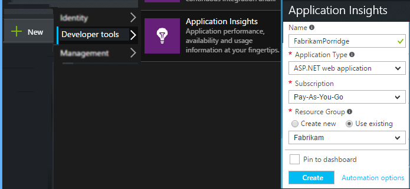
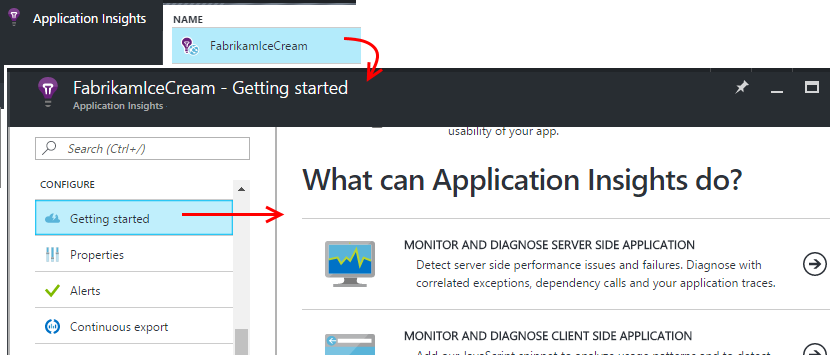

<properties 
	pageTitle="Analytics with Application Insights" 
	description="Device and web app analytics. Track usage and performance of your live web application.  Detect, triage and diagnose problems. Continuously monitor and improve success with your users." 
	services="application-insights" 
    documentationCenter=""
	authors="alancameronwills" 
	manager="douge"/>

<tags 
	ms.service="application-insights" 
	ms.workload="tbd" 
	ms.tgt_pltfrm="ibiza" 
	ms.devlang="na" 
	ms.topic="article" 
	ms.date="03/02/2016" 
	ms.author="awills"/>
 
# What is Application Insights?

Application Insights is an extensible analytics service that monitors your live application. It helps you detect and diagnose performance issues, and understand what users actually do with your app. It's designed for developers, to help you continuously improve the performance and usability of your app. 

It works with both web and stand-alone apps on a wide variety of platforms: .NET or J2EE, hosted on-premises or in the cloud. 

Application Insights is aimed at the development team. With it, you can:

* [Analyze usage patterns][knowUsers] to understand your users better and continuously improve your app. 
 * Page view counts, new and returning users, geolocation, platforms, and other core usage statistics
 * Trace usage paths to assess the success of each feature.
* [Detect, triage and diagnose][detect] performance issues and fix them before most of your users are aware.
 *  Alerts on performance changes or crashes.
 *  Metrics to help diagnose performance issues, such as response times, CPU usage, dependency tracking.
 *  Availability tests for web apps.
 *  Exception reports and alerts.
 *  Powerful diagnostic log search (including log traces from your favorite logging frameworks).

The SDK for each platform includes a range of modules that monitor the app straight out of the box. In addition, you can code your own telemetry for more detailed and tailored analytics.

Telemetry data collected from your application is stored and analysed in the Azure Portal, where there are intuitive views and powerful tools for fast diagnosis and analysis.

Want even deeper analysis? [Export](app-insights-export-telemetry.md) your data [to SQL](app-insights-code-sample-export-telemetry-sql-database.md), [to Power BI](app-insights-export-power-bi.md), or your own tools.

## Platforms and languages

There are SDKs for a growing range of platforms. Currently the list includes:

 * [ASP.NET servers][greenbrown] on Azure or your IIS server
 * [Azure Cloud Services](app-insights-cloudservices.md)
 * [J2EE servers][java]
 * [Web pages][client]: HTML+JavaScript
 * [Windows desktop and server apps][desktop]
 * [Other platforms][platforms] - Node.js, PHP, Python, Ruby, Joomla, SharePoint, WordPress

Application Insights can also get telemetry from existing ASP.NET web apps without rebuilding them.

If your app has client, server and other components, you can instrument them all. The data will be integrated in the Application Insights portal so that, for example, you can correlate events at the client with events at the server.

## How it works

You install a small SDK in your application, and set up an account in the Application Insights portal. The SDK monitors your app and sends telemetry data to the portal. The portal shows you statistical charts and provides powerful search tools to help you diagnose any problems.

The SDK has several modules which collect telemetry, for example to count users, sessions, and performance. You can also write your own custom code to send telemetry data to the portal. Custom telemetry is particularly useful to trace user stories: you can count events such as button clicks, achievement of particular goals, or user mistakes.

For ASP.NET servers and Azure web apps, you can also install [Status Monitor][redfield], which has two uses. It lets you:

* Monitor a web app without re-building or re-installing it.
* Track calls to dependent modules.

### What's the overhead?

The impact on your performance is very small. Tracking calls non-blocking, and are batched and sent in a separate thread. 

## To get started

1. You'll need a subscription to [Microsoft Azure](http://azure.com). It's free to sign up, and you can choose the free [pricing tier](https://azure.microsoft.com/pricing/details/application-insights/) of Application Insights.

2. Sign into [Azure Portal](https://portal.azure.com)
3. Create an Application Insights resource. This is where you'll see data from your app.

    

    Choose your application type.

4. Open your new resource, and open the Quick Start guide.
    
    

    This explains how to install the SDK in your app. If it's a web app, you'll also find out how to add the SDK to web pages, and to set up availability tests.

For more details, choose your app type under Get Started in the navigation bar on the left of this page.

## Code

[Samples and walkthroughs](app-insights-code-samples.md)

[SDK Labs](https://www.myget.org/gallery/applicationinsights-sdk-labs) - NuGet packages you can install (and uninstall) as additions to Application Insights SDK. Try them out and give us feedback!

## Support and feedback

* Questions and Issues:
 * [Troubleshooting][qna]
 * [MSDN Forum](https://social.msdn.microsoft.com/Forums/vstudio/en-US/home?forum=ApplicationInsights)
 * [StackOverflow](http://stackoverflow.com/questions/tagged/ms-application-insights)
* Bugs:
 * [Connect](https://connect.microsoft.com/VisualStudio/Feedback/LoadSubmitFeedbackForm?FormID=6076)
* Suggestions:
 * [User Voice](http://visualstudio.uservoice.com/forums/121579-visual-studio/category/77108-application-insights)

## Videos

> [AZURE.VIDEO 218]

> [AZURE.VIDEO usage-monitoring-application-insights]

> [AZURE.VIDEO performance-monitoring-application-insights]

<!--Link references-->

[android]: https://github.com/Microsoft/ApplicationInsights-Android
[azure]: ../insights-perf-analytics.md
[client]: app-insights-javascript.md
[desktop]: app-insights-windows-desktop.md
[detect]: app-insights-detect-triage-diagnose.md
[greenbrown]: app-insights-asp-net.md
[ios]: https://github.com/Microsoft/ApplicationInsights-iOS
[java]: app-insights-java-get-started.md
[knowUsers]: app-insights-overview-usage.md
[platforms]: app-insights-platforms.md
[portal]: http://portal.azure.com/
[qna]: app-insights-troubleshoot-faq.md
[redfield]: app-insights-monitor-performance-live-website-now.md
[windows]: app-insights-windows-get-started.md

 