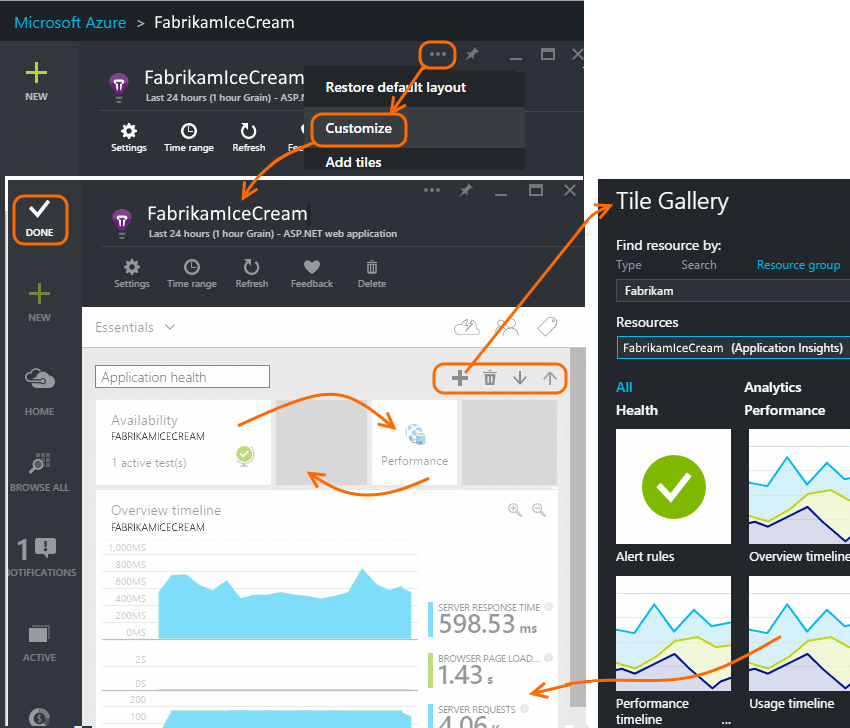
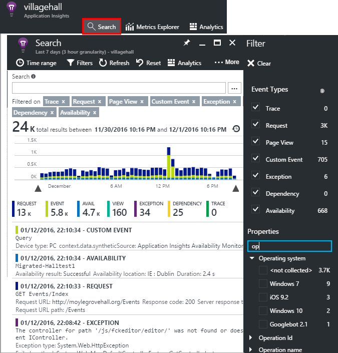
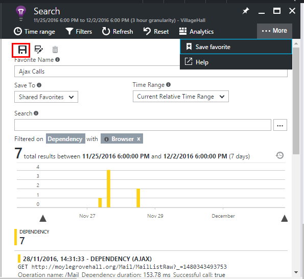
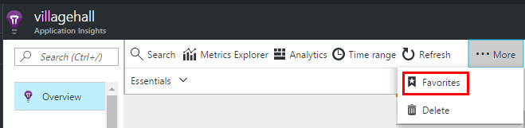

<properties
	pageTitle="Using the Application Insights portal"
	description="Overview of usage analytics with Application Insights"
	services="application-insights"
    documentationCenter=""
	authors="alancameronwills"
	manager="douge"/>

<tags
	ms.service="application-insights"
	ms.workload="tbd"
	ms.tgt_pltfrm="ibiza"
	ms.devlang="multiple"
	ms.topic="article" 
	ms.date="08/17/2015"
	ms.author="awills"/>

# Using the Application Insights portal

After you have [set up Application Insights on your project](app-insights-overview.md), telemetry data about your app's performance and usage will appear in your project's Application Insights resource in the [Azure portal](https://portal.azure.com).

## Find your telemetry in Azure

Sign in to the [Azure portal](https://portal.azure.com) and browse to the Application Insights resource that you created for your app.

The overview page gives you some basic telemetry, plus links to more.
The contents depend on the type of your app, and can be customized.

## The app overview blade

The overview blade (page) for your app shows the most important charts for monitoring performance and usage. The contents depend on the type of your app, and in any case you can customize it. 

### Customize the overview blade 

Choose what you want to see on the overview. In Customize, you can insert section titles, drag tiles and charts around, remove items, and add new tiles and charts from the gallery.

## Create your own metric chart and grids

### Editing charts and grids

To add a new chart to the blade:

Select an existing or new chart to edit what it shows:

You can display more than one metric on a chart, though there are restrictions about the combinations that can be displayed together. As soon as you choose one metric, some of the others are disabled. 

If you coded [custom metrics](app-insights-api-custom-events-metrics.md#track-metric) into your app (calls to TrackMetric and TrackEvent) they will be listed here.

### Segment your data

Select a chart or grid, switch on grouping and pick a property to group by:

If you coded custom metrics into your app and they include [property values](app-insights-api-custom-events-metrics.md#properties), you'll be able to select the property in the list.

Is the chart too small for segmented data? Adjust its height:

### Filter your data

To see just the metrics for a selected set of property values:

If you don't select any values for a particular property, it's the same as selecting them all: there is no filter on that property.

Notice the counts of events alongside each property value. When you select values of one property, the counts alongside other property values are adjusted.

### Save your metrics blade

When you've created some charts, save them as a favorite. You can choose whether to share it with other team members, if you use an organizational account.

To see the blade again, **go to the overview blade** and open Favorites:

If you chose Relative time range when you saved, the blade will be updated with the latest metrics. If you chose Absolute time range, it will show the same data every time.

### Reset the blade

If you edit a blade but then you'd like to get back to the original saved set, just click Reset.

## Creating a search page

Open diagnostic search:

Open the Filter blade and choose the event types you want to see. (If, later, you want to restore the filters with which you opened the blade, click Reset.)

### Filter on property values

You can filter events on the values of their properties. The available properties depend on the event types you selected. 

For example, pick out requests with a specific response code.

Choosing no values of a particular property has the same effect as choosing all values; it switches off filtering on that property.

### Narrow your search

Notice that the counts to the right of the filter values show how many occurrences there are in the current filtered set. 

In this example, it's clear that the `Reports/Employees` request results in the majority of the 500 errors:

Additionally if you want to also see what other events were happening during this time, you can check **Include events with undefined properties**.

### Save your search

When you've set all the filters you want, you can save the search as a favorite. If you work in an organizational account, you can choose whether to share it with other team members.

To see the search again, **go to the overview blade** and open Favorites:

If you saved with Relative time range, the re-opened blade has the latest data. If you saved with Absolute time range, you see the same data every time.

