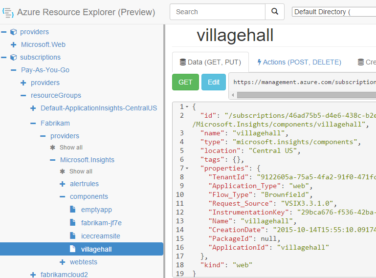

<properties 
	pageTitle="Create Application Insights resources using PowerShell" 
	description="Programmatically create Application Insights resources as part of your build." 
	services="application-insights" 
    documentationCenter=""
	authors="alancameronwills" 
	manager="douge"/>

<tags 
	ms.service="application-insights" 
	ms.workload="tbd" 
	ms.tgt_pltfrm="ibiza" 
	ms.devlang="na" 
	ms.topic="article" 
	ms.date="03/02/2016" 
	ms.author="awills"/>
 
# Create Application Insights resources using PowerShell

This article shows you how to create an [Application Insights](app-insights-overview.md) resource in Azure automatically. You might, for example, do so as part of a build process. Along with the basic Application Insights resource, you can create [availability web tests](app-insights-monitor-web-app-availability.md), [set up alerts](app-insights-alerts.md), and create other Azure resources.

The key to creating these resources is JSON templates for [Azure Resource Manager](../powershell-azure-resource-manager.md). In a nutshell, the procedure is: download the JSON definitions of existing resources; parameterize certain values such as names; and then run the template whenever you want to create a new resource. You can package several resources together, to create them all in one go - for example, an app monitor with availability tests, alerts, and storage for continuous export. There are some subtleties to some of the parameterizations, which we'll explain here.

## One-time setup

If you haven't used PowerShell with your Azure subscription before:

Install the Azure Powershell module on the machine where you want to run the scripts:

1. Install [Microsoft Web Platform Installer (v5 or higher)](http://www.microsoft.com/web/downloads/platform.aspx).
2. Use it to install Microsoft Azure Powershell.

## Copy the JSON for existing resources

1. Set up [Application Insights](app-insights-overview.md) for a project similar to the ones you want to generate automatically. Add web tests and alerts if you want them.
2. Create a new .json file - let's call it `template1.json` in this example. Copy this content into it:


    ```JSON

        {
          "$schema": "https://schema.management.azure.com/schemas/2015-01-01/deploymentTemplate.json#",
          "contentVersion": "1.0.0.0",
          "parameters": {
            "appName": { "type": "string" },
            "webTestName": { "type": "string" },
            "url": { "type": "string" },
            "text": { "type" : "string" }
          },
          "variables": {
			"testName": "[concat(parameters('webTestName'), 
               '-', toLower(parameters('appName')))]"
            "alertRuleName": "[concat(parameters('webTestName'), 
               '-', toLower(parameters('appName')), 
               '-', subscription().subscriptionId)]"
          },
          "resources": [
            {
              // component JSON file contents
            },
            {
              //web test JSON file contents
            },
            {
              //alert rule JSON file contents
            }
 
            // Any other resources go here
          ]
        }
    
    ```

    This template will set up one availability test in addition to the main resource.


2. Open [Azure Resource Manager](https://resources.azure.com/). Navigate down through subscriptions, resourceGroups, components, to your app resource. 

    

    *Components* are the basic Application Insights resources for displaying applications. There are separate resources for the associated alert rules and availability web tests.

3. Copy the JSON of the component into the appropriate place in `template1.json`.
6. Delete these properties:
  * `id`
  * `InstrumentationKey`
  * `CreationDate`
4. Open the webtests and alertrules sections and copy the JSON for individual items into your template. (Don't copy from the webtests or alertrules nodes: go into the items under them.)

    Each web test has an associated alert rule, so you have to copy both of them.

    The web test should go before the alert rule.

5. To satisfy the schema, insert this line in each resource:

    `"apiVersion": "2014-04-01",`

    (The schema also complains about the capitalization of the resource type names `Microsoft.Insights/*` -- but *don't* change these.)


## Parameterize the template

Now you have to replace the specific names with parameters. To [parameterize a template](../resource-group-authoring-templates.md), you write expressions using a [set of helper functions](../resource-group-template-functions.md). 

You can't parameterize just part of a string, so use `concat()` to build strings.

Here are examples of the substitutions you'll want to make. There are several occurrences of each substitution. You might need others in your template. These examples use the parameters and variables we defined at the top of the template.

find | replace with
---|---
`"hidden-link:/subscriptions/.../components/MyAppName"`| `"[concat('hidden-link:',`<br/>` resourceId('microsoft.insights/components',` <br/> ` parameters('appName')))]"`
`"/subscriptions/.../alertrules/myAlertName-myAppName-subsId",` | `"[resourceId('Microsoft.Insights/alertrules', variables('alertRuleName'))]",`
`"/subscriptions/.../webtests/myTestName-myAppName",` | `"[resourceId('Microsoft.Insights/webtests', parameters('webTestName'))]",`
`"myWebTest-myAppName"` | `"[variables(testName)]"'`
`"myTestName-myAppName-subsId"` | `"[variables('alertRuleName')]"`
`"myAppName"` | `"[parameters('appName')]"`
`"myappname"` (lower case) | `"[toLower(parameters('appName'))]"`
`"<WebTest Name=\"myWebTest\" ...`<br/>` Url=\"http://fabrikam.com/home\" ...>"`|`[concat('<WebTest Name=\"',` <br/> `parameters('webTestName'),` <br/> `'\" ... Url=\"', parameters('Url'),` <br/> `'\"...>')]" `

## If your app is an Azure web app

Add this resource, or if a `siteextensions` resource is already there, parameterize it like this:

```json
    {
      "apiVersion": "2014-06-01",
      "name": "Microsoft.ApplicationInsights.AzureWebSites",
      "type": "siteextensions",
      "dependsOn": [
        "[resourceId('Microsoft.Web/Sites', parameters('siteName'))]",
        "[resourceId('Microsoft.Web/Sites/config', parameters('siteName'), 'web')]",
        "[resourceId('Microsoft.Web/sites/sourcecontrols', parameters('siteName'), 'web')]"
      ],
      "properties": { }
    }

```

This resource deploys the Application Insights SDK to your Azure web app.

## Set dependencies between the resources

Azure should set up the resources in strict order. To make sure one setup completes before the next begins, add dependency lines:

* In the web test resource:

    `"dependsOn": ["[resourceId('Microsoft.Insights/components', parameters('appName'))]"],`

* In the alert resource:

    `"dependsOn": ["[resourceId('Microsoft.Insights/webtests', variables('testName'))]"],`

## Create Application Insights resources

1. In PowerShell, sign in to Azure

    `Login-AzureRmAccount`

2. Run a command like this:

    ```PS

        New-AzureRmResourceGroupDeployment -ResourceGroupName Fabrikam `
               -templateFile .\template1.json `
               -appName myNewApp `
               -webTestName aWebTest `
               -Url http://myapp.com `
               -text "Welcome!"
               -siteName "MyAzureSite"

    ``` 

    * -ResourceGroupName is the group where you want to create the new resources.
    * -templateFile must occur before the custom parameters.
    * -appName The name of the resource to create.
    * -webTestName The name of the web test to create.
    * -Url The url of your web app.
    * -text A string that appears in your web page.
    * -siteName - used if it's an Azure website


## Define metric alerts

There is a [PowerShell method of setting alerts](app-insights-alerts.md#set-alerts-by-using-powershell).


## An example

Here's the complete component, web test and web test alert template that I created:

``` JSON

{
  "$schema": "https://schema.management.azure.com/schemas/2015-01-01/deploymentTemplate.json#",
  "contentVersion": "1.0.0.0",
  "parameters": {
    "webTestName": { "type": "string" },
    "appName": { "type": "string" },
    "URL": { "type": "string" },
    "text": { "type" : "string" }
  },
  "variables": {
    "alertRuleName": "[concat(parameters('webTestName'), '-', toLower(parameters('appName')), '-', subscription().subscriptionId)]",
    "testName": "[concat(parameters('webTestName'), '-', toLower(parameters('appName')))]"
  },
  "resources": [
    {
      //"id": "[resourceId('Microsoft.Insights/components', parameters('appName'))]",
      "apiVersion": "2014-04-01",
      "kind": "web",
      "location": "Central US",
      "name": "[parameters('appName')]",
      "properties": {
        "TenantId": "9122605a-471fc50f8438",
        "Application_Type": "web",
        "Flow_Type": "Brownfield",
        "Request_Source": "VSIX3.3.1.0",
        "Name": "[parameters('appName')]",
        //"CreationDate": "2015-10-14T15:55:10.0917441+00:00",
        "PackageId": null,
        "ApplicationId": "[parameters('appName')]"
      },
      "tags": { },
      "type": "microsoft.insights/components"
    },
    {
      //"id": "[resourceId('Microsoft.Insights/webtests', variables('testName'))]",
      "name": "[variables('testName')]",
      "apiVersion": "2014-04-01",
      "type": "microsoft.insights/webtests",
      "location": "Central US",
      "tags": {
        "[concat('hidden-link:', resourceId('microsoft.insights/components', parameters('appName')))]": "Resource"
      },
      "properties": {
        "provisioningState": "Succeeded",
        "Name": "[parameters('webTestName')]",
        "Description": "",
        "Enabled": true,
        "Frequency": 900,
        "Timeout": 120,
        "Kind": "ping",
        "RetryEnabled": true,
        "Locations": [
          {
            "Id": "us-va-ash-azr"
          },
          {
            "Id": "emea-nl-ams-azr"
          },
          {
            "Id": "emea-gb-db3-azr"
          }
        ],
        "Configuration": {
          "WebTest": "[concat(
             '<WebTest   Name=\"', 
                parameters('webTestName'), 
              '\"  Id=\"32cfc791-aaad-4b50-9c8d-993c21beb218\"   Enabled=\"True\"         CssProjectStructure=\"\"    CssIteration=\"\"  Timeout=\"120\"  WorkItemIds=\"\"         xmlns=\"http://microsoft.com/schemas/VisualStudio/TeamTest/2010\"         Description=\"\"  CredentialUserName=\"\"  CredentialPassword=\"\"         PreAuthenticate=\"True\"  Proxy=\"default\"  StopOnError=\"False\"         RecordedResultFile=\"\"  ResultsLocale=\"\">  <Items>  <Request Method=\"GET\"         Guid=\"a6f2c90b-61bf-b28hh06gg969\"  Version=\"1.1\"  Url=\"', 
              parameters('Url'), 
              '\" ThinkTime=\"0\"  Timeout=\"300\" ParseDependentRequests=\"True\"         FollowRedirects=\"True\" RecordResult=\"True\" Cache=\"False\"         ResponseTimeGoal=\"0\"  Encoding=\"utf-8\"  ExpectedHttpStatusCode=\"200\"         ExpectedResponseUrl=\"\" ReportingName=\"\" IgnoreHttpStatusCode=\"False\" />        </Items>  <ValidationRules> <ValidationRule  Classname=\"Microsoft.VisualStudio.TestTools.WebTesting.Rules.ValidationRuleFindText, Microsoft.VisualStudio.QualityTools.WebTestFramework, Version=10.0.0.0, Culture=neutral, PublicKeyToken=b03f5f7f11d50a3a\" DisplayName=\"Find Text\"         Description=\"Verifies the existence of the specified text in the response.\"         Level=\"High\"  ExectuionOrder=\"BeforeDependents\">  <RuleParameters>        <RuleParameter Name=\"FindText\" Value=\"', 
              parameters('text'), 
              '\" />  <RuleParameter Name=\"IgnoreCase\" Value=\"False\" />  <RuleParameter Name=\"UseRegularExpression\" Value=\"False\" />  <RuleParameter Name=\"PassIfTextFound\" Value=\"True\" />  </RuleParameters> </ValidationRule>  </ValidationRules>  </WebTest>')]"
        },
        "SyntheticMonitorId": "[variables('testName')]"
      }
    },
    {
      //"id": "[resourceId('Microsoft.Insights/alertrules', variables('alertRuleName'))]",
      "name": "[variables('alertRuleName')]",
      "apiVersion": "2014-04-01",
      "type": "microsoft.insights/alertrules",
      "location": "East US",
      "dependsOn": [
        "[resourceId('Microsoft.Insights/components', parameters('appName'))]",
        "[resourceId('Microsoft.Insights/webtests', variables('testName'))]"
      ],
      "tags": {
        "[concat('hidden-link:', resourceId('Microsoft.Insights/components', parameters('appName')))]": "Resource",
        "[concat('hidden-link:', resourceId('Microsoft.Insights/webtests', variables('testName')))]": "Resource"
      },
      "properties": {
        "name": "[variables('alertRuleName')]",
        "description": "",
        "isEnabled": true,
        "condition": {
          "$type": "Microsoft.WindowsAzure.Management.Monitoring.Alerts.Models.LocationThresholdRuleCondition, Microsoft.WindowsAzure.Management.Mon.Client",
          "odata.type": "Microsoft.Azure.Management.Insights.Models.LocationThresholdRuleCondition",
          "dataSource": {
            "$type": "Microsoft.WindowsAzure.Management.Monitoring.Alerts.Models.RuleMetricDataSource, Microsoft.WindowsAzure.Management.Mon.Client",
            "odata.type": "Microsoft.Azure.Management.Insights.Models.RuleMetricDataSource",
            "resourceUri": "[resourceId('microsoft.insights/webtests', variables('testName'))]",
            "metricName": "GSMT_AvRaW"
          },
          "windowSize": "PT15M",
          "failedLocationCount": 2
        },
        "action": {
          "$type": "Microsoft.WindowsAzure.Management.Monitoring.Alerts.Models.RuleEmailAction, Microsoft.WindowsAzure.Management.Mon.Client",
          "odata.type": "Microsoft.Azure.Management.Insights.Models.RuleEmailAction",
          "sendToServiceOwners": true,
          "customEmails": [ ]
        },
        "provisioningState": "Succeeded",
        "actions": [ ]
      }

    }
  ]
}

```

## See also

Other automation articles:

* [Create an Application Insights resource](app-insights-powershell-script-create-resource.md) - quick method without using a template.
* [Set up Alerts](app-insights-powershell-alerts.md)
* [Create web tests](https://azure.microsoft.com/blog/creating-a-web-test-alert-programmatically-with-application-insights/)
* [Send Azure Diagnostics to Application Insights](app-insights-powershell-azure-diagnostics.md)
* [Create release annotations](https://github.com/Microsoft/ApplicationInsights-Home/blob/master/API/CreateReleaseAnnotation.ps1)
